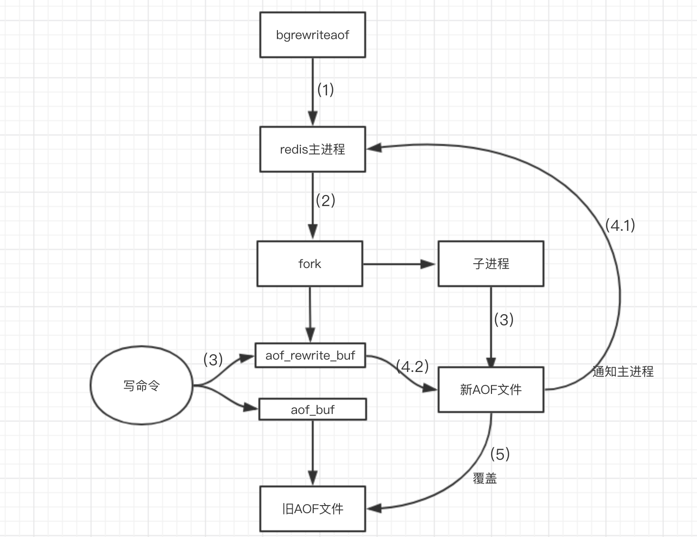

# Redis持久化机制

[TOC]

## RDB

RDB持久化就是把**当前进程数据生成快照保存到硬盘里**的过程，触发RDB持久化过程分为手动触发和自动触发

### 手动触发

分别对应 save 和 bgsave 

- save 阻塞当前的Redis服务器，直到RDB过程完成为止，线上不建议使用

- bgsave Redis进程执行 fork 操作创建子线程，RDB持久化过程由子进程负责，完成后自动结束，阻塞只发生 fork 阶段，一般时间很短

Redis默认采用的是LZF 算法对生成的RDB文件做压缩处理

---

BG SAVE 是为了解决 SAVE 资源消耗过多的问题（这一句是点出目标）。BG SAVE核心是利用`fork`系统调用，复制出来一个子进程，而后子进程尝试将数据写入文件。这个时候，子进程和主进程是**共享内存的**，当主进程发生写操作，那么就会复制一份内存，这就是所谓的 COW（CopyOnWriteList）。COW 的核心是**利用缺页异常**，操作系统在捕捉到缺页异常之后，发现他们共享内存了，就会复制出来一份。

 Java 里面也有一大类数据结构，利用了 COW 这种思想，例如 `CopyOnWriteArrayList`，当里面元素变更的时候，就会复制出来一个新的。它特别适合那种大多数情况**只是读，只有小部分可能是写**的场景。

如果 Redis 的数据也是读多写少，那么 COW 就很高效。这也是一种典型的空间换取时间策略。

**COW缺点**

1. 引发缺页异常。如果物理内存紧张，还会引起大量的物理页置换；
2. COW 的存在，导致我们需要预留一部分内存出来，Redis 无法全部利用服务器的内存；

一般来说，最极端情况是所有内存复制一遍，那么 Redis 最多利用一半的内存，考虑到操作系统本身的开销，那么一半都不到。不过如果愿意冒险的话，可以设置超过一半。例如，不考虑操作系统开销，如果自己的 Redis 读多写少，在整个 BG SAVE 过程，最多复制 10% 的内存，那么就可以给 Redis 分配 80% 的内存。这种搞法，糟糕的情况下，会引发大量的物理页置换，性能下降。

**优点**

RDB是一个紧凑压缩的二进制文件，代表Redis在某个时间点上的数据快照，非常适合用于备份，全量复制等场景

Redis加载RDB恢复数据 **远远快于 AOF的方式**

 1）只有一个文件 dump.rdb，方便持久化；

 2）容灾性好，一个文件可以保存到安全的磁盘。

 3）性能最大化，fork 子进程来进行持久化写操作，让主进程继续处理命令，只存在毫秒级不响应请求。

 4）相对于数据集大时，比 AOF 的启动效率更高。

**缺点**

RDB方式没有办法做到实时持久化/秒级持久化，fork创建子线程属于重量级操作，

存在老版本Redis服务器无法兼容新版RDB格式问题

数据安全性低，RDB 是间隔一段时间进行持久化，如果持久化之间 redis 发生故障，会发生数据丢失。

## AOF

 AOF持久化(即Append Only File持久化)，则是将**服务器执行的命令保存到AOF文件中**。通过fsync异步将命令写到日志，当重启Redis会重新将持久化的日志中文件恢复数据。

AOF重写，指的是对命令进行压缩，将RPUSH、LPOP的类似命令进行压缩，减少AOF文件大小

过程说明：

　　aof_rewrite_buf 代表重写缓冲区   aof_buf代表写写命令存放的缓冲区

　　1.开始bgrewriteaof（文件重写），判断当前有没有bgsave命令(RDB持久化)/bgrewriteaof在执行，倘若有，则这些命令执行完成以后在执行。

　　2.主进程fork出子进程，在这一个短暂的时间内，redis是阻塞的。

　　3.主进程fork完子进程继续接受客户端请求，所有写命令依然写入AOF文件缓冲区并根据appendfsync策略同步到磁盘，保证原有AOF文件完整和正确。由于fork的子进程仅仅只共享主进程fork时的内存，因此Redis使用采用重写缓冲区(aof_rewrite_buf)机制保存fork之后的客户端的写请求，防止新AOF文件生成期间丢失这部分数据。此时，客户端的写请求不仅仅写入原来aof_buf缓冲，还写入重写缓冲区(aof_rewrite_buf)。

　　4.子进程通过内存快照，按照命令重写策略写入到新的AOF文件。

　　4.1子进程写完新的AOF文件后，向主进程发信号，父进程更新统计信息。

　　4.2主进程把AOFaof_rewrite_buf中的数据写入到新的AOF文件(避免写文件是数据丢失)。

　　5.使用新的AOF文件覆盖旧的AOF文件，标志AOF重写完成。

---

- 持久化的三个过程：命令追加、文件写入、文件同步

  - 命令追加即将执行的命令追加到AOF文件中。

  - 文件写入使用缓存区实现

  - 文件同步分为always、everysec、no三个选项。 安全级别从高到低、效率从低到高

    - always每次执行均写入安全性高效率低。
    - everysec每隔一秒子线程对AOF文件进行同步。理论只会丢失一秒数据。
    - no 何时同步由操作系统控制，写入的速度长，因为累积了数据在缓冲区，效率与上一种类似。

    

 **优点：**

 1）数据安全，aof 持久化可以配置 appendfsync 属性，有 always，每进行一次 命令操作就记录到 aof 文件中一次。

 2）通过 append 模式写文件，即使中途服务器宕机，可以通过 redis-check-aof 工具解决数据一致性问题。

**缺点：**

 1）AOF 文件比 RDB 文件大，且恢复速度慢。

 2）数据集大的时候，比 rdb 启动效率低。

## 混合持久化

混合RDB和AOF持久化。解决单单使用AOF持久化，重启时缓存恢复速度过慢的问题

Redis4.0以后采用混合持久化，用 AOF 来**保证数据不丢失**，作为数据恢复的第一选择; 用 RDB 来做不同程度的**冷备**

混合持久化同样也是通过bgrewriteaof完成的，不同的是当开启混合持久化时，fork出的子进程先将共享的内存副本全量的以RDB方式写入aof文件，然后在将重写缓冲区的增量命令以AOF方式写入到文件，写入完成后通知主进程更新统计信息，并将新的含有RDB格式和AOF格式的AOF文件替换旧的的AOF文件。简单的说：新的AOF文件前半段是RDB格式的全量数据后半段是AOF格式的增量数据，如下图：

###  数据恢复

当我们开启了混合持久化时，启动redis依然优先加载aof文件，aof文件加载可能有两种情况如下：

- aof文件开头是rdb的格式, 先加载 rdb内容再加载剩余的 aof。
- aof文件开头不是rdb的格式，直接以aof格式加载整个文件。

**优点**：

1. 混合持久化结合了RDB持久化 和 AOF 持久化的优点, 由于绝大部分都是RDB格式，加载速度快，同时结合AOF，增量的数据以AOF方式保存了，数据更少的丢失。

**缺点**：

1. 兼容性差，一旦开启了混合持久化，在4.0之前版本都不识别该aof文件，同时由于前部分是RDB格式，阅读性较差
