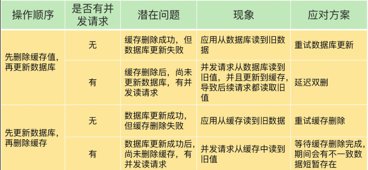

# Redis数据一致性

[TOC]

> 总的说两点
>
> 1. 先删除redis，更新数据库后，再删除redis
> 2. 先更新数据库，再删除redis
>
> 第一种一般用延迟双删（也就是更新数据库之后再删一次redis）或者订阅binlog
>
> 第二种实现简单，但是会出现短暂的不一致

##  CacheAside 旁路缓存

- 写：更新 DB，**然后直接删除缓存 cache 。**
- 读：从 cache 中读取数据，读取到就直接返回，读取不到的话，就从 DB 中取数据返回，然后再把数据放到 cache 中。

 业务端处理所有数据访问细节，同时利用 **Lazy 计算**的思想，更新 DB 后，直接删除 cache 并通过 DB 更新，确保数据以 DB 结果为准，则可以大幅降低 cache 和 DB 中数据不一致的概率

 如果没有专门的存储服务，同时是对**数据一致性要求比较高的业务，或者是缓存数据更新比较复杂的业务**，比较适合读请求比较多的场景，适合使用 Cache Aside 模式。

- 为什么是删除缓存，而不是更新缓存？
  - 更新缓存的代价有时候是很高，如比较复杂的缓存数据计算的场景，更新缓存的逻辑及操作造成的开销就比较大。再且如果频繁更新数据库，就要频繁的更新缓存，相当于每次更新都要double的一个程序开销，增加更新的复杂度。
  - 而部分缓存数据，可能访问的频率不是很高，等访问的时候再更新缓存信息可以大幅的降低开销。
  - 其实删除缓存，而不是更新缓存，就是一个 lazy 计算的思想。类似于redis的key过期处理策略。

~~~java
// 延迟双删，用以保证最终一致性,防止小概率旧数据读请求在第一次删除后更新数据库。解决更新数据库后，可能缓存删除失败的脏数据情况，即删缓存-更新数据库-删缓存。
public void write(String key,Object data){
	redis.delKey(key);
	db.updateData(data);
	Thread.sleep(1000);
	redis.delKey(key);
}
~~~

高并发下保证绝对的一致，先删缓存再更新数据，需要用到**内存队列做异步串行化**。非高并发场景，先更新数据再删除缓存，**延迟双删**策略基本满足了

- 先更新db后删除redis：删除redis失败则出现问题
- 先删redis后更新db：删除redis瞬间，旧数据被回填redis
- 先删redis后更新db休眠后删redis：同第二点，休眠后删除redis 可能宕机
- java内部jvm队列：不适用分布式场景且降低并发

## 延迟双删策略

**删除缓存->更新缓存->延时(几百ms)(可异步，如MQ解决)再次删除缓存**

为了避免更新数据库的时候，其他线程从缓存中读取不到数据，就在更新完数据库之后，再sleep一段时间，然后再次删除缓存

在更新前和更新后都进行删除，尽可能避免读到脏数据

延迟双删只能保证最终一致性，第二次删除缓存前还是有可能读到脏数据

**删除失败方案**

- 重试机制
- 消息队列，如RabbitMQ的延时队列、阻塞队列
