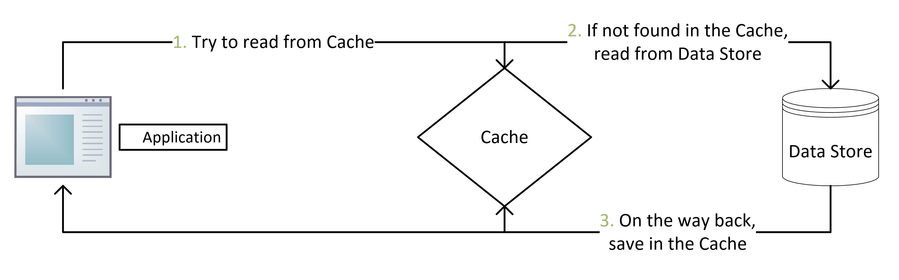
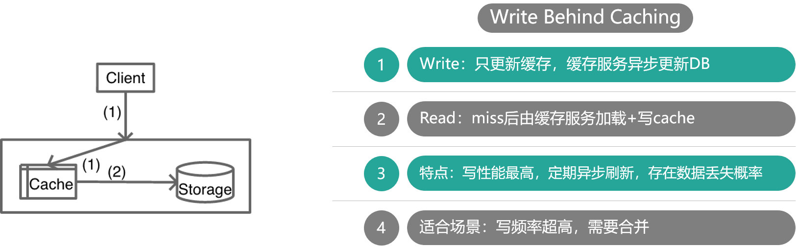
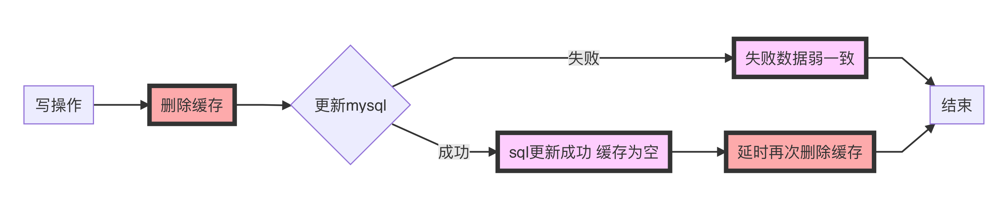
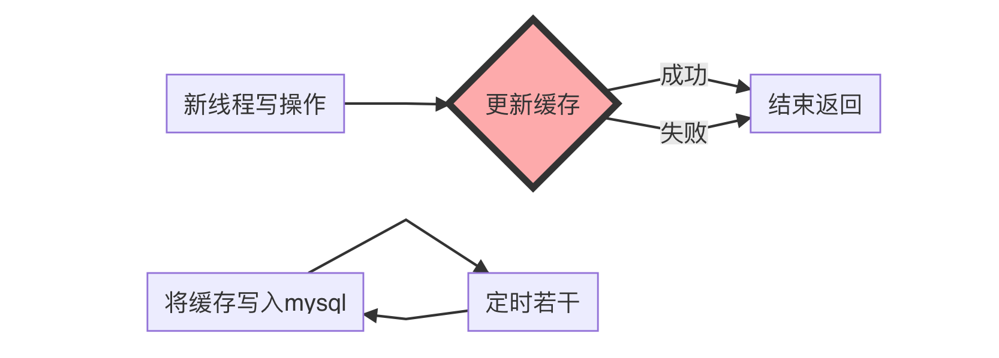

# Redis数据一致性

[TOC]

##  CacheAside 旁路缓存

- 写：更新 DB，然后直接删除缓存 cache 。
- 读：从 cache 中读取数据，读取到就直接返回，读取不到的话，就从 DB 中取数据返回，然后再把数据放到 cache 中。

 业务端处理所有数据访问细节，同时利用 **Lazy 计算**的思想，更新 DB 后，直接删除 cache 并通过 DB 更新，确保数据以 DB 结果为准，则可以大幅降低 cache 和 DB 中数据不一致的概率

 如果没有专门的存储服务，同时是对**数据一致性要求比较高的业务，或者是缓存数据更新比较复杂的业务**，比较适合读请求比较多的场景，适合使用 Cache Aside 模式。如微博发展初期，不少业务采用这种模式

- 为什么是删除缓存，而不是更新缓存？
  - 更新缓存的代价有时候是很高，如比较复杂的缓存数据计算的场景，更新缓存的逻辑及操作造成的开销就比较大。再且如果频繁更新数据库，就要频繁的更新缓存，相当于每次更新都要double的一个程序开销，增加更新的复杂度。
  - 而部分缓存数据，可能访问的频率不是很高，等访问的时候再更新缓存信息可以大幅的降低开销。
  - 其实删除缓存，而不是更新缓存，就是一个 lazy 计算的思想。类似于redis的key过期处理策略。

~~~java
// 延迟双删，用以保证最终一致性,防止小概率旧数据读请求在第一次删除后更新数据库。解决更新数据库后，可能缓存删除失败的脏数据情况，即删缓存-更新数据库-删缓存。
public void write(String key,Object data){
	redis.delKey(key);
	db.updateData(data);
	Thread.sleep(1000);
	redis.delKey(key);
}
~~~

高并发下保证绝对的一致，先删缓存再更新数据，需要用到**内存队列做异步串行化**。非高并发场景，先更新数据再删除缓存，**延迟双删**策略基本满足了

- 先更新db后删除redis：删除redis失败则出现问题
- 先删redis后更新db：删除redis瞬间，旧数据被回填redis
- 先删redis后更新db休眠后删redis：同第二点，休眠后删除redis 可能宕机
- java内部jvm队列：不适用分布式场景且降低并发

##  Read/Write Though 读写穿透

**先查询**缓存中数据是否存在,如果存在则直接返回

如果**不存在**,则由**缓存组件负责从数据库中同步加载数据.**

先查询要**写入的数据在缓存中**是否已经存在,如果已经存在,则**更新缓存中的数据**，并且由**缓存组件同步更新**到数据库中。

用户**读操作**较多.相较于Cache aside而言更适合缓存一致的场景。使用简单屏蔽了**底层数据库的操作**,只是操作缓存.

**场景：**

微博 Feed 的 Outbox Vector（即用户最新微博列表）就采用这种模式。一些粉丝较少且不活跃的用户发表微博后，Vector 服务会首先查询 Vector Cache，如果 cache 中没有该用户的 Outbox 记录，则不写该用户的 cache 数据，直接更新 DB 后就返回，只有 cache 中存在才会通过 CAS 指令进行更新。

## Write Behind Caching 异步缓存写入

比如对一些计数业务，一条 **Feed 被点赞** 1万 次，如果更新 1万 次 DB 代价很大，而合并成一次请求直接加 1万，则是一个非常轻量的操作。但这种模型有个显著的缺点，即数据的一致性变差，甚至在一些极端场景下可能会丢失数据。

> -使用阿里巴巴的canal，订阅mysql的binlog日志，通过解析日志，更新缓存信息。解决上述缓存删除后，出现缓存穿透的问题。

## 延迟双删策略

**删除缓存->更新缓存->延时(几百ms)(可异步，如MQ解决)再次删除缓存**

当有 一大堆并发写 过来时，此时可以直接操作缓存，定期写入SQL（适合高并发）

以Redis数据为主，MySQL数据为辅助。定期插入(好像数据备份库一样)。

