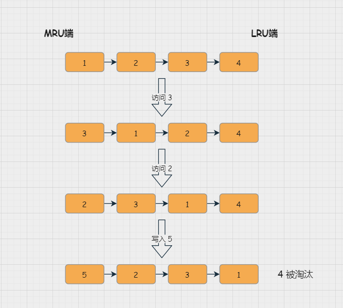

# Redis数据清理

[TOC]

## 过期键清理策略

redis采用 **定期删除+惰性删除**

- 过期键的删除策略
  - 定时删除，为每个过期键建立一个timer，缺点占用CPU
  - 惰性删除，**只会在取出key的时候**判断是否过期，对内存不友好。
  - 定期删除，即**根据设定执行时长和操作频率清理**，缺点难以确定。
    - Redis 底层会通过限制删除操作执行的时长和频率来减少删除操作对CPU时间的影响，默认100ms就随机抽一些设置了过期时间的key，不会扫描全部的过期键，因为开销过大。
  - Redis使用**惰性删除和定期删除结合的方式配合使用。**
- redis在内存空间不足的时候，为了保证命中率，就会选择一定的数据淘汰策略——内存淘汰机制（过期键的补充措施）

## 内存淘汰策略

- 内存淘汰机制：八种大体上可以分为4种，
- **lru**（最近最少使用）
- **lfu**（最少使用频率）
- **random**（随机）
- **ttl**（根据生存时间，快过期）

> volatile就是在设置了过期时间的数据中筛选
>
> allkeys是在所有的数据中筛选

1. volatile-lru：从已设置过期时间的数据集中挑选最近最少使用的数据淘汰。
2. volatile-ttl：从已设置过期时间的数据集中挑选将要过期的数据淘汰。
3. volatile-random：从已设置过期时间的数据集中任意选择数据淘汰。
4. volatile-lfu：从已设置过期时间的数据集挑选使用频率最低的数据淘汰。

1. allkeys-lru：从数据集中挑选最近最少使用的数据淘汰。（缓存常用）
2. allkeys-lfu：从数据集中挑选使用频率最低的数据淘汰。
3. allkeys-random：从数据集（server.db[i].dict）中任意选择数据淘汰

1. no-enviction（不淘汰）：**默认策略**。意思是当内存不足以容纳新入数据时，新写入操作就会报错，请求可以继续进行，线上任务也不能持续进行，采用no-enviction策略可以保证数据不被丢失。（字典库常用）

## LRU实现原理

>  Least Recently Used 最近最少使用机制

常规的LRU算法会维护一个**双向链表**，用来表示访问关系

同时用 哈希表来维护节点的位置，额外的存储存放 next 和 prev 指针，牺牲比较大的存储空间。

LRU会把所有的数据组成一个链表，链表头部成为 **MRU**，代表**最近最常使用的数据**，尾部LRU端代表最近最不常使用的数据

### 实现过程

插入的时候，首先判断是否有 **键值冲突**，没有则新构建一个节点，插入到链表中，并移到链表头，再判断是否有 **越界**，有则把尾部的节点删除

没有冲突则用新值替换旧值，然后移到链表头

读取时，判断键对应的节点 是否存在，存在则读取值 并把节点**移到头部**

Redis的实现LRU会维护一个全局的LRU时钟，并且每个键中也有一个时钟，**每次访问键的时候更新时钟值**。

默认的LRU时钟的分辨率是1秒，可以通过改变
REDIS_LRU_CLOCK_RESOLUTION宏的值来改变

~~~c
#define REDIS_LRU_BITS 24
unsigned lruclock:REDIS_LRU_BITS; /* Clock for LRU eviction */
~~~

淘汰过程：Redis会基于server.maxmemory_samples配置选取固定数目的key，然后**比较它们的lru访问时间**，然后**淘汰最近最久没有访问的key**

maxmemory_samples的值越大，Redis的近似LRU算法就越接近于严格LRU算法，但是相应消耗也变高，对性能有一定影响，样本值默认为5。

~~~java
public class LRU<K, V> implements Iterable<K> {

    private Node head;
    private Node tail;
    private HashMap<K, Node> map;
    private int maxSize;

    private class Node {

        Node pre;
        Node next;
        K k;
        V v;

        public Node(K k, V v) {
            this.k = k;
            this.v = v;
        }
    }

    public LRU(int maxSize) {

        this.maxSize = maxSize;
        this.map = new HashMap<>(maxSize * 4 / 3);

        head = new Node(null, null);
        tail = new Node(null, null);

        head.next = tail;
        tail.pre = head;
    }

    public V get(K key) {

        if (!map.containsKey(key)) {
            return null;
        }

        Node node = map.get(key);
        unlink(node);
        appendHead(node);

        return node.v;
    }

    public void put(K key, V value) {

        if (map.containsKey(key)) {
            Node node = map.get(key);
            unlink(node);
        }

        Node node = new Node(key, value);
        map.put(key, node);
        appendHead(node);

        if (map.size() > maxSize) {
            Node toRemove = removeTail();
            map.remove(toRemove.k);
        }
    }

    private void unlink(Node node) {

        Node pre = node.pre;
        Node next = node.next;

        pre.next = next;
        next.pre = pre;

        node.pre = null;
        node.next = null;
    }

    private void appendHead(Node node) {
        Node next = head.next;
        node.next = next;
        next.pre = node;
        node.pre = head;
        head.next = node;
    }

    private Node removeTail() {

        Node node = tail.pre;

        Node pre = node.pre;
        tail.pre = pre;
        pre.next = tail;

        node.pre = null;
        node.next = null;

        return node;
    }

    @Override
    public Iterator<K> iterator() {

        return new Iterator<K>() {
            private Node cur = head.next;

            @Override
            public boolean hasNext() {
                return cur != tail;
            }

            @Override
            public K next() {
                Node node = cur;
                cur = cur.next;
                return node.k;
            }
        };
    }
}
~~~

### LRU算法问题

使用链表管理所有缓存的数据，给Redis带来额外的开销，而且，当有数据访问时就会有链表移动操作，进而降低Redis的性能

**于是，Redis 对 LRU 的实现进行了一些改变：**

-  记录每个Key最近一次被访问的时间戳（由键值对数据结构 RedisObject 中的 lru 字段记录）
- 在第一次淘汰数据时，会先随机选择 N 个数据作为一个候选集合，然后淘汰 lru 值最小的。（N 可以通过 `config set maxmemory-samples 100` 命令来配置

- 后续再淘汰数据时，会挑选数据进入候选集合，进入集合的条件是：它的 lru 小于候选集合中最小的 lru。
- 如果候选集合中数据个数达到了 maxmemory-samples，Redis 就会将 lru 值小的数据淘汰出去。

## LFU算法

> Least Frequently Used

基于数据访问次数来淘汰数据的，在LRU的策略基础上，为每个数据增加一个计数器，来统计这个数据的访问次数

lru是24bit，而lfu将lru拆分成两部分：

- **ldt**，lru字段的前16bit，表示数据的**访问时间戳**
- **counter**，lru字段的后8bit，表示数据的**访问次数**

LFU会将访问次数最低的数据淘汰，如果访问次数相同，再根据访问的时间，将访问时间戳最小的淘汰

