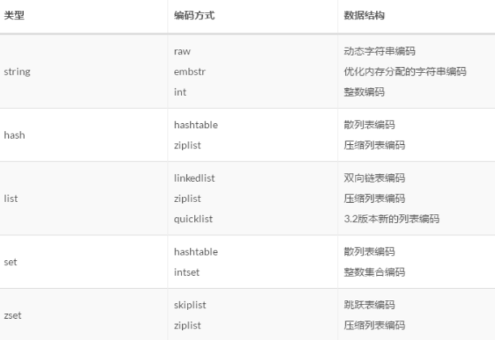

# Redis数据结构

[TOC]

## 分类

(list这里是3.2之前)

第一个层面，是从使用者的角度。比如：

- **string**
- **list**
- **hash**
- **set**
- **sorted set**

这一层面也是Redis暴露给外部的调用接口，称之为Redis数据类型。

第二个层面，是Redis为了实现上述数据结构，引入的内部数据结构。比如：

- **dict**
- **sds**
- **ziplist**
- **quicklist**
- **skiplist**
- **intset**

## Redis对象

Redis使用对象来表示数据库中的键和值，其中键对象一般为字符串对象，值对象则可以指向不同类型的数据。

`type`记录了对象类型，可以取值为`REDIS_STRING`、`REDIS_LIST`、`REDIS_HASH`、`REDIS_SET`、`REDIS_ZSET`，分别表示string、list、hash、set、zset对象。

`encoding`表示对象底层的编码和存储方式，取值和对象的对应关系如下表所示：

|         编码常量         |         底层数据结构          |
| :----------------------: | :---------------------------: |
|    REDIS_ENCODING_INT    |        long类型的整数         |
|  REDIS_ENCODING_EMBSTR   | embstr编码的动态字符串（SDS） |
|    REDIS_ENCODING_RAW    |     简单动态字符串（SDS）     |
|    REDIS_ENCODING_HT     |             字典              |
| REDIS_ENCODING_QUICKLIST |             快表              |
|  REDIS_ENCODING_ZIPLIST  |           压缩列表            |
|  REDIS_ENCODING_INTSET   |           整数集合            |
| REDIS_ENCODING_SKIPLIST  |          跳跃表+字典          |

ptr是指向具体内存数据结构的指针，由于Redis有多种数据类型，每种数据类型都有多种数据结构可以实现，因此ptr用void来修饰。

## string

> **sds**

当string保存的是一个整数值，并可以用long型存储时，那么string对象会将整数值保存在ptr里面，将void转换成long型，**编码为int**；

当整数值太大无法用long型存储时，会将整数值转换成字符串，用SDS来存储，**编码为embstr或者raw**。

当string对象保存的是一个字符串，并且字符串长度小于等于39字节时，就会用embstr编码来保存字符串值。此时SDS与字符串redisObject紧邻在一起，只需申请一次内存。

当字符串内容长度大于39字节时，会用raw编码来保存字符串，申请内存时需申请两次，一次用来存储redisObject，另一次用于存储SDS结构。释放内存也需要两次释放。

### SDS数据结构及特点

在Redis3.2中，SDS的定义如下：

~~~c
struct __attribute__ ((__packed__)) sdshdr8 {
    uint8_t len; /* used */
    uint8_t alloc; /* excluding the header and null terminator */
    unsigned char flags; /* 3 lsb of type, 5 unused bits */
    char buf[];
};
struct __attribute__ ((__packed__)) sdshdr16 {
    uint16_t len; /* used */
    uint16_t alloc; /* excluding the header and null terminator */
    unsigned char flags; /* 3 lsb of type, 5 unused bits */
    char buf[];
};
struct __attribute__ ((__packed__)) sdshdr32 {
    uint32_t len; /* used */
    uint32_t alloc; /* excluding the header and null terminator */
    unsigned char flags; /* 3 lsb of type, 5 unused bits */
    char buf[];
};
struct __attribute__ ((__packed__)) sdshdr64 {
    uint64_t len; /* used */
    uint64_t alloc; /* excluding the header and null terminator */
    unsigned char flags; /* 3 lsb of type, 5 unused bits */
    char buf[];
};
~~~

每个字段的含义如下：

- len：记录当前已使用的字节数（不包括'\0'），获取SDS长度的复杂度为O(1)
- alloc：记录当前字节数组总共分配的字节数量（不包括'\0'）
- flags：标记当前字节数组的属性，是sdshdr8还是sdshdr16等
- buf：字节数组，用于保存字符串（实际数据），包括结尾空白字符'\0'（额外占用1个字节）

针对不同的string长度，使用不同类型保存`len`和`alloc`，是Redis节省内存的一种优化。

**SDS的特点是：**

1. **直接存储了字符串长度**，O(1) 时间复杂度查询字符串长度信息
2. SDS采用了**预分配和懒回收**的策略来分配内存，可以减少内存分配次数
3. 针对缓存频繁修改的情况：SDS分配内存不仅会分配需要的空间，**还会分配额外的空间**。
   - 小于1MB的SDS每次分配与len属性同样大小的空间
   - 大于1MB的每次分配1MB
4. **使用惰性释放策略**：不立即使用内存重分配来回收缩短后多出来的字节，而是使用free属性，记录字节数量
5. 有效防止缓冲区溢出

### 扩容

当字符串长度小于1M时，扩容是新长度的两倍，如果超过1M，扩容时一次只会多扩1M的空间。

~~~c
sds sdsMakeRoomFor(sds s, size_t addlen) {
    void *sh, *newsh;
    size_t avail = sdsavail(s);  /* sds剩余可用 即s.alloc - s.len */
    size_t len, newlen;
    char type, oldtype = s[-1] & SDS_TYPE_MASK;
    int hdrlen;

    /* 有足够空间则返回 */
    if (avail >= addlen) return s;

    len = sdslen(s); /* 字符串长度 */
    sh = (char*)s-sdsHdrSize(oldtype);  /* sdshdr指针 */
    newlen = (len+addlen);  /* 新长度 */
    if (newlen < SDS_MAX_PREALLOC)
        newlen *= 2;
    else
        newlen += SDS_MAX_PREALLOC;

    type = sdsReqType(newlen); /* 新长度合适的sds类型 */

    /* 扩容时一般不为SDS_TYPE_5 */
    if (type == SDS_TYPE_5) type = SDS_TYPE_8;

    hdrlen = sdsHdrSize(type); /* 新sdshdr大小 */
    if (oldtype==type) {
        newsh = s_realloc(sh, hdrlen+newlen+1);
        if (newsh == NULL) return NULL;
        s = (char*)newsh+hdrlen;
    } else {
        /* 分配内存，拷贝原字符串，释放原sds内存，并设置好flags以及len */
        newsh = s_malloc(hdrlen+newlen+1);
        if (newsh == NULL) return NULL;
        memcpy((char*)newsh+hdrlen, s, len+1);
        s_free(sh);
        s = (char*)newsh+hdrlen;
        s[-1] = type;
        sdssetlen(s, len);
    }
    sdssetalloc(s, newlen);
    return s;
}
~~~

### 缩容&惰性释放空间

释放内存的过程中修改len和free字段，并不释放实际占用内存。例如sdsclear操作：

~~~c
// 将len字段设置为0，但内存空间不释放。
void sdsclear(sds s) {
    sdssetlen(s, 0);
    s[0] = '\0';
}
~~~

当然必要的时候也可以调用sdsRemoveFreeSpace，主动缩容。

### C字符串与SDS对比

> 空间预分配，惰性空间释放

- 结构中直接存储了字符串长度，获取字符长度只需要**常量时间复杂度**，而**原生字符串则需要遍历数组**；
- **二进制安全**，可以存储字节数据，因为存储字符串长度，不会提前遇到\0字符而终止；
- **杜绝缓冲区溢出**，C语言字符串本身不记录数组长度，增加操作时，分配内存不足时容易造成缓冲区溢出，**而sds因为存在alloc，会在修改时，检查空间大小是否满足**；
- **内存预分配以及惰性删除**，减少内存重新分配次数；
- **兼容C标准库中的部分字符串函数**。

## list

> **ziplist和linkedlist(<3.2)   |   quicklist(>3,2)**

注意版本，在版本3.2之前，列表底层的编码是**ziplist和linkedlist**实现的，但是在版本3.2之后，重新引入 quicklist，**列表的底层都由quicklist实现**

3.2之前存储方式的优缺点：

- 双向链表linkedlist便于在表的两端进行push和pop操作，在插入节点上复杂度很低，但是它的**内存开销比较大**。首先，它在每个节点上**除了要保存数据之外，还要额外保存两个指针**；其次，双向链表的各个节点是单独的内存块，**地址不连续**，节点多了**容易产生内存碎片**。
- ziplist存储在一段连续的内存上，所以存储效率很高。但是，它**不利于修改操作，插入和删除操作需要频繁的申请和释放内存**。特别是当ziplist长度很长的时候，一次realloc可能会导致大批量的数据拷贝。

### quickList

quickList，是ziplist和linkedlist二者的结合；quickList将二者的优点结合起来

考虑到链表的附加空间相对太高，对于64位操作系统来说，prev 和 next 指针就要占去 16 个字节 ；并且链表的每个节点都单独分配，内存碎片化程度较高，list对象在底层使用quicklist（快速列表）来存储(在redis3.2之后)。**quicklist是由一个个ziplist组成的链表**，每个ziplist连续地存放多个list元素，ziplist中的每个entry块存放一个list元素。相对链表实现来说，quicklist可以大大节省prev 和 next 指针的占用空间。

quickList就是一个标准的双向链表的配置，有head 有tail;
每一个节点是一个quicklistNode，包含prev和next指针。
每一个quicklistNode 包含 一个ziplist，*zp 压缩链表里存储键值。
所以quicklist是对ziplist进行一次封装，使用小块的ziplist来既保证了少使用内存，也保证了性能。

~~~c
/* quicklistNode is a 32 byte struct describing a ziplist for a quicklist.
 * We use bit fields keep the quicklistNode at 32 bytes.
 * count: 16 bits, max 65536 (max zl bytes is 65k, so max count actually < 32k).
 * encoding: 2 bits, RAW=1, LZF=2.
 * container: 2 bits, NONE=1, ZIPLIST=2.
 * recompress: 1 bit, bool, true if node is temporarry decompressed for usage.
 * attempted_compress: 1 bit, boolean, used for verifying during testing.
 * extra: 12 bits, free for future use; pads out the remainder of 32 bits */
typedef struct quicklistNode {
    struct quicklistNode *prev; //上一个node节点
    struct quicklistNode *next; //下一个node
    unsigned char *zl;            //保存的数据 压缩前ziplist 压缩后压缩的数据
    unsigned int sz;             /* ziplist size in bytes */
    unsigned int count : 16;     /* count of items in ziplist */
    unsigned int encoding : 2;// 编码格式   /* RAW==1 or LZF==2 */
    unsigned int container : 2; // 存储方式 /* NONE==1 or ZIPLIST==2 */
    unsigned int recompress : 1; /* was this node previous compressed? */ // 数据是否被压缩
    unsigned int attempted_compress : 1; /* node can't compress; too small */ // 数据能否被压缩
    unsigned int extra : 10;// 预留的bitw /* more bits to steal for future usage */
} quicklistNode;

/* quicklistLZF is a 4+N byte struct holding 'sz' followed by 'compressed'.
 * 'sz' is byte length of 'compressed' field.
 * 'compressed' is LZF data with total (compressed) length 'sz'
 * NOTE: uncompressed length is stored in quicklistNode->sz.
 * When quicklistNode->zl is compressed, node->zl points to a quicklistLZF */
typedef struct quicklistLZF {
    unsigned int sz; /* LZF size in bytes*/
    char compressed[];
} quicklistLZF;

/* quicklist is a 32 byte struct (on 64-bit systems) describing a quicklist.
 * 'count' is the number of total entries.
 * 'len' is the number of quicklist nodes.
 * 'compress' is: -1 if compression disabled, otherwise it's the number
 *                of quicklistNodes to leave uncompressed at ends of quicklist.
 * 'fill' is the user-requested (or default) fill factor. */
typedef struct quicklist {
    quicklistNode *head; //头结点
    quicklistNode *tail; //尾节点
    unsigned long count;        /* total count of all entries in all ziplists */
    unsigned int len;           /* number of quicklistNodes */
    int fill : 16;              /* fill factor for individual nodes *///负数代表级别，正数代表个数
    unsigned int compress : 16; /* depth of end nodes not to compress;0=off *///压缩级别
} quicklist;
~~~

### ziplist

ziplist的数据结构

~~~c
struct ziplist<T>{
    int32 zlbytes;            //压缩列表占用字节数
    int32 zltail_offset;    //最后一个元素距离起始位置的偏移量,用于快速定位到最后一个节点
    int16 zllength;            //元素个数
    T[] entries;            //元素内容
    int8 zlend;                //结束位 0xFF
}
~~~

**关键点：内存连续，数据移动，连锁更新**

`ziplist`是一个很特殊的列表，它的内存类似数组那样是连续，但是每个元素的大小却不相同。`ziplist`通常用于单个数据小，并且数据量不多的情况。在 Redis 里面，`ziplist`用于组成有序集合，字典和列表三种值对象。

`ziplist`能够在`O(1)`的时间内完成对头尾的操作（因为`ziplist`记录了首尾节点），但是一般的增删改查，都是`O(N)`的。这是因为`ziplist`是一个连续内存的结构，找到位置`i`，需要**从头部开始遍历**，而在**增删**的时候需要将位置`i`之后的元素移动（增往后移动，删往前移动）。

尤其是，因为`ziplist`的节点存储了前一个节点的长度`prelen`，所以，当前一个节点发生变更的时候，就需要更新长度`prelen`。而 Redis 为了节约内存，`prelen`有一个字节和五个字节两种长度。举例来说，假设前一个节点，最开始的长度是254，而后更新成了256，那么当前节点原本一个字节能够放下`prelen`，不得不扩展到五个字节。假如说当前节点最开始长度也是254，那么`prelen`扩展到五个字节之后就变成了258，当前节点的后一个节点，就不得不跟着扩展

这就是所谓的连锁更新，它使得一个增删改操作，最坏的时候是`O(N^2)`。这也是为什么`ziplist`只适合放置**小数据，少数据**的原因。（从这里也可以解释为什么那些编码，都是限制数据小于64字节，并且数量少于512）

当链表entry数据超过512、或单个value 长度超过64，底层就会转化成linkedlist编码；
linkedlist是标准的双向链表，Node节点包含prev和next指针，可以进行双向遍历；
还保存了 head 和 tail 两个指针，因此，对链表的表头和表尾进行插入的复杂度都为 (1) —— 这是高效实现 LPUSH 、 RPOP、 RPOPLPUSH 等命令的关键。

## hash

> **ziplist   |   hashtable**

当元素个数较少，并且每个元素较短时，hash对象底层通过**ziplist来存储**，field和value存储在两个相邻的entry中

当元素个数较多，或者存在较长的元素时，hash对象会转为**dict（字典）存储**。临界点的元素个数和元素长度可由参数`hash-max-ziplist-entries`和`hash-max-ziplist-value`进行配置，默认值分别为512和64。

Redis 的哈希表使用**链地址法**解决hash冲突，即冲突的位置上使用**单链表的接口连接**，解决冲突的问题。

### dict

一个dict由如下若干项组成：

- 一个指向dictType结构的指针（type）。它通过自定义的方式使得dict的key和value能够存储任何类型的数据。
- 一个私有数据指针（privdata）。由调用者在创建dict的时候传进来。
- 两个哈希表（ht[2]）。只有在重哈希的过程中，ht[0]和ht[1]才都有效。而在平常情况下，只有ht[0]有效，ht[1]里面没有任何数据。
- 当前重哈希索引（rehashidx）。如果rehashidx = -1，表示当前没有在重哈希过程中；否则，表示当前正在进行重哈希，且它的值记录了当前重哈希进行到哪一步了。

dictType结构包含若干函数指针，用于dict的调用者对涉及key和value的各种操作进行自定义。这些操作包含：

- hashFunction，对key进行哈希值计算的哈希算法。
- keyDup和valDup，分别定义key和value的拷贝函数，用于在需要的时候对key和value进行深拷贝，而不仅仅是传递对象指针。
- keyCompare，定义两个key的比较操作，在根据key进行查找时会用到。
- keyDestructor和valDestructor，分别定义对key和value的析构函数。

私有数据指针（privdata）就是在dictType的某些操作被调用时会传回给调用者。

需要详细察看的是dictht结构。它定义一个哈希表的结构，由如下若干项组成：

- 一个dictEntry指针数组（table）。key的哈希值最终映射到这个数组的某个位置上（对应一个bucket）。如果多个key映射到同一个位置，就发生了冲突，那么就拉出一个dictEntry链表。
- size：标识dictEntry指针数组的长度。它总是2的指数。
- sizemask：用于将哈希值映射到table的位置索引。它的值等于(size-1)，比如7, 15, 31, 63，等等，也就是用二进制表示的各个bit全1的数字。每个key先经过hashFunction计算得到一个哈希值，然后计算(哈希值 & sizemask)得到在table上的位置。相当于计算取余(哈希值 % size)。
- used：记录dict中现有的数据个数。它与size的比值就是装载因子（load factor）。

### dictht的扩容与缩容

Redis中的哈希表通过load_factor（负载因子）来决定是否扩容或者缩容，负载可由公式ht[0].used/ht[0].size算得。

#### 扩容

扩容时需考虑服务器当前是否正在执行bgsave或者bgrewriteaof，若服务器当前正在bgsave或bgrewriteaof，应该尽量避免扩容，此时触发扩容的条件是load_factor为5；否则当load_factor为1时就开始扩容。之所以要这样做，是因为bgsave或bgrewriteaof命令会fork子进程来遍历内存，若内存无变更则与父进程共享内存页，修改内存数据时需将内存页拷贝一份出来进行修改（这就是传说中的写时复制），修改内存数据不但在拷贝内存页时会消耗CPU资源，而且会消耗更多的内存空间。而扩容时需要将旧哈希表元素rehash到新哈希表，从而造成内存数据变更，因此要尽量避免扩容。

为了方便rehash，扩容时数组容量会扩展到（第一个大于2倍哈希表元素个数）的2^n。

#### 缩容

缩容则不需要考虑bgsave或者bgrewriteaof，当负载因子为0.1时会触发缩容。缩容时也需要进行rehash操作，数组长度会缩减为（第一个大于哈希表元素个数）的2^n，新下标也可通过公式hash(key) & sizemask算出来。

### 渐进式rehash

也就是避免一次性对所有的key进行重哈希，而是将rehash的操作**分散到对于dict的各个增删改查的操作中去。**

哈希表在**扩容和缩容时都需要rehash**，由于Redis是单线程处理的，如果字典中的元素太多，一次性执行rehash操作会造成卡顿。

因此Redis采用渐进式rehash的策略，在**查找、插入、删除操作时，对其进行迁移**。

如果一直没有被访问，Redis会在**定时任务**中对其执行rehash。

Redis 采用 MurmurHash2 ，该算法效率高，随机性好，可以减少冲突可能，Redis的哈希表是采用了**拉链法来解决冲突**，在冲突的时候，**会将元素加在表头，以加快速度**

渐进式rehash每次将重哈希至少向前推进n步（除非不到n步整个重哈希就结束了），每一步都将ht[0]上某一个bucket（即一个dictEntry链表）上的每一个dictEntry移动到ht[1]上，它在ht[1]上的新位置根据ht[1]的sizemask进行重新计算。rehashidx记录了当前尚未迁移（有待迁移）的ht[0]的bucket位置。

如果重hash被调用的时候，rehashidx指向的bucket里一个dictEntry也没有，那么它就没有可迁移的数据。这时它尝试在ht[0].table数组中不断向后遍历，直到找到下一个存有数据的bucket位置。如果一直找不到，则最多走n*10步，本次重哈希暂告结束。

最后，如果ht[0]上的数据都迁移到ht[1]上了（即d->ht[0].used == 0），那么整个重哈希结束，ht[0]变成ht[1]的内容，而ht[1]重置为空。

#### 对比

Java里的rehash则不一样，是一次性迁移的，但是在Go里面，map的扩容也是渐进式的，也是在访问数据的过程中逐渐完成迁移

这种渐进式的思想在 Redis 里面还体现在重新分片上。Redis 的重新分片也是一边迁移数据，同时对外提供服务。在找一个 key 的时候，也是先找源节点，找到了同时迁移，找不到就说明迁移到了目标节点

总体而言，渐进式 rehash 可以带来更平滑的响应时间。但是渐进式的 rehash 也会带来**总体开销比一次性迁移开销大的缺点**，并且，每一次查询都比一次性rehash要慢

## set

> **intset  | hashtable**

当集合元素全为能用long声明的整数值，并且元素个素**不大于512个（可通过参数set-max-intset-entries配置）时，集合数据通过intset来存储**，intset中的元素按从小到大的顺序排列。

~~~shell
set-max-intset-entries 512
~~~

其他情况下，集合数据一律使用**dict（**字典）来存储

字典的**键为集合元素的value，字典的值为null。**

### intset

由整数组成的有序集合，有序，就便于二分查找，快速判断一个元素是否属于这个集合

~~~c
typedef struct intset {
    uint32_t encoding;
    uint32_t length;
    int8_t contents[]; // 总长度 = encoding * length
} intset;
~~~

**intset与ziplist比较**

- ziplist可以存储任意二进制串，而intset只能存储整数。
- ziplist是无序的，而intset是从小到大有序的。因此，在ziplist上查找只能遍历，而在intset上可以进行二分查找，性能更高。
- ziplist可以对每个数据项进行不同的变长编码（每个数据项前面都有数据长度字段`len`），而intset只能整体使用一个统一的编码（`encoding`）。

## zset

> **ziplist   |   hashtable + skiplist**

默认情况下，当zset中的**元素个数不大于128**（通过参数zset-max-ziplist-entries控制），并且所有元素的**长度都不大于64字节**（通过参数zset-max-ziplist-value控制）时，zset底层采用ziplist来存储，相邻的两个entry分别表示value和score。

~~~shell
zset-max-ziplist-entries 128
zset-max-ziplist-value 64
~~~

~~~c
typedef struct zskiplist{
    // 表头结点和尾节点
    struct zskiplistNode *header, *tail;
    // 表中节点的数量
    unsigned int length;
    // 表中层数最大的节点的层数
    int level;
} zskiplist;
~~~

如果两个条件有一个不满足，都采用**hashtable+skiplist**的形式存储

其中**hashtable存储value和score的映射关系**，**skiplist按顺序存储value**。

元素按score大小进行排序，当score相同时，元素按照字符串的字典大小进行排序

之所以采用hashtable+skiplist的形式存储zset，是因为这两种结构都各有好处。

首先，zset是按照score排序的，skiplist的排序特性刚好满足这种需求；

然后，hashtable保存了value和score的映射关系，可以直接通过value来获取score，时间复杂度为O(1)。假如没有使用hashtable，获取score就得在skiplist中逐层下沉地搜索，时间复杂度为O(lg n)。虽然同时使用hashtable和skiplist来保存zset，但是他们共用同一个value和score，因此不会造成空间浪费。

> 跳表如何实现快速查找

在链表的基础之上，每两个节点提取一个节点到上一级，也就是**每相邻的两个结点增加一个指针，让指针指向下一个结点**

skiplist不要求上下相邻两层链表之间的结点个数有严格的对应关系，而是为每个结点随机生成一个层数（level）。比如，一个结点随机生成的层数是5，那么就将它链入到第1层到第5层链表中。

**每一个节点的层数（level）是随机出来的**，而且新插入一个节点不会影响其它节点的层数。因此，**插入操作只需要修改插入节点前后的指针，而不需要对很多节点都进行调整**。这就降低了插入操作的复杂度。

至于zset为什么使用skiplist**实现排序功能**，而不用红黑树呢？主要有两点：

- skiplist实现比红黑树实现起来更**简单**，代码更容易维护；
- skiplist**区间查找效率更高**，上面每一层链表的节点个数，是下面一层的节点个数的一半，这样查找过程就非常类似于一个二分查找，跳表可以做到O(lg n) 的时间复杂度定位区间的起点，然后再顺序往后遍历就可以了。

### 跳表对比

| 数据结构 | 实现原理               | key查询方式          | 查找效率     | 存储大小                                                     | 插入、删除效率                               |
| -------- | ---------------------- | -------------------- | ------------ | ------------------------------------------------------------ | -------------------------------------------- |
| **Hash** | **哈希表**             | **支持单key**        | **接近O(1)** | **小，除了数据没有额外的存储**                               | **O(1)**                                     |
| **B+树** | **平衡二叉树扩展而来** | **单key,范围，分页** | **O(Log(n)** | **除了数据，还多了左右指针，以及叶子节点指针**               | **O(Log(n)，需要调整树的结构，算法比较复杂** |
| **跳表** | **有序链表扩展而来**   | **单key，分页**      | **O(Log(n)** | **除了数据，还多了指针，但是每个节点的指针小于<2,所以比B+树占用空间小** | **O(Log(n)，只用处理链表，算法比较简单**     |

> 内存占用，范围查找，实现难易程度

1. 首先哈希表不是有序的，只能做单个key的查找，不适合做范围查找

2. **在做范围查找的时候，平衡树比skiplist操作要复杂**，在平衡树上，找到指定范围的小值之后，还需要以**中序遍历的顺序继续寻找其它不超过大值的节点**。如果不对平衡树进行一定的改造，这里的中序遍历并不容易实现。而在skiplist上进行范围查找就非常简单，只需要在找到小值之后，**对第1层链表进行若干步的遍历就可以实现**。

3. 平衡树的插入和删除操作可能引发子树的调整，逻辑复杂，而**skiplist的插入和删除只需要修改相邻节点的指针**，操作简单又快速。

   

