# Redis架构

[TOC]

## 主从模式

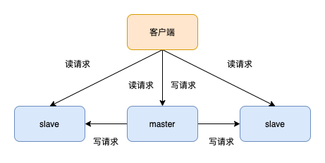

主从库之间采用的是**读写分离**的模式。

**读操作：主库，从库都可以执行** 

**写操作：只能主库上执行，主库将操作同步给从库**

因为**主从库都可以接收读请求**，提高了系统的QPS

主从模式最大的优点是**部署简单**，最少**两个节点便可以构成主从模式**，并且可以通过**读写分离避免读和写同时不可用**。不过，一旦 Master 节点出现故障，主从节点就**无法自动切换**所以，主从模式一般**适合业务发展初期，并发量低，运维成本低**的情况

---

**同步过程：**

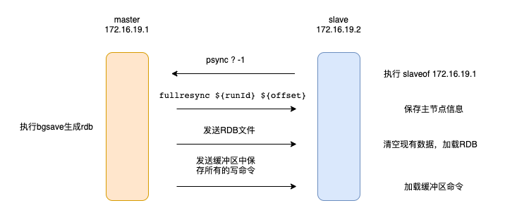

主从库全量复制主要分为如下三个阶段

1. 从库发送psync命令，此时**主库开始生成rdb文件**
2. 主库将生成的**rdb文件发送给从库**
3. 主库将生成rdb文件**后接收到的写命令发送给从库**

**异步复制：**

主节点不但负责数据读写，还负责把写命令同步给从节点，写命令的发送过程是异步完成，也就是说主节点处理完写命令后立即返回客户度，**并不等待从节点复制完成**。

1. 主节点接受处理命令
2. 主节点处理完后返回响应结果
3. 对于修改命令，异步发送给从节点，从节点在主线程中执行复制的命令。

**增量复制：**

在Redis2.8之前，如果出现了网络异常，从库和主库会进行一次全量复制，开销非常大。

在Redis2.8之后，主从库会采用**增量复制**的方式进行同步。增量复制只会把**主从库断连期间主库接收到的命令同步给从库**

---

**增量同步时主从库如何保持一致：**

**复制偏移量**：**主库和从库(双方)都会**在内部维护一个**复制偏移量** 

主库每次向从库发送n个字节的数据时，就把自己的复制偏移量加上n 

从库每次收到主库传来的n个字节的数据时，就把自己的复制偏移量加上n

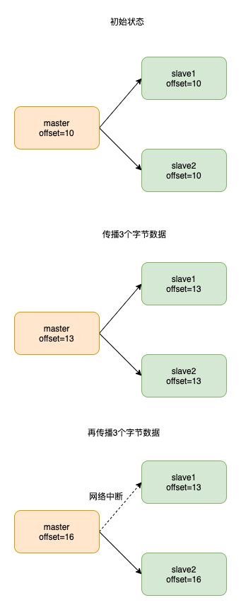

---

**主从复制原理：**

 ①通过从服务器发送到PSYNC命令给主服务器

 ②如果是首次连接，触发一次**全量复制**。此时主节点会启动一个后台线程，生成 RDB 快照文件

 ③主节点会将这个 RDB 发送给从节点，slave 会先写入本地磁盘，再从本地磁盘加载到内存中

 ④master会将此过程中的写命令写入缓存，从节点**实时同步**这些数据

 ⑤如果网络断开了连接，自动重连后主节点通过命令传播**增量复制**给从节点部分缺少的数据

**缺点**

 所有的slave节点数据的复制和同步都由master节点来处理，会照成master节点压力太大，使用主从从结构来解决，redis4.0中引入psync2 解决了slave重启后仍然可以增量同步。

## 哨兵模式

> 主要解决了主从下master宕机后需要手动切换的问题

 由一个或多个sentinel实例组成sentinel集群可以监视一个或多个主服务器和多个从服务器。**哨兵模式适合读请求远多于写请求的业务场景，比如在秒杀系统**中用来缓存活动信息。 如果写请求较多，当集群 Slave 节点数量多了后，Master 节点同步数据的压力会非常大。

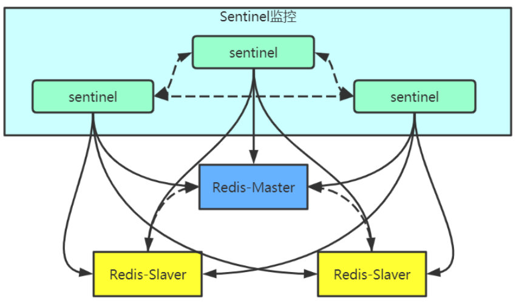

当主服务器进入下线状态时，sentinel可以将该主服务器下的某一从服务器**升级为主服务器继续提供服务，从而保证redis的高可用性**。

**检测主观下线状态**

 Sentinel每秒一次向所有与它建立了命令连接的实例(主服务器、从服务器和其他Sentinel)发送PING命 令

 实例在所配置的**down-after-milliseconds**毫秒（默认30s）内返回无效回复Sentinel就会认为该实例主观下线(**SDown**)

**检查客观下线状态**

 当一个Sentinel将一个主服务器判断为主观下线后 ，Sentinel会向监控这个主服务器的所有其他Sentinel发送查询主机状态的命令

 如果达到Sentinel配置中的quorum数量的Sentinel实例**都判断主服务器为主观下线**，则该主服务器就会被判定为客观下线(**ODown**)。

**选举Leader Sentinel**

 当一个主服务器被判定为客观下线后，监视这个主服务器的所有Sentinel会通过选举算法(raft)，选出一个Leader Sentinel去执行**failover(故障转移)**操作。

**Raft算法**

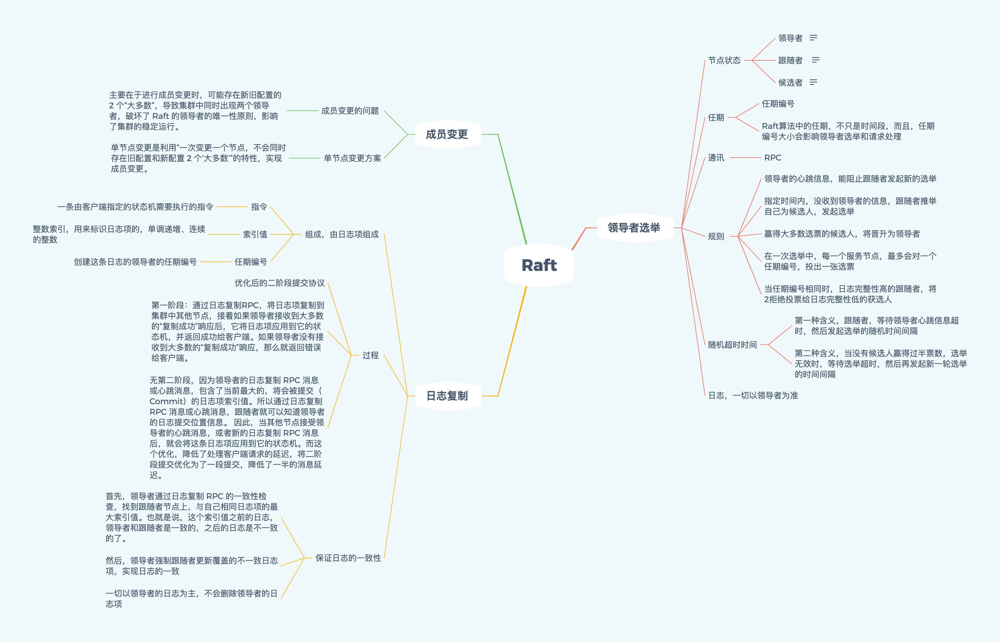

 Raft协议是用来解决分布式系统一致性问题的协议。 Raft协议描述的节点共有三种状态:Leader, Follower, Candidate。 Raft协议将时间切分为一个个的Term(任期)，可以认为是一种“逻辑时间”。 选举流程: 

①Raft采用心跳机制触发Leader选举系统启动后，全部节点初始化为Follower，term为0

 ②节点如果收到了RequestVote或者AppendEntries，就会保持自己的Follower身份

 ③节点如果一段时间内没收到AppendEntries消息，在该节点的超时时间内还没发现Leader，Follower就会转换成Candidate，自己开始竞选Leader。 一旦转化为Candidate，该节点立即开始下面几件事情: --增加自己的term，启动一个新的定时器 --给自己投一票，向所有其他节点发送RequestVote，并等待其他节点的回复。

 ④如果在计时器超时前，节点收到多数节点的同意投票，就转换成Leader。同时通过 AppendEntries，向其他节点发送通知。

 ⑤每个节点在一个term内只能投一票，采取先到先得的策略，Candidate投自己， Follower会投给第一个收到RequestVote的节点。

 ⑥Raft协议的定时器采取随机超时时间（选举的关键），先转为Candidate的节点会先发起投票，从而获得多数票。

**主服务器的选择**

 当选举出Leader Sentinel后，Leader Sentinel会根据以下规则去从服务器中选择出新的主服务器。

1. 过滤掉主观、客观下线的节点
2. 选择配置slave-priority最高的节点，如果有则返回没有就继续选择
3. 选择出复制偏移量最大的系节点，因为复制偏移量越大则数据复制的越完整
4. 选择run_id最小的节点，因为run_id越小说明重启次数越少

**故障转移**

 当Leader Sentinel完成新的主服务器选择后，Leader Sentinel会对下线的主服务器执行故障转移操作，主要有三个步骤:

 1、它会将失效 Master 的其中一个 Slave 升级为新的 Master , 并让失效 Master 的其他 Slave 改为复制新的 Master ;

 2、当客户端试图连接失效的 Master 时，集群会向客户端返回新 Master 的地址，使得集群当前状态只有一个Master。

 3、Master 和 Slave 服务器切换后， Master 的 redis.conf 、 Slave 的 redis.conf 和 sentinel.conf 的配置文件的内容都会发生相应的改变，即 Master 主服务器的 redis.conf配置文件中会多一行 replicaof 的配置， sentinel.conf 的监控目标会随之调换。

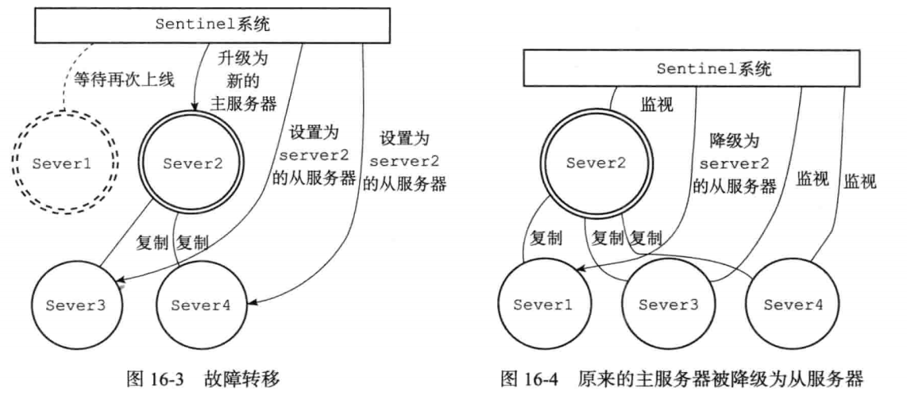

**缺点**

- 部署相对Redis主从模式要复杂一些，原理理解更繁琐；
- 资源浪费，Redis数据节点中slave节点作为备份节点不提供服务；
- Redis Sentinel主要是针对Redis数据节点中的**主节点的高可用切换**，对Redis的数据节点做失败判定分为主观下线和客观下线两种，对于Redis的从节点有对节点做主观下线操作，并不执行故障转移。
- 不能解决读写分离问题，实现起来相对复杂。

## 集群模式

> Sentinal 着眼于高可用，master宕机时会自动将slave提升为master
>
> cluster 着眼于扩展性，在单个redis内存不足时，使用Cluster进行分片存储

集群通过分片实现数据共享，并提供复制和故障转移功能。

 为了避免单一节点负载过高导致不稳定，集群模式采用**一致性哈希算法或者哈希槽的方法**将 Key 分布到各个节点上。其中，每个 Master 节点后跟若干个 Slave 节点，用于**出现故障时做主备切换**，客户端可以**连接任意 Master 节点**，集群内部会按照**不同 key 将请求转发到不同的 Master** 节点

 集群模式是如何实现高可用的呢？集群内部节点之间会**互相定时探测**对方是否存活，如果多数节点判断某个节点挂了，则会将其踢出集群，然后从 **Slave** 节点中选举出一个节点**替补**挂掉的 Master 节点。**整个原理基本和哨兵模式一致**

 虽然集群模式避免了 Master 单节点的问题，但**集群内同步数据时会占用一定的带宽**。所以，只有在**写操作比较多的情况下人们才使用集群模式**，其他大多数情况，使用**哨兵模式**都能满足需求

**缺点**

- Client实现复杂，驱动要求实现Smart Client，缓存slots mapping信息并及时更新，提高了开发难度，客户端的不成熟影响业务的稳定性。目前仅JedisCluster相对成熟，异常处理部分还不完善，比如常见的“max redirect exception”。
- 节点会因为某些原因发生阻塞（阻塞时间大于clutser-node-timeout），被判断下线，这种failover是没有必要的。
- 数据通过异步复制，不保证数据的强一致性。
- 多个业务使用同一套集群时，无法根据统计区分冷热数据，资源隔离性较差，容易出现相互影响的情况。
- Slave在集群中充当“冷备”，不能缓解读压力，当然可以通过SDK的合理设计来提高Slave资源的利用率。**只有主节点负责读写请求和集群信息的维护；从节点只进行主节点数据和状态信息的复制。**
- Key批量操作限制，如使用mset、mget目前只支持具有相同slot值的Key执行批量操作。对于映射为不同slot值的Key由于Keys不支持跨slot查询，所以执行mset、mget、sunion等操作支持不友好。
- Key事务操作支持有限，只支持多key在同一节点上的事务操作，当多个Key分布于不同的节点上时无法使用事务功能。
- Key作为数据分区的最小粒度，不能将一个很大的键值对象如hash、list等映射到不同的节点。
- 不支持多数据库空间，单机下的Redis可以支持到16个数据库，集群模式下只能使用1个数据库空间，即db 0。
- 复制结构只支持一层，从节点只能复制主节点，不支持嵌套树状复制结构。
- 避免产生hot-key，导致主库节点成为系统的短板。
- 避免产生big-key，导致网卡撑爆、慢查询等。
- 重试时间应该大于cluster-node-time时间。
- Redis Cluster不建议使用pipeline和multi-keys操作，减少max redirect产生的场景。

---

redis cluster设置有0~16383的槽，每个槽映射一个数据子集，通过hash函数，将数据存放在不同的槽位中，每个集群的节点保存一部分的槽。每个key存储时，先经过**哈希函数**CRC16(key)得到一个整数，然后整数与16384**取模**，得到**槽的数值**，然后找到对应的节点，将数据存放入对应的槽中

集群的每个节点负责一部分的hash槽，当需要增加节点的时候，只需要把其他节点的某些哈希槽挪到新节点即可；移除的时候，只需要把移除节点上的哈希槽挪到其他节点就行了；

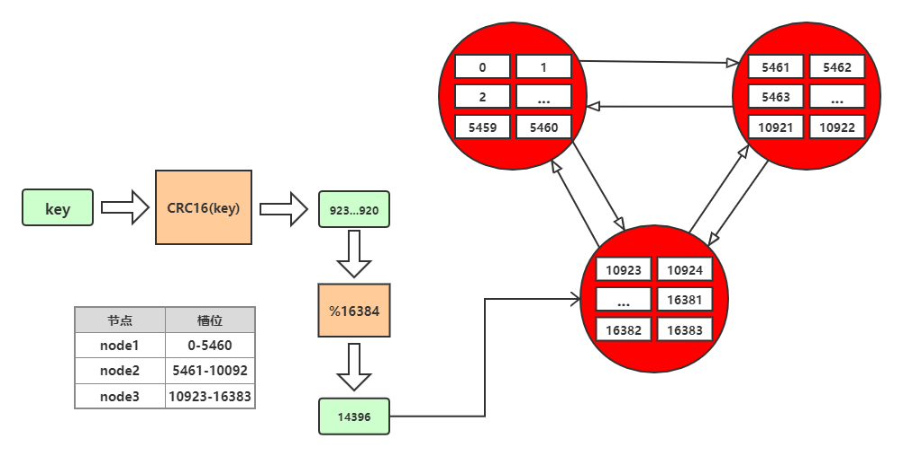

**集群通信**

但是寻找槽的过程并不是一次就命中的，比如上图key将要存放在14396槽中，但是并不是一下就锁定了node3节点，可能先去询问node1，然后才访问node3。

而集群中节点之间的通信，保证了最多两次就能命中对应槽所在的节点。因为在每个节点中，都保存了其他节点的信息，知道哪个槽由哪个节点负责。这样即使第一次访问没有命中槽，但是会通知客户端，该槽在哪个节点，这样访问对应节点就能精准命中。

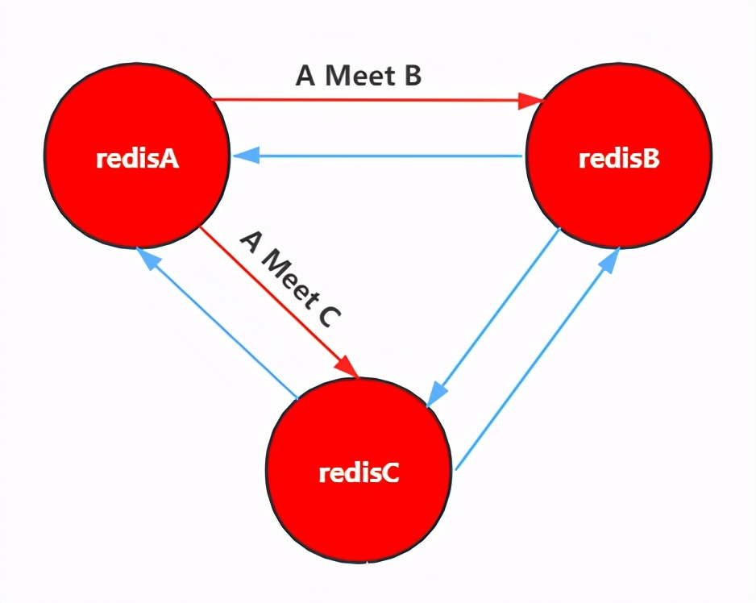

1. 节点A对节点B发送一个meet操作，B返回后表示A和B之间能够进行沟通。
2. 节点A对节点C发送meet操作，C返回后，A和C之间也能进行沟通。
3. 然后B根据对A的了解，就能找到C，B和C之间也建立了联系。
4. 直到所有节点都能建立联系。

这样每个节点都能互相直到对方负责哪些槽

集群并不是建立之后，节点数就固定不变的，也会有新的节点加入集群或者集群中的节点下线，这就是集群的扩容和缩容。但是由于集群节点和槽息息相关，所以集群的伸缩也对应了槽和数据的迁移

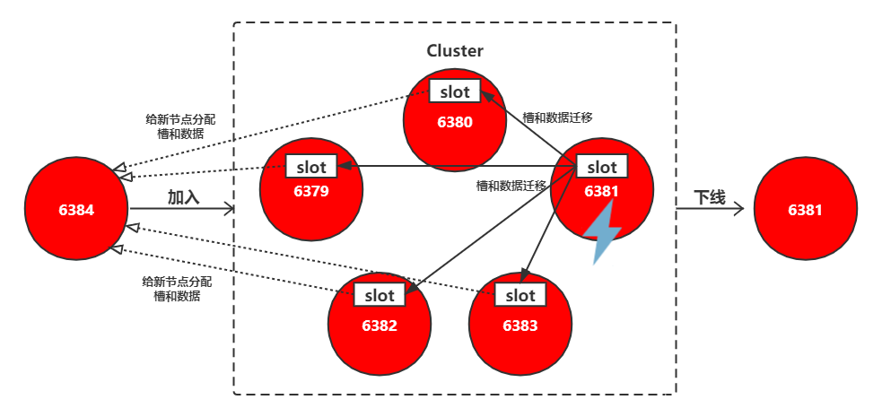

加入有两种方式。一个是通过集群节点执行命令来和该孤立节点握手，另一个则是使用脚本来添加节点。

1. cluster_node_ip:port: cluster meet ip port new_node_ip:port
2. redis-trib.rb add-node new_node_ip:port cluster_node_ip:port

通常这个新的节点有两种身份，要么作为主节点，要么作为从节点：

- 主节点：分摊槽和数据
- 从节点：作故障转移备份

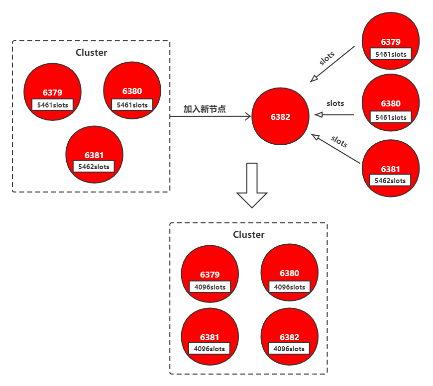

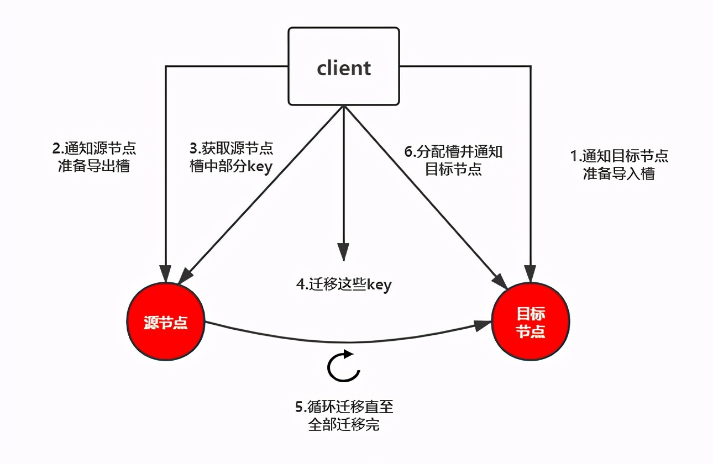

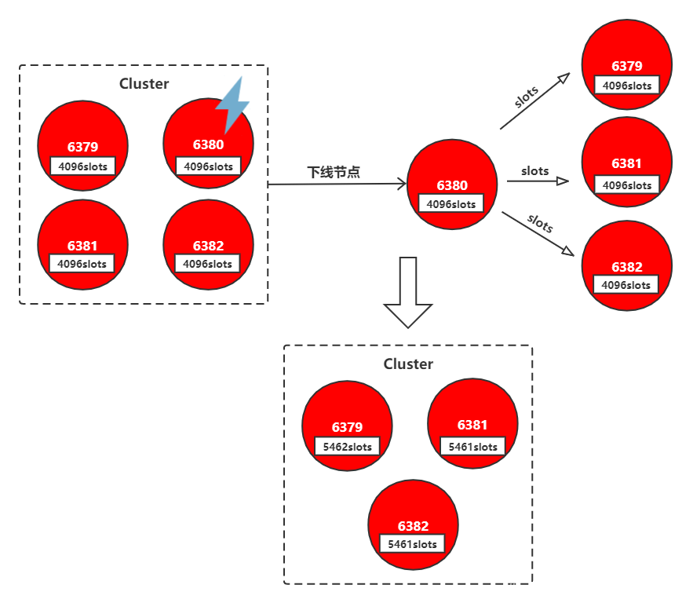

**下线节点的流程如下：**

1. 判断该节点是否持有槽未持有槽就跳转到下一步持有槽则先迁移槽到其他节点
2. 通知其他节点（**cluster forget**）忘记该下线节点
3. 关闭下线节点的服务

**故障转移：**

只有主节点才需要进行故障转移。主从复制时，需要使用redis sentinel来实现故障转移。而redis cluster则不需要redis sentinel，其自身就具备了故障转移功能。集群节点发现故障同样是有主观下线和客观下线的

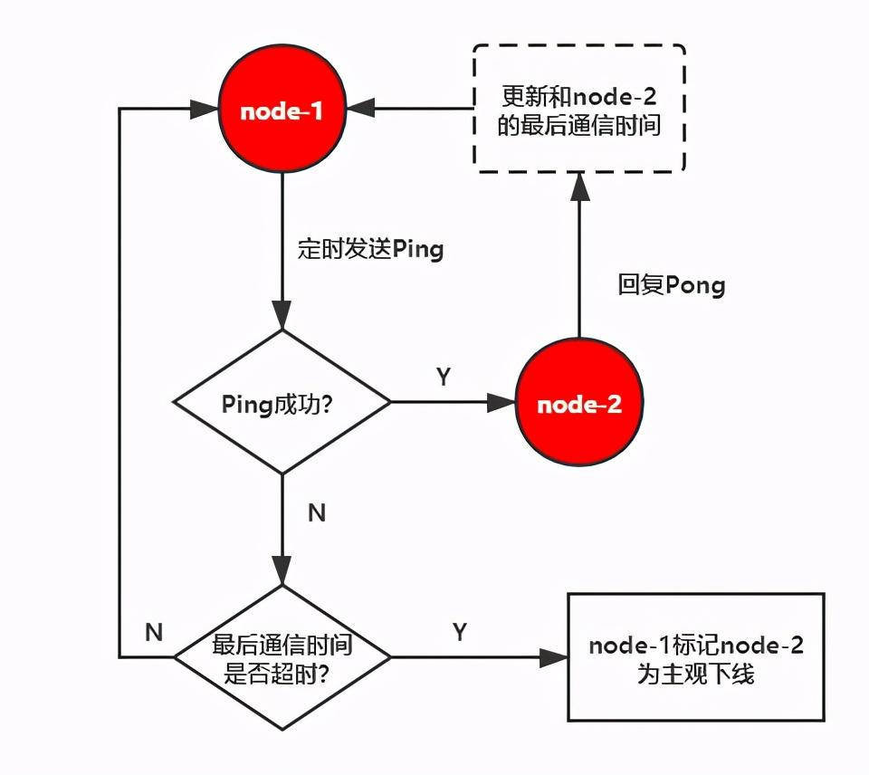

对于每个节点有一个故障列表，故障列表维护了当前节点接收到的其他所有节点的信息。当半数以上的持有槽的主节点都标记某个节点主观下线，就会尝试客观下线。

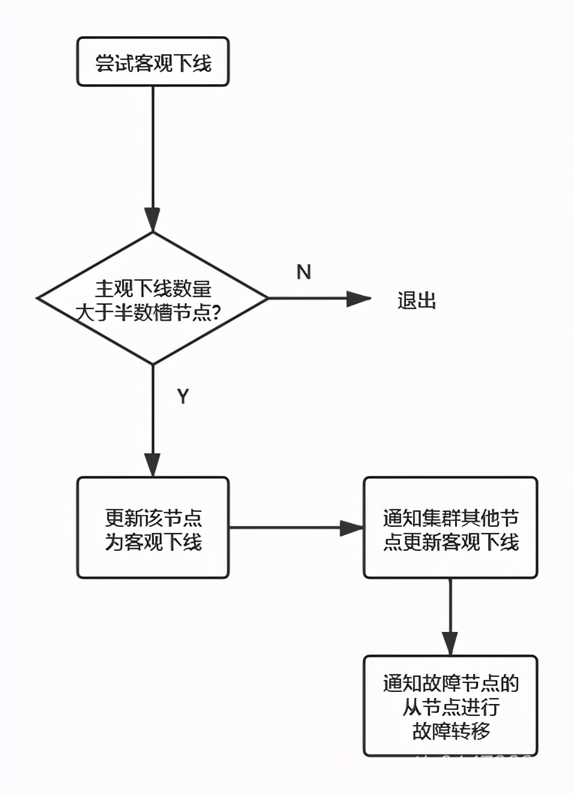

**故障转移**

首先是进行**资格检查**，只有具备资格的从节点才能参加选举：

- 故障节点的所有从节点检查和故障主节点之间的**断线时间**
- 超过cluster-node-timeout * cluster-slave-validati-factor(默认10)则取消选举资格

然后是准备**选举顺序**，不同偏移量的节点，参与选举的顺位不同。**offset最大的slave节点，选举顺位最高，最优先选举。而offset较低的slave节点，要延迟选举。**

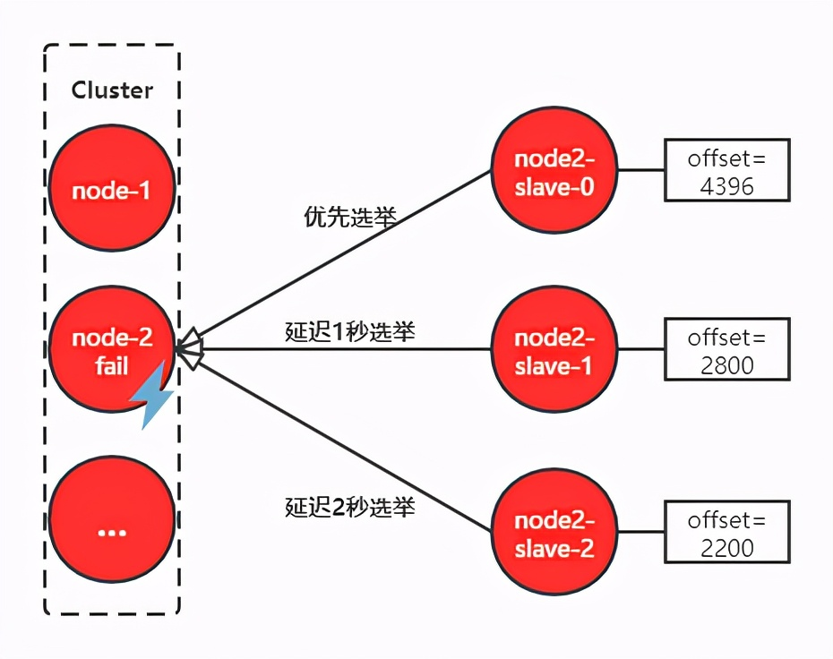

当有从节点参加选举后，主节点收到信息就开始投票。偏移量最大的节点，优先参与选举就更大可能获得最多的票数，称为主节点。

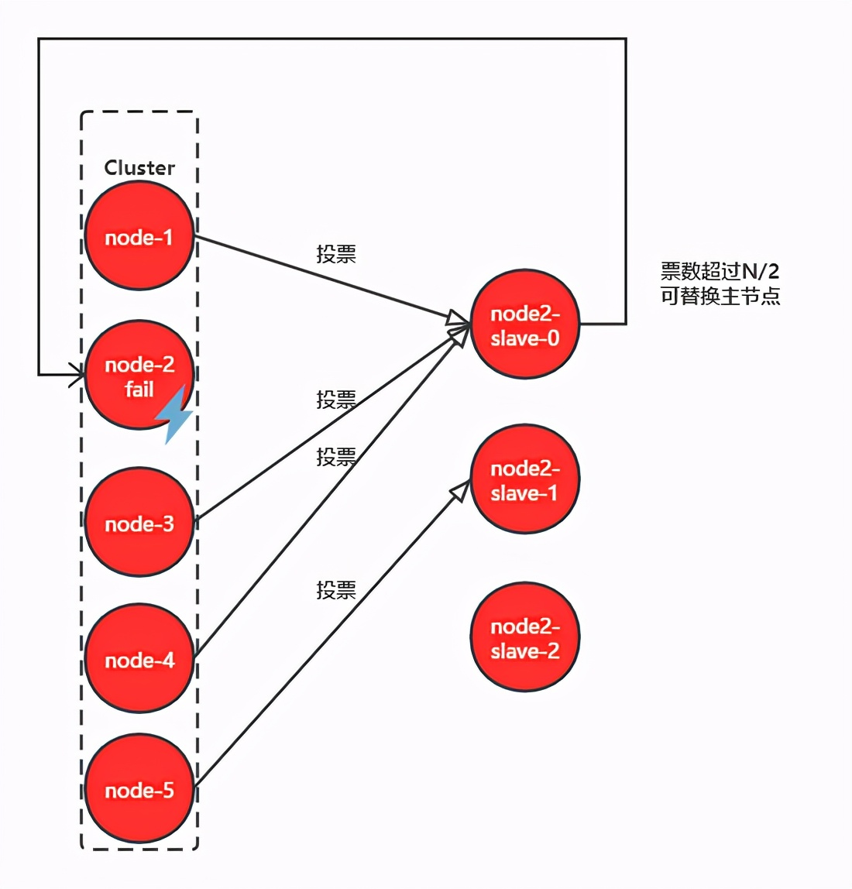

当从节点走马上任变成主节点之后，就要开始进行**替换主节点**：

1. 让该slave节点执行slaveof no one变为master节点
2. 将故障节点负责的槽分配给该节点
3. 向集群中其他节点广播Pong消息，表明已完成故障转移
4. 故障节点重启后，会成为new_master的slave节点

**扩容迁移数据问题**

- 主要谈到一致性哈希在redis中的具体实现
- 平滑迁移，对外做到无感知，比如用开源的工具**`redis-shake`** 

