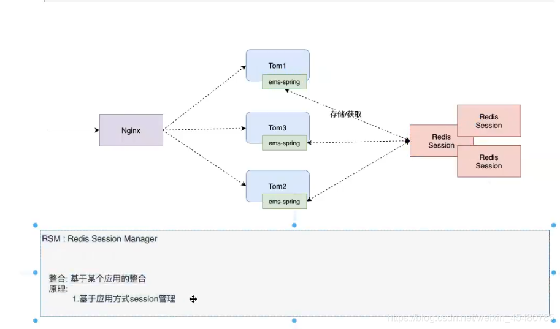
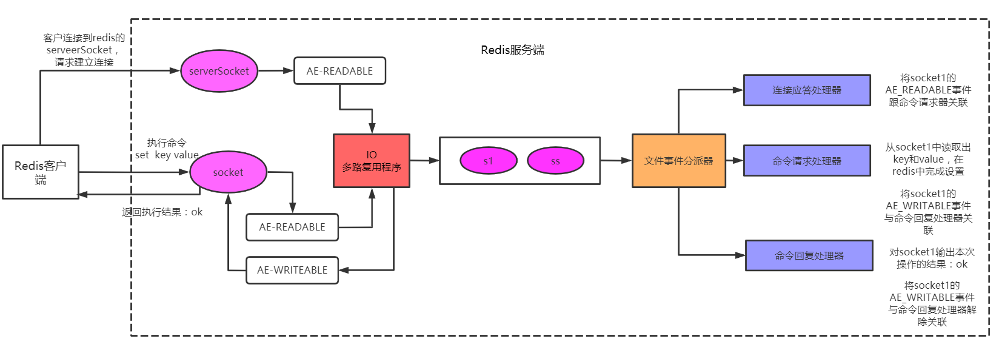
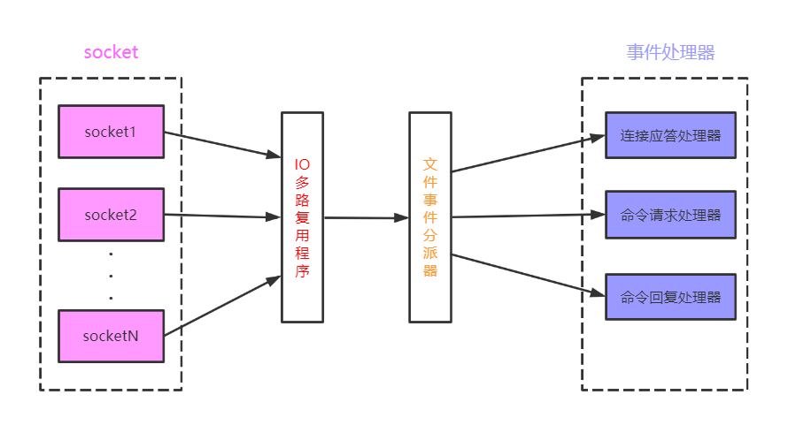

# Redis问与答

[TOC]

## 缓存雪崩

 指**缓存同一时间大面积的失效**(比如 宕机、cache服务挂了或者大量过期)，所以，后面的请求都会落到数据库上，从而导致数据库崩溃,整个系统崩溃,发生灾难

 **解决方案：**

- 事前：**Redis 高可用**，主从+哨兵，Redis cluster，避免全盘崩溃
- 事中：本地 ehcache 缓存 + hystrix **限流&降级**，避免 MySQL 被打死
  - 针对key值大批量过期的情况，可以设置不同的失效时间比如随机设置缓存的失效时间。
- 事后：Redis持久化，一旦重启，自动从磁盘上加载数据，快速恢复缓存数据
- **逻辑上永不过期 ** 给每一个缓存数据增加相应的**缓存标记**，缓存标记失效则更新数据缓存
- **多级缓存**，失效时通过二级更新一级，由第三方插件更新二级缓存。

- 本地缓存+hystrix的措施
  - 保证数据库绝对不会死，限流组件确保了每秒只有多少个请求能通过。
  - 对用户来说，部分请求都是可以被处理的。系统没死，对用户来说，可能就是点击几次刷不出来页面，但是多点几次，就可以刷出来了。

## 缓存穿透

 缓存穿透是指**缓存和数据库中都没有的数据**（恶意攻击者不断发起请求，如发起为id为“-1”的数据或id为特别大不存在的数据），导致所有的请求都落到数据库上，造成数据库短时间内承受大量请求而崩掉。

- 解决方案：
  1. 接口层增加校验，如用户鉴权校验，id做基础校验，id<=0的直接拦截；
  2. 缓存取不到的数据，在数据库中也没有取到，这时也可以将key-value对写为key-null，并设置缓存有效时间，可以设置短点如30秒，这样可以防止攻击用户反复用同一个id暴力攻击。
  3. 采用**布隆过滤器**，将所有可能存在的数据哈希到一个足够大的 bitmap 中，一个一定不存在的数据会被这个 bitmap 拦截掉，从而避免了对底层存储系统的查询压力。（宁可错杀一千不可放过一人）

### 缓存击穿

缓存击穿指的是， 由于并发用户特别多，同时读缓存没读到数据，又同时去数据库去取数据，引起数据库压力瞬间增大，造成过大压力。

和缓存雪崩不同的是，缓存击穿指**并发查同一条数据**，缓存雪崩是不同数据都过期了，很多数据都查不到从而查数据库

 **解决方案：**

 1）设置**热点数据永远不过期**，异步线程处理。

 2）若缓存的数据更新不频繁，且缓存刷新的整个流程耗时较少的情况下，则可以采用基于 Redis、zookeeper 等分布式中间件的分布式互斥锁，或者本地互斥锁以保证仅少量的请求能请求数据库并重新构建缓存，其余线程则在锁释放后能访问到新缓存

 3）缓存预热，若缓存的数据更新频繁或者在缓存刷新的流程耗时较长的情况下，可以利用定时线程在缓存过期前主动地重新构建缓存或者延后缓存的过期时间，以保证所有的请求能一直访问到对应的缓存

 系统上线后，将相关**可预期（例如排行榜）**热点数据直接加载到缓存。

 写一个缓存刷新页面，手动操作热点数据**（例如广告推广）**上下线。

## 数据不一致

 在缓存机器的带宽被打满，或者机房网络出现波动时，缓存更新失败，新数据没有写入缓存，就会导致缓存和 DB 的数据不一致。

缓存 rehash 时，某个缓存机器反复异常，多次上下线，更新请求多次 rehash。这样，一份数据存在多个节点，且每次 rehash 只更新某个节点，导致一些缓存节点产生脏数据。

- Cache 更新失败后，可以进行重试，则将重试失败的 key 写入mq，待缓存访问恢复后，将这些 key 从缓存删除。这些 key 在再次被查询时，重新从 DB 加载，从而保证数据的一致性
- 缓存时间适当调短，让缓存数据及早过期后，然后从 DB 重新加载，确保数据的最终一致性。
- 不采用 rehash 漂移策略，而采用缓存分层策略，尽量避免脏数据产生。

## 数据并发竞争

数据并发竞争在大流量系统也比较常见，比如车票系统，如果某个火车车次缓存信息过期，但仍然有大量用户在查询该车次信息。又比如微博系统中，如果某条微博正好被缓存淘汰，但这条微博仍然有大量的转发、评论、赞。上述情况都会造成并发竞争读取的问题。

-  **互斥锁**，查询失败默认值快速返回。
-  对缓存数据保持多个备份，减少并发竞争的概率

## 热点key问题

 明星结婚、离婚、出轨这种特殊突发事件，比如奥运、春节这些重大活动或节日，还比如秒杀、双12、618 等线上促销活动，都很容易出现 Hot key 的情况。

如何提前发现HotKey？

- 对于重要节假日、线上促销活动这些提前已知的事情，可以提前评估出可能的热 key 来。
- 而对于突发事件，无法提前评估，可以**通过 Spark，对应流任务进行实时分析**，及时发现新发布的热点 key。而对于之前已发出的事情，逐步发酵成为热 key 的，则可以通过 Hadoop 对批处理任务离线计算，找出最近历史数据中的高频热 key。

**解决方案：**

- 这 n 个 key 分散存在多个缓存节点，然后 client 端请求时，随机访问其中某个后缀的 hotkey，这样就可以把热 key 的请求打散，避免一个缓存节点过载
- 缓存集群可以单节点进行主从复制和垂直扩容
- 利用应用内的前置缓存，但是需注意需要设置上限
- 延迟不敏感，定时刷新，实时感知用主动刷新
- 和缓存穿透一样，限制逃逸流量，单请求进行数据回源并刷新前置
- 无论如何设计，最后都要写一个兜底逻辑，千万级流量说来就来

## BigKey问题

- 首先Redis底层数据结构里，根据Value的不同，会进行数据结构的重新选择
- 可以扩展新的数据结构，进行序列化构建，然后通过 restore 一次性写入
- 将大 key **拆分为多个 key**，设置较长的过期时间

## 主从同步下数据丢失

### 丢失场景

1. 主从同步过程中，主节点的数据**还未同步到从节点**，但是**主节点挂了**，进行了主从切换；导致从的数据丢失了一部分
2. 主挂了，从节点选取了新的主节点；但此时客户端还与老的主节点进行通讯，等客户端主从变换成功之后，**从新的主节点获取数据**，会导致数据丢失；因为老的新节点恢复后也以slave节点存在（自身的数据清空，从新的主节点获取数据）

### 解决

~~~shell
// 至少要保证n个从节点从主节点复制数据的延迟不能超过s秒钟
// 如n设置为1，s设置为10，就表示集群中至少要有1个从几点从主节点复制数据的延迟不能超过10秒钟，一旦所有的节点，从主节点同步数据的时间延迟都超过10秒，主节点停止接收任何写请求。
// 但是这只是一种止损的
min-slaves-to-write n
min-slaves-max-lag s
~~~

## 提升缓存命中率

首先不命中：无法直接通过缓存获取到想要的数据，需要再次查询数据库或者执行其它的操作。原因可能是由于**缓存中根本不存在，或者缓存已经过期**。

~~~shell
// 怎么计算命中率
telnet localhost 6379  
info 
keyspace_hits:14414110  
keyspace_misses:3228654  
used_memory:433264648  
expired_keys:1333536  
evicted_keys:1547380
// 通过计算hits和miss，我们可以得到缓存的命中率：14414110 / (14414110 + 3228654) = 81% 
~~~

## 影响缓存命中率的几个因素

### 1.业务场景和业务需求

缓存适合“读多写少”的业务场景，反之，使用缓存的意义其实并不大，命中率会很低。

业务需求决定了对时效性的要求，直接影响到缓存的过期时间和更新策略。时效性要求越低，就越适合缓存。在相同key和相同请求数的情况下，缓存时间越长，命中率会越高。

互联网应用的大多数业务场景下都是很适合使用缓存的。

### 2.缓存的设计（粒度和策略）

通常情况下，**缓存的粒度越小，命中率会越高**。举个实际的例子说明：

当缓存单个对象的时候（例如：单个用户信息），只有当该对象对应的数据发生变化时，我们才需要更新缓存或者让移除缓存。而当缓存一个集合的时候（例如：所有用户数据），其中任何一个对象对应的数据发生变化时，都需要更新或移除缓存。

还有另一种情况，假设其他地方也需要获取该对象对应的数据时（比如其他地方也需要获取单个用户信息），如果缓存的是单个对象，则可以直接命中缓存，反之，则无法直接命中。这样更加灵活，缓存命中率会更高。

此外，缓存的**更新/过期策略**也直接影响到缓存的命中率。当数据发生变化时，直接更新缓存的值会比移除缓存（或者让缓存过期）的命中率更高，当然，系统复杂度也会更高。

### 3.缓存容量和基础设施

缓存的容量有限，则容易引起缓存失效和被淘汰（目前多数的缓存框架或中间件都采用了LRU算法）。同时，缓存的技术选型也是至关重要的，比如采用应用内置的本地缓存就比较容易出现单机瓶颈，而采用分布式缓存则毕竟容易扩展。所以需要做好系统容量规划，并考虑是否可扩展。此外，不同的缓存框架或中间件，其效率和稳定性也是存在差异的。

### 4.其他因素

当缓存节点发生故障时，需要避免缓存失效并最大程度降低影响，这种特殊情况也是架构师需要考虑的。业内比较典型的做法就是通过一致性Hash算法，或者通过节点冗余的方式。

> 提高的方法
>
> 聚焦在高频访问且时效性要求不高的热点业务上（如字典数据，session，token），通过缓存预加载，增加存储容量，调整缓存粒度，更新缓存手段等等来提高命中率

## Redis分布式Session解决方案

先简单介绍一下分布式session的常见解决方案：

1. session复制

   > 需要将其他服务器上的session全部同步到本服务器上，会带来一定的网路开销，在用户量特别大的时候，会出现内存不足的情况，服务器之间的session都是同步的，任何一台宕机之后影响都不大且配置相对简单
   >
   > web.xml中开启session复制：`<distributable/>`

2. session粘性 负载均衡方案

   > Ngnix每次都将同一用户的所有请求转发至同一台服务器上，即将用户与服务器绑定
   >
   > 这样也会带来极大的风险，比如说有一台服务器宕机，那该台服务器上的session全部失效，而且要求nginx一定是最前端的服务器，否则nginx得不到正确ip，就不能根据ip作hash，否则将出现分流错乱

3. 基于cookie 客户端存储

   > 直接存储在cookie中，但存在以下问题：
   >
   > 数据存储在客户端，存在安全隐患，cookie存储大小、类型存在限制，而且，如果一次请求cookie过大，会给网络增加更大的开销

4. 交给Redis

   > - spring为我们封装好了spring-session，直接引入依赖即可，*@EnableRedisHttpSession注解* 
   > - 数据保存在redis中，无缝接入，不存在任何安全隐患
   > - redis自身可做集群，搭建主从，同时方便管理

## Redis的多路复用是怎么保证读写的顺序正确

Redis会将每个客户端套接字都关联一个指令队列，客户端的指令通过队列进行顺序处理，先到先服务，多个套接字产生的事件，由IO多路复用程序将它们放到一个队列中，然后通过这个队列，有序、同步地传递给文件事件分派器

## Redis io多路复用原理

Redis 是单线程架构，所有的命令操作都是**先进入队列**，然后一个一个按照顺序线性执行的，但是由于读写操作等待用户输入或输出都是阻塞的，所以 I/O 操作在一般情况下往往不能直接返回，这会导致某一文件的 I/O 阻塞导致整个进程无法对其它客户提供服务，**为了让单线程的服务端应用同时处理多个客户端的事件**，而采用 I/O 多路复用技术就是为了解决这个问题。（Redis 也支持 select 和 poll，默认使用 epoll）

## Redis内存占用过高

首先分析为什么占用会过高，可能是Key设置的不合理、业务需求多等等

1. 可以对Key进行采集和分析，需要优化改进的Key以及可以直接删除的Key，控制key的数量

2. **缩减键值对象**，降低Redis内存使用最直接的方式就是缩减键（key）和值（value）的长度。

   - key长度：如在设计键时，在完整描述业务情况下，键值越短越好。
   - value长度：值对象缩减比较复杂，常见需求是把业务对象序列化成二进制数组放入Redis。首先应该在业务上精简业务对象，去掉不必要的属性避免存储无效数据。其次在序列化工具选择上，应该选择更高效的序列化工具来降低字节数组大小。

3. **编码优化**。Redis对外提供了string,list,hash,set,zet等类型，但是Redis内部针对不同类型存在编码的概念，所谓编码就是具体使用哪种底层数据结构来实现。编码不同将直接影响数据的内存占用和读写效率。

4. **共享对象池**

   > 对象共享池指Redis内部维护[0-9999]的整数对象池。创建大量的整数类型redisObject存在内存开销，每个redisObject内部结构至少占16字节，甚至超过了整数自身空间消耗。所以Redis内存维护一个[0-9999]的整数对象池，用于节约内存。 除了整数值对象，其他类型如list,hash,set,zset内部元素也可以使用整数对象池。因此开发中在满足需求的前提下，尽量使用整数对象以节省内存。

5. 字符串优化

   > 由于Redis内部最常用的数据结构就是字符串，注意**预分配机制带来的内存浪费**

   **字符串重构**： 指不一定把每份数据作为字符串整体存储，像json这样的数据可以使用hash结构，使用二级结构存储也能帮我们节省内存。同时可以使用hmget,hmset命令支持字段的部分读取修改，而不用每次整体存取

## Redis为什么快

- 第一是开发语言，C是接近操作系统的语言

- 二是Redis所有数据直接放在内存中，内存是电存储

- 三是Redis默认的单线程避免了线程切换以及加锁释放锁带来的消耗

- 四是Redis采用的是非阻塞Io 多路复用模型，默认使用epoll作为实现机制，epoll默认的水平触发只要缓冲区还有数据，就会一直触发事件。epoll 中的读、写、关闭、连接都转化成了事件，然后利用 epoll 的多路复用特性，不在 IO 上浪费时间

  > IO多路复用 实现了**一个线程可以监视多个文件句柄**，一旦某个文件句柄就绪，就能通知应用程序进行相应的读写操作

- 五可以谈 Redis高效的数据  结构，比如sds简单动态字符串，两种优化策略如，空间预分配和惰性空间释放

- 六 Redis有自己的虚拟内存机制，不会像一般的系统会调用系统函数处理，会浪费一定的时间去移动和请求

  > 虚拟内存机制就是暂时把**不经常访问的数据(冷数据)从内存交换到磁盘中**，从而腾出宝贵的内存空间用于其它需要访问的数据(热数据)。通过VM功能可以实现冷热数据分离，使热数据仍在内存中、冷数据保存到磁盘。这样就可以避免因为内存不足而造成访问速度下降的问题。

## 怎么考虑设置热点key

1. 针对具体的业务考虑，频繁访问的接口，或者接口rn时间长，涉及慢sql相关
2. 用redis自带的命令monitor实时抓取redis服务器接收到的命令，但是对性能有影响，高并发情况下不可取，4.0命令 `redis-cli --hotkeys`,但由于需要扫描整个 keyspace，实时性上比较差，另外扫描耗时与 key 的数量正相关，如果 key 的数量比较多，耗时可能会非常长。
3. 收集redis key访问日志，实时计算出热点key排名
4. 在proxy层，对每一个 redis 请求进行收集上报

## 影响redis的qps因素

- 网路带宽和延迟

- 大对象的存取

- 大量使用 pipelining 流水线发送 （使得client能够无等待响应的方式连续发送多条命令请求至Redis Server端，然后Server端按照请求顺序返回响应结果）

  ~~~shell
  client> set k0 v0;
  client> set k1 v1;
  client> set k2 v2;
  server> ok
  server> ok
  server> ok
  ~~~

  
