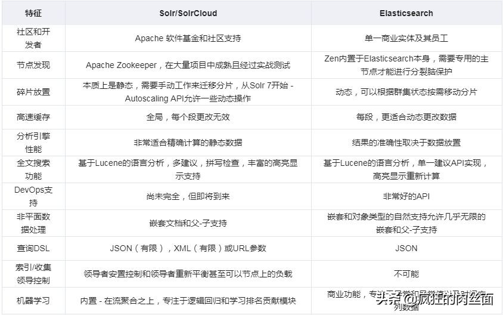

# Solr

## 原理

倒排索引

## 与ES比较

[Apache Solr vs Elasticsearch - the Feature Smackdown! (solr-vs-elasticsearch.com)](http://solr-vs-elasticsearch.com/)

- Elasticsearch是分布式的，不需要其他组件，Solr 利用 Zookeeper 进行分布式管理，而 Elasticsearch 自身带有分布式协调管理功能
- Elasticsearch设计用于云计算中，处理多租户不需要特殊配置，而Solr则需要更多的高级设置。
- 当单纯的对已有数据进行搜索时，Solr更快，实时建立索引时, Solr会产生io阻塞，查询性能较差, Elasticsearch具有明显的优势，随着数据量的增加，Solr的搜索效率会变得更低，而Elasticsearch却没有明显的变化

