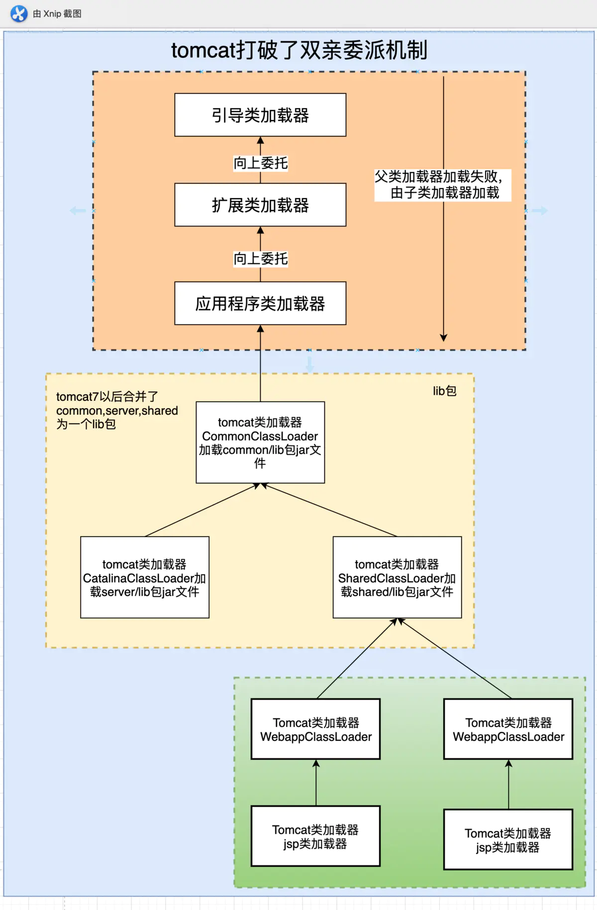

# Tomcat

[TOC]

## 为什么要打破双亲委派

1. 一个web容器可能需要部署两个应用程序，不同的应用程序可能会依赖同一个第三方类库的不同版本，不能要求同一个类库在同一个服务器只有一份，因此要保证每个应用程序的类库都是独立的，保证相互隔离。
2. 部署在同一个web容器中相同的类库相同的版本可以共享。
3. web容器也有自己依赖的类库，不能于应用程序的类库混淆。基于安全考虑，应该让容器的类库和程序的类库隔离开来。
4. web容器要支持jsp的热部署。
5. 

- CommonLoader：Tomcat最基本的类加载器，加载路径中的class可以被Tomcat容器本身以及各个Webapp访问；
- CommonClassLoader容器私有的类加载器，加载路径中的class对于Webapp不可见；
- SharedClassLoader：各个Webapp共享的类加载器，加载路径中的class对于所有Webapp可见，但是对于Tomcat容器不可见；
- WebappClassLoader：各个Webapp私有的类加载器，加载路径中的class只对当前Webapp可见；

1. CommonClassLoader能加载的类都可以被Catalina ClassLoader和SharedClassLoader使用，从而实现了公有类库的共用。
2. CatalinaClassLoader和Shared ClassLoader自己能加载的类则与对方相互隔离。
3. WebAppClassLoader可以使用SharedClassLoader加载到的类，但各个WebAppClassLoader实例之间相互隔离。
4. JasperLoader的加载范围仅仅是这个JSP文件所编译出来的那一个.Class文件，它出现的目的就是为了被丢弃：当Web容器检测到JSP文件被修改时，会替换掉目前的JasperLoader的实例，并通过再建立一个新的Jsp类加载器来实现JSP文件的HotSwap功能。 （JSP热部署原理）

Tomcat 为了实现隔离性，没有遵守双亲委派模型，每个WebAppClassLoader加载自己的目录下的class文件，不会传递给父类加载器。

