# Zab与Zookeeper.md

[TOC]

> ZAB 协议是为分布式协调服务ZooKeeper专门设计的一种支持崩溃恢复的一致性协议。基于该协议，ZooKeeper 实现了一种主从模式的系统架构来保持集群中各个副本之间的数据一致性

## Zab协议

全称ZooKeeper Atomic Broadcast protocol（原子消息广播协议）

ZAB协议运行过程中，所有的客户端更新都发往Leader，Leader写入本地日志后再复制到所有的Follower节点。

一旦Leader节点故障无法工作，zab协议能够自动从Follower节点中重新选择出一个合适的替代者，这个过程被称为选主，选主也是ZAB协议中最为重要和复杂的过程

类似一个 **二阶段提交过程**。对于客户端发送的写请求，全部由 Leader 接收，Leader 将请求封装成一个事务 Proposal，将其发送给所有 Follwer ，然后，根据所有 Follwer 的反馈，如果超过半数成功响应，则执行 commit 操作（先提交自己，再发送 commit 给所有 Follwer）。

> 二阶段提交（英语：Two-phase Commit）是指在计算机网络以及数据库领域内，为了使基于分布式系统架构下的所有节点在进行事务提交时保持一致性而设计的一种算法。通常，二阶段提交也被称为是一种协议（Protocol）。在分布式系统中，每个节点虽然可以知晓自己的操作时成功或者失败，却无法知道其他节点的操作的成功或失败。当一个事务跨越多个节点时，为了保持事务的ACID特性，需要引入一个作为协调者的组件来统一掌控所有节点（称作参与者）的操作结果并最终指示这些节点是否要把操作结果进行真正的提交（比如将更新后的数据写入磁盘等等）。因此，二阶段提交的算法思路可以概括为： 参与者将操作成败通知协调者，再由协调者根据所有参与者的反馈情报决定各参与者是否要提交操作还是中止操作。

### 选主时机

#### 节点启动时

每个节点启动的时候状态都是LOOKING，处于观望状态，接下来就是要进行选主了，也就是节点刚启动，使子集进入选举状态

#### Leader节点异常

Leader节点运行后会周期性地向Follower发送心跳信息（称之为ping），如果一个Follower未收到Leader节点地心跳信息，Follower节点的状态会从FOLLOWING转变为LOOKING

在Follower节点的主要处理流程中：

~~~java
void followLeader() throws InterruptedException {
    try {
        ......
            while (this.isRunning()) {
                readPacket(qp);
                processPacket(qp);
            }
        // 如果上面的while循环内出现异常
        // 注意：长时间没有收到Leader的消息也是异常
    } catch (Exception e) {
        // 出现异常就退出了while循环
        // 也就结束了Follower的处理流程
    }
~~~

接下来进入节点运行的主循环：

~~~java
public void run() {
    // 在主循环内不停地接受Follower的消息并根据消息类型决定如何处理
    while (running) {
        switch (getPeerState()) {
            case FOLLOWING:
                try {
                    setFollower(makeFollower(logFactory));
                    follower.followLeader();
                } catch (Exception e) {
                    ......
                } finally {
                    follower.shutdown();
                    setFollower(null);
                    // 状态更新为LOOKING
                    updateServerState();
                }
                break;
                ......

        }
    }
~~~

此后，该Follower就会再次进入选主阶段。

#### 多数Follower节点异常

Leader节点也会检测Follower节点的状态，如果多数Follower节点**不再响应**Leader节点（可能是Leader节点与Follower节点之间产生了网络分区），那么Leader节点可能此时也不再是合法的Leader了，也必须要进行一次新的选主。

Leader节点启动时会接收**Follower的主动连接请求**，对于每一个Follower的新连接，Leader会创建一个**LearnerHandler对象来处理与该Follower的消息通信**。

LearnerHandler创建一个独立线程，在主循环内不停地接受Follower的消息并根据消息类型决定如何处理。除此以外，每收到Follower的消息时，便**更新下一次消息的过期时间**，在LeaderHandler::run()

~~~java
public void run() {
    ......
        while (true) {
            qp = new QuorumPacket();
            ia.readRecord(qp, "packet");
            ......
                // 收到Follower的消息后
                // 设置下一个消息的过期时间
                tickOfNextAckDeadline = leader.self.tick.get() + leader.self.syncLimit;
            ......
        }
    ......
}
~~~

在Leader节点的主循环流程中，会判断多数派节点的消息状态，如下：

~~~java
void lead() throws IOException, InterruptedException {
    ......
        while (true) {
            ......
                // 判断每个每个Follower节点的状态
                // 是否与Leader保持同步
                for (LearnerHandler f : getLearners()) {
                    if (f.synced()) {   
                        syncedAckSet.addAck(f.getSid());
                    }
                }
            ......
        }
    if (!tickSkip && !syncedAckSet.hasAllQuorums()) {
        // 如果失去了大多数Follower节点的认可，就跳出Leader主循环，进入选主流程
        break;
    }
    ......
}

// LearnerHandler::synced()逻辑
// 即判断当前是否已经过了期望得到的Follower的下一个消息的期限：tickOfNextAckDeadline
public boolean synced() {
    return isAlive() && leader.self.tick.get() <= tickOfNextAckDeadline;
}
~~~

### 选主流程

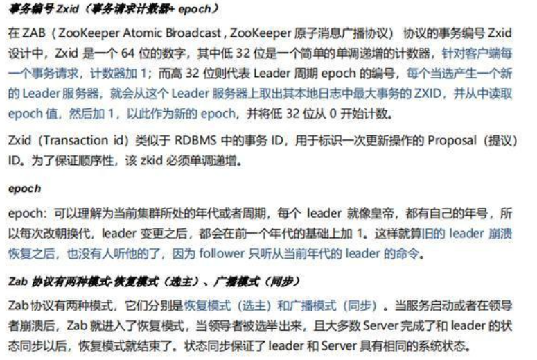

**election epoch**

这是分布式系统中极其重要的概念，由于分布式系统的特点，无法使用精准的时钟来维护事件的先后顺序，因此，Lampert提出的Logical Clock就成为了界定事件顺序的最主要方式。

分布式系统中以消息标记事件，所谓的Logical Clock就是**为每个消息加上一个逻辑的时间戳**。在ZAB协议中，每个消息都被赋予了一个zxid，zxid全局唯一。zxid有两部分组成：高32位是epoch，低32位是epoch内的自增id，由0开始。**每次选出新的Leader，epoch会递增**，**同时zxid的低32位清0**。这其实像极了咱们古代封建王朝的君主更替，每一次的江山易主，君王更替。

**zxid**

事务请求的唯一标记，由leader服务器负责进行分配。由2部分构成，高32位是上述的peerEpoch，低32位是请求的计数，从0开始。所以由zxid我们就可以知道该请求是哪个轮次的，并且是该轮次的第几个请求。

每个消息的编号，在分布式系统中，事件以消息来表示，**事件发生的顺序以消息的编号来标记**。在ZAB协议中，这就是zxid。ZAB协议中，消息的编号只能由Leader节点来分配，这样的好处是我们就可以**通过zxid来准确判断事件发生的先后**，记住，是任意事件，这也是分布式系统中，由全局唯一的主节点来处理更新事件带来的极大好处。

分布式系统运行的过程中，Leader节点必然会发生改变，一致性协议必须能够正确处理这种情况，保证在Leader发生变化的时候，新的Leader期间，产生的zxid必须要大于老的Leader时生成的zxid，通过上面说的epoch机制。

**logical clock**

表示选举轮数，在lookForLeader开始的时候会加1,，另外，在收到其他节点的投票信息时，如果其它节点的electionEpoch比本值大，本值会被赋成electionEpoch。也就是说，每次节点启动时，该值为0，这个值只在节点存活的时候有意义，即节点重启后，该值为0。

**proposedEpoch**

 表示本节点推荐的选举轮数，在updateProposal函数更新选票时，会更新该值。

****

**LOOKING/FOLLOWING/LEADING**

这三者描述了系统中节点的状态：

- LOOKING: 节点正处于选主状态，**不对外提供服务**，直至选主结束；
- FOLLOWING: 作为系统的从节点，接受主节点的更新并写入本地日志；
- LEADING: 作为系统主节点，接受客户端更新，写入本地日志并复制到从节点

### 参与方

选主过程参与方有：

- 发起选主的节点
- 集群其他节点，这些节点会为发起选主的节点进行投票

节点B判断确定A可以成为主，那么节点B就投票给节点A，判断的依据是：

> election epoch(A) > election epoch (B)
>
> zxid(A) > zxid(B)
>
> sid(A) > sid(B)

### 流程

1. 候选节点A初始化自身的zxid和epoch：updateProposal()；
2. 向**其他所有节点**发送选主通知：sendNotifications()；
3. 等待其他节点的回复：recvqueue.poll()；
4. 如果来自B节点的回复不为空，且B是一个有效节点，判断B此时的运行状态是LOOKING（也在发起选主）还是LEADING/FOLLOWING（正常请求处理过程）

由第四点就分为以下几种情况

#### 情况1：投票节点是LOOKING状态

> 处于LOOKING状态的A发起一次选主请求，并将请求广播至B、C节点，而此时B、C也恰好处于LOOKING状态：

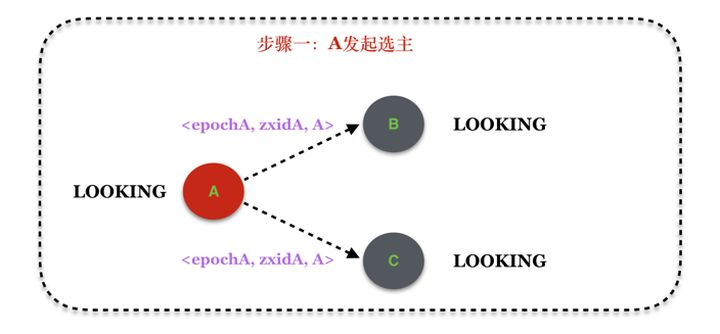

> B、C节点处理A的选主消息，其中，B接受A的提议，C拒绝A的提议：

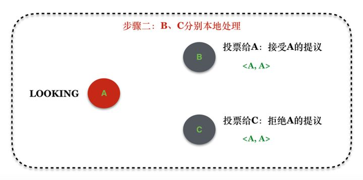

- 伴随着A的选主消息的一个额外收获是B和C此时都获得了A节点选主的结果（A投票给，记录为<A, A>），记录该信息，作为后续判断大家是否达成一致的标准。

> B将处理结果通知A、C

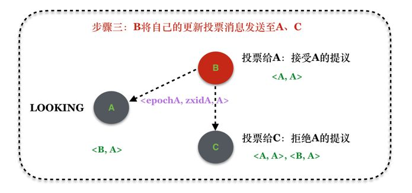

- 因为B更新了自己的投票，从投票给自己变成投票给A，因此根据协议的定义，需要将该消息扩散出去。而C由于拒绝了A的提议，因此，**无需扩散消息**；
- B将消息扩散给A和C的同时，A和C也就了解了B的投票信息，可以更新本地的投票信息表，例如上面经过B的扩散后，A知道了B节点的投票信息，C知道了A和B节点的投票信息。

> C同时也发起选主

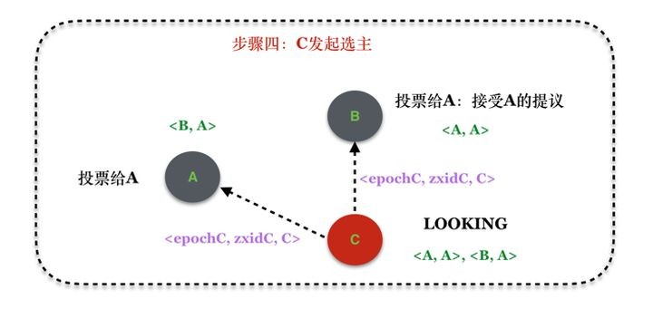

> A、B分别处理C的选主请求

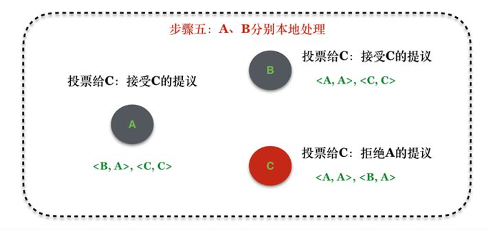

- 这里A和B判断得出C是最合适的Leader，因此A和B都更新自己的候选Leader为C，同时由于C的消息，A和B都更新自身维护的投票信息，增加C的投票信息。

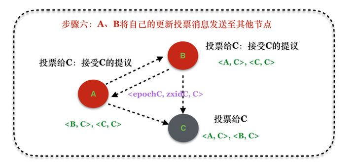

- 因为在第五步中A和B分别将自己的候选Leader变成了C，因此需要将该信息通知到其他节点，其他节点在收到新的投票信息后会更新本地的投票信息列表，如上图。

> 选主结束

此时此刻，所有的节点都已经达成了一致：每个节点都同意节点C作为新的Leader。

#### 情况2：投票节点是FOLLOWING/LEADING状态

以下原因可能导致出现这种情况：

- 节点A（Follower）与Leader出现网络问题而触发一次选主，但是其他Follower与Leader正常;
- 新节点加入集群也会有同样的情况发生。

如果一个正常服务状态(LEADING/FOLLOWING)的节点收到一个节点的选主请求，处理流程是怎么样的呢？

> 在QuorumPeer对象中存在一个WorkerReceiver线程，该线程的主要作用是**接受其他节点发送过来的选主消息变更的通知**。这个线程中收到其他节点发来的选主消息通知时会判断当前节点的状态：

~~~java
public void run() {
    ......
    if(self.getPeerState() == QuorumPeer.ServerState.LOOKING) {
        recvqueue.offer(n);
        ......
    // 如果节点处于非LOOKING状态
    } else {
        // 节点的投票信息
        Vote current = self.getCurrentVote();
        if(ackstate == QuorumPeer.ServerState.LOOKING) {
            QuorumVerifier qv = self.getQuorumVerifier();
            // 给发起投票的节点返回当前节点的投票信息
            ToSend notmsg = new ToSend(ToSend.mType.notification, ...）
            sendqueue.offer(notmsg);
        }
    }
}
~~~

此时处理过程是怎样的：

- 如果Logical Clock相同，将数据保存在recvset，如果Sender宣称自己是Leader，那么判断是不是半数以上的服务器都选举它，如果是设置角色并退出选举。
- 否则，这是一条与当前LogicalClock不符合的消息，说明在另一个选举过程中已经有了选举结果(另一个选举过程指的是什么)，于是将该选举结果加入到OutOfElection集合中，根据OutOfElection来判断是否可以结束选举，如果可以也是保存LogicalClock，更新角色，退出选举。出现这种情况可能是由于原集群中有一个新的服务器上线/重新启动，但是原来的已有集群的机器已经选主成功，因此，别无他法，只有加入原来的集群成为Follower。但这里的Logical Clock不符合，可能大也可能小，怎么理解？

说明：

- logical clock相同可能是因为出现这种情况：A、B同时发起选主，此时他们的election epoch可能相同，如果B率先完成了选主过程（B可能变成了Leader，也有可能B选择了其他节点为Leader），但是A还在选主过程中，此时如果B收到了A的选主消息，那么B就将自己的选主结果和自己的状态（LEADING/FOLLOWING）连同自己的election epoch回复给A，对于A来说，它收到了一个来自选主完成的节点B的election epoch相同的回复，便有了上面的第一种情况；

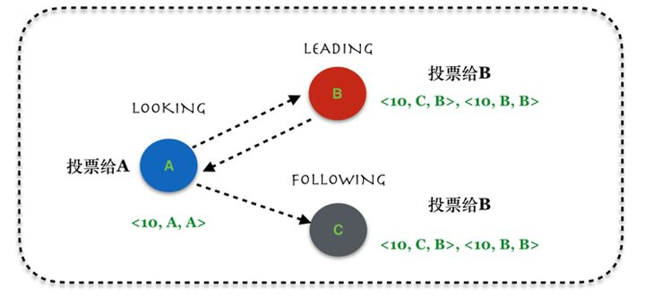

> 上图的10表示选主的Logical Clock

- logical clock不相同可能是因为新增了一个节点或者某个节点出现了网络隔离导致其触发一次新的选主，然后系统中其他节点状态依然正常，此时发起选主的节点由于要递增其logical clock，必然会导致其logical clock要大于其他正常节点的logical clock（当然也可能小于，考虑一个新上线节点触发选主，其logical clock从1开始计算）。因此就出现了上面的第二种情况，如下图：

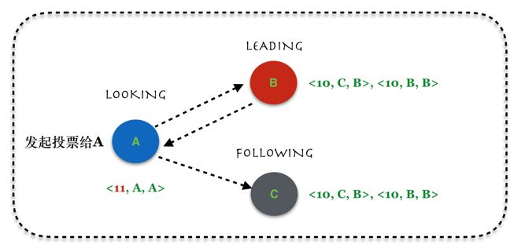

如果对方节点处于FOLLOWING/LEADING状态，除检查是否过半外，同时还要检查leader是否给自己发送过投票信息，从投票信息中确认该leader是不是LEADING状态。这个解释如下：

> 因为目前leader和follower都是各自检测是否进入leader选举过程。leader检测到未过半的server的ping回复，则leader会进入LOOKING状态，但是follower有自己的检测，感知这一事件，还需要一定时间，在此期间，如果其他server加入到该集群，可能会收到其他follower的过半的对之前leader的投票，但是此时该leader已经不处于LEADING状态了，所以需要这么一个检查来排除这种情况。

Leader/Follower信息同步

选出了Leader还不算完，根据ZAB协议定义，在真正对外提供服务之前还需要一个信息同步的过程。具体来说，Leader和Follower之间需要同步以下信息：

- **下一次zxid**：这是因为选出新的Leader后，epoch势必发生改变，因此，需要经过多方协商后选择出当前最大的epoch，然后再拼凑出下一轮提供服务的zxid
- **日志内容**：ZAB使用日志同步来维护多个节点的一致性状态，同步过程是由Leader发往Follower，因此可能会存在大家步调不一致的情况，表现出的现象就是节点日志内容不同，可能某些节点领先，而某些节点落后。

### Epoch协商

选主过程结束后，接下来就是多数派节点协商出一个最大的epoch（但如果是采用FastLeaderElection算法的话，选出来的Leader其实就拥有了最大的epoch）。

这个过程涉及到Leader和Follower节点的通信，具体流程：

1. Leader节点启动时调用getEpochToPropose()，并将自己的zxid解析出来的epoch作为参数；
2. Follower节点启动时也会连接Leader，并从自己的最后一条zxid解析出epoch发送给Leader，leader中处理该Follower消息的线程同样调用getEpochToPropose()，只是此时传入的参数是该Follower的epoch；
3. getEpochToPropose()中会判断参数中传入的epoch和当前最大的epoch，选择两者中最大的，并且判断该选择是否已经获得了多数派的认可，如果没有得到，则阻塞调用getEpochToPropose()的线程；如果获得认可，那就唤醒那些等待epoch协商结果的线程，于是，Follower就得到了多数派认可的全新的epoch，大家就从这个epoch开始生成新的zxid；
4. Leader的发起epoch更新过程在函数Leader::lead()中，Follower的发起epoch更新过程在函数Follower::followLeader()中，Leader处理Follower的epoch更新请求在函数LearnerHandler::run()中。

### 日志同步

选主结束后，接下来需要在Leader和Follower之间同步日志，根据ZAB协议定义，这个同步过程可能是Leader流向Follower。

对比的原理是将Follower的最新的日志zxid和Leader的已经提交的日志zxid对比，会有以下几种可能：

- 如果Leader的最新提交的日志zxid比Follower的最新日志的zxid大，那就将多的日志发送给Follower，让他补齐；
- 如果Leader的最新提交的日志zxid比Follower的最新日志的zxid小，那就发送命令给Follower，将其多余的日志截断；
- 如果两者恰好一样，那什么都不用做。

即使是一个日志同步过程也要经历以下几个同步过程：

1. Leader发送同步日志给Follower，该过程传输的主要是日志数据流或者Leader给Follower的各种命令；
2. Leader发送NEWLEADER命令给Follower，该命令的作用应该是告诉Follower日志同步已经完成，Follower对该NEWLEADER作出ACK，而Leader会等待该ACK消息；
3. Leader最后发送UPTODATE命令至Follower，这个命令的作用应该是告诉Follower，我已经收到了你的ACK，而Follower这边收到该消息的时候说明一切与Leader同步的初始化工作都已经完成，可以进入正常的处理流程了，而Leader这边发完该命令后也可以进入正常的请求处理流程了。

---

使用日志实现分布式系统一致性的方案中，日志代表了系统中发生的事件，而日志存在两种状态：

- 发起（Proposal）：日志已经被记录在Leader/Follower的日志文件中，相当于节点已经记录了该事件；
- 提交（Commit）：一旦事件被多数节点记录，Leader节点便提交该日志，即处理事件。事件被处理完成后，Leader才会给予客户端答复，后续，Leader节点同样会将该Commit命令通知Follower节点。

一旦日志被提交，那么在客户端看来事件已经被系统处理，那该事件产生的状态就不能凭空消失，因此，在选主协议中最重要的两点保证是：

- 已经被处理的消息不能丢
- 被丢弃的消息不能再次出现

#### 已经被处理的消息不能丢

这一情况会出现在以下场景：当 leader 收到合法数量 follower 的 ACKs 后，就向各个 follower 广播 COMMIT 命令，同时也会在本地执行 COMMIT 并向连接的客户端返回「成功」。但是如果在各个 follower 在收到 COMMIT 命令前 leader 就挂了，导致剩下的服务器并没有执行都这条消息。

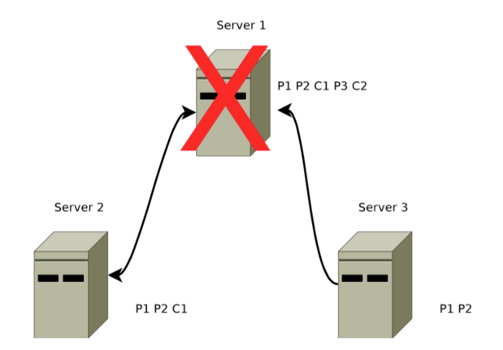

如图，消息 1 的 COMMIT命令C1在 Server1（Leader）和 Server2（Follower）上执行了，但是在Server3收到消息C1之前Server1便挂了，客户端很可能已经收到消息1已经成功执行的回复，协议需要保证重新选主后，C1消息不会丢失。

为了实现该目的，Zab选主时使用以下的策略：

选择拥有 proposal 最大值（即 zxid 最大） 的节点作为新的 Leader。

由于所有提案被COMMIT 之前必须有大多数量的 Follower ACK，即大多数服务器已经将该 proposal写入日志文件。因此，新选出的Leader如果满足是大多数节点中proposal最多的，它就必然存有所有被COMMIT消息的proposal。

接下来，新Leader与Follower 建立先进先出的队列， 先将自身有而Follower缺失的proposal发送给 它，再将这些 proposal的COMMIT命令发送给 Follower，这便保证了所有的Follower都保存了所有的 proposal、所有的Follower 都处理了所有的消息。

通过以上策略，能保证已经被处理的消息不会丢

#### 被丢弃的消息不能再次出现

这一情况会出现在以下场景：当Leader 接收到消息请求生成 proposal后就挂了，其他Follower 并没有收到此proposal，因此新选出的Leader中必然不含这条消息。 此时，假如之前挂了的Leader 重新启动并注册成了Follower，它要与新的Leader保持一致，就必须要删除自己上旧的proposal。

Zab 通过巧妙的设计 zxid 来实现这一目的。一个 zxid 是64位，高 32 是纪元（epoch）编号，每经过一次 Leader选举产生一个新的Leader，其epoch 号 +1。低 32 位是消息计数器，每接收到一条消息这个值 +1，新Leader 选举后这个值重置为 0。

这样设计的目的是即使旧的Leader 挂了后重启，它也不会被选举为Leader，因为此时它的zxid 肯定小于当前的新Leader。另外，当旧的Leader 作为Follower提供服务，新的Leader也会让它将所有多余未被COMMIT的proposal清除。

----

## zk样保证主从节点的状态同步

zookeeper 的核心是**原子广播**，这个机制保证了各个 server 之间的同步。实现这个机制的协议叫做 zab 协议。 zab 协议有两种模式，分别是**恢复模式（选主）和广播模式（同步）**。当服务启动或者在领导者崩溃后，zab 就进入了恢复模式，当领导者被选举出来，且大多数 server 完成了和 leader 的状态同步以后，恢复模式就结束了。状态同步保证了 leader 和 server 具有相同的系统状态。

## zk保证数据一致性

Zookeeper通过ZAB原子广播协议来实现数据的最终顺序一致性，一个类似2PC两阶段提交的过程。

由于Zookeeper只有Leader节点可以写入数据，如果是其他节点收到写入数据的请求，则会将之转发给Leader节点。

1. Leader收到请求之后，将它转换为一个proposal提议，并且为每个提议分配一个全局唯一递增的事务ID：zxid，然后把提议放入到一个FIFO的队列中，按照FIFO的策略发送给所有的Follower
2. Follower收到提议之后，以事务日志的形式写入到本地磁盘中，写入成功后返回ACK给Leader
3. Leader在收到超过半数的Follower的ACK之后，即可认为数据写入成功，就会发送commit命令给Follower告诉他们可以提交proposal了

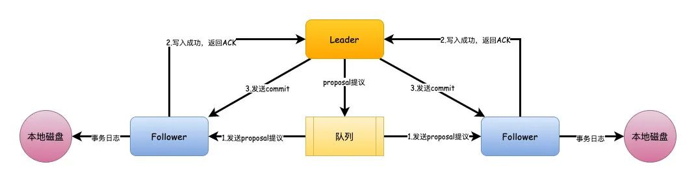

## zk进行leader选举

 **serverId（服务器ID 既 myid）**

- 比如有三台服务器，编号分别是1,2,3。
- 编号越大在选择算法中的权重越大。

**zxid（最新的事物ID 既 LastLoggedZxid）**

- 服务器中存放的最大数据ID。
- ID值越大说明数据越新，在选举算法中数据越新权重越大。

**epoch （逻辑时钟 既 PeerEpoch）**

- 每个服务器都会给自己投票，或者叫投票次数，同一轮投票过程中的逻辑时钟值是相同的。
- 每投完一次票这个数据就会增加，然后与接收到的其它服务器返回的投票信息中的数值相比。
- 如果收到低于当前轮次的投票结果，该投票无效，需更新到当前轮次和当前的投票结果。

### 前提条件

- 只有服务器状态在LOOKING（竞选状态）状态才会去执行选举算法。
- Zookeeper 的集群规模至少是2台机器，才可以选举Leader，这里以3台机器集群为例。
- 当一台服务器启动是不能选举的，等第二台服务器启动后，两台机器之间可以互相通信，才可以进行Leader选举
- 服务器运行期间无法和Leader保持连接的时候。

Leader的选举可以分为两个方面，同时选举主要包含事务zxid和myid，节点主要包含LEADING\FOLLOWING\LOOKING3个状态。

1. 服务启动期间的选举
2. 服务运行期间的选举

### 服务启动期间的选举

在集群初始化阶段，当有一台服务器Server1启动时，其单独无法进行和完成Leader选举，当第二台服务器Server2启动后，此时两台机器可以相互通信，每台机器都试图找到Leader，于是进入Leader选举过程。选举过程如下：

**(1) 每个Server发出一个投票投给自己**。由于是初始情况，Server1和Server2都会将自己作为Leader服务器来进行投票，**每次投票会包含所推举的服务器的myid和ZXID**，使用(myid, ZXID)来表示，此时Server1的投票为(1, 0)，Server2的投票为(2, 0)，然后各自将这个投票发给集群中其他机器。

**(2) 接受来自各个服务器的投票**。集群的每个服务器收到投票后，**首先判断该投票的有效性，如检查是否是本轮投票、是否来自LOOKING状态的服务器**。

**(3) 处理投票**。针对每一个投票，服务器都需要将别人的投票和自己的投票进行PK，PK规则如下

**1、优先检查ZXID。ZXID比较大的服务器优先作为Leader**。

**2、如果ZXID相同，那么就比较myid。myid较大的服务器作为Leader服务器**。

对于Server1而言，它的投票是(1, 0)，接收Server2的投票为(2, 0)，首先会比较两者的ZXID，均为0，再比较myid，此时Server2的myid最大，于是更新自己的投票为(2, 0)，然后重新投票，对于Server2而言，其无须更新自己的投票，只是再次向集群中所有机器发出上一次投票信息即可。

**(4) 统计投票**。每次投票后，服务器都会统计投票信息，判断是否已经有过半机器接受到相同的投票信息，对于Server1、Server2而言，都统计出集群中已经有两台机器接受了(2, 0)的投票信息，此时便认为已经选出了Leader。

**(5) 改变服务器状态**。一旦确定了Leader，每个服务器就会更新自己的状态，如果是Follower，那么就变更为FOLLOWING，如果是Leader，就变更为LEADING。

### 服务运行期间的选举

在Zookeeper运行期间，即便当有非Leader服务器宕机或新加入，此时也不会影响Leader，但是**一旦Leader服务器挂了，那么整个集群将暂停对外服务，进入新一轮Leader选举**，其过程和启动时期的Leader选举过程基本一致。假设正在运行的有Server1、Server2、Server3三台服务器，当前Leader是Server2，若某一时刻Leader挂了，此时便开始Leader选举。选举过程如下：

**(1)变更状态**。Leader挂后，余下的非Observer服务器都会将自己的服务器状态变更为LOOKING，然后开始进入Leader选举流程。

**(2)每个Server会发出一个投票**。在这个过程中，需要生成投票信息(myid,ZXID)每个服务器上的ZXID可能不同，我们假定Server1的ZXID为123，而Server3的ZXID为122；在第一轮投票中，Server1和Server3都会投自己，产生投票(1, 123)，(3, 122)，然后各自将投票发送给集群中所有机器。

**(3)接收来自各个服务器的投票**。与启动时过程相同。

**(4)处理投票**。与启动时过程相同，此时，Server1将会成为Leader。

**(5)统计投票**。与启动时过程相同。

**(6)改变服务器的状态**。与启动时过程相同。

## 选举后数据同步

实际上Zookeeper在选举之后，Follower和Observer（统称为Learner）就会去向Leader注册，然后就会开始数据同步的过程。

数据同步包含3个主要值和4种形式。

PeerLastZxid：Learner服务器最后处理的ZXID

minCommittedLog：Leader提议缓存队列中最小ZXID

maxCommittedLog：Leader提议缓存队列中最大ZXID

### 直接差异化同步 DIFF同步

如果PeerLastZxid在minCommittedLog和maxCommittedLog之间，那么则说明Learner服务器还没有完全同步最新的数据。

1. 首先Leader向Learner发送DIFF指令，代表开始差异化同步，然后把差异数据（从PeerLastZxid到maxCommittedLog之间的数据）提议proposal发送给Learner
2. 发送完成之后发送一个NEWLEADER命令给Learner，同时Learner返回ACK表示已经完成了同步
3. 接着等待集群中过半的Learner响应了ACK之后，就发送一个UPTODATE命令，Learner返回ACK，同步流程结束

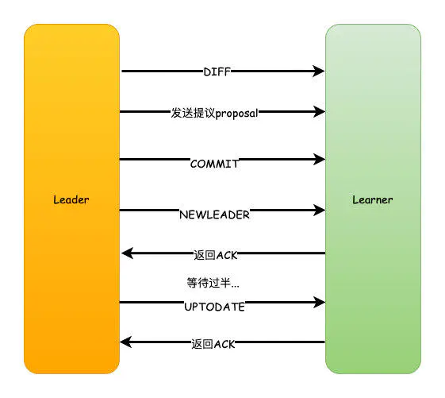

### 先回滚再差异化同步 TRUNC+DIFF同步

这个设置针对的是一个异常的场景。

如果Leader刚生成一个proposal，还没有来得及发送出去，此时Leader宕机，重新选举之后作为Follower，但是新的Leader没有这个proposal数据。

举个栗子：

假设现在的Leader是A，minCommittedLog=1，maxCommittedLog=3，刚好生成的一个proposal的ZXID=4，然后挂了。

重新选举出来的Leader是B，B之后又处理了2个提议，然后minCommittedLog=1，maxCommittedLog=5。

这时候A的PeerLastZxid=4，在(1,5)之间。

那么这一条只存在于A的提议怎么处理？

A要进行事务回滚，相当于抛弃这条数据，并且回滚到最接近于PeerLastZxid的事务，对于A来说，也就是PeerLastZxid=3。

流程和DIFF一致，只是会先发送一个TRUNC命令，然后再执行差异化DIFF同步。

### 仅回滚同步 TRUNC同步

针对PeerLastZxid大于maxCommittedLog的场景，流程和上述一致，事务将会被回滚到maxCommittedLog的记录。

这个其实就更简单了，也就是你可以认为TRUNC+DIFF中的例子，新的Leader B没有处理提议，所以B中minCommittedLog=1，maxCommittedLog=3。

所以A的PeerLastZxid=4就会大于maxCommittedLog了，也就是A只需要回滚就行了，不需要执行差异化同步DIFF了。

### 全量同步 SNAP同步

适用于两个场景：

1. PeerLastZxid小于minCommittedLog
2. Leader服务器上没有提议缓存队列，并且PeerLastZxid不等于Leader的最大ZXID

这两种场景下，Leader服务器都无法直接使用提议缓存队列和Learner进行数据同步，因此只能进行全量同步（SNAP同步）。

所谓全量同步就是Leader服务器将本机上的全量内存数据同步给Learner。Leader服务器首先向Learner发送一个SNAP指令，通知Leader即将进行全量数据同步。随后，Leader会从内存数据库中获取到全量的数据节点和会话超时时间记录器，将他们序列化后传输给Learner。Learner服务器接收到该全量数据后，会对其反序列化后载入到内存数据库中。

## zk数据不一致情况

### 查询不一致

因为Zookeeper是过半成功即代表成功，假设我们有5个节点，如果123节点写入成功，如果这时候请求访问到4或者5节点，那么有可能读取不到数据，因为可能数据还没有同步到4、5节点中，也可以认为这算是数据不一致的问题。

**解决方案可以在读取前使用sync命令。**

### leader未发送proposal宕机

leader刚生成一个proposal，还没有来得及发送出去，此时leader宕机，重新选举之后作为follower，但是新的leader没有这个proposal。

这种场景下的日志将会被丢弃。

### leader发送proposal成功，发送commit前宕机

如果发送proposal成功了，但是在将要发送commit命令前宕机了，如果重新进行选举，还是会选择zxid最大的节点作为leader，因此，这个日志并不会被丢弃，会在选举出leader之后重新同步到其他节点当中。

