# Zookeeper基础

[TOC]


## 四大数据类型

Zookeeper的数据存储结构就像一棵树，这棵树由节点组成，这种节点叫做Znode。

Znode分为四种类型：

### 1.持久节点 （PERSISTENT）

默认的节点类型。创建节点的客户端与zookeeper断开连接后，该节点依旧存在 。

client创建节点后，与zookeeper断开连接该节点将被持久化，当client再次连接后节点依旧存在。

### 2.持久节点顺序节点（PERSISTENT_SEQUENTIAL）

所谓顺序节点，就是在创建节点时，Zookeeper根据创建的时间顺序给该节点名称进行编号：

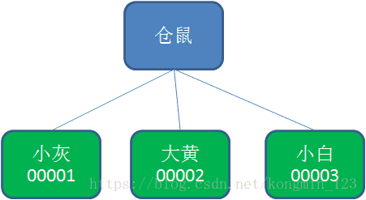

### 3.临时节点（EPHEMERAL）

和持久节点相反，当创建节点的客户端与zookeeper断开连接后，临时节点会被删除。

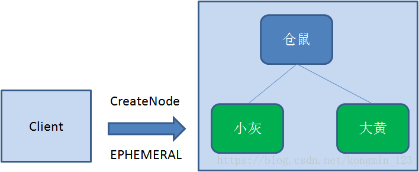

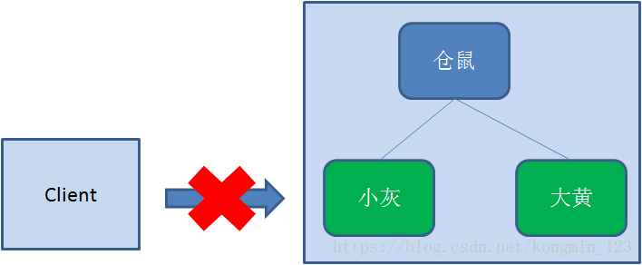

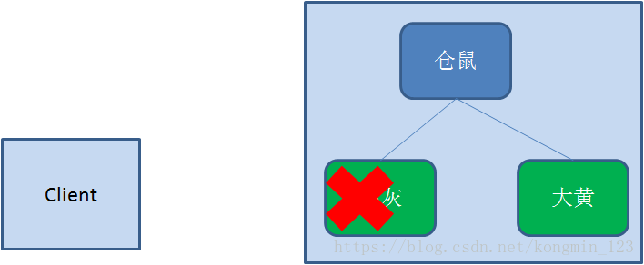

### 4.临时顺序节点（EPHEMERAL_SEQUENTIAL**）**

顾名思义，临时顺序节点结合和临时节点和顺序节点的特点：在创建节点时，Zookeeper根据**创建的时间顺序**给该节点名称进行编号；当创建节点的客户端与Zookeeper**断开连接后，临时节点会被删除**。


> `znode`被用来存储 `byte级` 或 `kb级` 的数据，可存储的最大数据量是`1MB`（**请注意**：一个节点的数据量不仅包含它自身存储数据，它的所有子节点的名字也要折算成Byte数计入，因此`znode`的子节点数也不是无限的）虽然可以手动的修改节点存储量大小，但一般情况下并不推荐这样做。


## 节点属性

一个`znode`节点不仅可以存储数据，还有一些其他特别的属性。接下来我们创建一个`/test`节点分析一下它各个属性的含义。

```shell
[zk: localhost:2181(CONNECTED) 6] get /test
456
cZxid = 0x59ac //
ctime = Mon Mar 30 15:20:08 CST 2020
mZxid = 0x59ad
mtime = Mon Mar 30 15:22:25 CST 2020
pZxid = 0x59ac
cversion = 0
dataVersion = 2
aclVersion = 0
ephemeralOwner = 0x0
dataLength = 3
numChildren = 0  
```

|    节点属性    |                             注解                             |
| :------------: | :----------------------------------------------------------: |
|     cZxid      |                  该数据节点被创建时的事务Id                  |
|     mZxid      |                该数据节点被修改时最新的事物Id                |
|     pZxid      |                   当前节点的父级节点事务Id                   |
|     ctime      |                      该数据节点创建时间                      |
|     mtime      |                    该数据节点最后修改时间                    |
|  dataVersion   |             当前节点版本号（每修改一次值+1递增）             |
|    cversion    |      子节点版本号（子节点修改次数，每修改一次值+1递增）      |
|   aclVersion   |  当前节点acl版本号（节点被修改acl权限，每修改一次值+1递增）  |
| ephemeralOwner | 临时节点标示，当前节点如果是临时节点，则存储的创建者的会话id（sessionId），如果不是，那么值=0 |
|   dataLength   |                   当前节点所存储的数据长度                   |
|  numChildren   |                    当前节点下子节点的个数                    |


> 上面的属性可以分为下面的几大类

### Zxid

`znode`节点状态改变会导致该节点收到一个`zxid`格式的**时间戳**，这个时间戳是**全局有序**的，znode节点的**建立或者更新都会产生一个新的**。如果`zxid1`的值 < `zxid2`的值，那么说明`zxid2`发生的改变在`zxid1`之后。每个znode节点都有3个`zxid`属性，`cZxid`（节点创建时间）、`mZxid`（该节点修改时间，与子节点无关）、`pZxid`（该节点或者该节点的子节点的最后一次创建或者修改时间，与孙子节点无关）。

`zxid`属性主要应用于`zookeeper`的集群


### Version

`znode`属性中一共有三个版本号`dataversion`（数据版本号）、`cversion`（子节点版本号）、`aclversion`（节点所拥有的ACL权限版本号）

`znode`中的数据可以有多个版本，如果某一个节点下存有多个数据版本，那么查询这个节点数据就需要带上版本号。每当我们对`znode`节点数据修改后，该节点的`dataversion`版本号会递增。当客户端请求该`znode`节点时，会同时返回节点数据和版本号。另外当`dataversion`为 `-1`的时候可以忽略版本进行操作。对一个节点设置权限时`aclVersion`版本号会递

eg：修改`/test`节点的数据看看`dataVersion`有什么变化，发现`dataVersion`属性变成了 3，版本号递增了

~~~bash
[zk: localhost:2181(CONNECTED) 10] set /test 8888
cZxid = 0x59ac
ctime = Mon Mar 30 15:20:08 CST 2020
mZxid = 0x59b6
mtime = Mon Mar 30 16:58:08 CST 2020
pZxid = 0x59ac
cversion = 0
dataVersion = 3
aclVersion = 0
ephemeralOwner = 0x0
dataLength = 4
numChildren = 0
~~~


## 节点的权限控制

ACL即 `Access Control List` (节点的权限控制)，通过`ACL`机制来解决`znode`节点的**访问权限问题**，要注意的是`zookeeper`对权限的控制是基于`znode`级别的，也就说节点之间的权限不具有继承性，**即子节点不继承父节点的权限**。

> `zookeeper`中设置ACL权限的格式由`<schema>:<id>:<acl>`三段组成。

**schema** ：表示授权的方式

- `world`：表示任何人都可以访问
- `auth`：只有认证的用户可以访问
- `digest`：使用username  ：password用户密码生成MD5哈希值作为认证ID
- `host/ip`：使用客户端主机IP地址来进行认证

**id**：权限的作用域，用来标识身份，依赖于schema选择哪种方式。

**acl**：给一个节点赋予哪些权限，节点的权限有create,、delete、write、read、admin 统称 `cdwra`。


1.  `world`：表示任何人都可以访问

   `getAcl` 命令来看一下，没有设置过权限的`znode`节点，默认情况下的权限情况。

   ~~~bash
   [zk: localhost:2181(CONNECTED) 12] getAcl /test
   'world,'anyone
   : cdrwa
   ~~~

   到没有设置ACL属性的节点，默认schema 使用的是`world`，作用域是`anyone`，节点权限是`cdwra`，也就是说任何人都可以访问。

   给一个schema 为非`world`的节点设置`world`权限

   ```bash
   setAcl /test world:anyone:crdwa
   ```

2.  `auth`：只有认证的用户可以访问

   schema 用`auth`授权**表示只有认证后的用户才可以访问**，那么首先就需要添加认证用户，添加完以后需要对认证的用户设置ACL权限。

   ~~~bash
   addauth digest test:password(明文)
   ~~~

   需要注意的是设置认证用户时的密码是明文的。

   ~~~bash
   [zk: localhost:2181(CONNECTED) 2] addauth digest user:user //用户名：密码
   [zk: localhost:2181(CONNECTED) 5] setAcl /test auth:user:crdwa
   [zk: localhost:2181(CONNECTED) 6] getAcl /test
   'digest,'user:ben+k/3JomjGj4mfd4fYsfM6p0A=
   : cdrwa
   ~~~

   实际上我们这样设置以后，就是将这个节点开放给所有认证的用户，`setAcl /test auth:user:crdwa` 相当于`setAcl /test auth::crdwa`。

3. `digest`：用户名:密码的验证方式

   用户名:密码方式授权是针对单个特定用户，这种方式是**不需要先添加认证用户**的。

   如果在代码中使用zookeeper客户端设置ACL，那么密码是明文的，但若是zk.cli等客户端操作就需要将密码进行`sha1`及`base64`处理。

   ~~~bash
   setAcl <path> digest:<user>:<password(密文)>:<acl>
   
   setAcl /test digest:user:jalRr+knv/6L2uXdenC93dEDNuE=:crdwa
   ~~~

   密码的加密方式如下

   1.可以通过`shell`命令加密 

   ```bash
   echo -n <user>:<password> | openssl dgst -binary -sha1 | openssl base64
   ```

   2.使用`zookeeper`自带的类库`org.apache.zookeeper.server.auth.DigestAuthenticationProvider`生成

   ~~~java
   java -cp /zookeeper-3.4.13/zookeeper-3.4.13.jar:/zookeeper-3.4.13/lib/slf4j-api-1.7.25.jar \
     org.apache.zookeeper.server.auth.DigestAuthenticationProvider \
     root:root
   root:root->root:qiTlqPLK7XM2ht3HMn02qRpkKIE=
   ~~~

4.  `host/ip`：使用客户端主机IP地址来进行认证

   通过对特定的IP地址，也可以是一个IP段进行授权。

   ~~~bash
   [zk: localhost:2181(CONNECTED) 3] setAcl /test0000000014 ip:127.0.0.1:crdwa
   cZxid = 0x59ac
   ctime = Mon Mar 30 15:20:08 CST 2020
   mZxid = 0x59b6
   mtime = Mon Mar 30 16:58:08 CST 2020
   pZxid = 0x59ac
   cversion = 0
   dataVersion = 3
   aclVersion = 3 // 这个版本一直在增加
   ephemeralOwner = 0x0
   dataLength = 4
   numChildren = 0
   ~~~


## Watch

1. 客户端向服务端注册Wather监听
2. 保存Wather对象到客户端本地的WatherManager中
3. 服务端Wather事件触发后，客户端收到服务端通知，从WatherManager中取出对应Wather对象执行回调逻辑

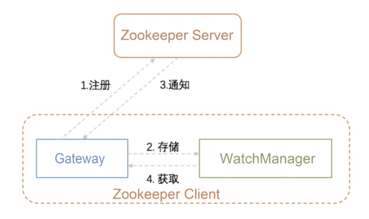

`zookeeper`可以为`dubbo`提供服务的注册与发现，作为注册中心，zookeeper`为什么能够实现服务的注册与发现吗？这就不得不说一下`zookeeper`的灵魂 `Watcher（监听者）。


### 简介

`watcher` 是`zooKeeper`中一个非常核心功能 ，客户端`watcher` 可以监控节点的数据变化以及它子节点的变化，一旦这些状态发生变化，zooKeeper服务端就会**通知所有在这个节点上设置过`watcher`的客户端** ，从而每个客户端都很快感知，它所监听的节点状态发生变化，而做出对应的逻辑处理。

简单的介绍了一下`watcher` ，那么我们来分析一下，`zookeeper`是如何实现服务的注册与发现。`zookeeper`的服务注册与发现，主要应用的是`zookeeper`的`znode`节点数据模型和`watcher`机制，大致的流程如下：

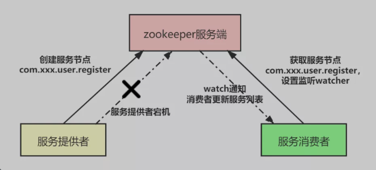


- **服务注册：** 服务提供者（`Provider`）启动时，会向`zookeeper服务端`注册服务信息，也就是**创建一个节点**，例如：用户注册服务`com.xxx.user.register`，并在节点上**存储服务的相关数据**（如服务提供者的**ip地址、端口**等）。
- **服务发现：** 服务消费者（`Consumer`）启动时，根据自身配置的依赖服务信息，向`zookeeper服务端`**获取注册的服务信息**并设置`watch监听`，获取到注册的服务信息之后，**将服务提供者的信息缓存在本地，并进行服务的调用**。
- **服务通知：** 一旦服务提供者因某种原因宕机不再提供服务之后，客户端与`zookeeper`服务端断开连接，`zookeeper`服务端上服务提供者**对应服务节点会被删除**（例如：用户注册服务`com.xxx.user.register`），随后`zookeeper`服务端会**异步**向所有消费用户注册服务`com.xxx.user.register`，**且设置了**`watch监听`的服务消费者**发出节点被删除的通知**，消费者根据收到的通知拉取最新服务列表，**更新本地缓存的服务列表**。


### Watch类型

`znode`节点可以设置两类`watch``

- ``DataWatches`，基于znode节点的**数据变更**从而触发 `watch` 事件，触发条件`getData()`、`exists()`、`setData()`、 `create()`。
- 另一种是`Child Watches`，基于znode的**孩子节点发生变更触发的watch事件**，触发条件 `getChildren()`、 `create()`。

而在调用 `delete()` 方法**删除znode**时，则会**同时触发**`Data Watches`和`Child Watches`，如果被删除的节点还有父节点，则父节点会触发一个`Child Watches`。


### Watch特性

1. 注意 -> `watch`对节点的监听事件是**一次性的**！客户端在指定的节点设置了监听`watch`，一旦该节点数据发生变更**通知一次客户端后**，客户端对该节点的监听事件就**失效**了。

   如果还要继续监听这个节点，就需要我们在客户端的监听回调中，**再次**对节点的监听`watch`事件设置为`True`。否则客户端只能接收到一次该节点的变更通知。

   若设计一直触发，订阅方必须显式取消，那么触发一次地场景若要实现，就要显式地调用取消，考虑实际场景，zk设计为一次性（举个例子，如果服务端变动频繁，而监听的客户端很多情况下，每次变动都要通知到所有的客户端，给网络和服务器造成很大压力。一般是客户端执行 getData(“/节点 A”,true)，如果节点 A 发生了变更或删除，客户端会得到它的 watch 事件，但是在之后节点 A 又发生了变更，而客户端又没 有设置 watch 事件，就不再给客户端发送。在实际应用中，很多情况下，我们的客户端不需要知道服务端的每一次变动，我只要最新的数据即可）

2. 客户端串行：客户端地Watcher回调处理是串行同步的过程，不会因为一个Watcher的逻辑阻塞整个客户端

3. 轻量：Wather通知的单位是WathedEvent**，只包含通知状态、事件类型和节点路径**，**不包含具体的事件内容**，具体的时间内容需要客户端主动去重新获取数据


## Zookeeper角色

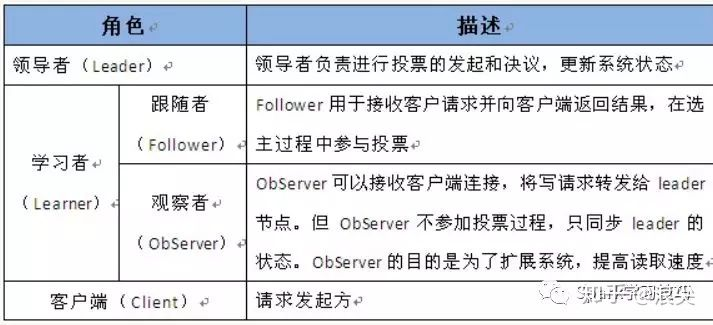

Zookeeper中通常只有Leader节点可以写入，Follower和Observer都只是负责读，但是Follower会参与节点的选举和**过半写成功**，Observer则不会，他只是单纯的提供读取数据的功能。通常这样设置的话，是为了避免太多的从节点参与过半写的过程，导致影响性能，这样Zookeeper只要使用一个几台机器的小集群就可以实现高性能了，如果要横向扩展的话，只需要增加Observer节点即可。

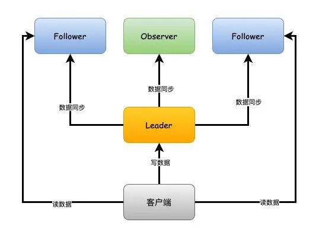

### Leader

- 一个 Zookeeper 集群同一时间只会有一个实际工作的 Leader，它会发起并维护与各 Follwer及Observer间的心跳。
- 所有的写操作必须要通过 Leader 完成再由 Leader 将写操作广播给其它服务器。只要有超过半数节点（不包括 observeer 节点）写入成功，该写请求就会被提交（类 2PC 协议）。

### Follower

- 一个 Zookeeper 集群可能同时存在多个 Follower，它会响应 Leader 的心跳；
- Follower 可直接处理并返回客户端的读请求，同时会将写请求转发给 Leader 处理；
- 并且负责在 Leader 处理写请求时对请求进行投票。

### Observer

在不伤害写性能的情况下扩展zookeeper，尤其是对读请求进行扩展，接受更多的请求流量，不牺牲写操作的吞吐量

> 尽管通过Client直接连接到Zookeeper集群的性能已经非常好了，但是这种架构如果要承受超大规模的Client，就必须增加Zookeeper集群的Server数量，随着Server的增加，Zookeeper**集群的写性能必定下降**，因为Zookeeper的Znode变更是要过半数投票通过，随着机器的增加，由于网络消耗等原因必然导致投票成本增加，从而导致写性能的下降。
>
> Observer节点，可以帮助解决上述问题，提供Zookeeper的可扩展性。Observer不参与投票，只是简单的**接收投票结果**，因此我们增加再多的Observer，**也不会影响集群的写性能**。除了这个差别，其他的和Follower基本上完全一样。例如：Client都可以连接到他们，并且都**可以发送读写请求给他们**，**收到写请求都会上报到Leader**。
>
> 因为它不参与投票，所以他们不属于Zookeeper集群的关键部位，即使他们Failed，或者从集群中断开，**也不会影响集群的可用性**。根据Observer的特点，我们可以使用Observer做**跨数据中心部署**。如果把Leader和Follower分散到多个数据中心的话，因为数据中心之间的网络的延迟，势必会导致集群性能的大幅度下降。使用Observer的话，将Observer跨机房部署，而Leader和Follower部署在单独的数据中心，**这样更新操作会在同一个数据中心来处理**，并将数据发送的其他数据中心（包含Observer的），然后Client就可以在其他数据中心查询数据了。但是使用了Observer并非就能完全消除数据中心之间的延迟，**因为Observer还得接收Leader的同步结果合Observer有更新请求也必须转发到Leader**，所以在网络延迟很大的情况下还是会有影响的，**它的优势就为了本地读请求的快速响应**

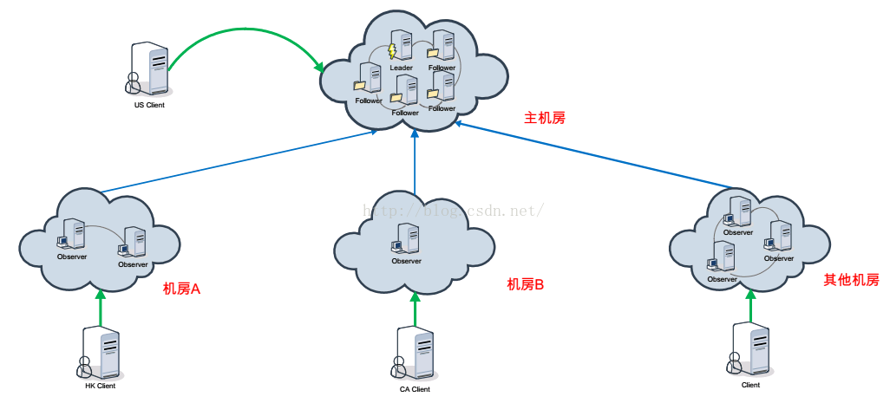

- 角色与 Follower 类似，但是无投票权。Zookeeper 需保证高可用和强一致性，为了支持更多的客户端，需要增加更多 Server；Server 增多，因为zookeeper从节点写入必须得是过半写才算成功，投票阶段延迟增大，影响性能；引入 Observer，Observer 不参与投票； Observers 接受客户端的连接，并将写请求转发给 leader 节点； 加入更多 Observer 节点，提高伸缩性，同时不影响吞吐率。

很多跨机房、跨地区的数据中心就是通过observer来实现的

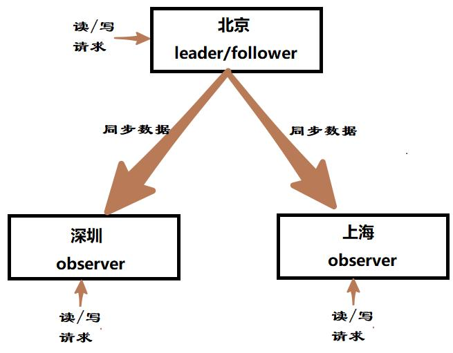


如果要使用Observer模式，可以在对应节点的配置文件添加如下配置：

~~~shell
peerType=observer // zoo.cfg
~~~

上面仅仅是告诉Zookeeper该节点是Observer，其次，必须在配置文件指定哪些节点被指定为Observer，例如:

~~~shell
server.1:localhost:2181:3181:observer
~~~


## Zookeeper如何处理请求

ZooKeeper集群中的每个server都能为客户端提供读、写服务。

对于客户端的读请求，server会直接从它本地的内存数据库中取出数据返回给客户端，这个过程不涉及其它任何操作，也不会联系leader。

对于客户端的写请求，因为写操作会修改znode的数据、状态，所以必须要在ZooKeeper集群中进行协调。处理过程如下：

1. 收到写请求的那个server，首先将写请求**发送给leader**。
2. leader收到来自follower(或observer)的写请求后，首先计算这次写操作之后的状态，然后将这个写请求**转换成带有各种状态的事务**(如版本号、zxid等等)。
3. leader将这个事务以提议的方式**广播**出去(即发送proposal)。
4. 所有follower收到proposal后，对这个提议进行投票，投票完成后返回ack给leader。follower的投票只有两种方式：(1)确认这次提议表示同意；(2)丢弃这次提议表示不同意。
5. leader收集投票结果，只要投票数量达到了**大多数的要求**(例如，5个节点的集群，3个或3个以上的节点才算大多数)，这次提议就通过。
6. 提议通过后，leader向所有server发送一个**提交通知**。
7. 所有节点将这次事务写入事务日志，并进行提交。
8. 提交后，收到写请求的那个server向客户端返回成功信息。

下面是ZooKeeper集群处理写请求过程的一个简图：

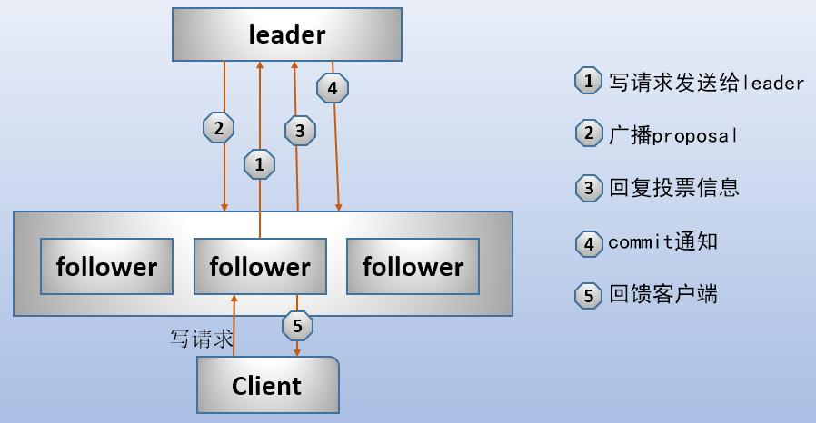

> 和follower一样，当observer收到客户端的读请求时，会直接从内存数据库中取出数据返回给客户端。
>
> 对于写请求，当写请求发送到某server上后，无论这个节点是follower还是observer，都会将它发送给leader。然后leader组织投票过程，所有server都收到这个proposal(包括observer，因为proposal是广播出去的)，但是leader和follower以及observer通过配置文件，都知道自己是不是observer以及谁是observer。自己是observer的server不参与投票。当leader收集完投票后，将那些observer的server去掉，在剩下的server中计算大多数，如果投票结果达到了大多数，这次写事务就成功，于是leader通知所有的节点(包括observer)，让它们将事务写入事务日志，并提交。

