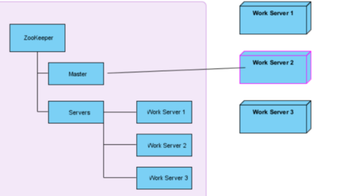
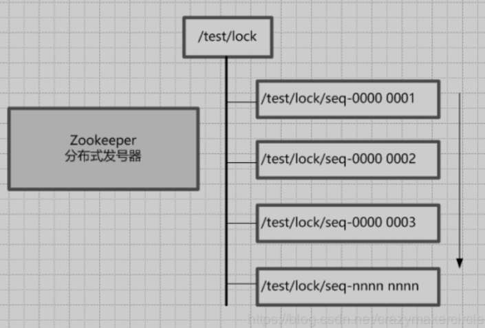
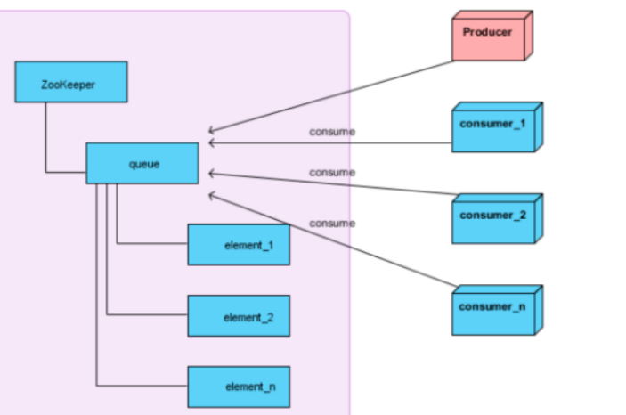
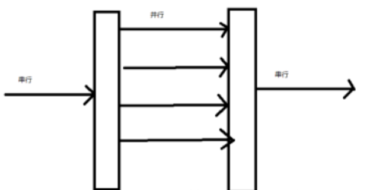
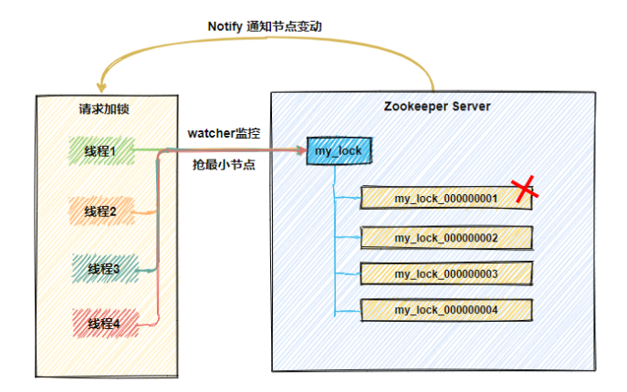
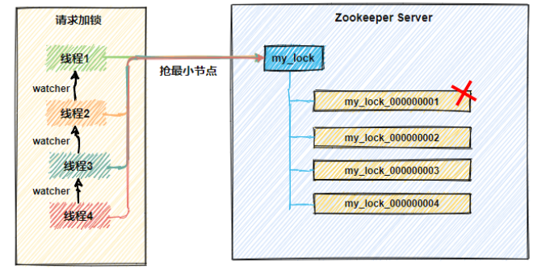
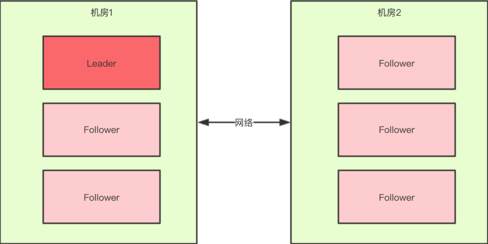
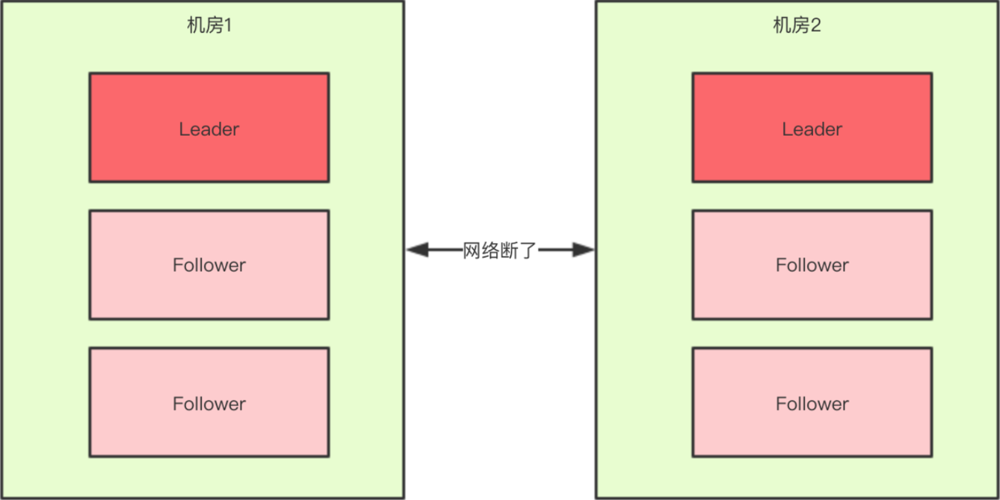
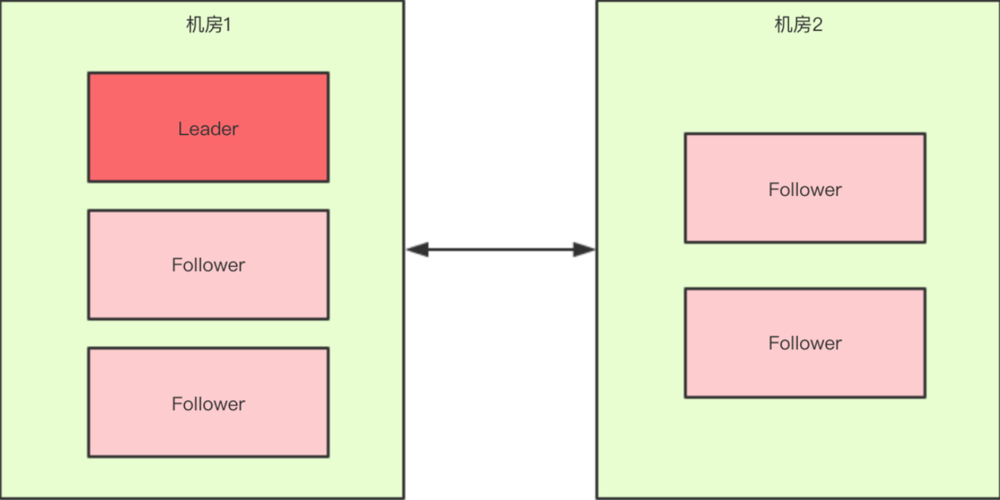
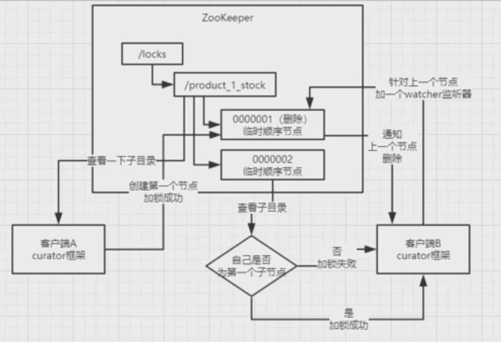

# Zookeeper应用场景及相应问题处理

[TOC]

## 应用场景

### 数据发布/订阅

\- 数据发布/订阅 (Publish/Subscribe) 系统，即所谓的配置中心，顾名思义就是发布者将数据发布到ZooKeeper的一个或一系列节点上，供订阅者进行数据订阅，进而达到动态获取数据的目的，实现配置信息的集中式管理和数据的动态更新。

\- 发布/订阅系统一般有两种设计模式，分别是推 (Push) 模式和拉 (Pull) 模式。在推模式中，服务端主动将数据更新发送给所有订阅的客户端；而拉模式则是由客户端主动发起请求来获取最新数据，通常客户端都采用定时进行轮询拉取的方式。

\- 如果将配置信息存放到 ZooKeeper 上进行集中管理，那么通常情况下，应用在启动的时候都会主动到ZooKeeper服务端上进行--次配置信息的获取，同时，在指定节点上注册一个 Watcher 监听，这样一来，但凡配置信息发生变更，服务端都会实时通知到所有订阅的客户端，从而达到实时获取最新配置信息的目的。

\- ZooKeeper 采用的是**推拉相结合**的方式：客户端向服务端注册自己需要关注的节点，一旦该节点的数据发生变更，那么服务端就会向相应的客户端发送 Watcher 事件通知，客户端接收到这个消息通知之后，需要主动到服务端获取最新的数据。

### 配置管理

消息队列Kafka中，就使用Zookeeper来维护broker的信息；dubbo中管理服务的配置信息。原理也是基于`watcher`机制，例如：创建一个`/config`节点存放一些配置，客户端监听这个节点，一点修改`/config`节点的配置信息，通知各个客户端数据变更重新拉取配置信息。

### 负载均衡

请求/数据分摊多个计算机单元上

\- 负载均衡 (Load Balance) 是一种相当常见的计算机网络技术，用来对多个计算机(计算机集群)、网络连接、CPU、磁盘驱动器或其他资源进行分配负载，以达到优化资源使用、最大化吞吐率、最小化响应时间和避免过载的目的。通常负载均衡可以分为硬件和软件负载均衡两类，我们主要探讨的是 ZooKeeper 在“软”负载均衡中的应用场景。

\- 分布式系统具有对等性，为了保证系统的高可用性，通常采用副本的方式来对数据和服务进行部署。而对于消费者而言，则需要在这些对等的服务提供方中选择一个来执行相关的业务逻辑，其中比较典型的就是DNS服务。DNS是域名系统 (DomainNameSystem) 的缩写，是因特网中使用最广泛的核心技术之一，DNS 系统可以看作是一个超大规模的分布式映射表，用于将域名和IP地址进行一一映射，进而方便人们通过域名来访问互联网站点。

\- 我们来介绍一种基干 ZooKeeper 实现的动态 DNS 方案(以下简称该方案为

“DDNS”, Dynamic DNS)。和配置管理一样，我们首先需要在 ZooKeeper 上创建一个节点来进行域名配置，例如 /DDNS/app1/server:appl.companyl.com (以下简称“域名节点”)。通常应用都会首先从域名节点中获取一份IP地址和端口的配置，进行自行解析。同时，每个应用还会在域名节点上注册一个数据变更 Watcher 监听，以便及时收到域名变更的通知。

### 命名服务

\- Java 语言中的 JNDI 便是一种典型的命名服务。JNDI 是 Java 命名与目录接口 (Java Naming and Directory Interface) 的缩写，是 J2EE 体系中重要的规范之一，标准的 J2EE 容器都提供了对 JNDI 规范的实现。因此，在实际开发中，开发人员常常使用应用服务器自带的 JNDI 实现来完成数据源的配置与管理，使用 JNDI 方式后，开发人员可以完全不需要关心与数据库相关的任何信息，包括数据库类型、JDBC 驱动类型以及数据库账户等。

\- ZooKeeper 提供的命名服务功能与 JNDI 技术有相似的地方，都能够帮助应用系统通过一个资源引用的方式来实现对资源的定位与使用。另外，广义上命名服务的资源定位都不是真正意义的实体资源，在分布式环境中，上层应用仅仅需要一个全局唯一的名字，类似于数据库中的唯一主键。下面我们来看看如何使用 ZooKeeper 来实现一套分布式全局唯一ID的分配机制。

\- 通过调用 ZooKeeper 节点创建的 API 接口可以创建一个顺序节点，并且在 API 返回值中会返回这个节点的完整名字。利用这个特性，我们就可

以借助 ZooKeeper 来生成全局唯一的 ID 了。

 \- 所有客户端都会根据自己的任务类型，在指定类型的任务下面通过调用 create() 接口来创建一个顺序节点，例如创建“job-” 节点。

 \- 节点创建完毕后，create() 接口会返回一个完整的节点名，例如“job-000000003”。

 \- 客户端拿到这个返回值后，拼接上 type 类型，例如“type2-job-000000003”，这就可以作为一个全局唯一的ID了。

### 分布式协调/通知

\- 分布式协调/通知服务是分布式系统中不可缺少的-一个环节，是将不同的分布式组件有机结合起来的关键所在。对于一个在多台机器上部署运行的应用而言，通常需要一个协调者 (Coordinator) 来控制整个系统的运行流程，例如分布式事务的处理、机器间的互相协调等。同时，引入这样一个协调者，便于将分布式协调的职责从应用中分离出来，从而可以大大减少系统之间的耦合性，而且能够显著提高系统的可扩展性。

\- ZooKeeper 中特有的 **Watcher 注册与异步通知机制**，能够很好地实现分布式环境下不同机器，甚至是不同系统之间的协调与通知，从而实现对数据变更的实时处理。基于 ZooKeeper 实现分布式协调与通知功能，通常的做法是不同的客户端都对 ZooKeeper 上同一个数据节点进行 Watcher 注册，监听数据节点的变化(包括数据节点本身及其子节点)，如果数据节点发生变化，那么所有订阅的客户端都能够接收到相应的 Watcher 通知，并做出相应的处理。

### 集群管理

\- 所谓集群管理，包括集群监控与集群控制两大块。

\- 利用 ZooKeeper 的 Watcher 监听和临时节点这两大特性，就可以实现另一种集群机器存活性监控的系统。例如，监控系统在 /elusterServers 节点上注册一个 Watcher 监听,那么但凡进行动态添加机器的操作，就会在 /clusterSrvers 节点下创建一个临时节点: /clusterServers/[Hostname]。这样一来，监控系统就能够实时检测到机器的变动情况，至于后续处理就是监控系统的业务了。

### Master选举

> 什么是master选举
>
> 假设我们有一个系统A，向外提供服务，并且这个服务必须24小时不间断提供（7*24小时可用， 99.999%可用），于是我们选择采用集群，master slave的架构方式，集群中有主机，有备机，由主机向外提供服务，备机负责监听主机的状态，一旦主机宕机，备机必须立刻接管主机继续向外提供服务，这种从备机中选出主机的过程就是master选举

\- 在分布式计算中，Master 选举是很重要的一个功能。分布式最核心的特性就是能够将具有独立计算能力的系统单元部署在不同的机器上，构成一个完整的分布式系统。

\- 在分布式系统中，Master往往用来协调集群中其他系统单元，具有对分布式系统状态变更的决定权。

\- 利用 ZooKeeper 的**强一致性**，能够很好地保证在分布式高并发情况下节点的创建一定能够保证全局唯一性，即 ZooKeeper 将会保证客户端无法重复创建一个已经存在的数据节点。也就是说，如果同时有多个客户端**请求创建同一个节点，那么最终一定只有一个客户端请求能够创建成功**。利用这个特性，就能很容易地在分布式环境中进行 Master 选举了。

\- 客户端往 ZooKeeper 上创建一个临时节点，在这个过程中，只有一个客户端能够成功创建这个节点，那么这个客户端所在的机器就成为了 Master。同时，其他没有在 ZooKeeper 上成功创建节点的客户端，都会在节点上注册一个子节点变更的 Watcher，用于监控当前的 Master 机器是否存活，一旦发现当前的 Master 挂了，那么其余的客户端将会重新进行 Master 选举。

\- 我们可以看到，如果仅仅只是想实现 Master 选举的话，那么其实只需要有一个能够保证数据唯一性的组件即可，例如关系型数据库的主键模型就是非常不错的选择。但是，如果希望能够快速地进行集群 Master 动态选举，那么基于 ZooKeeper 来实现是一个不错的新思路。

> 左边紫色代表zookeeper集群，右边代表三台工作服务器。
>
> 1.它们启动时会首先去Servers节点下创建一个临时节点，并把自己的基本信息写入节点，也即服务注册；
>
> 2.系统中的其他服务可以获取Servers节点下的字节点列表，来了解当前系统哪些服务器可用，也即服务发现；
>
> 3.然后这些服务器会尝试去创建Master节点，谁能创建成功，谁就是Master。
>
> 4.所有的备用服务器（slave）必须关注Master节点的删除事件。
>
>
> master选举改成多线程(多进程)模型（master-slave） 创建三个工程，while去抢

### 分布式锁

`zookeeper`基于`watcher`机制和`znode`的有序节点，天生就是一个分布式锁的坯子。首先创建一个`/test/lock`父节点作为一把锁，尽量是持久节点（PERSISTENT类型），每个尝试获取这把锁的客户端，在`/test/lock`父节点下创建临时顺序子节点。

由于序号的递增性，我们规定序号最小的节点即获得锁。例如：客户端来获取锁，在`/test/lock`节点下创建节点为`/test/lock/seq-00000001`，它是最小的所以它优先拿到了锁，**其它节点等待通知再次获取锁**。`/test/lock/seq-00000001`执行完自己的逻辑后删除节点释放锁。

**那么节点`/test/lock/seq-00000002`想要获取锁等谁的通知呢？**

这里我们让`/test/lock/seq-00000002`节点监听`/test/lock/seq-00000001`节点，一旦`/test/lock/seq-00000001`节点删除，则通知`/test/lock/seq-00000002`节点，让它再次判断自己是不是最小的节点，是则拿到锁，不是继续等通知。

以此类推`/test/lock/seq-00000003`节点监听`/test/lock/seq-00000002`节点，总是让后一个节点监听前一个节点，不用让所有节点都监听最小的节点，避免设置不必要的监听，**以免造成大量无效的通知，形成“羊群效应”**。

> 实现思路
>
> 1.在获取锁的时候，在locker节点下创建顺序节点
>
> 2.getChildren获取所有子节点，然后通过排序获得最小节点，如果是第一个节点则返回获得锁
>
> 3.如果当前节点不是第一个则监听比自己小的上一个节点，并等待（上一个节点删除了，那么释放等待，获得锁）
>
> 4.在释放锁的时候，把自己创建的节点删除

### 分布式队列

zookeeper实现分布式队列也很简单，应用znode的有序节点天然的“先进先出”，**后创建的节点总是最大的，出队总是拿序号最小的节点**即可。

> 左侧为zookeeper集群，右侧为消费者和生产者，生产者在queue节点下创建顺序节点，来存放数据，消费者通过读取这些节点来消费数据。

两种模式

1. **先进先出队列**

   生产者

   1.往节点里面存放有序的节点数据

   

   消费者（与分布式锁类似，监控自己的上一个节点删除事件）

   1.通过getChildren获取指定根节点下的所有子节点

   2.确定自己节点在子节点中的顺序（看是不是最小节点，可通过SortSet或者排序算法）如果是第一个节点则返回并删除自己

   3.如果自己不是最小的子节点，那么监控比自己小的上一个子节点的删除事件，否则处于等待（等待完毕返回数据，删除自己）

   4.接收watcher通知，重复流程

2. **Barrier模式（分布式屏障）**

   把数据都积累起来，然后同时运行，形同行人过红绿灯

   

## 处理羊群效应

利用`zookeeper`独特的类似文件系统的数据结构，可以像创建文件夹一样随意创建节点`my_lock`，节点下可以创建子节点，节点还可以存储数据并生成有序自增的节点ID `my_lock_00000001 .... my_lock_0000000N`等。这样先创建的节点序号ID 就越小，谁的节点ID 最小则视为拿到锁，拿到锁的节点处理完业务后删除对应节点释放锁。

而没拿到锁的线程通过设置`watcher`监控节点`my_lock`，一旦发现该节点下有线程释放锁删除子节点，其余 **所有线程** 重新获取`my_lock`下 **全部子节点** 比较自身节点是否为最小，最小则获得锁，一直如此重复，直到所有线程都拿到锁。

那这样就产生一个现象，在整个分布式锁的竞争过程中，存在大量重复运行的动作，并且绝大多数都是无效操作，判断出自己并非是序号最小的节点，从而继续等待下一次通知，这就是所谓的 “`羊群效应`”。

如果节点数量足够多，当删除一个节点**大量客户端同时监听**，比较自己自身节点是否为最小，**就会产生大量的网络开销**，会大大降低整个`zookeeper`集群的性能，所以必须对现有的分布式锁进行优化，如下图：

既然只想判断自身是不是最小的节点，那么每次比较的时候，比如 `my_lock_00000002` 发现自己不是最小节点后，这时**只要找到前一个节点**`my_lock_00000001` 并`watcher` 监控它。当`my_lock_00000001` 释放锁删除节点，则会通知节点`my_lock_00000002`该你拿锁了，其他节点以此类推，这样有序监听就解决了“`羊群效应`”。

## 处理脑裂问题

### 什么是脑裂**（split-brain）**

在"双机热备"高可用（HA）系统中，当联系两个节点的"心跳线"断开时(即两个节点断开联系时)，本来为一个整体、动作协调的HA系统，就分裂成为两个独立的节点(即两个独立的个体)。由于相互失去了联系，都以为是对方出了故障，两个节点上的HA软件像"裂脑人"一样，"本能"地争抢"共享资源"、争起"应用服务"。就会发生严重后果：

1）或者共享资源被瓜分、两边"服务"都起不来了；

2）或者两边"服务"都起来了，但同时读写"共享存储"，导致数据损坏（常见如数据库轮询着的联机日志出错）。

两个节点**相互争抢共享资源**，结果会导致系统混乱，数据损坏。对于无状态服务的HA，无所谓脑裂不脑裂，但对有状态服务(比如MySQL)的HA，必须要严格防止脑裂
[但有些生产环境下的系统按照无状态服务HA的那一套去配置有状态服务，结果就可想而知]。

### 脑裂产生的原因

一般来说，裂脑的发生，有以下几种原因：

1. 高可用服务器各节点之间心跳线链路发生故障，导致无法正常通信。
2. 因心跳线坏了（包括断了，老化）。
3. 因网卡及相关驱动坏了，ip配置及冲突问题（网卡直连）。
4. 因心跳线间连接的设备故障（网卡及交换机）。
5. 因仲裁的机器出问题（采用仲裁的方案）。
6. 高可用服务器上开启了iptables防火墙阻挡了心跳消息传输。
7. 高可用服务器上心跳网卡地址等信息配置不正确，导致发送心跳失败。
8. 其他服务配置不当等原因，如心跳方式不同，心跳广插冲突、软件Bug等。

### 预防HA集群脑裂

- 第一种：添加冗余的心跳线 [即冗余通信的方法]
  同时使用串行电缆和以太网电缆连接，同时用两条心跳线路 (即心跳线也HA)，这样一条线路坏了，另一个还是好的，依然能传送心跳消息，尽量减少"脑裂"现象的发生几率。

- 第二种方法：设置仲裁机制
  当两个节点出现分歧时，由第3方的仲裁者决定听谁的。这个仲裁者，可能是一个锁服务，一个共享盘或者其它什么东西。例如设置参考IP（如网关IP），当心跳线完全断开时，2个节点都各自ping一下参考IP，不通则表明断点就出在本端。不仅"心跳"、还兼对外"服务"的本端网络链路断了，即使启动（或继续）应用服务也没有用了，那就主动放弃竞争，让能够ping通参考IP的一端去起服务。更保险一些，ping不通参考IP的一方干脆就自我重启，以彻底释放有可能还占用着的那些共享资源。

- 第三种方法：fence机制 [即共享资源的方法] [前提是必须要有可靠的fence设备] 
  当不能确定某个节点的状态时 ，通过fence设备强行关闭该心跳节点，确保共享资源被完全释放！相当于Backup备节点接收不到心跳信息，通过单独的线路发送关机命令关闭主节点的电源。

  

  理想情况下，以上第二、三两者一个都不能少。但是如果节点没有使用共享资源，比如基于主从复制的数据库HA，也可以安全的省掉fence设备，只保留仲裁，而且很多时候线上环境里也也可能没有可用的fence设备，比如在云主机里。

  

  那么可不可以省掉仲裁机制，只留fence设备呢？这是不可以的。因为，当两个节点互相失去联络时会同时fencing对方。如果fencing的方式是reboot，那么两台机器就会不停的重启。如果fencing的方式是power off，那么结局有可能是2个节点同归于尽，也有可能活下来一个。但是如果两个节点互相失去联络的原因是其中一个节点的网卡故障，而活下来的正好又是那个有故障的节点，那么结局一样是悲剧。所以说: 单纯的双节点，无论如何也防止不了脑裂。

- 第四种：启用磁盘锁
  正在服务一方锁住共享磁盘，"裂脑"发生时，让对方完全"抢不走"共享磁盘资源。但使用锁磁盘也会有一个不小的问题，如果占用共享盘的一方不主动"解锁"，另一方就永远得不到共享磁盘。现实中假如服务节点突然死机或崩溃，就不可能执行解锁命令。后备节点也就接管不了共享资源和应用服务。于是有人在HA中设计了"智能"锁。即：正在服务的一方只在发现心跳线全部断开（察觉不到对端）时才启用磁盘锁。平时就不上锁了。

### 脑裂场景说明

对于一个集群，想要提高这个集群的可用性，通常会采用多机房部署，比如现在有一个由6台zkServer所组成的一个集群，部署在了两个机房

正常情况下，此集群只会有一个Leader，那么如果机房之间的网络断了之后，两个机房内的zkServer还是可以相互通信的，如果不考虑过半机制，那么就会出现每个机房内部都将选出一个Leader。

这就相当于原本一个集群，被分成了两个集群，出现了两个"大脑"，这就是所谓的"脑裂"现象。对于这种情况，其实也可以看出来，原本应该是统一的一个集群对外提供服务的，现在**变成了两个集群同时对外提供服务**，如果过了一会，断了的网络突然联通了，那么此时就会出现问题了，两个集群刚刚都对外提供服务了，**数据该怎么合并**，数**据冲突怎么解决**等等问题。刚刚在说明脑裂场景时有一个前提条件就是没有考虑过半机制，所以实际上Zookeeper集群中是不会轻易出现脑裂问题的，原因在于过半机制。

zookeeper的过半机制：在领导者选举的过程中，如果某台zkServer获得了超过半数的选票，则此zkServer就可以成为Leader了。举个简单的例子：如果现在集群中有5台zkServer，那么half=5/2=2，那么也就是说，领导者选举的过程中至少要有三台zkServer投了同一个zkServer，才会符合过半机制，才能选出来一个Leader。

那么zookeeper选举的过程中为什么一定要有一个过半机制验证？
因为这样不需要等待所有zkServer都投了同一个zkServer就可以选举出来一个Leader了，这样比较快，所以叫快速领导者选举算法。

zookeeper过半机制中为什么是大于，而不是大于等于？这就是更脑裂问题有关系了，比如回到上文出现脑裂问题的场景 [如上图1]：当机房中间的网络断掉之后，机房1内的三台服务器会进行领导者选举，但是此时过半机制的条件是 "节点数 > 3"，也就是说至少要4台zkServer才能选出来一个Leader，所以对于机房1来说它不能选出一个Leader，同样机房2也不能选出一个Leader，这种情况下整个集群当机房间的网络断掉后，整个集群将没有Leader。而如果过半机制的条件是 "节点数 >= 3"，那么机房1和机房2都会选出一个Leader，这样就出现了脑裂。这就可以解释为什么过半机制中是大于而不是大于等于，目的就是为了防止脑裂。

如果假设我们现在只有5台机器，也部署在两个机房：

此时过半机制的条件是 "节点数 > 2"，也就是至少要3台服务器才能选出一个Leader，此时机房件的网络断开了，对于机房1来说是没有影响的，Leader依然还是Leader，对于机房2来说是选不出来Leader的，此时整个集群中只有一个Leader。因此总结得出，有了过半机制，对于一个Zookeeper集群来说，要么没有Leader，要么只有1个Leader，这样zookeeper也就能避免了脑裂问题。

### 脑裂问题处理

简单点来说，脑裂(Split-Brain) 就是比如当你的 cluster 里面有两个节点，它们都知道在这个 cluster 里需要选举出一个 master。那么当它们两个之间的通信完全没有问题的时候，就会达成共识，选出其中一个作为 master。但是如果它们之间的通信出了问题，那么两个结点都会觉得现在没有 master，所以每个都把自己选举成 master，于是 cluster 里面就会有两个 master。

对于Zookeeper来说有一个很重要的问题，就是到底是根据一个什么样的情况来判断一个节点死亡down掉了？在分布式系统中这些都是有监控者来判断的，但是监控者也很难判定其他的节点的状态，唯一一个可靠的途径就是心跳，Zookeeper也是使用心跳来判断客户端是否仍然活着。

使用ZooKeeper来做Leader HA基本都是同样的方式：每个节点都尝试注册一个象征leader的临时节点，其他没有注册成功的则成为follower，并且通过watch机制监控着leader所创建的临时节点，Zookeeper通过内部心跳机制来确定leader的状态，一旦leader出现意外Zookeeper能很快获悉并且通知其他的follower，其他flower在之后作出相关反应，这样就完成了一个切换，这种模式也是比较通用的模式，基本大部分都是这样实现的。但是这里面有个很严重的问题，如果注意不到会导致短暂的时间内系统出现脑裂，因为心跳出现超时可能是leader挂了，但是也可能是zookeeper节点之间网络出现了问题，导致leader假死的情况，leader其实并未死掉，但是与ZooKeeper之间的网络出现问题导致Zookeeper认为其挂掉了然后通知其他节点进行切换，这样follower中就有一个成为了leader，但是原本的leader并未死掉，这时候client也获得leader切换的消息，但是仍然会有一些延时，zookeeper需要通讯需要一个一个通知，这时候整个系统就很混乱可能有一部分client已经通知到了连接到新的leader上去了，有的client仍然连接在老的leader上，如果同时有两个client需要对leader的同一个数据更新，并且刚好这两个client此刻分别连接在新老的leader上，就会出现很严重问题。

这里做下小总结：
**假死**：由于心跳超时（网络原因导致的）认为leader死了，但其实leader还存活着。
**脑裂**：由于假死会发起新的leader选举，选举出一个新的leader，但旧的leader网络又通了，导致出现了两个leader ，有的客户端连接到老的leader，而有的客户端则连接到新的leader。

#### 导致的原因

主要原因是Zookeeper集群和Zookeeper client判断超时并不能做到完全同步，也就是说可能一前一后，如果是集群先于client发现，那就会出现上面的情况。同时，在发现并切换后通知各个客户端也有先后快慢。一般出现这种情况的几率很小，需要leader节点与Zookeeper集群网络断开，但是与其他集群角色之间的网络没有问题，还要满足上面那些情况，但是一旦出现就会引起很严重的后果，数据不一致。

#### 解决

要解决Split-Brain脑裂的问题，一般有下面几种种方法：

1. **Quorums (法定人数) 方式:** 比如3个节点的集群，Quorums = 2, 也就是说集群可以容忍1个节点失效，这时候还能选举出1个lead，集群还可用。比如4个节点的集群，它的Quorums = 3，Quorums要超过3，相当于集群的容忍度还是1，如果2个节点失效，那么整个集群还是无效的。这是zookeeper防止"脑裂"默认采用的方法。
2. **采用Redundant communications (冗余通信)方式**：集群中采用多种通信方式，防止一种通信方式失效导致集群中的节点无法通信。
3. **Fencing (共享资源) 方式**：比如能看到共享资源就表示在集群中，能够获得共享资源的锁的就是Leader，看不到共享资源的，就不在集群中。
   仲裁机制方式。
4. **启动磁盘锁定方式。**

要想避免zookeeper"脑裂"情况其实也很简单，在follower节点切换的时候不在检查到老的leader节点出现问题后马上切换，**而是在休眠一段足够的时间**，确保老的leader已经**获知变更并且做了相关的shutdown清理工作了然后再注册成为master**就能避免这类问题了，这个休眠时间一般定义为与zookeeper定义的超时时间就够了，但是这段时间内系统可能是不可用的，但是相对于数据不一致的后果来说还是值得的。

1、zooKeeper默认采用了Quorums这种方式来防止"脑裂"现象。即只有集群中超过半数节点投票才能选举出Leader。这样的方式可以确保leader的唯一性,要么选出唯一的一个leader,要么选举失败。在zookeeper中Quorums作用如下：
**1]** 集群中最少的节点数用来选举leader保证集群可用。
**2]** 通知客户端数据已经安全保存前集群中最少数量的节点数已经保存了该数据。一旦这些节点保存了该数据，客户端将被通知已经安全保存了，可以继续其他任务。而集群中剩余的节点将会最终也保存了该数据。

假设某个leader假死，其余的followers选举出了一个新的leader。这时，旧的leader复活并且仍然认为自己是leader，这个时候它向其他followers发出写请求也是会被拒绝的。因为每当新leader产生时，会生成一个epoch标号(标识当前属于那个leader的统治时期)，这个epoch是递增的，followers如果确认了新的leader存在，知道其epoch，就会拒绝epoch小于现任leader epoch的所有请求。那有没有follower不知道新的leader存在呢，有可能，但肯定不是大多数，否则新leader无法产生。Zookeeper的写也遵循quorum机制，因此，得不到大多数支持的写是无效的，旧leader即使各种认为自己是leader，依然没有什么作用。

zookeeper除了可以采用上面默认的Quorums方式来避免出现"脑裂"，还可以可采用下面的预防措施：
2、**添加冗余的心跳线**，例如双线条线，尽量减少“裂脑”发生机会。
3、**启用磁盘锁**。正在服务一方锁住共享磁盘，"裂脑"发生时，让对方完全"抢不走"共享磁盘资源。但使用锁磁盘也会有一个不小的问题，如果占用共享盘的一方不主动"解锁"，另一方就永远得不到共享磁盘。现实中假如服务节点突然死机或崩溃，就不可能执行解锁命令。后备节点也就接管不了共享资源和应用服务。于是有人在HA中设计了"智能"锁。即正在服务的一方只在发现心跳线全部断开（察觉不到对端）时才启用磁盘锁。平时就不上锁了。
4、**设置仲裁机制**。例如设置参考IP（如网关IP），当心跳线完全断开时，2个节点都各自ping一下 参考IP，不通则表明断点就出在本端，不仅"心跳"、还兼对外"服务"的本端网络链路断了，即使启动（或继续）应用服务也没有用了，那就主动放弃竞争，让能够ping通参考IP的一端去起服务。更保险一些，ping不通参考IP的一方干脆就自我重启，以彻底释放有可能还占用着的那些共享资源。

> 分布式锁如何保证健壮性

分布式锁脑裂，重复加锁

分布式系统，主控节点有一个Master，此时因为网络故障等原因，导致其他人**以为这个Master不可用了**，其他节点出现了别的Master，**导致集群里有2个Master同时在运行**