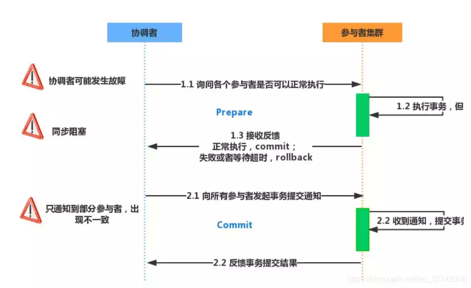
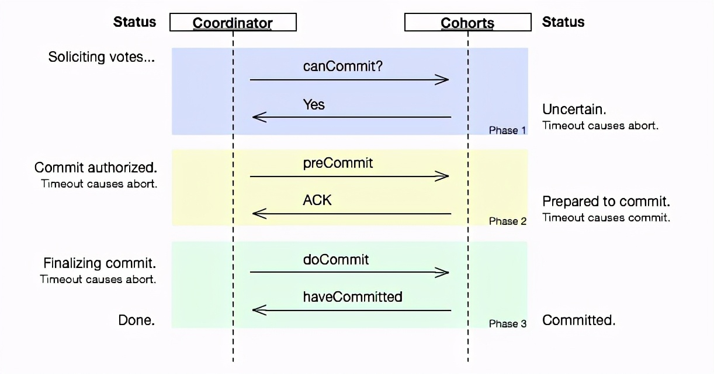
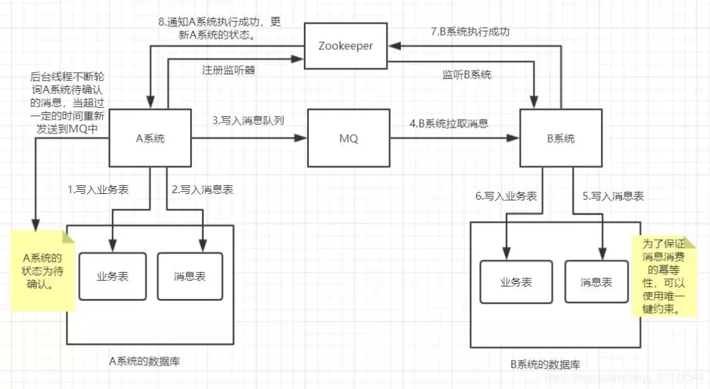
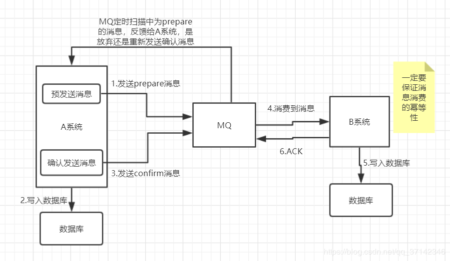

# 分布式事务

[TOC]

> 事务的参与者、支持事务的服务器、资源服务器以及事务管理器分别位于不同的分布式系统的不同节点之上

本质上来说，分布式事务就是为了保证不同数据库的数据一致性。

## 2PC

2指的就是两个阶段，P准备阶段，C提交阶段

该方案的缺陷：

- **同步阻塞**：所有的参与者都是事务同步阻塞型的。当参与者**占有公共资源时**，其他第三方节点访问公共资源**不得不处于阻塞状态**。
- **单点故障**：一旦协调器发生故障，系统不可用。
- **数据不一致**：当协调器发送commit之后，有的参与者收到commit消息，事务执行成功，有的没有收到，处于阻塞状态，这段时间会产生数据不一致性。
- **不确定性**：当协调器发送commit之后，并且此时只有一个参与者收到了commit，那么当该参与者与协调器同时宕机之后，重新选举的协调器无法确定该条消息是否提交成功。

## 3PC

3PC在2PC上增加了**中间状态**   -> **准备阶段，预提交阶段，提交阶段**

- **协调者和参与者均引入超时机制**，解决2PC的同步阻塞问题，避免事务资源被一直占用

该方案的缺陷：

- **数据不一致问题**，当参与者接收到 PreCommit，如果网络出现分区，此时协调者与参与者无法进行正常通信，这种情况下，参与者依然会进行事务提交

## 本地消息表

在A系统中，我们首先写入业务表，然后写入消息表，然后将消息发送到MQ中，在B系统中需要先写入消息表，这是为了保证消息重复消费，为了保证消息消费的幂等性，可以使用数**据的唯一键**来约束。

当B系统执行成功之后，需要通知A系统执行成功，此时可以使用一个监听器，如Zookeeper，ZK监听到执行成功更新A系统成功。然后开始发送下一条消息。

A系统中需要有一个后台线程，**不断的去判断A系统的状态为待确认的消息**，设置超时机制，如果超时，**重新发送到MQ中**。直到执行成功。

可以看出，本地消息表方案需要写入消息表中，如果在高并发的场景下会进行大量的磁盘IO，因此该方案不适用于高并发场景。

## MQ

基于本地消息表进行优化，不使用本地消息表，而是基于MQ

在该方案中，首先A系统需要向MQ中发送prepare消息，然后执行A系统的业务，写入数据库成功之后向MQ发送confirm消息，当消息为confirm状态时，B系统就可以消费到消息，消费成功之后返回ACK确认消息给MQ。

需要注意的是。需要保证B系统消费消息的幂等性，可以借助第三方系统。

比如在**redis中设置标识**，标明已经消费过该消息，或者借助ZK基于分布式锁的原理，**创建节点**，重复消费消息，**创建失败**。

