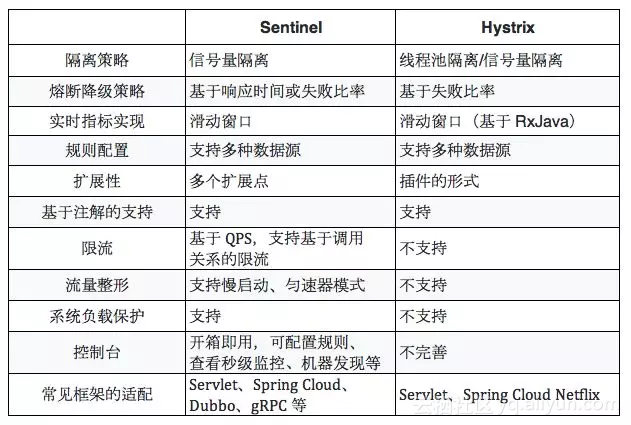
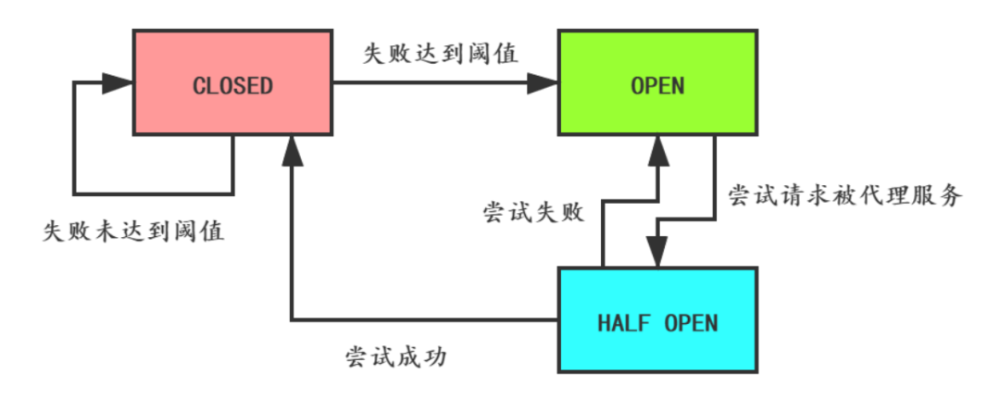
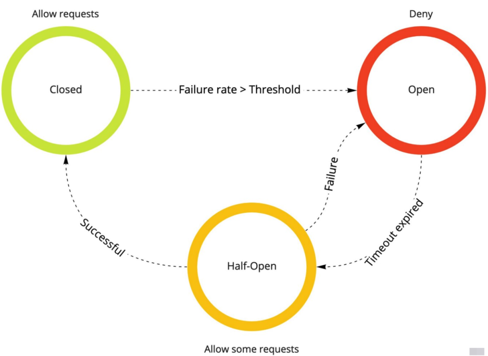
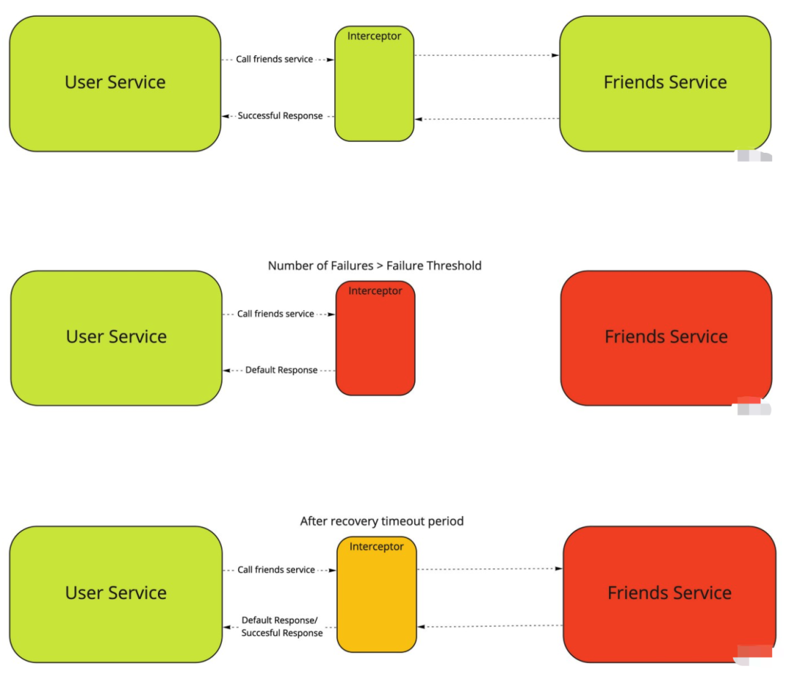
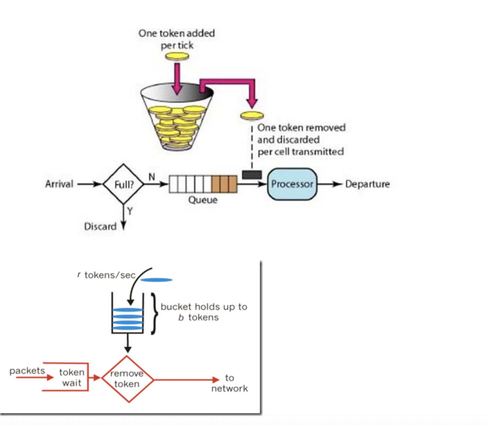
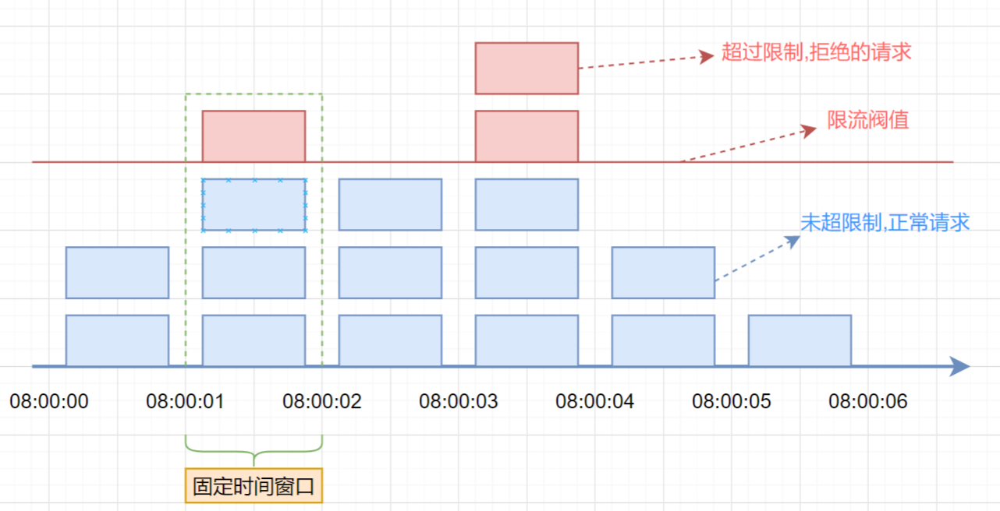
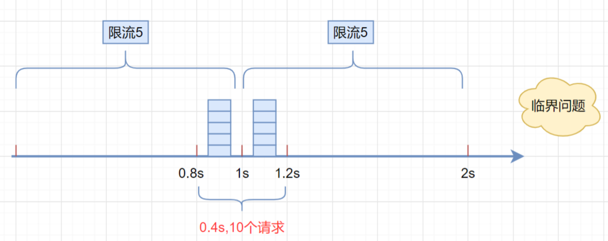
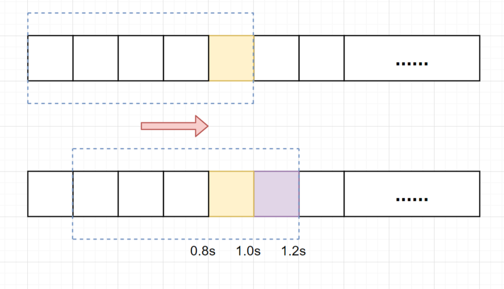

# 熔断限流降级

[TOC]

## hystrix & Sentinel 

### hystrix 的设计原则

- 资源隔离（Hystrix提供两种资源隔离策略，线程池（推荐使用）和信号量）

  > 将每个依赖服务分配到独立的线程池进行资源隔离，避免服务雪崩
  >
  > |          |                          线程池隔离                          |                          信号量隔离                          |
  > | :------: | :----------------------------------------------------------: | :----------------------------------------------------------: |
  > |   线程   |                     与调用线程非相同线程                     |                  与调用线程相同(tomcat线程)                  |
  > |   开销   |                    排队、调度、上下文切换                    |                      无线程切换，开销低                      |
  > |   异步   |                             支持                             |                            不支持                            |
  > | 并发支持 |                     支持(最大线程池大小)                     |                     支持(最大信号量上限)                     |
  > |          | 隔离度高，不影响其他资源，代价是上下文切换比较大，可能导致机器资源碎片化 | 限制对某个资源调用的并发数，隔离非常轻量级，仅限制对某个资源调用的并发数，而不是显式地去创建线程池，缺点是无法对慢调用自动进行降级，只能等待客户端自己超时，因此仍然可能会出现级联阻塞的情况。 |

- 熔断器

  > 熔断器开关由关闭到打开的状态转换是通过当前服务健康状况和设定阈值比较决定的.

- 命令模式

### Sentinel 的设计原则

 Hystrix 的关注点在于以**隔离和熔断为主的容错机制**，超时或被熔断的调用将会快速失败，并可以提供 fallback 机制。

而 Sentinel 的侧重点在于：

- 多样化的流量控制

  > - 直接拒绝模式：即超出的请求直接拒绝。
  > - 慢启动预热模式：当流量激增的时候，控制流量通过的速率，让通过的流量缓慢增加，在一定时间内逐渐增加到阈值上限，给冷系统一个预热的时间，避免冷系统被压垮。
  > - 匀速器模式：利用 Leaky Bucket 算法实现的匀速模式，严格控制了请求通过的时间间隔，同时堆积的请求将会排队，超过超时时长的请求直接被拒绝。Sentinel 还支持基于调用关系的限流，包括基于调用方限流、基于调用链入口限流、关联流量限流等，依托于 Sentinel 强大的调用链路统计信息，可以提供精准的不同维度的限流。

- 熔断降级（本质上都是基于熔断器模式）

  > Sentinel 可以通过并发线程数模式的流量控制来提供信号量隔离的功能。并且结合基于响应时间的熔断降级模式，可以在不稳定资源的平均响应时间比较高的时候自动降级，防止过多的慢调用占满并发数，影响整个系统。

- 系统负载保护

- 实时监控和控制台

### 熔断器模式

熔断器通常以拦截器模式/责任链/过滤器的形式实现，它包含3个状态

- 关闭：默认状态，允许拦截器将所有请求传递给上游服务，并将上游服务的响应传递给调用方。
- 打开：熔断器观察到请求失败比例已经达到阈值，熔断器认为被代理服务故障，打开开关，请求不再到达被代理的服务，而是快速失败。
- 半开放式：熔断器打开后，为了能自动恢复对被代理服务的访问，会切换到半开放状态，去尝试请求被代理服务以查看服务是否已经故障恢复。如果成功，会转成 CLOSED 状态，否则转到 OPEN 状态。

## 令牌桶

> 　令牌桶算法的原理是系统会以一个**恒定的速度往桶里放入令牌**，而如果请求需要被处理，则需要**先从桶里获取一个令牌**，当桶里没有令牌可取时，则拒绝服务。 当桶满时，新添加的令牌被丢弃或拒绝。
>
> 存放固定容量token的桶，按照固定的速率往桶里面添加令牌

## 漏斗

> **主要区别在于“漏桶算法”能够强行限制数据的传输速率，而“令牌桶算法”在能够限制数据的平均传输速率外，还允许某种程度的突发传输。在“令牌桶算法”中，只要令牌桶中存在令牌，那么就允许突发地传输数据直到达到用户配置的门限，因此它适合于具有突发特性的流量。**

水（请求）先进入到漏桶里，人为设置一个最大出水速率，漏桶以<=出水速率的速度出水，当水流入速度过大会直接溢出（拒绝服务）

- 存下请求
- 匀速处理
- 多于丢弃

因此这是一种**强行限制请求速率**的方式，但是缺点非常明显，主要有两点：

- **无法面对突发的大流量**----比如请求处理速率为1000，容量为5000，来了一波2000/s的请求持续10s，那么后5s的请求将全部直接被丢弃，服务器拒绝服务，但是实际上网络中突发一波大流量尤其是短时间的大流量是非常正常的，超过容量就拒绝，非常简单粗暴
- **无法有效利用网络资源**----比如虽然服务器的处理能力是1000/s，但这不是绝对的，这个1000只是一个宏观服务器处理能力的数字，实际上一共5秒，每秒请求量分别为1200、1300、1200、500、800，平均下来qps也是1000/s，但是这个量对服务器来说完全是可以接受的，但是因为限制了速率是1000/s，因此前面的三秒，每秒只能处理掉1000个请求而一共打回了700个请求，白白浪费了服务器资源

## 固定窗口限流

首先维护一个计数器，将**单位时间段**当做一个窗口，计数器记录这个窗口接收请求的次数。

- 当次数少于限流阀值，就允许访问，并且计数器+1
- 当次数大于限流阀值，就拒绝访问。
- 当前的时间窗口过去之后，计数器清零。

假设单位时间是1秒，限流阀值为3。在单位时间1秒内，每来一个请求,计数器就加1，如果计数器累加的次数超过限流阀值3，后续的请求全部拒绝。等到1s结束后，计数器清0，重新开始计数。如下图：

但是，这种算法有一个很明显的**临界问题**：假设限流阀值为5个请求，单位时间窗口是1s,如果我们在单位时间内的前0.8-1s和1-1.2s，分别并发5个请求。虽然都没有超过阀值，但是如果算0.8-1.2s,则并发数高达10，已经超过单位时间1s不超过5阀值的定义啦。

## 滑动窗口限流

滑动窗口限流解决固定窗口临界值的问题。它将单位时间周期分为n个小周期，分别记录每个小周期内接口的访问次数，并且根据时间滑动删除过期的小周期。

假设单位时间还是1s，滑动窗口算法把它划分为5个小周期，也就是滑动窗口（单位时间）被划分为5个小格子。每格表示0.2s。每过0.2s，时间窗口就会往右滑动一格。然后呢，每个小周期，都有自己独立的计数器，如果请求是0.83s到达的，0.8~1.0s对应的计数器就会加1。

假设我们1s内的限流阀值还是5个请求，0.8~1.0内（比如0.9s的时候）来了5个请求，落在黄色格子里。时间过了1.0s之后，又来5个请求，落在紫色格子里。如果**是固定窗口算法，是不会限流的**，但是**滑动窗口的话，每过一个小周期，它会右移一个小格**。过了1.0s后，会右移一小格，当前的单位时间段是0.2~1.2s，**这个区域的请求已经超过限定的5了**，已触发限流啦，实际上，紫色格子的请求都被拒绝啦。

**当滑动窗口的格子周期划分得越多，那么滑动窗口的滚动就越平滑，限流的统计就会越精确。**

