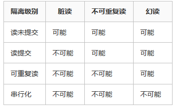

# MySQL事务ACID

[TOC]

**事务，就是一个操作序列 ，这些操作要么都执行，要么都不执行，它是一个不可分割的工作单位， ACID又是事务的四大特性**


## 概念

ACID，是指在可靠数据库管理系统（DBMS）中，事务(transaction)所应该具有的四个特性：

**原子性（Atomicity）、一致性（Consistency）、隔离性（Isolation）、持久性（Durability）**


### 原子性

**一个事务必须被视为一个不可分割的最小工作单元**

整个事务中的所有操作**要么全部提交成功，要么全部失败回滚**，对于一个事务来说，不可能只执行其中的一部分操作。


### 一致性

一致性是指事务必须使数据库从一个一致性状态变换到另一个一致性状态，也就是说一个**事务执行之前和执行之后都必须处于一致性状态**。

如转账的栗子: 假设用户A和用户B两者的钱加起来一共是5000，那么不管A和B之间如何转账，转几次账，事务结束后两个用户的钱相加起来应该还得是5000，这就是事务的一致性。

事务的一致性决定了一个系统设计和实现的复杂度，因为事务可以有不同程度的一致性：

- **强一致性**: 无论更新操作实在哪一个数据副本执行，之后所有的读操作都能获得最新的数据。
- **弱一致性**: 提交的更新操作，不一定立即会被读操作读到，需要一段时间，此种情况会存在一个不一致窗口。
- **最终一致性**: 是弱一致性的特例。事务更新一份数据，最终一致性保证在没有其他事务更新同样的值的话，最终所有的事务都会读到之前事务更新的最新值。如果没有错误发生，不一致窗口的大小依赖于：通信延迟，系统负载等。


### 隔离性

隔离性是当多个用户并发访问数据库时，比如操作同一张表，数据库为每一个用户开启的事务，**不能被其他事务的操作所干扰，多个并发事务之间要相互隔离**。

当前大多数数据库都提供了不同级别的事务隔离，之后便会产生不同的问题，一般会出现的问题主要有:

> **脏读，不可重复读，幻读**

#### 脏读

脏读是指在一个事务处理过程里**读取了另一个未提交的事务中的数据**。当一个事务A正在多次修改某个数据，而在这个事务中这多次的修改都还未提交，这时另外一个并发的事务B来访问该数据，将会**获取到事务A中没有提交的数据**， 从而最终造成两个事务得到的数据不一致。

如: 张三有500块钱，现在给李四转100块钱，这个事务中的SQL涉及到两个操作:1、 A账户减100块钱

```text
update account set money=money - 100 where name=’张三’;
```

2、 B账户加100块钱

```text
update account set money=money+100 where name=’李四’;
```

我们假设事务A执行转账，刚执行完第一条SQL语句，此时，另外一个事务B来查询张三账户的钱，那么获取到的是400块钱。但是事务A执行第二条语句的时候出现了问题，事务A进行了回滚，那么事实上张三账户的钱应该是500块钱，而不是400块钱，从而出现了脏读。

---

#### 不可重复读

不可重复读是指在对于数据库中的某个数据，**一个事务范围内多次查询却返回了不同的数据值，这是由于在查询间隔，被另一个事务修改并提交了**。

例如事务T1在读取某一数据，而事务T2**立马修改了这个数据并且提交事务给数据库**，事务T1再次读取该数据就得到了不同的结果，发生了不可重复读。

不可重复读和脏读的区别是，脏读是某一事务读取了另一个事务未提交的脏数据，而不可重复读则是**读取了前一事务提交的数据**。


---

#### 幻读

幻读，是指当**事务不是独立执行时发生的一种现象**。

例如事务T1对一个表中所有的行的某个数据项做了从“1”修改为“2”的操作，这时事务T2又对这个表中插入了一行数据项，而这个数据项的数值还是为“1”并且提交给数据库。而**操作事务T1的用户如果再查看刚刚修改的数据，会发现还有一行没有修改，其实这行是从事务T2中添加的**，就好像产生幻觉一样，这就是发生了幻读。

幻读和不可重复读都是**读取了另一条已经提交的事务**（这点就脏读不同，脏读是读取未提交的事务中的数据），所不同的是**不可重复读查询的都是同一个数据项**，而幻读**针对的是一批数据整体（比如数据的个数）**。


> 不可重读和幻读的区别
>
> 不可重复读重点在于update和delete，而幻读的重点在于insert。
>
> 如果使用锁机制来实现这两种隔离级别，在可重复读中，该sql第一次读取到数据后，就将这些数据加锁，其它事务无法修改这些数据，就可以实现可重复读了。
>
> 但这种方法**却无法锁住insert的数据**，所以当事务A先前读取了数据，或者修改了全部数据，事务B还是可以insert数据提交，这时事务A就会发现莫名其妙多了一条之前没有的数据，这就是**幻读，不能通过行锁来避免**。
>
> 需要Serializable隔离级别 ，**读用读锁，写用写锁，读锁和写锁互斥**，这么做可以有效的避免幻读、不可重复读、脏读等问题，但会极大的降低数据库的并发能力。
>
> 不可重复读和幻读最大的区别，就在于**如何通过锁机制来解决他们产生的问题**


### 持久性

持久性是指一个事务一旦被提交了，那么对数据库中的数据的改变就是永久性的，不会因为宕机等故障导致数据丢失（外力影响不保证，比如磁盘损害）。


## 实现机制

> redo log（重做日志）保证事务的原子性和持久性
>
> undo log（回滚日志）保证事务的一致性


### 实现原子性

redo log（重做日志）保证事务的原子性和持久性


### 实现一致性

undo log（回滚日志）保证事务的一致性


### 实现隔离性

Innodb引擎通过以下方式实现事务的隔离性:

- 事务自动提交(Autocommit)配置
- 隔离级别设置
- 不同隔离级别和相对应的锁机制


### 实现持久性

redoLog和binLog的两阶段提交具有crash-safe能力，保证持久性


---

## 四大隔离级别

**如何查看隔离级别**

~~~shell
SELECT @@tx_isolation;// 查看当前会话隔离级别
set session transaction isolation level repeatable read; // 设置当前会话隔离级别
select @@global.tx_isolation; // 查看系统当前隔离级别
set global transaction isolation level repeatable read; // 查看系统当前隔离级别
~~~


当数据库上有多个事务同时执行的时候，就可能出现脏读（dirty read）、不可重复读（non-repeatable read）、幻读（phantom read）的问题，为了解决这些问题，就有了“隔离级别”的概念。

隔离性其实比想象的要复杂，简单来说，隔离性的作用就是**保证在多个事务并行执行时，相互之间不会影响**；比如一个事务的修改对其他事务是不可见的，好似多个事务是串行执行的。


Oracle数据库不支持READ UNCOMMITTED和REPEATABLE READ隔离级别

而MySQL支持这全部4种隔离级别


MySQL是支持REPEATABLE READ隔离级别，在这个级别下可以解决“不可重复读”的问题，是真正满足ACID中隔离性的要求的，但锁粒度比READ COMMITTED隔离级别要重。

在READ COMMITTED隔离级别下是无法满足隔离性要求的，所以MySQL**默认是REPEATABLE READ（可重复读）隔离级别**。


### 读未提交（READ UNCOMMITTED）

> **一个事务可以读到另一个事务未提交的数据**

在这个级别，一个事务的修改，**即使没有提交，对其他事务也都是可见的**。一个事务可以读取另一个事务未提交的数据，这也被称为“脏读（dirty read）”，同样**破坏了事务隔离性要求，一个事务的修改对其他事务可见了**。

这个级别会导致很多问题，如一个事务可以读取到另一个事务的中间状态，且从性能上来说，READ UNCOMMITTED不会比其他的级别好太多，但却缺乏其他级别的很多好处，除非真的有非常必要的理由，在实际应用中一般很少使用。


### 读已提交（READ COMMITTED）

> **一个事务可以读到另一个事务已提交的数据**

一个事务从开始直到提交之前，所做的任何修改**对其他事务都是不可见的**，只有事务提交之后才对于其他事务可见。

这个级别有时候也叫“不可重复读（non-repeatable read）”，因为两次执行同样的查询，可能会得到不一样的结果。

RC隔离级别，针对当前读（还有快照读）保证对读取到的记录加读锁 (记录锁)。

因为在RC的事务隔离级别下，除了唯一性的约束检查和外键约束的检查需要Gap Lock外，InnoDB存储引擎不会使用Gap Lock，所以会产生“不可重复读”问题。而不可重复读会破坏事务隔离性要求，也就是一个事务的修改操作对其他事务可见了。


### 可重复读（REPEATABLE READ）

>  **在同一个事务执行期间前后看到的数据必须一致**

MySQL默认使用这个级别

确保同一事务的多个实例在并发读取数据时，会看到同样的数据行，查询的结果不变

**RR隔离级别保证对读取到的记录加锁 (记录锁)，同时保证对读取的范围加锁，新的满足查询条件的记录不能够插入 (间隙锁)**


### 串行化（SERIALIZABLE）


简单来说就是对同一行记录，“写”会加“写锁”，“读”会加“读锁”。当出现读写锁冲突的时候，**后访问的事务必须等前一个事务执行完成，才能继续执行**。所以可能导致大量的超时和锁争用的问题，实际应用中也很少在本地事务中使用SERIALIABLE隔离级别，主要应用在InnoDB存储引擎的分布式事务中。





