# B-Tree & B+Tree

[TOC]

## 区别

B-Tree也即B树，一种平衡树，B树的出现是为了弥合不同的存储级别之间的访问速度上的巨大差异，实现高效的IO。

### BST

也即**Binary Search Tree**，二叉查找树又称二叉搜索树，二叉排序树，特点如下

- 左子树上所有结点值均小于根结点 
- 右子树上所有结点值均大于根结点 
-  结点的左右子树本身又是一颗二叉查找树 
- 二叉查找树中序遍历得到结果是递增排序的结点序列

当树中每个结点左右子树高度大致相同时，查找的平均时间复杂度在O(logN)数量级上，当先后插入的关键字有序时，BST退化成单支树结构，时间复杂度在O(N)数量级上。

| 算法 |  平均   | 最差 |
| :--: | :-----: | :--: |
| 空间 |  O(N)   | O(N) |
| 搜索 | O(logN) | O(N) |
| 插入 | O(logN) | O(N) |
| 删除 | O(logN) | O(N) |

### AVL

- 左右子树深度之差的绝对值不大于1；
- 左子树和右子树仍然为AVL。

对BST改进，避免左右子树高度差距太大，导致时间复杂度O(N)，AVL是严格平衡的BST（平衡因子不超过1），AVL的每一次插入结点操作最多只需要旋转1次(单旋转或双旋转)，插入操作的代价最好最坏都是O(logN)

删除之后必须检查从删除节点开始到根节点路径上的所有结点的平衡因子，每一次删除操作最多需要logN次旋转，删除操作的时间复杂度为O(logN)+O(logN)=O(2logN)

### RBT

Red-Black Tree，也即红黑树，二叉平衡树的严格平衡策略以牺牲建立查找结构(插入，删除操作)的代价，换来了稳定的O(logN) 的查找时间复杂度， 红黑树**并不追求“完全平衡**”——它只要求部分地达到平衡要求，降低了对旋转的要求，从而提高了性能。

> 性质1：每个节点要么是黑色，要么是红色。
>
> 性质2：根节点是黑色。
>
> 性质3：每个叶子节点（NIL）是黑色。
>
> **性质4：每个红色结点的两个子结点一定都是黑色。**
>
> **性质5：任意一结点到每个叶子结点的路径都包含数量相同的黑结点。（保证这棵树尽量是平衡的。）**

 (1) 查找代价：由于红黑树的性质(最长路径长度不超过最短路径长度的2倍)，可以说明红黑树虽然不像AVL一样是严格平衡的，但平衡性能还是要比BST要好。其查找代价基本维持在O(logN)左右，但在最差情况下(最长路径是最短路径的2倍少1)，比AVL要略逊色一点。

  (2) 插入代价：RBT插入结点时，需要旋转操作和变色操作。但由于只需要保证RBT基本平衡就可以了。**因此插入结点最多只需要2次旋转**，这一点和AVL的插入操作一样。虽然变色操作需要O(logN)，但是变色操作十分简单，代价很小。

  (3) 删除代价：RBT的删除操作代价要比AVL要好的多，**删除一个结点最多只需要3次旋转操作。**

### B-Tree

对于数据在磁盘等辅助存储设别的情况，红黑树并不擅长，因为红黑树**还是过高**，当数据在磁盘中，磁盘IO会成为最大的性能瓶颈，设计的目标应该是尽量减少IO次数，而**树的高度越高，crud所需要的IO次数页越多**，严重影响性能。因为IO操作效率低，当大量数据存储时，查询不能一下子将所有数据加载到内存中，只能逐一加载磁盘页，每个磁盘页对应树的结点

B-Tree就是为为磁盘等辅存设备设计的**多路平衡查找树**，与二叉树相比，B树的每个非叶节点可以有多个子树。因此，当总节点数量相同时，B树的高度远远小于AVL树和红黑树(B树是一颗“矮胖子”)，磁盘IO次数大大减少。

对于一颗m阶B树，需要满足以下条件：

- 每个节点最多包含 m 个子节点。
- 除根节点外，每个非叶节点至少包含 m/2 （向上取整）个子节点。
- root至少含有2个子树，除非root的孩子是叶子节点。
- 拥有 k 个子节点的非叶节点将包含 k - 1 条记录。
- 所有叶节点都在同一层中，即所有叶子结点高度一致

B树的优势除了树高小，还有对**访问局部性原理**的利用。所谓局部性原理，是指当一个数据被使用时，其附近的数据有较大概率在短时间内被使用。B树将键相近的数据存储在同一个节点，当访问其中某个数据时，数据库会将该整个节点读到**缓存**中；当它临近的数据紧接着被访问时，可以直接在缓存中读取，无需进行磁盘IO；换句话说，B树的缓存命中率更高。

### B+Tree

> 在B树的基础上，将**非叶节点改造为不存储数据的纯索引节点，进一步降低了树的高度；此外将叶节点使用指针连接成链表，范围查询更加高效。**

**B+树与B树的区别**

- 有k个子结点的结点必然有k个关键码；
- 非叶结点仅具有索引作用，跟记录有关的信息均存放在叶结点中。
- 树的所有叶结点构成一个有序链表，可以按照关键码排序的次序遍历全部记录。
- B树中每个节点（包括叶节点和非叶节点）都存储真实的数据，**B+树中只有叶子节点存储真实的数据，非叶节点只存储键**。在MySQL中，这里所说的真实数据，可能是行的全部数据（如Innodb的聚簇索引），也可能只是行的主键（如Innodb的辅助索引），或者是行所在的地址（如MyIsam的非聚簇索引）。
- B树中一条记录只会出现一次，不会重复出现，而B+树的键则可能重复重现——一定会在叶节点出现，也可能在非叶节点重复出现。
- B+树的叶节点之间通过双向链表链接。
- B树中的非叶节点，记录数比子节点个数少1；而B+树中记录数与子节点个数相同。

由此，B+树与B树相比，有以下优势：

- **更少的IO次数**：B+树的非叶节点只包含键，而不包含真实数据，因此每个节点存储的记录个数比B数多很多（即阶m更大），因此B+树的高度更低，访问时所需要的IO次数更少。此外，由于**每个节点存储的记录数更多**，所以对访问局部性原理的利用更好，缓存命中率更高。
- **更适于范围查询**：在B树中进行范围查询时，**首先找到要查找的下限，然后对B树进行中序遍历，直到找到查找的上限**；而B+树的范围查询，只需要对**链表进行遍历**即可。
- 更稳定的查询效率：B树的查询时间复杂度在1到树高之间(分别对应记录在根节点和叶节点)，而B+树的查询复杂度则稳定为树高，因为所有数据都在叶节点。

B+树也存在劣势：**由于键会重复出现，因此会占用更多的空间**。但是与带来的性能优势相比，空间劣势往往可以接受，因此B+树的在数据库中的使用比B树更加广泛。

### 总结

B树：有序数组+平衡多叉树； 

B+树：有序数组**链表**+平衡多叉树；

前面说到，B树/B+树与红黑树等二叉树相比，最大的优势在于树高更小。实际上，对于Innodb的B+索引来说，树的高度一般在2-4层。下面来进行一些具体的估算。

树的高度是由阶数决定的，阶数越大树越矮；而阶数的大小又取决于每个节点可以存储多少条记录。Innodb中每个节点使用一个页(page)，页的大小为16KB，其中元数据只占大约128字节左右(包括文件管理头信息、页面头信息等等)，大多数空间都用来存储数据。

- 对于非叶节点，记录只包含索引的键和指向下一层节点的指针。假设每个非叶节点页面存储1000条记录，则每条记录大约占用16字节；当索引是整型或较短的字符串时，这个假设是合理的。延伸一下，我们经常听到建议说索引列长度不应过大，原因就在这里：索引列太长，每个节点包含的记录数太少，会导致树太高，索引的效果会大打折扣，而且索引还会浪费更多的空间。
- 对于叶节点，记录包含了索引的键和值(值可能是行的主键、一行完整数据等，具体见前文)，数据量更大。这里假设每个叶节点页面存储100条记录(实际上，当索引为聚簇索引时，这个数字可能不足100；当索引为辅助索引时，这个数字可能远大于100；可以根据实际情况进行估算)。

对于一颗3层B+树，第一层(根节点)有1个页面，可以存储1000条记录；第二层有1000个页面，可以存储1000×1000条记录；第三层(叶节点)有1000×1000个页面，每个页面可以存储100条记录，因此可以存储1000×1000×100条记录，即1亿条。而对于二叉树，存储1亿条记录则需要26层左右

## B Tree详解

### 阶

> B树中一个节点的子节点数目的最大值

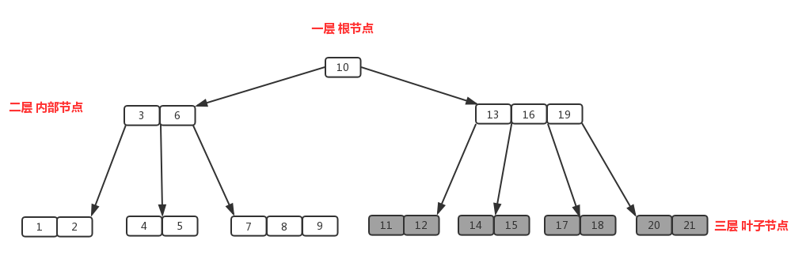

节点【13,16,19】拥有的子节点数目最多，四个子节点（灰色节点），所以可以定义上面的图片为4阶B树

### 内部节点

节点【13,16,19】、节点【3,6】都为内部节点

特征：内部节点是**除叶子节点和根节点之外的所有节点**，拥有父节点和子节点。假定m阶B树的内部节点的子节点数量为M，则一定要符合（m/2）<= M <=m关系式，包含元素数量M-1；包含的元素数量 （m/2）-1<= K <=m-1,K为元素数量。m/2向上取整。

### 插入

针对m阶高度h的B树，插入一个元素时，首先在B树中是否存在，如果不存在，即在叶子结点处结束，然后在叶子结点中插入该新的元素。

- 若该节点元素个数小于m-1，直接插入；
- 若该节点元素个数等于m-1，引起节点分裂；以该节点中间元素为分界，取中间元素（偶数个数，中间两个随机选取）插入到父节点中；
- 重复上面动作，直到所有节点符合B树的规则；最坏的情况一直分裂到根节点，生成新的根节点，高度增加1；

上面三段话为插入动作的核心，接下来以5阶B树为例

5阶B树关键点:

- 2<=根节点子节点个数<=5
- 3<=内节点子节点个数<=5
- 1<=根节点元素个数<=4
- 2<=非根节点元素个数<=4

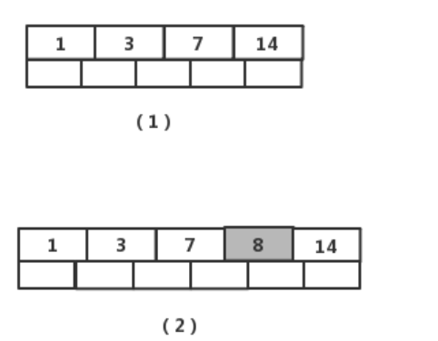

图（1）插入元素【8】后变为图（2），此时根节点元素个数为5，不符合 1<=根节点元素个数<=4，进行分裂（**真实情况是先分裂，然后插入元素**，这里是为了直观而先插入元素，下面的操作都一样，不再赘述），取节点中间元素【7】，加入到父节点，左右分裂为2个节点，如图（3）

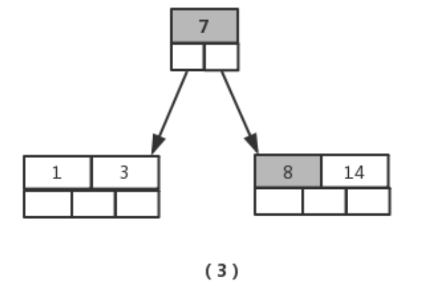

接着插入元素【5】，【11】，【17】时，不需要任何分裂操作，如下图

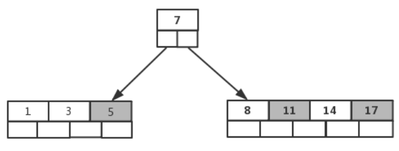

插入元素【13】

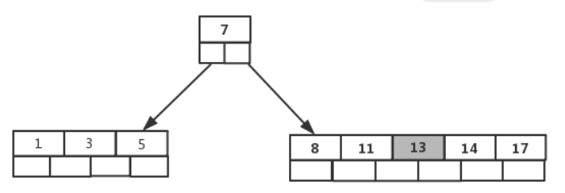

节点元素超出最大数量，进行分裂，提取中间元素【13】，插入到父节点当中

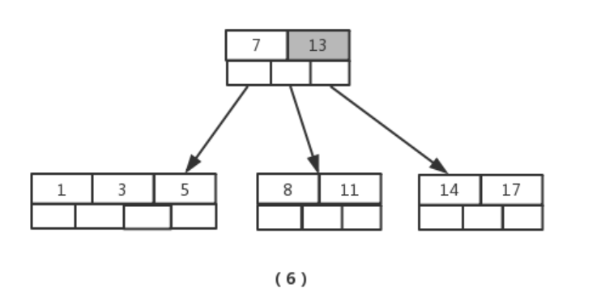

接着插入元素【6】，【12】，【20】，【23】时，不需要任何分裂操作，如图（7）

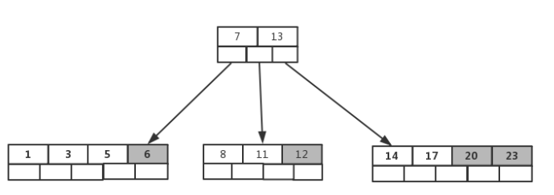

插入【26】时，最右的叶子结点空间满了，需要进行分裂操作，**中间元素【20】上移到父节点中**，注意通过上移中间元素，树最终还是保持平衡，分裂结果的结点存在2个关键字元素。

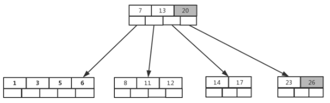

插入【4】时，导致最左边的叶子结点被分裂，【4】恰好也是中间元素，上移到父节点中，然后元素【16】,【18】,【24】,【25】陆续插入不需要任何分裂操作

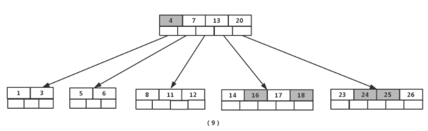

最后，当插入【19】时，含有【14】,【16】,【17】,【18】的结点需要分裂，把中间元素【17】上移到父节点中，但是情况来了，父节点中空间已经满了，所以也要进行分裂，将父节点中的中间元素【13】上移到新形成的根结点中，这样具体插入操作的完成。

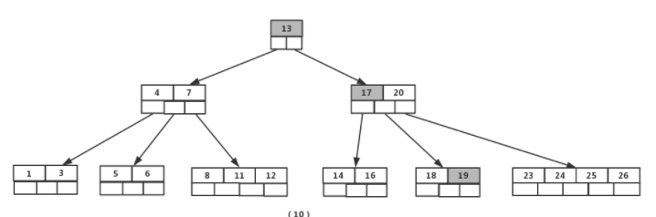

### 删除

首先查找B树中需删除的元素,如果该元素在B树中存在，则将该元素在其结点中进行删除；删除该元素后，首先判断该元素是否有左右孩子结点，如果有，则上移孩子结点中的某相近元素(“左孩子最右边的节点”或“右孩子最左边的节点”)到父节点中，然后是移动之后的情况；如果没有，直接删除。

- 某结点中元素数目小于（m/2）-1,(m/2)向上取整，则需要看其某相邻兄弟结点是否丰满；
- 如果丰满（结点中元素个数大于(m/2)-1），则向父节点借一个元素来满足条件；
- 如果其相邻兄弟都不丰满，即其结点数目等于(m/2)-1，则该结点与其相邻的某一兄弟结点进行“合并”成一个结点；

接下来还以5阶B树为例，详细讲解删除的动作；

- 关键要领，元素个数小于 2（m/2 -1）就合并，大于4（m-1）就分裂

如图依次删除依次删除【8】,【20】,【18】,【5】

首先删除元素【8】，当然首先查找【8】，【8】在一个叶子结点中，删除后该叶子结点元素个数为2，符合B树规则，操作很简单，只需要移动【11】至原来【8】的位置，移动【12】至【11】的位置（也就是结点中删除元素后面的元素向前移动）

下一步，删除【20】,因为【20】没有在叶子结点中，而是在中间结点中找到，咱们发现他的继承者【23】(字母升序的下个元素)，将【23】上移到【20】的位置，然后将孩子结点中的【23】进行删除，这里恰好删除后，该孩子结点中元素个数大于2，无需进行合并操作。

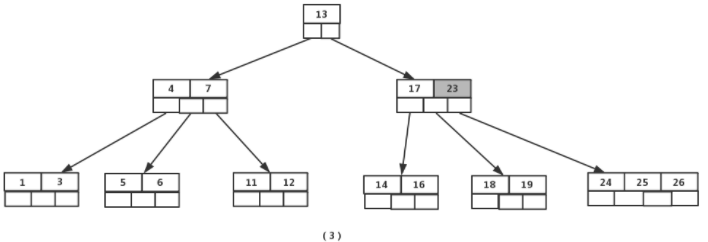

下一步删除【18】，【18】在叶子结点中,但是该结点中元素数目为2，删除导致只有1个元素，已经小于最小元素数目2,而由前面我们已经知道：如果其某个相邻兄弟结点中比较丰满（元素个数大于ceil(5/2)-1=2），则可以向父结点借一个元素，然后将最丰满的相邻兄弟结点中上移最后或最前一个元素到父节点中，在这个实例中，右相邻兄弟结点中比较丰满（3个元素大于2），所以先向父节点借一个元素【23】下移到该叶子结点中，代替原来【19】的位置，【19】前移；然【24】在相邻右兄弟结点中上移到父结点中，最后在相邻右兄弟结点中删除【24】，后面元素前移。

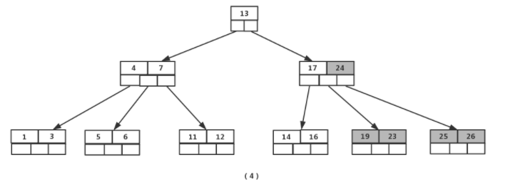

最后一步删除【5】， 删除后会导致很多问题，因为【5】所在的结点数目刚好达标，刚好满足最小元素个数（ceil(5/2)-1=2）**,而相邻的兄弟结点也是同样的情况**，删除一个元素都不能满足条件，所以需要该节点与某相邻兄弟结点进行合并操作；首先移动父结点中的元素（该元素在两个需要合并的两个结点元素之间）下移到其子结点中，然后将这两个结点进行合并成一个结点。所以在该实例中，咱们首先将父节点中的元素【4】下移到已经删除【5】而只有【6】的结点中，然后将含有【4】和【6】的结点和含有【1】,【3】的相邻兄弟结点进行合并成一个结点。

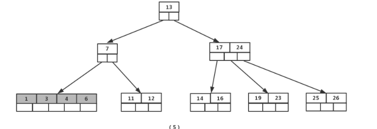

父节点只包含一个元素【7】，没达标（因为非根节点包括叶子结点的元素K必须满足于2=<K<=4，而此处的K=1），这是不能够接受的。如果这个问题结点的相邻兄弟比较丰满，则可以向父结点借一个元素。而此时兄弟节点元素刚好为2，刚刚满足，只能进行合并，而根结点中的唯一元素【13】下移到子结点，这样，树的高度减少一层

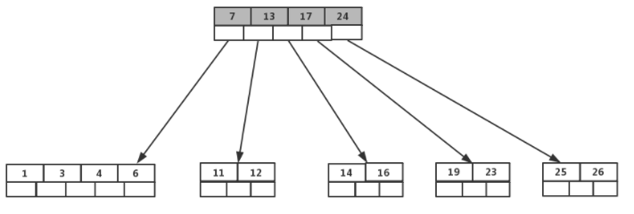

## B+Tree

B+ Tree 是基于 B Tree 和叶子节点顺序访问指针进行实现，它具有 B Tree 的平衡性，并且通过顺序访问指针来提高区间查询的性能。

在 B+ Tree 中，一个节点中的 key **从左到右非递减排列**（按键值大小排列），如果某个指针的左右相邻 key 分别是 keyi 和 keyi+1，且不为 null，则该指针指向节点的所有 key 大于等于 keyi 且小于等于 keyi+1。

- 非叶子节点只存储键值消息数据都在叶子节点
- 叶子节点间双向链表连接

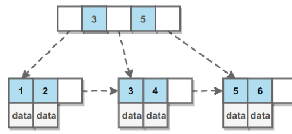

进行查找操作时，首先在根节点进行二分查找，找到一个 key 所在的指针，然后递归地在指针所指向的节点进行查找。直到查找到叶子节点，然后在叶子节点上进行二分查找，找出 key 所对应的 data。

插入删除操作会破坏平衡树的平衡性，因此在进行插入删除操作之后，需要对树进行分裂、合并、旋转等操作来维护平衡性。

> 为什么B+Tree叶子节点要加指针

在B+Tree的每一个叶子节点增加一个指向相邻叶子节点的指针，就形成了带有顺序访问指针的B+Tree，做这个优化的目的是**为了提高区间访问的性能**，如图，如果要查找key从2到5的所有数据记录，当找到2后，只需顺着节点和指针顺序遍历就可以一次性访问到所有的数据节点，极大提高了区间查询效率

**B+树的特征：**

- 有m个子树的中间节点包含有**m个元素**（**B树中是k-1个元素**），每个元素不保存数据，**只用来索引**；
- 所有的叶子结点中**包含了全部关键字的信息**，及指向含有这些关键字记录的**指针**，且叶子结点本身依关键字的大小自小而大的顺序链接。 (而B 树的叶子节点并没有包括全部需要查找的信息)；
- 所有的非终端结点可以看成是索引部分，结点中仅含有其子树根结点中最大（或最小）关键字。 (而B 树的非终节点也包含需要查找的有效信息)；
- 非叶子节点不再存储数据，数据只存储在同一层的叶子节点上；
- B+Tree中根到每一个节点的路径长度一样，而B-Tree不是这样；
- 叶子之间，增加了链表，获取所有节点，不再需要中序遍历；

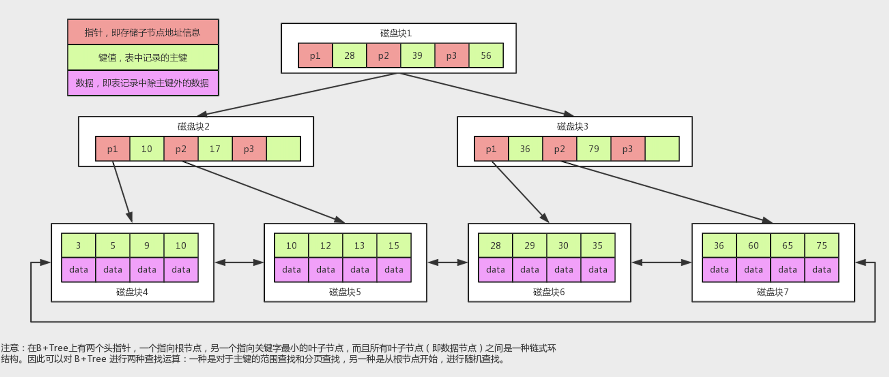

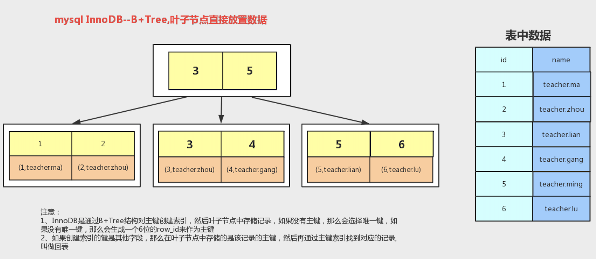

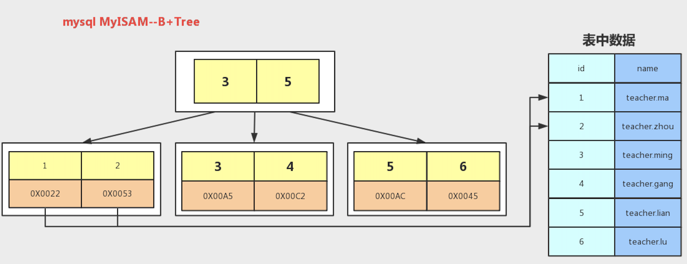

**为什么说B+树比B树更适合数据库索引？**

1）**B+树的磁盘读写代价更低**

　　B+树的内部结点并没有指向关键字具体信息的指针。因此其内部结点相对B 树更小。如果把所有同一内部结点的关键字存放在同一盘块中，那么盘块所能容纳的关键字数量也越多。一次性读入内存中的需要查找的关键字也就越多。相对来说IO读写次数也就降低了；

2）**B+树查询效率更加稳定**

　　由于非终结点并不是最终指向文件内容的结点，而只是叶子结点中关键字的索引。所以任何关键字的查找必须走一条从根结点到叶子结点的路。所有关键字查询的路径长度相同，导致每一个数据的查询效率相当；

3）**B+树便于范围查询**（最重要的原因，范围查找是数据库的常态）

　　B树在提高了IO性能的同时并没有解决元素遍历时效率低下的问题，正是为了解决这个问题，B+树应用而生。B+树只需要去遍历叶子节点就可以实现整棵树的遍历。而且在数据库中基于范围的查询是非常频繁的，而B树不支持这样的操作或者说效率太低

补充：B树的范围查找用的是**中序遍历**，而B+树用的是**在链表上遍历**；

