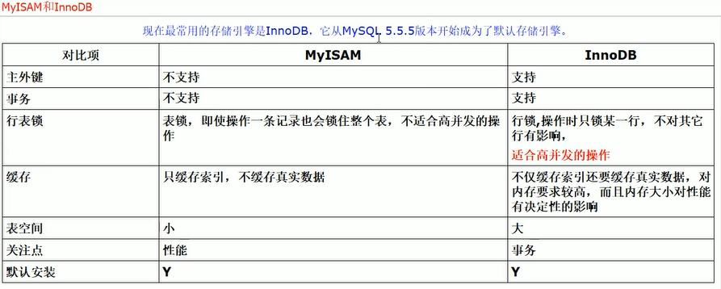

# InnoDB存储引擎架构

[TOC]

![[]InnoDB存储引擎架构简介](images/v2-646e38a5ab217ee5ecc87091b06ccc53_r.jpg)

在MySQL做完优化工作后，真正执行SQL语句的部件是**存储引擎**。在MySQL众多引擎之中，InnoDB是目前默认的存储引擎，也是使用最广泛的引擎。InnoDB是事务安全的MySQL存储引擎，支持ACID事务。其设计目标主要面向在线事务处理(OLTP)的应用。其特点是**行锁设计、支持MVCC、支持外键、提供一致性非锁定读**，即默认读操作不会产生锁。InnoDB存储数据是基于**磁盘存储**的,且其记录是按照页的方式进行管理。那么将引出如下疑问：

1. 当前的磁盘速度和CPU之间拥有一条巨大的鸿沟，InnoDB如何解决？
2. 数据库对数据进行操作（查询，修改，插入）时，数据在磁盘上的位置是随机的，将会更加影响操作数据的性能，InnoDB又是如何解决的？
3. 针对问题1，非常有效的办法是引入缓存来解决，但是引入缓存后，会导致缓存数据和磁盘数据一致性和MySQL非正常死亡时缓存数据丢失的问题。
4. InnoDB有哪些重要特性？

## 区别

InnoDB默认可以创建16个索引

- InnoDB支持事务，MyIsam不支持事务，对于InnoDB每一条SQL语言都默认封装成事务，自动提交，这样会影响速度，所以最好把多条SQL语言放到begin 和 commit之间，组成一个事务；
- InnoDB支持外键，而MyIsam不支持，对一个包含外键的InnoDB表转成MyIsam表会失败
- InnoDB是聚集索引，数据文件和索引绑定在一块，必须要有主键，通过主键索引效率很高，但是辅助索引需要两次查询，先查询到主键，然后在通过主键查询到数据。因此主键不应该过大。主键过大的时候，其它索引也会很大。而MyIsam是非聚集索引，数据和文件是分离的，索引保存的是数据文件的指针，主键索引和辅助索引是独立的。
- InnoDB不支持全文检索，而MyIsam支持全文检索，查询效率上MyIsam要高

## 架构

InnoDB存储引擎由**内存池**和一些**后台线程**组成

**内存池主要工作**

- 维护所有进程/线程需要访问的多个内部数据结构
- 缓存磁盘上的数据，方便快速读取，同时在对磁盘文件修改之前进行缓存
- 缓存重做日志（redo log）

**后台线程主要工作**

- 刷新内存池中的数据，保证缓冲池中缓存的数据最新
- 将已修改数据文件刷新到磁盘文件
- 保证数据库异常时InnoDB能恢复到正常运行状态

### 内存池

#### 缓冲池

InnoDB缓冲池是为了通过**内存的速度**来弥补磁盘速度慢对数据库性能造成的影响。其工作方式总是将数据库文件按页（每页16K）读取到缓冲池，然后按**最近最少使用**（LRU）的算法来保留在缓冲池中的缓存数据。在数据库中进行读操作时，首先将从磁盘读到的页存放在缓冲池中，下一次读取相同的页时，**首先判定是否存在缓冲池中**，如果有就是被命中直接读取，没有的话就从磁盘中读取。

在数据库进行改操作时，首先修改**缓冲池中的页**（修改后，该页即为脏页），然后在以一定的频率**刷新到磁盘上**。这里的刷新机制不是每页在发生变更时触发。而是通过一种**checkpoint**机制刷新到磁盘的。所以**缓冲池的大小直接影响着数据库的整体性能**，可以通过配置参数innodb_buffer_pool_size来设置。

**checkpoint的目的如下：**

- 缩短数据库的恢复时间
- 缓冲池不够用时，将脏页刷新到磁盘
- 重做日志不可用时，刷新脏页

从架构图中可以看出缓冲池中缓存的数据页类型有:索引页、数据页、 undo 页、插入缓冲、自适应哈希索引、 InnoDB 的锁信息、数据字典信息等。索引页和数据页占缓冲池的很大一部分。

- 数据页和索引页: Page是Innodb存储的最基本结构，也是Innodb磁盘管理的最小单位，与数据库相关的所有内容都存储在Page结构里。Page分为几种类型，数据页和索引页就是其中最为重要的两种类型。
- 插入缓存: 在InnoDB引擎上进行插入操作时，一般需要按照主键顺序进行插入，这样才能获得较高的插入性能。当一张表中存在非聚簇的且不唯一的索引时，在插入时，数据页的存放还是按照主键进行顺序存放，但是对于非聚簇索引叶节点的插入不再是顺序的了，这时就需要离散的访问非聚簇索引页，由于随机读取的存在导致插入操作性能下降。

InnoDB为此设计了Insert Buffer来进行插入优化。对于非聚簇索引的插入或者更新操作，不是每一次都直接插入到索引页中，而是先判断插入的非聚集索引是否在缓冲池中，若在，则直接插入；若不在，则先放入到一个Insert Buffer中。看似数据库这个非聚集的索引已经查到叶节点，而实际没有，这时存放在另外一个位置。然后再以一定的频率和情况进行Insert Buffer和非聚簇索引页子节点的合并操作。这时通常能够将多个插入合并到一个操作中，这样就大大提高了对于非聚簇索引的插入性能。

- 自适应哈希索引: InnoDB会根据访问的频率和模式，为热点页建立哈希索引，来提高查询效率。InnoDB存储引擎会监控对表上各个索引页的查询，如果观察到建立哈希索引可以带来速度上的提升，则建立哈希索引，所以叫做自适应哈希索引。

自适应哈希索引是通过缓冲池的B+树页构建而来，因此建立速度很快，而且不需要对整张数据表建立哈希索引。其 有一个要求，即对这个页的连续访问模式必须是一样的，也就是说其查询的条件(WHERE)必须完全一样，而且必须是连续的。

- 锁信息 : nnoDB存储引擎会在行级别上对表数据进行上锁。不过InnoDB也会在数据库内部其他很多地方使用锁，从而允许对多种不同资源提供并发访问。数据库系统使用锁是为了支持对共享资源进行并发访问，提供数据的完整性和一致性。关于锁的具体知识我们之后再进行详细学习。
- 数据字典信息 : InnoDB有自己的表缓存，可以称为表定义缓存或者数据字典。当InnoDB打开一张表，就增加一个对应的对象到数据字典。

数据字典是对数据库中的数据、库对象、表对象等的元信息的集合。在MySQL中，数据字典信息内容就包括表结构、数据库名或表名、字段的数据类型、视图、索引、表字段信息、存储过程、触发器等内容。MySQL INFORMATION_SCHEMA库提供了对数据局元数据、统计信息、以及有关MySQL server的访问信息（例如：数据库名或表名，字段的数据类型和访问权限等）。该库中保存的信息也可以称为MySQL的数据字典。

#### 重做日志缓冲

InnoDB有buffer pool（简称bp）。bp是数据库页面的缓存，对InnoDB的任何修改操作都会**首先在bp的page上进行**，然后这样的页面将被**标记为dirty**并被放到专门的**flush list上**，后续将由master thread或专门的刷脏线程阶段性的将这些页面**写入磁盘**（disk or ssd）。这样的好处是避免每次写操作都操作磁盘导致大量的随机IO，阶段性的刷脏可以将多次对页面的修改merge成一次IO操作，同时异步写入也降低了访问的时延。然而，如果在dirty page还未刷入磁盘时，server非正常关闭，这些修改操作将会丢失，如果写入操作正在进行，甚至会由于损坏数据文件导致数据库不可用。为了避免上述问题的发生，Innodb将所有对页面的修改操作写入一个专门的文件，并在数据库启动时从此文件进行恢复操作，这个文件就是redo log file。这样的技术推迟了bp页面的刷新，从而提升了数据库的吞吐，有效的降低了访问时延。带来的问题是额外的写redo log操作的开销（顺序IO，当然很快），以及数据库启动时恢复操作所需的时间。

redo日志由两部分构成：redo log buffer、redo log file。innodb是支持事务的存储引擎，在事务提交时，必须先将该事务的所有日志写入到redo日志文件中，待事务的commit操作完成才算整个事务操作完成。在每次将redo log buffer写入redo log file后，都需要调用一次fsync操作，因为重做日志缓冲只是把内容先写入操作系统的缓冲系统中，并没有确保直接写入到磁盘上，所以必须进行一次fsync操作。因此，磁盘的性能在一定程度上也决定了事务提交的性能。

InnoDB 存储引擎先将重做日志信息放入这个缓冲区,然后以一定频率将其刷新到重做日志文件。重做日志文件一般不需要设置得很大,因为在下列三种情况下重做日志缓冲中的内容会刷新到磁盘的重做日志文件中。

- Master Thread 每一秒将重做日志缓冲刷新到重做日志文件
- 每个事物提交时会将重做日志缓冲刷新到重做日志文件
- 当重做日志缓冲剩余空间小于1/2时,重做日志缓冲刷新到重做日志文件

#### 额外缓冲池

在 InnoDB 存储引擎中，对一些数据结构本身的内存进行分配时，需要从额外的内存池中进行申请。例如: 分配了缓冲池,但是每个缓冲池中的帧缓冲还有对应的缓冲控制对象，这些对象记录以一些诸如 LRU, 锁,等待等信息,而这个对象的内存需要从额外的内存池中申请

### 后台线程

> 引擎是多线程的模型，由此其后台有多个不同的后台进程，负责处理不同的任务

#### Master Thread

核心的后台线程，主要负责将**缓冲池中的数据异步刷新到磁盘**，保证数据的一致性，包括脏页的刷新、合并插入缓冲、undo页的回收等。Master thread在主循环中，分两大部分操作，每秒钟的操作和每10秒钟的操作

- **每秒一次的操作**

- - 日志缓冲刷新到磁盘: 即使这个事务还没有提交（总是），这点解释了为什么再大的事务commit时都很快；
  - 合并插入缓冲（可能）: 合并插入并不是每秒都发生，InnoDB会判断当前一秒内发生的IO次数是否小于5，如果是，则系统认为当前的IO压力很小，可以执行合并插入缓冲的操作。
  - 至多刷新100个InnoDB的缓冲池的脏页到磁盘（可能) : 这个刷新100个脏页也不是每秒都在做，InnoDB引擎通过判断当前缓冲池中脏页的比例(buf_get_modified_ratio_pct)是否超过了配置文件中innodb_max_drity_pages_pct参数(默认是90，即90%)，如果超过了这个阈值，InnoDB引擎认为需要做磁盘同步操作，将100个脏页写入磁盘。

- **每10秒一次的操作**

- - 刷新100个脏页到磁盘（可能）: InnoDB引擎先判断过去10秒内磁盘的IO操作是否小于200次，如果是，认为当前磁盘有足够的IO操作能力，即将100个脏页刷新到磁盘。
  - 合并至多5个插入缓冲（总是）: 此次的合并插入缓冲操作总会执行，不同于每秒操作时可能发生的合并操作。
  - 将日志缓冲刷新到磁盘（总是）: InnoDB引擎会再次执行日志缓冲刷新到磁盘的操作，与每秒发生的操作一样。
  - 删除无用的undo页（总是）: 当对表执行update，delete操作时，原先的行会被标记为删除，但是为了一致性读的关系，需保留这些行版本的信息，在进行10S一次的删除操作时，InnoDB引擎会判断当前事务系统中已被删除的行是否可以删除，如果可以，InnoDB会立即将其删除。InnoDB每次最多删除20个Undo页。
  - 产生一个检查点（checkpoing）；

#### IOThread

在 InnoDB 存储引擎中大量使用了异步 IO （AIO）来处理写 IO 请求，IO Thread 的工作主要是负责这些 IO 请求的回调.。分别为write、read、insert buffer和log IO thread。线程数量可以通过参数进行调整。5.6以后的版本可以通过innodb_write_io_threads和innodb_read_io_threads来限制读写线程，而在5.6版本以前，只有一个参数innodb_file_io_threads来控制读写总线程数。

#### Purge Thread

**负责回收已经使用并分配的undo页**，purge操作默认是由master thread中完成的，为了减轻master thread的工作，提高cpu使用率以及提升存储引擎的性能。用户可以在参数文件中添加如下命令来启动独立的purge thread。innodb_purge_threads=1

从innodb1.2版本开始，可以指定多个innodb_purge_threads来进一步加快和提高undo回收速度，同时，由于Purge Thread 需要离散地读取undo页，这样也能更进一步利用磁盘地随机读取性能

#### Page Cleaner Thread

InnoDB1.2.X版本中引入的。其作用是将**之前版本中脏页的刷新操作都放入到单独的线程中来完成**。 其目的是减轻master thread的工作以及对于用户查询线程的阻塞，进一步提高InnoDB存储引擎的性能。

## InnoDB对内存区域的管理

LRU Free Flush

### LRU List

通常，数据库种的缓存池是通过LRU（最近最少使用）算法来进行管理，即最频繁使用的页在LRU列表的前端，而最少使用的页在LRU列表的尾端，当缓冲池不能存放新读到的页的时候，将首先释放LRU列表中尾段的页

需要注意的是，不没有采用朴素的LRU算法，该列表里还加入了midpoint位置，也就是新读到的页并不是直接放在首部，而是放到midpoint，该算法在InnoDB称为`midpoint insertion straregy` ，在默认的配置下，该位置在LRU列表长度的 5/8 处，该位置由innodb_old_blocks_pct，该值默认是37，表示新读到的页插入到LRU列表尾端的37%的位置，差不多 3/8 的位置，midpoint之前称之为new 列表，可看作是最为活跃的热点数据

为防止如索引或数据的扫描操作等SQL操作使得缓冲池中的页被刷新出，从而影响缓冲池的效率，因为这类操作需要访问表中的许多页，甚至是全部的页，若不是活跃的热点数据，如果被放入首部，非常可能将所需要的热点数据页从列表中删除，下一次访问时就要访问磁盘了，故引入参数管理LRU列表，`innodb_old_blocks_time`,表示页读取到mid位置后需要等待多久才会被加入到LRU列表的热端

### Free List

数据库启动时，列表是空的，这时页都存放在Free列表中，当需要从缓冲池中分页时，首先从free列表中查找是否有可用的空闲页，若有则将该页从free列表中删除，放入LRU列表中

### Flush List

在LRU列表中的页被修改后，称该页为脏页，即缓冲池中的页和磁盘上的页的数据产生了不一致，**checkpoint**机制刷新回磁盘，而Flush列表中的页即为脏页列表，需要注意的是，脏页既存在于LRU列表，也存在于Flush列表中，LRU列表用来管理缓冲池中页的可用性，Flush列表用来管理将页刷新回磁盘，互不影响

## InnoDB的重要特性

MySQL InnoDB通过如下重要特性实现了更好的新能和更高的特性

- 插入缓冲（insert buffer）
- 两次写（Double write）
- 自适应哈希索引（adaptive hash index）
- 异步io（Async IO）
- 刷新领接页（Flush Neighbor Page）

### 插入缓冲

我们去图书馆还书，对应图书馆来说，他是做了insert(增加)操作，管理员在1小时内接受了100本书，这时候他有2种做法把还回来的书归位到书架上:

1）每还回来一本书，根据这本书的编码（书柜区-排-号）把书送回架上

2）暂时不做归位操作，先放到柜面上，等不忙的时候，再把这些书按照书柜区-排-号先排好，然后一次性归位用方法1，管理员需要进出（IO）藏书区100次，不停的登高爬低完成图书归位操作，累死累活，效率很差。用方法2，管理员只需要进出（IO）藏书区1次，对同一个位置的书，不管多少，都只要爬一次楼梯，大大减轻了管理员的工作量。所以图书馆都是按照方法2来做还书动作的。但是你要说，我的图书馆就20本书，1个0.5米的架子，方法2和1管理起来都很方便，这种情况不在我们讨论的范围。当数据量非常小的时候，就不存在效率问题了。

关系数据库在处理插入操作的时候，处理的方法和上面类似，每一次插入都相当于还一本书，它也需要一个柜台来保存插入的数据，然后分类归档，在不忙的时候做批量的归位。这个柜台就是insert buffer.这就是为什么会有insert buffer，更多的是处于性能优化的考虑。

insert buffer是一种特殊的数据结构（B+ tree）并不是缓冲池的一部分，而是和数据页一样，是**物理页**的一部分。**对于非聚集索引的插入或更新操作**,不是每一次直接插入索引页.而是**先判断插入的非聚集索引页是否在缓冲池中**.如果在,则直接插入,如果不再,则先放入一个插入缓冲区中.然后再以一定的频率执行**插入缓冲和非聚集索引页子节点的合并**操作.使用条件:**非聚集索引（辅助索引l）,非唯一**，原因如下:

- primary key 是按照递增的顺序进行插入的，异常插入聚族索引一般也顺序的，非随机IO。
- 写唯一索引要检查记录是不是存在，所以在修改唯一索引之前,必须把修改的记录相关的索引页读出来才知道是不是唯一、这样Insert buffer就没意义了，要读出来(随机IO)，所以只对非唯一索引有效。

#### 插入缓冲原理

对于为非唯一索引，辅助索引的修改操作并非实时更新索引的叶子页，而是把若干对同一页面的更新缓存起来做，合并为一次性更新操 作，减少IO，转随机IO为顺序IO,这样可以避免随机IO带来性能损耗，提高数据库的写性能，具体流程:

**1) 先判断要更新的这一页在不在缓冲池中**a、若在，则直接插入；b、若不在，则将index page 存入Insert Buffer，按照Master Thread的调度规则来合并非唯一索引和索引页中的叶子结点

**2) Master Thread的调度规则**

**a、主动merger: innodb主线程定期完成，用户线程无感知**主动merge通过innodb主线程(svr_master_thread）判断：若过去1s之内发生的I/O小于系统I/O能力的5%，则主动进行一次insert buffer的merge操作。merge的页面数为系统I/O能力的5%，读取采用async io模式。每10s,必定触发一次insert buffer meger操作。meger的页面数仍旧为系统 I/O能力的5%。

- 主线程发出async io请求，async读取需要被merge的索引页面
- I/O handler 线程，在接受到完成的async I/O之后，进行merge

**b 、被动merge: 用户线程完成，用户能感受到meger操作带来的性能影响**

- insert操作，导致页面空间不足，需要分裂(split)。由于insert buffer只针对单个页面，不能buffer page split[页已经在内存里]，因此引起页面的被动meger。同理，update操作导致页面空间不 足；purge导致页面为空等。总之,若当前操作引起页面split or merge，那么就会导致被动merge；
- insert操作，由于其它各种原因，insert buffer优化返回false，需要真正读取page时，要进行被动merge。与一不同的是，页在disk上，需要读取到内存里；
- 在进行insert buffer操作，发现insert buffer太大，需要压缩insert buffer，这时需要强制被动merge，不允许 insert 操作进行。

### 两次写

Insert Buffer带给InnoDB存储引擎的是性能上的提升，doublewrite（两次写）带给InnoDB存储引擎的是数据页的可靠性。

当发生数据库宕机时，可能InnoDB存储引擎正在写入某个页到表中，而这个页只写了一部分，比如16KB的页，只写了前4KB，之后就发生了宕机，这种情况被称为部分写失效（partial page write)。在InnoDB存储引擎未使用doublewrite技术前，曾经出现过因为部分写失效而导致数据丢失的情况。

如果发生写失效，可以通过重做日志进行恢复。这是一个办法。但是必须清楚地认识到，重做日志中记录的是对页的物理操作，如偏移量800，写‘aaaa’记录。如果这个页本身已经发生了损坏，再对其进行重做是没有意义的。这就是说，在应用重做日志前，用户需要一个页的副本，当写入失效发生时，先通过页的副本来还原该页，再进行重做，这就是doublewrite。在InnoDB存储引擎中doublewrite的体系架构如图所示：

### 自适应哈希索引

哈希（hash）是一种非常快的查找方法，在一般情况下这种查找的时间复杂度为O(1)，即一般仅需要一次查找就能定位数据。 而B+树的查找次数，取决于B+树的高度，在生产环境中，B+树的高度一般为3~4层，所以需要3~4次的查询。

InnoDB存储引擎会监控对表上各索引页的查询。如果观察到建立哈希索引可以带来速度提升，则建立哈希索引，称之为自适应哈希索引(Adaptive Hash Index, AHI)。AHI是通过缓冲池的B+树页构造而来，因此建立的速度很快，而且不需要对整张表构建哈希索引。InnoDB存储引擎会自动根据访问的频率和模式来自动地为某些热点页建立哈希索引。

AHI有一个要求，对这个页的连续访问模式必须是一样的。例如对于(a,b)这样的联合索引页，其访问模式可以是下面情况：

- where a=xxx
- where a =xxx and b=xxx

访问模式一样是指查询的条件是一样的，若交替进行上述两种查询，那么InnoDB存储引擎不会对该页构造AHI。 AHI还有下面几个要求：

- 以该模式访问了100次
- 页通过该模式访问了N次，其中N=页中记录*1/16

InnoDB存储引擎官方文档显示，启用AHI后，读取和写入速度可以提高2倍，辅助索引的连接操作性能可以提高5倍。AHI的设计思想是数据库自优化，不需要DBA对数据库进行手动调整

### 异步IO

- sync IO ：同步IO 即每进行一次IO操作，此次操作结束才能继续接下来的操作。 但是如果用户发需要等待出一条索引扫描的查询，那么这条SQL查询语句可能需要扫描多个索引页，也就是需要进行多次的IO操作。在每扫描一个页并等待期完成再进行下一次的扫描是没有必要的。
- 异步IO： 用户可以在发出一个IO请求后立即再发出另一个IO请求，当全部IO请求发送完毕后，等待所有IO操作的完成，这就是AIO。

AIO另一个优势可以将多个IO，合并为1个IO，以提高IO效率。例如：用户需要访问3页内容，但这3页时连续的。同步IO需要进行3次IO,而AIO只需要一次 就可以了。

### 刷新领接页

当刷新一个脏页时，innodb会检测该页所在区（extent）的所有页，如果是脏页，那么一起进行刷新。这样做，通过AIO将多个IO写入操作合并为一个IO操作。在传统机械磁盘下有着显著优势。

