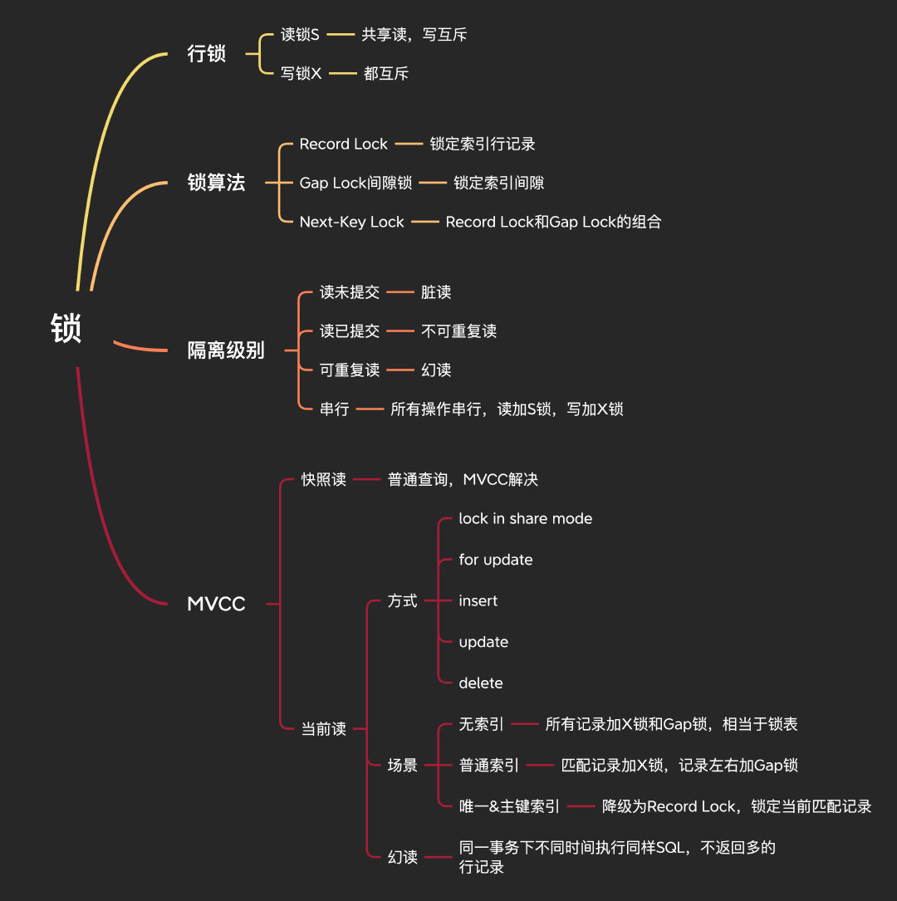
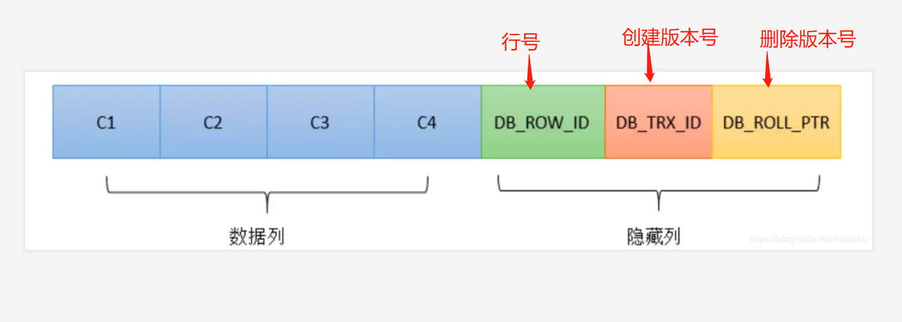
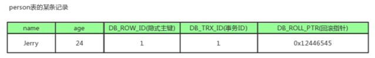
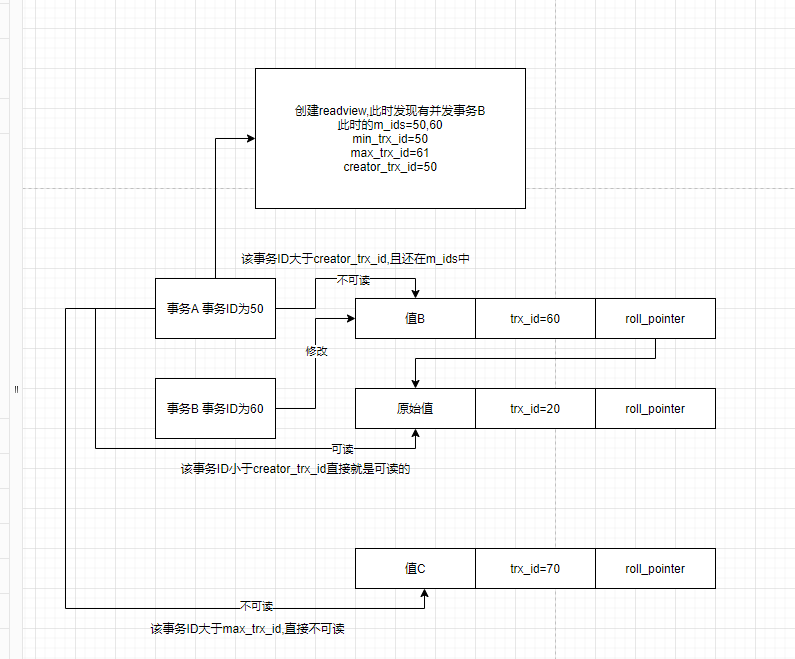
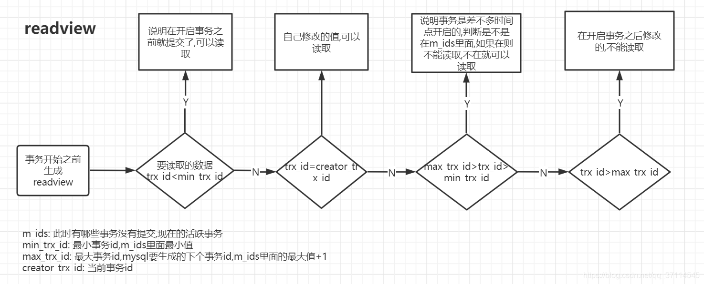

# MVCC

[TOC]

## 什么是MVCC

> 注意一点，mvcc在rr级别下，**解决幻读是在  快照读下的幻读问题**，当前都还得靠锁
>
> 而从写或者更新的角度，，如果其他事务对本事务readview内数据的修改发生在本事务操作当前读（加锁）**之前**，则不能解决幻读
>
> 如果其他事务对本事务的readview内数据的修改发生在本事务操作当前读之后，则会阻塞，这种情况属于mvcc配合间隙锁解决幻读问题。

是一种无锁读取的优化策略，它的“无锁”是特指读取时不需要加锁。

MVCC 的基本思路是对数据库的任何修改都不会直接覆盖之前的数据，而是产生一个新版副本与老**版本**共存，以此达到读取时可以完全不加锁的目的。

## 概念

数据库并发场景

- 读-读：不存在 任何问题，也不需要并发控制
- 读-写：有线程安全问题，可能会造成事务隔离性问题，可能遇到**脏读，幻读，不可重复读**
- 写-写：有线程安全问题，可能会存在更新丢失问题，比如第一类更新丢失，第二类更新丢失

---

### 当前读 

它读取的数据库记录，都是**当前最新的版本**，会对当前读取的数据进行**加锁**，防止其他事务修改数据。

由于当前读每次生成新的readview，所以就需要  行锁 + 间隙锁来保证，在这个事物没提交前，查询的数据是一样的，从而解决幻读（mvcc无法解决当前读的幻读问题，只好用加锁了（行锁间隙锁）

当前读不仅会对当前记录加**行记录锁**，还会对查询范围空间的数据加**间隙锁**（GAP LOCK），因此可以阻止幻读问题的出现。

 如下操作都是当前读：

- select lock in share mode **(共享锁)**
- select for update (排他锁)
- **update (排他锁)**
- insert (排他锁)
- delete (排他锁)
- 串行化事务隔离级别

---

### 快照读

RC：每次select都生成一个快照读

RR：**开启事务后第一个select语句才是快照读的地方**，而不是一开启事务就快照读，后面的快照读也使用这个readview，配合undoLog，才做到同一个事务中多次查询，查询的数据相同

快照读的实现是基于多版本并发控制，即MVCC，既然是多版本，那么快照读读到的数据不一定是当前最新的数据，**有可能是之前历史版本的数据**。

## 原理

MVCC的核心就是 **Undo log+ Read-view**

“MV”就是通过 Undo log**来保存数据的历史版本**，实现多版本的管理

“CC”是通过 Read-view来实现管理，通过 Read-view原则**来决定数据是否显示**。

同时针对不同的隔离级别， Read view的生成策略不同，也就实现了不同的隔离级别。

**简单说一句话就是：undo log + 版本链 + 比较规则**

InnoDB在每行数据都增加三个隐藏字段

- 一个唯一行号
- 一个记录创建的版本号
- 一个记录删除的版本号

### 版本链 

数据库中的每行数据，除了我们肉眼看见的数据，还有几个隐藏字段，分别是db_trx_id、db_roll_pointer、db_row_id。

- db_trx_id ：**最近修改(修改/插入)事务ID**：记录创建这条记录/最后一次修改该记录的事务ID。6byte

- db_roll_pointer（版本链关键）：**回滚指针**，指向这条记录的上一个版本（存储于rollback segment里）。7byte

- db_row_id ：**隐含的自增ID（隐藏主键）**，如果数据表没有主键，InnoDB会自动以db_row_id产生一个聚簇索引。 6byte

例如：

1. db_row_id是数据库默认为该行记录生成的唯一隐式主键
2. db_trx_id是当前操作该记录的事务ID
3. db_roll_pointer是一个回滚指针，用于配合undo日志，指向上一个旧版本。 每次对数据库记录进行改动，都会记录一条undo日志，每条undo日志也都有一个roll_pointer属性（INSERT操作对应的undo日志没有该属性，因为该记录并没有更早的版本）

> 对该记录每次更新后，都会将旧值放到一条undo日志中，就算是该记录的一个旧版本，随着更新次数的增多，所有的版本都会被roll_pointer属性连接成一个链表，我们把这个链表称之为版本链，版本链的头节点就是当前记录最新的值。

### Read View（读视图）

事务进行**快照读**操作的时候生产的**读视图**(Read View)，在该事务执行的快照读的那一刻，会生成数据库系统当前的一个**快照**。
记录并维护系统当前**活跃事务的ID**(没有commit，当每个事务开启时，都会被分配一个ID, 这个ID是递增的，所以越新的事务，ID值越大)，是系统中当前不应该被本事务看到的其他事务id列表。

Read View主要是用来做`可见性`判断的, 即当我们`某个事务`执行`快照读`的时候，对该记录创建一个Read View读视图，把它比作条件用来判断`当前事务`能够看到`哪个版本`的数据，既可能是当前`最新`的数据，也有可能是该行记录的undo log里面的`某个版本`的数据。

## MVCC与事务隔离级别

MVCC指的就是在使用RC，RR在执行select操作时访问记录的版本链的过程，从而可以使得**不同事务的读-写，写-读操作并发执行**，从而提高系统性能

而**写写并发控制是由两阶段锁**来实现的

上面所讲的`Read View`用于支持`RC`（Read Committed，读提交）和`RR`（Repeatable Read，可重复读）`隔离级别`的`实现`。

### 基于ReadView实现RR

m_ids：记录生成readview的时候此刻还未提交的trx_id(事务ID)

min_trx_id：m_ids中的最小值

max_trx_id：是mysql下一个要生成的事务ID,最大事务ID.就是m_ids中最大的下一个

creator_trx_id：（当前的）自己的事务ID

### 基于ReadView实现RC

每次查询都会新生成一个ReadView,如果事务B已经提交了,并且他的值可以被事务A读取到,事务A中多次查询的时候都会生成一个新的ReadView,此时因为事务B已经提交了,m_ids里面没有事务B的值,所以数据可以被读取到

### undo log 中记录和 read-view 的比对

之所以在可重读级别下能够始终看到的数据都和启动时候看的是一致的，原因就是因为高低水位加上一个当前事务id以及一个比对结果

1. 如果当前记录的事务id落在绿色部分（trx_id < min_id），表示这个版本是已提交的事务生成的，可读。
2. 如果当前记录的事务id落在红色部分（trx_id > max_id），表示这个版本是由将来启动的事务生成的，不可读。
3. 如果当前记录的事务id落在黄色部分（min_id <= trx_id <= max_id），则分为两种情况：
   - 若当前记录的事务id在未提交事务的数组中，则此条记录不可读；
   - 若当前记录的事务id不在未提交事务的数组中，则此条记录可读。

### RR、RC生成时机

- `RC`隔离级别下，是每个`快照读`都会`生成并获取最新`的`Read View`；
- 而在`RR`隔离级别下，则是`同一个事务中`的`第一个快照读`才会创建`Read View`, `之后的`快照读获取的都是`同一个Read View`，之后的查询就`不会重复生成`了，所以一个事务的查询结果每次`都是一样的`。

### 解决快照读出现的幻读问题

第一次select产生一个快照，并且后面的select查询都是沿用第一次快照读的结果
