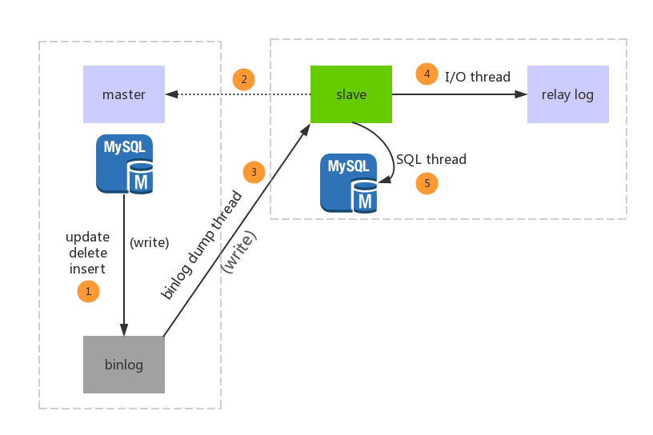

# MySQL主从复制

[TOC]

## 简介

- **原理**：将主服务器的binlog日志复制到从服务器上执行一遍，达到主从数据的一致状态。
- **过程**：从库开启一个I/O线程，向主库请求Binlog日志。主节点开启一个binlog dump线程，检查自己的二进制日志，并发送给从节点；从库将接收到的数据保存到中继日志（Relay log）中，另外开启一个SQL线程，把Relay中的操作在自身机器上执行一遍
- **优点**： 
  - 作为备用数据库，并且不影响业务
  - 可做读写分离，一个写库，一个或多个读库，在不同的服务器上，充分发挥服务器和数据库的性能，但要保证数据的一致性

**binlog记录格式：**statement、row、mixed

 基于语句statement的复制、基于行row的复制、基于语句和行（mix）的复制。其中基于row的复制方式更能保证主从库数据的一致性，但日志量较大，在设置时考虑磁盘的空间问题

## 数据一致性问题

"主从复制有延时"，这个延时期间读取从库，可能读到不一致的数据。

**缓存记录写key法：**

 在cache里记录哪些记录发生过的写请求，来路由读主库还是读从库

**异步复制：**

 在异步复制中，主库执行完操作后，写入Binlog日志后，就返回客户端，这一动作就结束了，**并不会验证从库有没有收到**，完不完整，所以这样可能**会造成数据的不一致**。

**半同步复制：**

 当主库每提交一个事务后，不会立即返回，而是等待其中一个**从库接收到Binlog并成功写入Relay-log中才返回客户端**，通过一份在主库的Binlog，另一份在其中一个从库的Relay-log，可以保证了数据的安全性和一致性。

**全同步复制：**

 指当主库执行完一个事务，所有的从库都执行了该事务才返回给客户端。因为需要等待所有从库执行完该事务才能返回，所以全同步复制的**性能必然会收到严重的影响**。