# MySQL事务ACID

[TOC]

**事务，就是一个操作序列 ，这些操作要么都执行，要么都不执行，它是一个不可分割的工作单位， ACID又是事务的四大特性**![[]MySQL事务ACID详解](images/v2-81e17a7fa76e997ff7e7e826b7c521bb_r.jpg)


## 概念

ACID，是指在可靠数据库管理系统（DBMS）中，事务(transaction)所应该具有的四个特性：原子性（Atomicity）、一致性（Consistency）、隔离性（Isolation）、持久性（Durability）


### 原子性

**一个事务必须被视为一个不可分割的最小工作单元**，整个事务中的所有操作要么全部提交成功，要么全部失败回滚，对于一个事务来说，不可能只执行其中的一部分操作。实现事务的原子性，数据库要支持回滚操作，在事务中某个操作失败后，回滚到事务之前的状态。大多数数据库实现事务时，事务操作的数据是在事务相关的数据快照上，并不是真正修改实际的数据，如果有错不提交即可。而其他一些只支持简单事务的数据库系统中，事务更新数据不在快照上，而是直接操作实际数据，则系统需要先预演一遍所有要执行的操作，如果失败，事务相关的所有操作都不会被执行。


### 一致性

一致性是指事务必须使数据库从一个一致性状态变换到另一个一致性状态，也就是说一个**事务执行之前和执行之后都必须处于一致性状态**。

如转账的栗子: 假设用户A和用户B两者的钱加起来一共是5000，那么不管A和B之间如何转账，转几次账，事务结束后两个用户的钱相加起来应该还得是5000，这就是事务的一致性。

事务的一致性决定了一个系统设计和实现的复杂度，因为事务可以有不同程度的一致性：

- 强一致性: 无论更新操作实在哪一个数据副本执行，之后所有的读操作都能获得最新的数据。
- 弱一致性: 提交的更新操作，不一定立即会被读操作读到，需要一段时间，此种情况会存在一个不一致窗口。
- 最终一致性: 是弱一致性的特例。事务更新一份数据，最终一致性保证在没有其他事务更新同样的值的话，最终所有的事务都会读到之前事务更新的最新值。如果没有错误发生，不一致窗口的大小依赖于：通信延迟，系统负载等。


### 隔离性

隔离性是当多个用户并发访问数据库时，比如操作同一张表，数据库为每一个用户开启的事务，**不能被其他事务的操作所干扰，多个并发事务之间要相互隔离**。

当前大多数数据库都提供了不同级别的事务隔离，之后便会产生不同的问题，一般会出现的问题主要有:

- #### 脏读

脏读是指在一个事务处理过程里**读取了另一个未提交的事务中的数据**。当一个事务A正在多次修改某个数据，而在这个事务中这多次的修改都还未提交，这时另外一个并发的事务B来访问该数据，将会**获取到事务A中没有提交的数据**， 从而最终造成两个事务得到的数据不一致。

如: 张三有500块钱，现在给李四转100块钱，这个事务中的SQL涉及到两个操作:1、 A账户减100块钱

```text
update account set money=money - 100 where name=’张三’;
```

2、 B账户加100块钱

```text
update account set money=money+100 where name=’李四’;
```

我们假设事务A执行转账，刚执行完第一条SQL语句，此时，另外一个事务B来查询张三账户的钱，那么获取到的是400块钱。但是事务A执行第二条语句的时候出现了问题，事务A进行了回滚，那么事实上张三账户的钱应该是500块钱，而不是400块钱，从而出现了脏读。

- #### 不可重复读

不可重复读是指在对于数据库中的某个数据，**一个事务范围内多次查询却返回了不同的数据值，这是由于在查询间隔，被另一个事务修改并提交了**。

例如事务T1在读取某一数据，而事务T2**立马修改了这个数据并且提交事务给数据库**，事务T1再次读取该数据就得到了不同的结果，发生了不可重复读。

不可重复读和脏读的区别是，脏读是某一事务读取了另一个事务未提交的脏数据，而不可重复读则是**读取了前一事务提交的数据**。

- #### 幻读

幻读，是指当**事务不是独立执行时发生的一种现象**。

例如事务T1对一个表中所有的行的某个数据项做了从“1”修改为“2”的操作，这时事务T2又对这个表中插入了一行数据项，而这个数据项的数值还是为“1”并且提交给数据库。而**操作事务T1的用户如果再查看刚刚修改的数据，会发现还有一行没有修改，其实这行是从事务T2中添加的**，就好像产生幻觉一样，这就是发生了幻读。

幻读和不可重复读都是**读取了另一条已经提交的事务**（这点就脏读不同，脏读是读取未提交的事务中的数据），所不同的是**不可重复读查询的都是同一个数据项**，而幻读**针对的是一批数据整体（比如数据的个数）**。


> 不可重读和幻读的区别
>
> 不可重复读重点在于update和delete，而幻读的重点在于insert。
>
> 如果使用锁机制来实现这两种隔离级别，在可重复读中，该sql第一次读取到数据后，就将这些数据加锁，其它事务无法修改这些数据，就可以实现可重复读了。但这种方法**却无法锁住insert的数据**，所以当事务A先前读取了数据，或者修改了全部数据，事务B还是可以insert数据提交，这时事务A就会发现莫名其妙多了一条之前没有的数据，这就是**幻读，不能通过行锁来避免**。需要Serializable隔离级别 ，**读用读锁，写用写锁，读锁和写锁互斥**，这么做可以有效的避免幻读、不可重复读、脏读等问题，但会极大的降低数据库的并发能力。
>
> 不可重复读和幻读最大的区别，就在于**如何通过锁机制来解决他们产生的问题**


- #### 丢失更新

两个事务同时读取同一条记录，A先修改记录，B也修改记录（B是不知道A修改过），B提交数据后B的修改结果覆盖了A的修改结果。


### 持久性

持久性是指一个事务一旦被提交了，那么对数据库中的数据的改变就是永久性的，即便发生宕机，仍然可以依靠事物日志完成数据的持久化


## 实现机制

### 实现原子性


### 实现一致性

MySQL通过如下策略完成事务的一致性:

- InnoDB doublewrite buffer（双写缓冲）
- InnoDB crash recovery（故障恢复）


#### 双写缓冲

> InnoDB使用了一种叫做doublewrite的特殊文件flush技术，在把pages写到date files之前，InnoDB先把它们写到一个叫doublewrite buffer的连续区域内，在写doublewrite buffer完成后，InnoDB才会把pages写到data file的适当的位置。如果在写page的过程中发生意外崩溃，InnoDB在稍后的恢复过程中在doublewrite buffer中找到完好的page副本用于恢复。

数据库，操作系统和磁盘读写的基本单位是块，也可以称之为(page size)block size。数据库的块一般为8K，16K；而OS的块则一般为4K；IO块则更小，linux内核要求IO block size<=OS block size。

磁盘IO除了IO block size，还有一个概念是扇区(IO sector)，扇区是磁盘物理操作的基本单位，而IO 块是磁盘操作的逻辑单位，一个IO块对应一个或多个扇区，扇区大小一般为512个字节。

各个块大小的关系如下： DB block > OS block >= IO block > 磁盘 sector，而且他们之间保持了整数倍的关系。

~~~mysql
mysql> show variables like 'innodb_page_size';
+------------------+-------+
| Variable_name    | Value |
+------------------+-------+
| innodb_page_size | 16384 |
+------------------+-------+
1 row in set (0.00 sec)
~~~

由于任何DB page的写入，最终都会转为sector（扇区）的写入，如果在写磁盘的过程中，出现异常重启，就可能会发生一个DB页只写了部分sector到磁盘，进而出现页断裂的情况

InnoDB的page size一般是16KB，其数据校验也是针对这16KB来计算的，将数据写入到磁盘是以page为单位进行操作的。操作系统写文件是以4KB作为单位的，那么每写一个InnoDB的page到磁盘上，操作系统需要写4个块。而计算机硬件和操作系统，在极端情况下（比如断电）往往并不能保证这一操作的原子性，16K的数据，写入4K时，发生了系统断电或系统崩溃，只有一部分写是成功的，这种情况下就是partial page write（部分页写入）问题。这时page数据出现不一样的情形，从而形成一个"断裂"的page，使数据产生混乱。这个时候InnoDB对这种块错误是无 能为力的.

有人会认为系统恢复后，MySQL可以根据redo log进行恢复，而MySQL在恢复的过程中是检查page的checksum，checksum就是pgae的最后事务号，发生partial page write问题时，page已经损坏，找不到该page中的事务号，就无法恢复。

doublewrite buffer是InnoDB在tablespace上的128个页（2个区）大小是2MB。为了解决 partial page write问题，当MySQL将脏数据flush到data file的时候, 先使用memcopy将脏数据复制到内存中的doublewrite buffer，之后通过doublewrite buffer再分2次，每次写入1MB到共享表空间，然后马上调用fsync函数，同步到磁盘上，避免缓冲带来的问题，在这个过程中，doublewrite是顺序写，开销并不大，在完成doublewrite写入后，再将double write buffer写入各表空间文件，这时是离散写入，详情如下: 

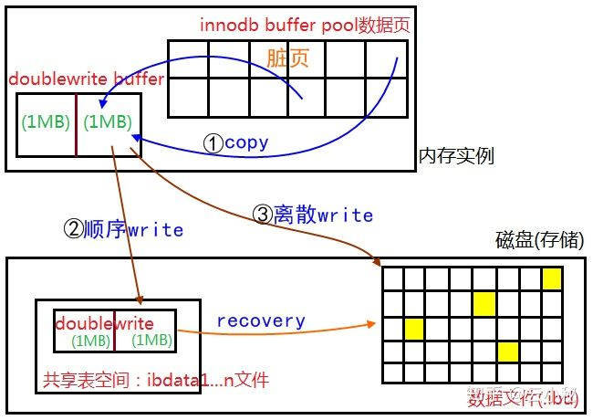

所以在正常的情况下, MySQL写数据page时，**会写两遍到磁盘上，第一遍是写到doublewrite buffer，第二遍是从doublewrite buffer写到真正的数据文件中**。如果发生了极端情况（断电），InnoDB再次启动后，发现了一个page数据已经损坏，那么此时就可以从doublewrite buffer中进行数据恢复了。


#### 故障恢复

InnoDB的数据恢复是一个很复杂的过程，在其恢复过程中，需要redo log、binlog、undo log等参与，这里把InnoDB的恢复过程主要划分为两个阶段，第一阶段主要依赖于redo log的恢复，而第二阶段，恰恰需要binlog和undo log的共同参与.


##### 第一阶段 Redo log恢复

数据库启动后，InnoDB会通过redo log找到最近一次checkpoint的位置，然后根据checkpoint相对应的LSN开始，获取需要重做的日志，接着解析获取的日志并且保存到一个哈希表中，最后通过遍历哈希表中的redo log信息，读取相关页进行恢复。

大致过程如下:

- 打开Redo Logs和系统表空间文件(ibdataN)
- 读取并从中找到最大的Checkpoint LSN
- 从最近的Checkpoint 开始往后扫描Redo Log
- 如果能够找到Redo Log记录，说明还有数据页的更改没有刷新到数据文件上，启动Crash Recovery，使用Redo Log来恢复数据的一致性

InnoDB的checkpoint信息保存在日志文件中，即ib_logfile0的开始2048个字节中，checkpoint有两个，交替更新，checkpoint与日志文件的关系如下图：

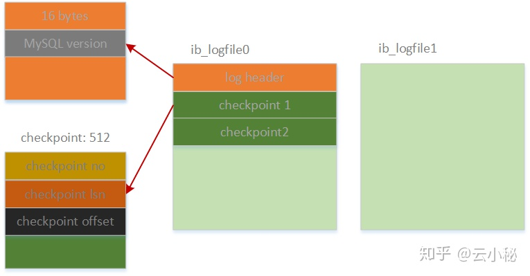

checkpoint信息分别保存在ib_logfile0的512字节和1536字节处，每个checkpoint默认大小为512字节，InnoDB的checkpoint主要有3部分信息组成：

- checkpoint no

checkpoint no主要保存的是checkpoint号，因为InnoDB有两个checkpoint(上图中的checkpoint1和checkpoint2)，通过checkpoint号来判断哪个checkpoint最新

- checkpoint lsn

checkpoint lsn主要记录了产生该checkpoint是flush的LSN(Log Sequence Number)，确保在该LSN前面的数据页都已经落盘，不再需要通过redo log进行恢复。

- checkpoint offset

checkpoint offset主要记录了该checkpoint产生时，redo log在ib_logfile中的偏移量，通过该offset位置就可以找到需要恢复的redo log开始位置。

通过以上checkpoint的信息，我们可以简单得到需要恢复的redo log的位置，然后通过顺序扫描该redo log来读取数据，比如我们通过checkpoint定位到开始恢复的redo log位置在ib_logfile1中的某个位置，那么整个redo log扫描的过程可能是这样的：

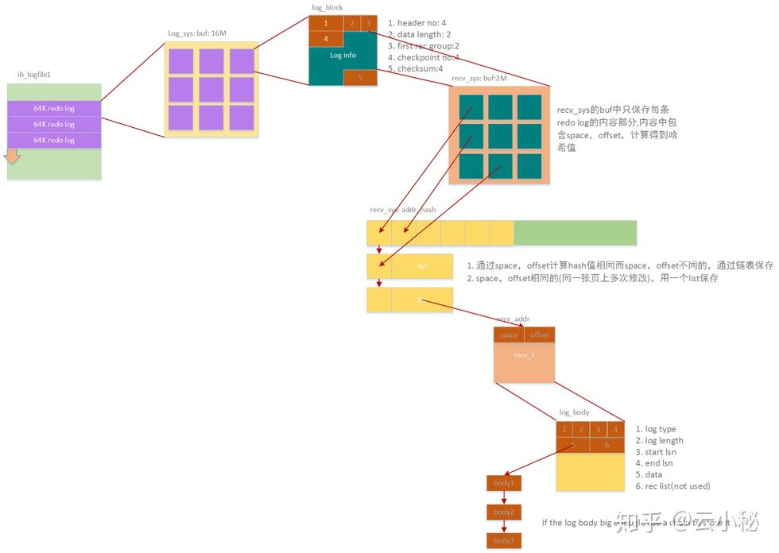

- 从ib_logfile1的指定位置开始读取redo log，每次读取4 * page_size的大小，这里我们默认页面大小为16K，所以每次读取64K的redo log到缓存中，redo log每条记录(block)的大小为512字节
- 读取到缓存中的redo log通过解析、验证等一系列过程后，把redo log的内容部分保存到用于恢复的缓存recv_sys->buf，保存到恢复缓存中的每条信息主要包含两部分：(space,offset)组成的位置信息和具体redo log的内容，我们称之为body
- 同时保存在恢复缓存中的redo信息会根据space，offset计算一个哈希值后保存到一个哈希表(recv_sys->addr_hash)中，相同的哈希值不同(space，offset)用链表存储，相同的(space,offset)用列表保存，可能部分事务比较大，redo信息一个block不能保存，所以，每个body中可以用链表链接多body的值
- redo log被保存到哈希表中之后，InnoDB就可以开始进行数据恢复，只需要轮询哈希表中的每个节点获取redo信息，根据(space,offset)读取指定页面后进行日志覆盖。


redo log全部被解析并且apply完成，整个InnoDB recovery的第一阶段也就结束了，在该阶段中，所有已经被记录到redo log但是没有完成数据刷盘的记录都被重新落盘。然而，InnoDB单靠redo log的恢复是不够的，这样还是有可能会丢失数据(或者说造成主从数据不一致)，因为在事务提交过程中，写binlog和写redo log提交是两个过程，写binlog在前而redo提交在后，如果MySQL写完binlog后，在redo提交之前发生了宕机，这样就会出现问题：binlog中已经包含了该条记录，而redo没有持久化。binlog已经落盘就意味着slave上可以apply该条数据，redo没有持久化则代表了master上该条数据并没有落盘，也不能通过redo进行恢复。这样就造成了主从数据的不一致，换句话说主上丢失了部分数据，那么MySQL又是如何保证在这样的情况下，数据还是一致的？这就需要进行第二阶段恢复。


##### 第二阶段 binlog和undo log恢复

在第二阶段恢复中，需要用到binlog和undo log，其实在该阶段的恢复中，也被划分成两部分

第一部分，根据binlog获取所有可能没有提交事务的xid列表

第二部分，根据undo中的信息构造所有未提交事务链表，最后通过上面两部分协调判断事务是否可以提交。

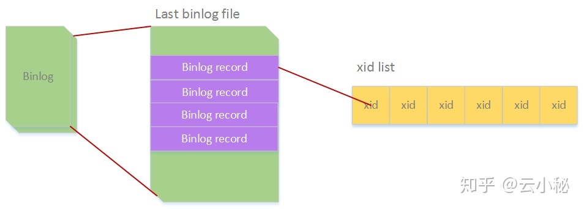

**根据binlog获取xid列表**

如上图中所示，MySQL在第二阶段恢复的时候，先会去读取最后一个binlog文件的所有event信息，然后把xid保存到一个列表中，然后进行第二部分的恢复，如下：

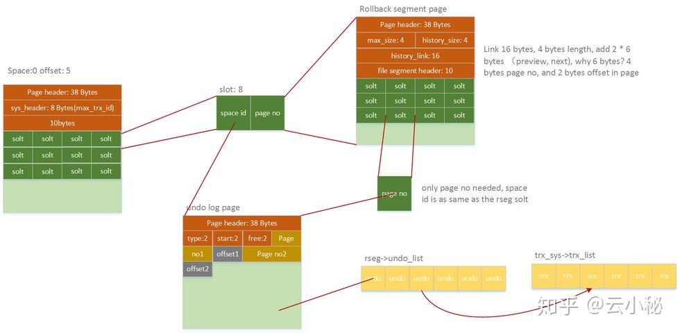


InnoDB当前版本有128个回滚段，每个回滚段中保存了undo log的位置指针，通过扫描undo日志，我们可以构造出还未被提交的事务链表(存在于insert_undo_list和update_undo_lsit中的事务都是未被提交的)，所以通过起始页(0,5)下的solt信息可以定位到回滚段，然后根据回滚段下的undo的slot定位到undo页，把所有的undo信息构建一个undo_list，然后通过undo_list再创建未提交事务链表trx_sys->trx_list。 基于上面两步， 我们已经构建了xid列表和未提交事务列表，那么在这些未提交事务列表中的事务，哪些需要被提交？哪些又该回滚？判断条件很简单：凡是xid在通过binlog构建的xid列表中存在的事务，都需要被提交，换句话说，所有已经记录binlog的事务，需要被提交，而剩下那些没有记录binlog的事务，则需要被回滚。

**流程图**

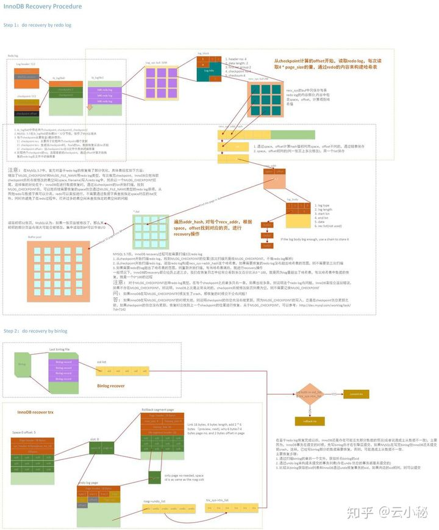


### 实现隔离性

Innodb引擎通过以下方式实现事务的隔离性:

- 事务自动提交(Autocommit)配置
- 隔离级别设置
- 不同隔离级别和相对应的锁机制


#### 隔离级别设置

当数据库上有多个事务同时执行的时候，就可能出现脏读（dirty read）、不可重复读（non-repeatable read）、幻读（phantom read）的问题，为了解决这些问题，就有了“隔离级别”的概念。

隔离性其实比想象的要复杂，简单来说，隔离性的作用就是**保证在多个事务并行执行时，相互之间不会影响**；比如一个事务的修改对其他事务是不可见的，好似多个事务是串行执行的。

在SQL 92标准定义了四个隔离级别，分别包括：

读未提交（READ UNCOMMITTED）、读已提交（READ COMMITTED）、可重复读（REPEATABLE READ）和串行化（SERIALIZABLE）。但是很少有数据库厂商遵循这些标准，比如Oracle数据库就不支持READ UNCOMMITTED和REPEATABLE READ隔离级别。而MySQL支持这全部4种隔离级别。MySQL是支持REPEATABLE READ隔离级别，在这个级别下可以解决“不可重复读”的问题，是真正满足ACID中隔离性的要求的，但锁粒度比READ COMMITTED隔离级别要重。在READ COMMITTED隔离级别下是无法满足隔离性要求的，所以MySQL**默认是REPEATABLE READ（可重复读）隔离级别**。


##### 读未提交

在这个级别，**只加写锁，读不加锁**。那么就会产生这三种情况：读读可以并行、读写可以并行、写读可以并行（**只有写写不可以并行**（因为写上有锁））。所以在这个级别，一个事务的修改，**即使没有提交，对其他事务也都是可见的**。一个事务可以读取另一个事务未提交的数据，这也被称为“脏读（dirty read）”，同样破坏了事务隔离性要求，一个事务的修改对其他事务可见了。这个级别会导致很多问题，如一个事务可以读取到另一个事务的中间状态，且从性能上来说，READ UNCOMMITTED不会比其他的级别好太多，但却缺乏其他级别的很多好处，除非真的有非常必要的理由，在实际应用中一般很少使用。


##### 读已提交

在这个级别，能满足前面提到的隔离性的简单定义：一个事务开始时，**只能“看见”已经提交的事务所做的修改**。换句话说，一个事务从开始直到提交之前，所做的任何修改**对其他事务都是不可见的**，只有事务提交之后才对于其他事务可见。这个级别有时候也叫“不可重复读（non-repeatable read）”，因为两次执行同样的查询，可能会得到不一样的结果。为什么会出现“不可重复读”问题呢？从下面的分析中找答案。

RC隔离级别，针对当前读（还有快照读）保证对读取到的记录加读锁 (记录锁)。因为在RC的事务隔离级别下，除了唯一性的约束检查和外键约束的检查需要Gap Lock外，InnoDB存储引擎不会使用Gap Lock，所以会产生“不可重复读”问题。而不可重复读会破坏事务隔离性要求，也就是一个事务的修改操作对其他事务可见了。


##### 可重复读

可重复读级别解决了“不可重复读”及“幻读”问题，**就是在同一个事务执行期间前后看到的数据必须一致**，MySQL默认使用这个级别。简单说就是在同一个事务中发出同一个SELECT语句两次或更多次，那么产生的结果数据集总是相同的。因此，使用可重复读隔离级别的事务**可以多次检索同一行集，并对它们执行任意操作，直到提交或回滚操作终止该事务**。

基于**读写锁**，可重复读**只能解决读读的并行执行**，并不能使读写、写写、写读的并行执行。注意这是说在读写锁的情况下，但是现在RDBMS都使用MVCC机制了，所以会有所不同。在RR隔离级别，针对当前读（还有快照读），保证对读取到的记录加读锁（行锁），同时保证对读取的范围加锁，也就是说新的满足查询条件的记录不能够插入 (由间隙锁保证)，所以解决了“不可重复读”及“幻读”现象。


##### 串行化

在这个级别，它通过强制事务串行执行，避免了前面说的一系列问题。简单来说就是对同一行记录，“写”会加“写锁”，“读”会加“读锁”。当出现读写锁冲突的时候，**后访问的事务必须等前一个事务执行完成，才能继续执行**。所以可能导致大量的超时和锁争用的问题，实际应用中也很少在本地事务中使用SERIALIABLE隔离级别，主要应用在InnoDB存储引擎的分布式事务中。

SERIALIZABLE事务隔离级别**最严厉**，在进行查询时就会对相关行加上共享锁，其他事务对加“共享锁”的行只能进行读操作，而不能进行写操作。一旦有事务对行加了“独占锁”，其他事务连读都不能操作。

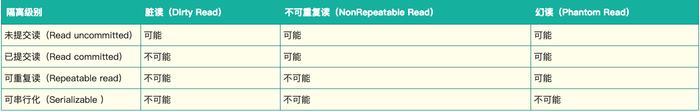


##### 事务隔离的具体实现

**展开说明可重复读**

在实现上，数据库里面会创建一个视图（read-view），访问的时候以**视图的逻辑结果**为准。在“可重复读”隔离级别下，这个视图是在**事务启动时创建的**，整个事务存在期间都用这个视图，即使有其他事务修改了数据，事务中看到的数据仍然跟在启动时看到的一样。在“读提交”隔离级别下，这个视图是在每个 SQL 语句开始执行的时候创建的。这里需要注意的是，“读未提交”隔离级别下直接返回记录上的最新值，没有视图概念；而“串行化”隔离级别下直接用加锁的方式来避免并行访问。

在 MySQL 中，实际上每条记录在更新的时候都会同时记录一条回滚操作。记录上的最新值，通过回滚操作，都可以得到前一个状态的值。

假设一个值从 1 被按顺序改成了 2、3、4，在回滚日志里面就会有类似下面的记录

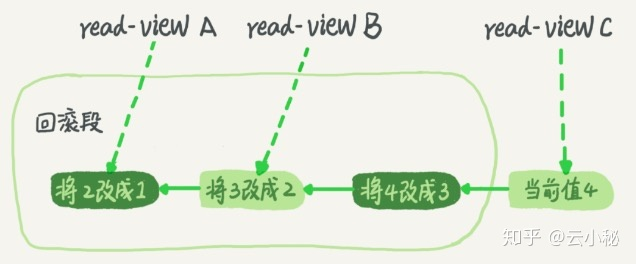

当前值是 4，但是在查询这条记录的时候，不同时刻启动的事务会有不同的 read-view。如图中看到的，在视图 A、B、C 里面，这一个记录的值分别是 1、2、4，同一条记录在系统中可以存在多个版本，就是数据库的多版本并发控制（MVCC）。对于 read-view A，要得到 1，就必须将当前值依次执行图中所有的回滚操作得到。

同时你会发现，即使现在有另外一个事务正在将 4 改成 5，这个事务跟 read-view A、B、C 对应的事务是不会冲突的。你一定会问，回滚日志总不能一直保留吧，什么时候删除呢？答案是，在不需要的时候才删除。也就是说，系统会判断，当没有事务再需要用到这些回滚日志时，回滚日志会被删除。 什么时候才不需要了呢？就是当系统里没有比这个回滚日志更早的 read-view 的时候。

建议不要使用长事务，长事务意味着系统里面会存在很老的事务视图。由于这些事务随时可能访问数据库里面的任何数据，所以这个事务提交之前，数据库里面它可能用到的回滚记录都必须保留，这就会导致大量占用存储空间。

在 MySQL 5.5 及以前的版本，回滚日志是跟数据字典一起放在 ibdata 文件里的，即使长事务最终提交，回滚段被清理，文件也不会变小，当然这个问题在 MySQL 5.7 中已经彻底解决了。我见过数据只有 20GB，而回滚段有 200GB 的库。最终只好为了清理回滚段，重建整个库。 除了对回滚段的影响，长事务还占用锁资源，也可能拖垮整个库。


#### 隔离级别和相对应的锁机制

##### 一次封锁与两段锁

因为有大量的并发访问，为了预防死锁，一般应用中推荐使用一次封锁法，就是在方法的**开始阶段**，已经预先知道会用到哪些数据，然后**全部锁住**，在方法**运行之后，再全部解锁**。这种方式可以有效的避免循环死锁，但在数据库中却不适用，因为在事务开始阶段，数据库并不知道会用到哪些数据。

数据库遵循的是**两段锁协议**，将事务分成两个阶段，**加锁阶段和解锁阶段**（所以叫两段锁）

- 加锁阶段：在该阶段可以进行加锁操作。在对任何数据进行读操作之前要申请并获得S锁（共享锁，其它事务可以继续加共享锁，但不能加排它锁），在进行写操作之前要申请并获得X锁（排它锁，其它事务不能再获得任何锁）。加锁不成功，则事务进入等待状态，直到加锁成功才继续执行。
- 解锁阶段：当事务释放了一个封锁以后，事务进入解锁阶段，在该阶段只能进行解锁操作不能再进行加锁操作。

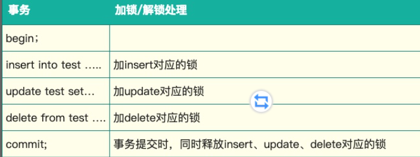

这种方式虽然无法避免死锁，但是两段锁协议可以保证事务的并发调度是串行化（串行化很重要，尤其是在数据恢复和备份的时候）


#### 锁的种类

MySQL中锁的种类很多，有常见的表锁和行锁，也有新加入的Metadata Lock等等,表锁是对一整张表加锁，虽然可分为读锁和写锁，但毕竟是锁住整张表，会导致并发能力下降，一般是做ddl处理时使用。

行锁则是锁住数据行，这种加锁方法比较复杂，但是由于只锁住有限的数据，对于其它数据不加限制，所以并发能力强，MySQL一般都是用**行锁**来处理并发事务。


##### Read Committed (读已提交)

在RC级别中，数据的读取都是不加锁的，但是数据的写入、修改和删除是需要加锁的。效果如下

~~~mysql
MySQL> show create table class_teacher \G\
Table: class_teacher
Create Table: CREATE TABLE `class_teacher` (
  `id` int(11) NOT NULL AUTO_INCREMENT,
  `class_name` varchar(100) COLLATE utf8mb4_unicode_ci NOT NULL,
  `teacher_id` int(11) NOT NULL,
  PRIMARY KEY (`id`),
  KEY `idx_teacher_id` (`teacher_id`)
) ENGINE=InnoDB AUTO_INCREMENT=5 DEFAULT CHARSET=utf8mb4 COLLATE=utf8mb4_unicode_ci
1 row in set (0.02 sec)
MySQL> select * from class_teacher;
+----+--------------+------------+
| id | class_name   | teacher_id |
+----+--------------+------------+
|  1 | 初三一班     |          1 |
|  3 | 初二一班     |          2 |
|  4 | 初二二班     |          2 |
+----+--------------+------------+
~~~


由于MySQL的InnoDB默认是使用的RR（可重复读）级别，所以我们先要将该session开启成RC级别，并且设置binlog的模式

~~~mysql
SET session transaction isolation level read committed;
SET SESSION binlog_format = 'ROW';（或者是MIXED）
~~~

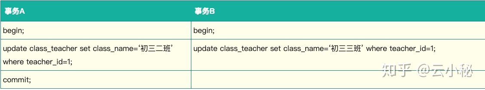

为了防止并发过程中的修改冲突，事务A中MySQL给teacher_id=1的数据行加锁，并一直不commit（释放锁），那么事务B也就一直拿不到该行锁，wait直到超时。

这时我们要注意到，teacher_id是有索引的，如果是没有索引的class_name呢？update class_teacher set teacher_id=3 where class_name = ‘初三一班’; 那么MySQL会给整张表的所有数据行的加行锁。这里听起来有点不可思议，但是当sql运行的过程中，MySQL并不知道哪些数据行是 class_name = ‘初三一班’的（没有索引），如果一个条件无法通过索引快速过滤，存储引擎层面就会将所有记录加锁后返回，再由MySQL Server层进行过滤。

但在实际使用过程当中，MySQL做了一些改进，在MySQL Server过滤条件，发现不满足后，会调用unlock_row方法，把不满足条件的记录释放锁 (违背了二段锁协议的约束)。这样做，保证了最后只会持有满足条件记录上的锁，但是每条记录的加锁操作还是不能省略的。可见即使是MySQL，为了效率也是会违反规范的。（参见《高性能MySQL》中文第三版p181）

这种情况同样适用于MySQL的默认隔离级别RR。所以对一个数据量很大的表做批量修改的时候，如果无法使用相应的索引，MySQL Server过滤数据的的时候特别慢，就会出现虽然没有修改某些行的数据，但是它们还是被锁住了的现象。


##### Repeatable Read（可重读）

这是MySQL中InnoDB默认的隔离级别

###### 读

读就是可重读，可重读这个概念是一事务的多个实例在**并发读取数据时，会看到同样的数据行**，有点抽象，我们来看一下效果

*RC（不可重读）模式下的展现*

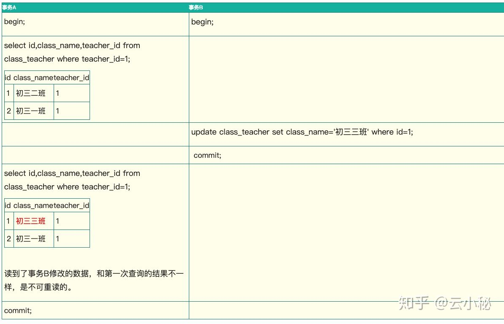

事务B修改id=1的数据提交之后，事务A同样的查询，后一次和前一次的结果不一样，这就是不可重读（重新读取产生的结果不一样）

来看看在RR（可重读）级别中MySQL的表现：


注意到，当teacher_id=1时，事务A先做了一次读取，事务B中间修改了id=1的数据，并commit之后，事务A第二次读到的数据和第一次完全相同。所以说它是可重读的

> RR级别是可重复读的，但无法解决幻读，而只有在Serializable级别才能解决幻读。于是加了一个事务C来展示效果，在事务C中添加了一条teacher_id=1的数据commit，RR级别中应该会有幻读现象，事务A在查询teacher_id=1的数据时会读到事务C新加的数据。但是测试后发现，在MySQL中是不存在这种情况的，在事务C提交后，事务A还是不会读到这条数据。可见在MySQL的RR级别中，是解决了幻读的读问题的

##### 悲观锁

指的是对数据被外界（包括本系统当前的其他事务，以及来自外部系统的事务处理）修改持保守态度，因此，在整个数据处理过程中，将数据处于锁定状态。悲观锁的实现，往往依靠数据库提供的锁机制（也只有数据库层提供的锁机制才能真正保证数据访问的排他性，否则，即使在本系统中实现了加锁机制，也无法保证外部系统不会修改数据）

在悲观锁的情况下，为了保证事务的隔离性，就需要一致性锁定读。**读取数据时给加锁，其它事务无法修改这些数据。修改删除数据时也要加锁，其它事务无法读取这些数据。**


##### 乐观锁

悲观锁大多数情况下依靠数据库的锁机制实现，以保证操作最大程度的独占性。但随之而来的就是数据库性能的大量开销，特别是对长事务而言，这样的开销往往无法承受。

而乐观锁机制在一定程度上解决了这个问题。乐观锁，大多是基于数据版本（ Version ）记录机制实现。何谓数据版本？即为数据增加一个版本标识，在基于数据库表的版本解决方案中，一般是通过为数据库表增加一个 “version” 字段来实现。读取出数据时，将此版本号一同读出，之后更新时，对此版本号加一。此时，将提交数据的版本数据与数据库表对应记录的当前版本信息进行比对，如果提交的数据版本号大于数据库表当前版本号，则予以更新，否则认为是过期数据。


##### MVCC在InnoDB中的实现

在InnoDB中，会在每行数据后添加两个额外的隐藏的值来实现MVCC，这两个值一个记录这行数据何时被创建，另外一个记录这行数据何时过期（或者被删除）。 在实际操作中，存储的并不是时间，而是事务的版本号，每开启一个新事务，事务的版本号就会递增。 在可重读Repeatable reads事务隔离级别下：

- SELECT时，读取创建版本号<=当前事务版本号，删除版本号为空或>当前事务版本号。
- INSERT时，保存当前事务版本号为行的创建版本号
- DELETE时，保存当前事务版本号为行的删除版本号
- UPDATE时，插入一条新纪录，保存当前事务版本号为行创建版本号，同时保存当前事务版本号到原来删除的行

通过MVCC，虽然每行记录都需要额外的存储空间，更多的行检查工作以及一些额外的维护工作，但可以减少锁的使用，大多数读操作都不用加锁，读数据操作很简单，性能很好，并且也能保证只会读取到符合标准的行，也只锁住必要行。

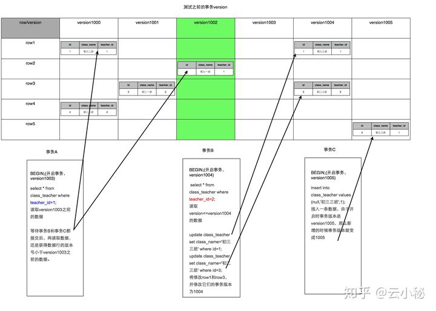


##### “读”与“读”的区别

MySQL中的读，和事务隔离级别中的读，是不一样的

RR级别中，通过MVCC机制，虽然让数据变得可重复读，但我们读到的数据可能是历史数据，是不及时的数据，不是数据库当前的数据

对于这种读取历史数据的方式，我们叫它快照读 (snapshot read)，而读取数据库当前版本数据的方式，叫当前读 (current read)。很显然，在MVCC中

- 快照读：就是select

  select * from table ….;

- 当前读：特殊的读操作，插入/更新/删除操作，属于当前读，处理的都是当前的数据，需要加锁。

事务的隔离级别实际上都是定义了当前读的级别，MySQL为了减少锁处理（包括等待其它锁）的时间，提升并发能力，引入了快照读的概念，使得select不用加锁


##### 写（当前读）

事务的隔离级别中虽然只定义了读数据的要求，实际上这也可以说是写数据的要求

为了解决当前读中的幻读问题，MySQL事务使用了Next-Key锁。

Next-Key锁是**行锁和GAP（间隙锁）**的合并

行锁可以防止不同事务版本的数据修改提交时造成数据冲突的情况。但如何避免别的事务插入数据就成了问题。

RR级别和RC级别的对比

- RC级别：

  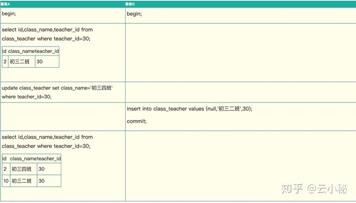

- RR级别

  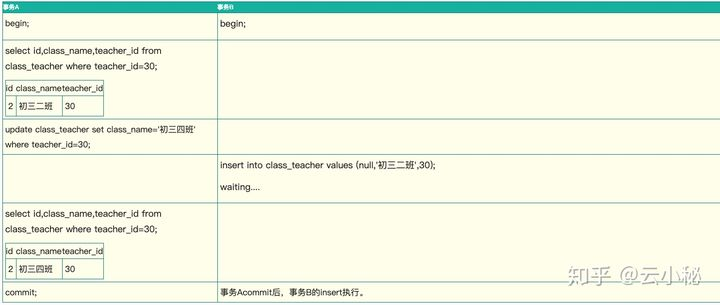

在RC级别中，事务A修改了所有teacher_id=30的数据，但是当事务Binsert进新数据后，事务A发现莫名其妙多了一行teacher_id=30的数据，而且没有被之前的update语句所修改，这就是“当前读”的幻读。

RR级别中，事务A**在update后加锁**，事务B无法插入新数据，这样事务A在update前后读的数据保持一致，避免了幻读。这个锁，就是Gap锁。

行锁防止别的事务修改或删除，GAP锁防止别的事务新增，行锁和GAP锁结合形成的的Next-Key锁共同解决了RR级别在写数据时的幻读问题。


### 实现持久化

ACID中的持久化和具体的硬件配置有很大的关系，因为持久化时的性能和具体的服务器CPU，网络，和硬盘有很大的关系，MySQL中跟持久化有关了的配置主要有:

- doublewrite buffer的打开和关闭
- innodb_flush_log_at_trx_commit的配置
- sync_binlog的配置
- innodb_file_per_table的配置
- 存储设备中的电池备份缓存
- 运行MySQL数据库的操作系统选择，必须要支持fsync() 系统调用
- 运行MySQL的服务器电源使用UPS，保护MySQL服务器和存储设备不会因为断电出现异常
- 对于分布式应用程序，需要考虑应用程序和MySQL数据中心之间的网络


#### doublewrite buffer的打开和关闭

InnoDB doublewrite 机制提高了InnoDB的可靠性，解决了InnoDB部分数据写入失败(即: partial page write页断裂)的问题， 保证了数据的一致性。

double write虽然是一个buffer, 但是它是开在物理文件上的一个buffer, 其实也就是file, 所以它会导致系统有更多的fsync操作, 而硬盘的fsync性能是很慢的, 从而降低mysql的整体性能。

不过 doublewrite buffer写入磁盘共享表空间这个过程是连续存储，是顺序写，性能非常高，(约占写的10%)，牺牲一点写性能来保证数据页的完整还是很有必要的。所以一般建议打开MySQL的doublewrite buffer


#### innodb_flush_log_at_trx_commit的配置

innodb_flush_log_at_trx_commit：是 InnoDB 引擎特有的，ib_logfile的刷新方式（ ib_logfile：记录的是redo log和undo log的信息）， 其取值可以为0， 1， 2

**innodb_flush_log_at_trx_commit=0:** Innodb 中的Log Thread每隔1 秒钟会将log buffer中的数据写入到文件，同时还会通知文件系统进行文件同步的flush 操作，保证数据确实已经写入到磁盘上面的物理文件。但是，每次事务的结束（commit 或者是rollback）并不会触发Log Thread 将log buffer 中的数据写入文件。所以，当设置为0 的时候，当MySQL Crash 和OS Crash 或者主机断电之后，最极端的情况是丢失1 秒时间的数据变更。

**innodb_flush_log_at_trx_commit=1:** Innodb 的默认设置，表示在每次事务提交的时候，都把log buffer刷到文件系统中(os buffer)去，并且调用文件系统的“flush”操作将缓存刷新到磁盘上去。这样的话，数据库对IO的要求就非常高了，如果底层的硬件提供的IOPS比较差，那么MySQL数据库的并发很快就会由于硬件IO的问题而无法提升。

**innodb_flush_log_at_trx_commit=2:** 表示在每次事务提交的时候会把log buffer刷到文件系统中去，但并不会立即刷写到磁盘。如果只是MySQL数据库挂掉了，由于文件系统没有问题，那么对应的事务数据并没有丢失。只有在数据库所在的主机操作系统损坏或者突然掉电的情况下，数据库的事务数据可能丢失1秒之类的事务数据。这样的好处，减少了事务数据丢失的概率，而对底层硬件的IO要求也没有那么高(log buffer写到文件系统中，一般只是从log buffer的内存转移的文件系统的内存缓存中，对底层IO没有压力)。

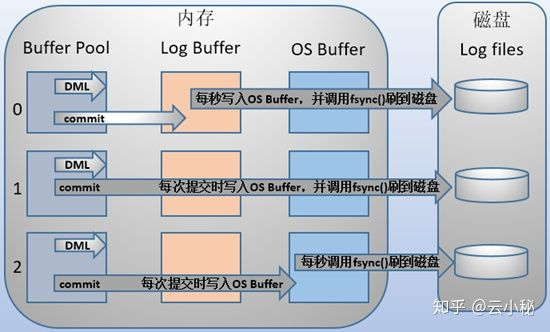


#### sync_binlog的配置

sync_binlog: 是MySQL 的二进制日志（binary log）同步到磁盘的频率。其可取的值是: 0 ~ N

**sync_binlog=0:** 当事务提交之后，MySQL不做fsync之类的磁盘同步指令刷新binlog_cache中的信息到磁盘，而让Filesystem自行决定什么时候来做同步，或者cache满了之后才同步到磁盘。这个是性能最好的。

**sync_binlog=1:** 当每进行1次事务提交之后，MySQL将进行一次fsync之类的磁盘同步指令来将binlog_cache中的数据强制写入磁盘。

**sync_binlog=N:** 当每进行n次事务提交之后，MySQL将进行一次fsync之类的磁盘同步指令来将binlog_cache中的数据强制写入磁盘。

大多数情况下，对数据的一致性并没有很严格的要求，所以并不会把 sync_binlog 配置成 1. 为了追求高并发，提升性能，可以设置为 100 或直接用 0. 而和 innodb_flush_log_at_trx_commit 一样，对于支付服务这样的应用，还是比较推荐 sync_binlog = 1.


#### innodb_file_per_table的配置

Innodb存储引擎可将所有数据存放于ibdata*的共享表空间，也可将每张表存放于独立的.ibd文件的独立表空间。共享表空间以及独立表空间都是针对数据的存储方式而言的。


##### 共享表空间

某一个数据库的所有的表数据，索引文件全部放在一个文件中，默认这个共享表空间的文件路径在data目录下。 默认的文件名为:ibdata1 初始化为10M。这个表空间可以由很多个文件组成，一个表可以跨多个文件存在，所以其大小限制不再是文件大小的限制，而是其自身的限制。从Innodb的官方文档中可以看到，其表空间的最大限制为64TB，也就是说，Innodb的单表限制基本上也在64TB左右了，当然这个大小是包括这个表的所有索引等其他相关数据。

- **共享表空间的优点**

1) 可以将表空间分成多个文件存放到各个磁盘上（表空间文件大小不受表大小的限制，如一个表可以分布在不同的文件上）。2) 数据和文件放在一起方便管理。

- **共享表空间的缺点**

1) 所有的数据和索引存放到一个文件，虽然可以把一个大文件分成多个小文件，但是多个表及索引在表空间中混合存储，当数据量非常大的时候，表做了大量删除操作后表空间中将会有大量的空隙，特别是对于统计分析，对于经常删除操作的这类应用最不适合用共享表空间。 2) 共享表空间分配后不能回缩：当出现临时建索引或是创建一个临时表的操作表空间扩大后，就是删除相关的表也没办法回缩那部分空间了（可以理解为oracle的表空间10G，但是才使用10M，但是操作系统显示mysql的表空间为10G），进行数据库的冷备很慢；


##### 独立表空间

每一个表都将会生成以独立的文件方式来进行存储，每一个表都有一个.frm表描述文件，还有一个.ibd文件。 其中这个文件包括了单独一个表的数据内容以及索引内容，默认情况下它的存储位置也是在表的位置之中。

- **独立表空间的优点**

1) 每个表都有自已独立的表空间。

2) 每个表的数据和索引都会存在自已的表空间中。

3) 可以实现单表在不同的数据库中移动。

4) 空间可以回收（除drop table操作处，表空间不能自已回收）

i: Drop table操作自动回收表空间，如果对于统计分析或是日值表，删除大量数据后可以通过:alter table TableName engine=innodb;回缩不用的空间。

ii: 对于使innodb-plugin的Innodb使用turncate table也会使空间收缩

iii: 对于使用独立表空间的表，不管怎么删除，表空间的碎片不会太严重的影响性能，而且还有机会处理。

- **独立表空间的缺点**

1) 单表增加过大，当单表占用空间过大时，存储空间不足，只能从操作系统层面思考解决方法

2) 单表增加过大，如超过100个G，相比较之下，使用独占表空间的效率以及性能会更高一点。