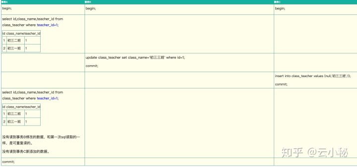

# MySQL事务ACID

[TOC]

**事务，就是一个操作序列 ，这些操作要么都执行，要么都不执行，它是一个不可分割的工作单位， ACID又是事务的四大特性**![[]MySQL事务ACID详解](images/v2-81e17a7fa76e997ff7e7e826b7c521bb_r.jpg)


## 概念

ACID，是指在可靠数据库管理系统（DBMS）中，事务(transaction)所应该具有的四个特性：原子性（Atomicity）、一致性（Consistency）、隔离性（Isolation）、持久性（Durability）


### 原子性

**一个事务必须被视为一个不可分割的最小工作单元**，整个事务中的所有操作要么全部提交成功，要么全部失败回滚，对于一个事务来说，不可能只执行其中的一部分操作。实现事务的原子性，数据库要支持回滚操作，在事务中某个操作失败后，回滚到事务之前的状态。大多数数据库实现事务时，事务操作的数据是在事务相关的数据快照上，并不是真正修改实际的数据，如果有错不提交即可。而其他一些只支持简单事务的数据库系统中，事务更新数据不在快照上，而是直接操作实际数据，则系统需要先预演一遍所有要执行的操作，如果失败，事务相关的所有操作都不会被执行。


### 一致性

一致性是指事务必须使数据库从一个一致性状态变换到另一个一致性状态，也就是说一个**事务执行之前和执行之后都必须处于一致性状态**。

如转账的栗子: 假设用户A和用户B两者的钱加起来一共是5000，那么不管A和B之间如何转账，转几次账，事务结束后两个用户的钱相加起来应该还得是5000，这就是事务的一致性。

事务的一致性决定了一个系统设计和实现的复杂度，因为事务可以有不同程度的一致性：

- 强一致性: 无论更新操作实在哪一个数据副本执行，之后所有的读操作都能获得最新的数据。
- 弱一致性: 提交的更新操作，不一定立即会被读操作读到，需要一段时间，此种情况会存在一个不一致窗口。
- 最终一致性: 是弱一致性的特例。事务更新一份数据，最终一致性保证在没有其他事务更新同样的值的话，最终所有的事务都会读到之前事务更新的最新值。如果没有错误发生，不一致窗口的大小依赖于：通信延迟，系统负载等。


### 隔离性

隔离性是当多个用户并发访问数据库时，比如操作同一张表，数据库为每一个用户开启的事务，**不能被其他事务的操作所干扰，多个并发事务之间要相互隔离**。

当前大多数数据库都提供了不同级别的事务隔离，之后便会产生不同的问题，一般会出现的问题主要有:

#### 脏读

脏读是指在一个事务处理过程里**读取了另一个未提交的事务中的数据**。当一个事务A正在多次修改某个数据，而在这个事务中这多次的修改都还未提交，这时另外一个并发的事务B来访问该数据，将会**获取到事务A中没有提交的数据**， 从而最终造成两个事务得到的数据不一致。

如: 张三有500块钱，现在给李四转100块钱，这个事务中的SQL涉及到两个操作:1、 A账户减100块钱

```text
update account set money=money - 100 where name=’张三’;
```

2、 B账户加100块钱

```text
update account set money=money+100 where name=’李四’;
```

我们假设事务A执行转账，刚执行完第一条SQL语句，此时，另外一个事务B来查询张三账户的钱，那么获取到的是400块钱。但是事务A执行第二条语句的时候出现了问题，事务A进行了回滚，那么事实上张三账户的钱应该是500块钱，而不是400块钱，从而出现了脏读。

#### 不可重复读

不可重复读是指在对于数据库中的某个数据，**一个事务范围内多次查询却返回了不同的数据值，这是由于在查询间隔，被另一个事务修改并提交了**。

例如事务T1在读取某一数据，而事务T2**立马修改了这个数据并且提交事务给数据库**，事务T1再次读取该数据就得到了不同的结果，发生了不可重复读。

不可重复读和脏读的区别是，脏读是某一事务读取了另一个事务未提交的脏数据，而不可重复读则是**读取了前一事务提交的数据**。

#### 幻读

幻读，是指当**事务不是独立执行时发生的一种现象**。

例如事务T1对一个表中所有的行的某个数据项做了从“1”修改为“2”的操作，这时事务T2又对这个表中插入了一行数据项，而这个数据项的数值还是为“1”并且提交给数据库。而**操作事务T1的用户如果再查看刚刚修改的数据，会发现还有一行没有修改，其实这行是从事务T2中添加的**，就好像产生幻觉一样，这就是发生了幻读。

幻读和不可重复读都是**读取了另一条已经提交的事务**（这点就脏读不同，脏读是读取未提交的事务中的数据），所不同的是**不可重复读查询的都是同一个数据项**，而幻读**针对的是一批数据整体（比如数据的个数）**。


> 不可重读和幻读的区别
>
> 不可重复读重点在于update和delete，而幻读的重点在于insert。
>
> 如果使用锁机制来实现这两种隔离级别，在可重复读中，该sql第一次读取到数据后，就将这些数据加锁，其它事务无法修改这些数据，就可以实现可重复读了。但这种方法**却无法锁住insert的数据**，所以当事务A先前读取了数据，或者修改了全部数据，事务B还是可以insert数据提交，这时事务A就会发现莫名其妙多了一条之前没有的数据，这就是**幻读，不能通过行锁来避免**。需要Serializable隔离级别 ，**读用读锁，写用写锁，读锁和写锁互斥**，这么做可以有效的避免幻读、不可重复读、脏读等问题，但会极大的降低数据库的并发能力。
>
> 不可重复读和幻读最大的区别，就在于**如何通过锁机制来解决他们产生的问题**


#### 丢失更新

两个事务同时读取同一条记录，A先修改记录，B也修改记录（B是不知道A修改过），B提交数据后B的修改结果覆盖了A的修改结果。


### 持久性

持久性是指一个事务一旦被提交了，那么对数据库中的数据的改变就是永久性的，即便发生宕机，仍然可以依靠事物日志完成数据的持久化


## 实现机制

> redo log用来保证事务的原子性和持久性（redo+binlog两阶段提交具有crash-safe能力，保证持久性），undo log保证事务的一致性，

### 实现原子性

回滚日志保证原子性


### 实现一致性

重做日志


### 实现隔离性

Innodb引擎通过以下方式实现事务的隔离性:

- 事务自动提交(Autocommit)配置
- 隔离级别设置
- 不同隔离级别和相对应的锁机制


#### 四大隔离级别

当数据库上有多个事务同时执行的时候，就可能出现脏读（dirty read）、不可重复读（non-repeatable read）、幻读（phantom read）的问题，为了解决这些问题，就有了“隔离级别”的概念。

隔离性其实比想象的要复杂，简单来说，隔离性的作用就是**保证在多个事务并行执行时，相互之间不会影响**；比如一个事务的修改对其他事务是不可见的，好似多个事务是串行执行的。

在SQL 92标准定义了四个隔离级别，分别包括：

读未提交（READ UNCOMMITTED）、读已提交（READ COMMITTED）、可重复读（REPEATABLE READ）和串行化（SERIALIZABLE）。但是很少有数据库厂商遵循这些标准，比如Oracle数据库就不支持READ UNCOMMITTED和REPEATABLE READ隔离级别。而MySQL支持这全部4种隔离级别。MySQL是支持REPEATABLE READ隔离级别，在这个级别下可以解决“不可重复读”的问题，是真正满足ACID中隔离性的要求的，但锁粒度比READ COMMITTED隔离级别要重。在READ COMMITTED隔离级别下是无法满足隔离性要求的，所以MySQL**默认是REPEATABLE READ（可重复读）隔离级别**。


##### 读未提交（READ UNCOMMITTED）

在这个级别，**只加写锁，读不加锁**。那么就会产生这三种情况：读读可以并行、读写可以并行、写读可以并行（**只有写写不可以并行**（因为写上有锁））。所以在这个级别，一个事务的修改，**即使没有提交，对其他事务也都是可见的**。一个事务可以读取另一个事务未提交的数据，这也被称为“脏读（dirty read）”，同样破坏了事务隔离性要求，一个事务的修改对其他事务可见了。这个级别会导致很多问题，如一个事务可以读取到另一个事务的中间状态，且从性能上来说，READ UNCOMMITTED不会比其他的级别好太多，但却缺乏其他级别的很多好处，除非真的有非常必要的理由，在实际应用中一般很少使用。


##### 读已提交（READ COMMITTED）

在这个级别，能满足前面提到的隔离性的简单定义：一个事务开始时，**只能“看见”已经提交的事务所做的修改**。换句话说，一个事务从开始直到提交之前，所做的任何修改**对其他事务都是不可见的**，只有事务提交之后才对于其他事务可见。这个级别有时候也叫“不可重复读（non-repeatable read）”，因为两次执行同样的查询，可能会得到不一样的结果。为什么会出现“不可重复读”问题呢？从下面的分析中找答案。

RC隔离级别，针对当前读（还有快照读）保证对读取到的记录加读锁 (记录锁)。因为在RC的事务隔离级别下，除了唯一性的约束检查和外键约束的检查需要Gap Lock外，InnoDB存储引擎不会使用Gap Lock，所以会产生“不可重复读”问题。而不可重复读会破坏事务隔离性要求，也就是一个事务的修改操作对其他事务可见了。


##### 可重复读（REPEATABLE READ）

可重复读级别解决了“不可重复读”及“幻读”问题，**就是在同一个事务执行期间前后看到的数据必须一致**，MySQL默认使用这个级别。简单说就是在同一个事务中发出同一个SELECT语句两次或更多次，那么产生的结果数据集总是相同的。因此，使用可重复读隔离级别的事务**可以多次检索同一行集，并对它们执行任意操作，直到提交或回滚操作终止该事务**。


基于**读写锁**，可重复读**只能解决读读的并行执行**，并**不能使读写、写写、写读的并行执行**。注意这是说在读写锁的情况下，但是现在RDBMS都使用MVCC机制了，所以会有所不同。在RR隔离级别，针对当前读（还有快照读），保证对读取到的记录加读锁（行锁），同时保证对读取的范围加锁，也就是说新的满足查询条件的记录不能够插入 (由间隙锁保证)，所以解决了“不可重复读”及“脏读”现象。

注意，对于select（快照读）不会产生幻读，但对于update（当前读）会产生幻读。


##### 串行化（SERIALIZABLE）

在这个级别，它通过强制事务串行执行，避免了前面说的一系列问题。简单来说就是对同一行记录，“写”会加“写锁”，“读”会加“读锁”。当出现读写锁冲突的时候，**后访问的事务必须等前一个事务执行完成，才能继续执行**。所以可能导致大量的超时和锁争用的问题，实际应用中也很少在本地事务中使用SERIALIABLE隔离级别，主要应用在InnoDB存储引擎的分布式事务中。

SERIALIZABLE事务隔离级别**最严厉**，在进行查询时就会对相关行加上共享锁，其他事务对加“共享锁”的行只能进行读操作，而不能进行写操作。一旦有事务对行加了“独占锁”，其他事务连读都不能操作。

解决幻读也可以用MVCC+间隙锁


##### 事务隔离的具体实现

**展开说明可重复读**

在实现上，数据库里面会创建一个视图（read-view），访问的时候以**视图的逻辑结果**为准。在“可重复读”隔离级别下，这个视图是在**事务启动时创建的**，整个事务存在期间都用这个视图，即使有其他事务修改了数据，事务中看到的数据仍然跟在启动时看到的一样。在“读提交”隔离级别下，这个视图是在每个 SQL 语句开始执行的时候创建的。这里需要注意的是，“读未提交”隔离级别下直接返回记录上的最新值，没有视图概念；而“串行化”隔离级别下直接用加锁的方式来避免并行访问。

在 MySQL 中，实际上每条记录在更新的时候都会同时记录一条回滚操作。记录上的最新值，通过回滚操作，都可以得到前一个状态的值。

假设一个值从 1 被按顺序改成了 2、3、4，在回滚日志里面就会有类似下面的记录


当前值是 4，但是在查询这条记录的时候，不同时刻启动的事务会有不同的 read-view。如图中看到的，在视图 A、B、C 里面，这一个记录的值分别是 1、2、4，同一条记录在系统中可以存在多个版本，就是数据库的多版本并发控制（MVCC）。对于 read-view A，要得到 1，就必须将当前值依次执行图中所有的回滚操作得到。

同时你会发现，即使现在有另外一个事务正在将 4 改成 5，这个事务跟 read-view A、B、C 对应的事务是不会冲突的。你一定会问，回滚日志总不能一直保留吧，什么时候删除呢？答案是，在不需要的时候才删除。也就是说，系统会判断，当没有事务再需要用到这些回滚日志时，回滚日志会被删除。 什么时候才不需要了呢？就是当系统里没有比这个回滚日志更早的 read-view 的时候。

建议不要使用长事务，长事务意味着系统里面会存在很老的事务视图。由于这些事务随时可能访问数据库里面的任何数据，所以这个事务提交之前，数据库里面它可能用到的回滚记录都必须保留，这就会导致大量占用存储空间。

在 MySQL 5.5 及以前的版本，回滚日志是跟数据字典一起放在 ibdata 文件里的，即使长事务最终提交，回滚段被清理，文件也不会变小，当然这个问题在 MySQL 5.7 中已经彻底解决了。我见过数据只有 20GB，而回滚段有 200GB 的库。最终只好为了清理回滚段，重建整个库。 除了对回滚段的影响，长事务还占用锁资源，也可能拖垮整个库。


#### 隔离级别和相对应的锁机制

##### 一次封锁与两段锁

因为有大量的并发访问，为了预防死锁，一般应用中推荐使用一次封锁法，就是在方法的**开始阶段**，已经预先知道会用到哪些数据，然后**全部锁住**，在方法**运行之后，再全部解锁**。这种方式可以有效的避免循环死锁，但在数据库中却不适用，因为在事务开始阶段，数据库并不知道会用到哪些数据。

数据库遵循的是**两段锁协议**，将事务分成两个阶段，**加锁阶段和解锁阶段**（所以叫两段锁）

- 加锁阶段：在该阶段可以进行加锁操作。在对任何数据进行读操作之前要申请并获得S锁（共享锁，其它事务可以继续加共享锁，但不能加排它锁），在进行写操作之前要申请并获得X锁（排它锁，其它事务不能再获得任何锁）。加锁不成功，则事务进入等待状态，直到加锁成功才继续执行。
- 解锁阶段：当事务释放了一个封锁以后，事务进入解锁阶段，在该阶段只能进行解锁操作不能再进行加锁操作。


这种方式虽然无法避免死锁，但是两段锁协议可以保证事务的并发调度是串行化（串行化很重要，尤其是在数据恢复和备份的时候）


#### 锁的种类

MySQL中锁的种类很多，有常见的表锁和行锁，也有新加入的Metadata Lock等等,表锁是对一整张表加锁，虽然可分为读锁和写锁，但毕竟是锁住整张表，会导致并发能力下降，一般是做ddl处理时使用。

行锁则是锁住数据行，这种加锁方法比较复杂，但是由于只锁住有限的数据，对于其它数据不加限制，所以并发能力强，MySQL一般都是用**行锁**来处理并发事务。


##### Read Committed (读已提交)

在RC级别中，数据的读取都是不加锁的，但是**数据的写入、修改和删除是需要加锁的**。效果如下

~~~mysql
MySQL> show create table class_teacher \G\
Table: class_teacher
Create Table: CREATE TABLE `class_teacher` (
  `id` int(11) NOT NULL AUTO_INCREMENT,
  `class_name` varchar(100) COLLATE utf8mb4_unicode_ci NOT NULL,
  `teacher_id` int(11) NOT NULL,
  PRIMARY KEY (`id`),
  KEY `idx_teacher_id` (`teacher_id`)
) ENGINE=InnoDB AUTO_INCREMENT=5 DEFAULT CHARSET=utf8mb4 COLLATE=utf8mb4_unicode_ci
1 row in set (0.02 sec)
MySQL> select * from class_teacher;
+----+--------------+------------+
| id | class_name   | teacher_id |
+----+--------------+------------+
|  1 | 初三一班     |          1 |
|  3 | 初二一班     |          2 |
|  4 | 初二二班     |          2 |
+----+--------------+------------+
~~~


由于MySQL的InnoDB默认是使用的RR（可重复读）级别，所以我们先要将该session开启成RC级别，并且设置binlog的模式

~~~mysql
SET session transaction isolation level read committed;
SET SESSION binlog_format = 'ROW';（或者是MIXED）
~~~


为了防止并发过程中的修改冲突，事务A中MySQL给teacher_id=1的数据行加锁，并一直不commit（释放锁），那么事务B也就一直拿不到该行锁，wait直到超时。

这时我们要注意到，teacher_id是有索引的，如果是没有索引的class_name呢？update class_teacher set teacher_id=3 where class_name = ‘初三一班’; 那么MySQL会给整张表的所有数据行的加行锁。这里听起来有点不可思议，但是当sql运行的过程中，MySQL并不知道哪些数据行是 class_name = ‘初三一班’的（没有索引），如果一个条件无法通过索引快速过滤，存储引擎层面就会将所有记录加锁后返回，再由MySQL Server层进行过滤。

但在实际使用过程当中，MySQL做了一些改进，在MySQL Server过滤条件，发现不满足后，会调用unlock_row方法，把不满足条件的记录释放锁 (违背了二段锁协议的约束)。这样做，保证了最后只会持有满足条件记录上的锁，但是每条记录的加锁操作还是不能省略的。可见即使是MySQL，为了效率也是会违反规范的。（参见《高性能MySQL》中文第三版p181）

这种情况同样适用于MySQL的默认隔离级别RR。所以对一个数据量很大的表做批量修改的时候，如果无法使用相应的索引，MySQL Server过滤数据的的时候特别慢，就会出现虽然没有修改某些行的数据，但是它们还是被锁住了的现象。


##### Repeatable Read（可重读）

这是MySQL中InnoDB默认的隔离级别

###### 读

读就是可重读，可重读这个概念是一事务的多个实例在**并发读取数据时，会看到同样的数据行**，有点抽象，我们来看一下效果

*RC（不可重读）模式下的展现*


事务B修改id=1的数据提交之后，事务A同样的查询，后一次和前一次的结果不一样，这就是不可重读（重新读取产生的结果不一样）

来看看在RR（可重读）级别中MySQL的表现：



注意到，当teacher_id=1时，事务A先做了一次读取，事务B中间修改了id=1的数据，并commit之后，事务A第二次读到的数据和第一次完全相同。所以说它是可重读的

> RR级别是可重复读的，但无法解决幻读，而只有在Serializable级别才能解决幻读。于是加了一个事务C来展示效果，在事务C中添加了一条teacher_id=1的数据commit，RR级别中应该会有幻读现象，事务A在查询teacher_id=1的数据时会读到事务C新加的数据。但是测试后发现，在MySQL中是不存在这种情况的，在事务C提交后，事务A还是不会读到这条数据。可见在MySQL的RR级别中，是解决了幻读的读问题的

##### 悲观锁

指的是对数据被外界（包括本系统当前的其他事务，以及来自外部系统的事务处理）修改持保守态度，因此，在整个数据处理过程中，将数据处于锁定状态。悲观锁的实现，往往依靠数据库提供的锁机制（也只有数据库层提供的锁机制才能真正保证数据访问的排他性，否则，即使在本系统中实现了加锁机制，也无法保证外部系统不会修改数据）

在悲观锁的情况下，为了保证事务的隔离性，就需要一致性锁定读。**读取数据时给加锁，其它事务无法修改这些数据。修改删除数据时也要加锁，其它事务无法读取这些数据。**


##### 乐观锁

悲观锁大多数情况下依靠数据库的锁机制实现，以保证操作最大程度的独占性。但随之而来的就是数据库性能的大量开销，特别是对长事务而言，这样的开销往往无法承受。

而乐观锁机制在一定程度上解决了这个问题。乐观锁，大多是基于数据版本（ Version ）记录机制实现。何谓数据版本？即为数据增加一个版本标识，在基于数据库表的版本解决方案中，一般是通过为数据库表增加一个 “version” 字段来实现。读取出数据时，将此版本号一同读出，之后更新时，对此版本号加一。此时，将提交数据的版本数据与数据库表对应记录的当前版本信息进行比对，如果提交的数据版本号大于数据库表当前版本号，则予以更新，否则认为是过期数据。


##### MVCC在InnoDB中的实现

在InnoDB中，会在每行数据后添加两个额外的隐藏的值来实现MVCC，这两个值一个记录这行数据**何时被创建**，另外一个记录这行数据**何时过期**（或者被删除）。 在实际操作中，存储的并不是时间，而是事务的**版本号**，每开启一个新事务，事务的版本号就会递增。 在可重读Repeatable reads事务隔离级别下：

- SELECT时，读取创建版本号<=当前事务版本号，删除版本号为空或>当前事务版本号。
- INSERT时，保存当前事务版本号为行的创建版本号
- DELETE时，保存当前事务版本号为行的删除版本号
- UPDATE时，插入一条新纪录，保存当前事务版本号为行创建版本号，同时保存当前事务版本号到原来删除的行

通过MVCC，虽然每行记录都需要额外的存储空间，更多的行检查工作以及一些额外的维护工作，但可以减少锁的使用，大多数读操作都不用加锁，读数据操作很简单，性能很好，并且也能保证只会读取到符合标准的行，也只锁住必要行。


##### “读”与“读”的区别

MySQL中的读，和事务隔离级别中的读，是不一样的

RR级别中，通过MVCC机制，虽然让数据变得可重复读，但我们读到的数据可能是历史数据，是不及时的数据，不是数据库当前的数据

 **MVCC使用快照读和当前读解决可重复读**

对于这种读取历史数据的方式，我们叫它快照读 (snapshot read)，而读取数据库当前版本数据的方式，叫当前读 (current read)。很显然，在MVCC中


- 快照读：当执行select操作， innodb默认会执行快照读，会记录下这个select后的结果，之后select的时候就会返回这次快照的数据，即使其他事务提交了不会影响当前select的数据，这就实现了可重复读了

  

- 当前读：对于会对数据修改的操作（update,insert,delete）都是采用当前读的模式。在执行这几个操作时会读取最新的版本号记录，写操作后把版本号改为了当前事务的版本号，所以即使是被其他的事务提交的数据也可以查询到。假设要update一条数据，但是在另一个事务中已经delete掉这条数据并且commit了，如果update就会产生冲突，所以在update的时候需要知道最新的数据，也正是因为这样才导致幻读。

事务的隔离级别实际上都是定义了当前读的级别，MySQL为了减少锁处理（包括等待其它锁）的时间，提升并发能力，引入了快照读的概念，使得select不用加锁


##### 写（当前读）

事务的隔离级别中虽然只定义了读数据的要求，实际上这也可以说是写数据的要求

**为了解决当前读中的幻读问题，MySQL事务使用了Next-Key锁。**

Next-Key锁是**行锁（Record Lock，在唯一索引查询的时候才会用行锁）和GAP（间隙锁，锁定一个范围，但不包括记录本身，为了防止同一事务的两次当前读，出现幻读的情况）**的合并

行锁可以防止不同事务版本的数据修改提交时造成数据冲突的情况。但如何避免别的事务插入数据就成了问题。

RR级别和RC级别的对比

- RC级别：

  

- RR级别

  

在RC级别中，事务A修改了所有teacher_id=30的数据，但是当事务Binsert进新数据后，事务A发现莫名其妙多了一行teacher_id=30的数据，而且没有被之前的update语句所修改，这就是“当前读”的幻读。

RR级别中，事务A**在update后加锁**，事务B无法插入新数据，这样事务A在update前后读的数据保持一致，避免了幻读。这个锁，就是Gap锁。

行锁防止别的事务修改或删除，GAP锁防止别的事务新增，行锁和GAP锁结合形成的的Next-Key锁共同解决了RR级别在写数据时的幻读问题。


### 实现持久化

InnoDB使用重做日志保证一致性与持久性