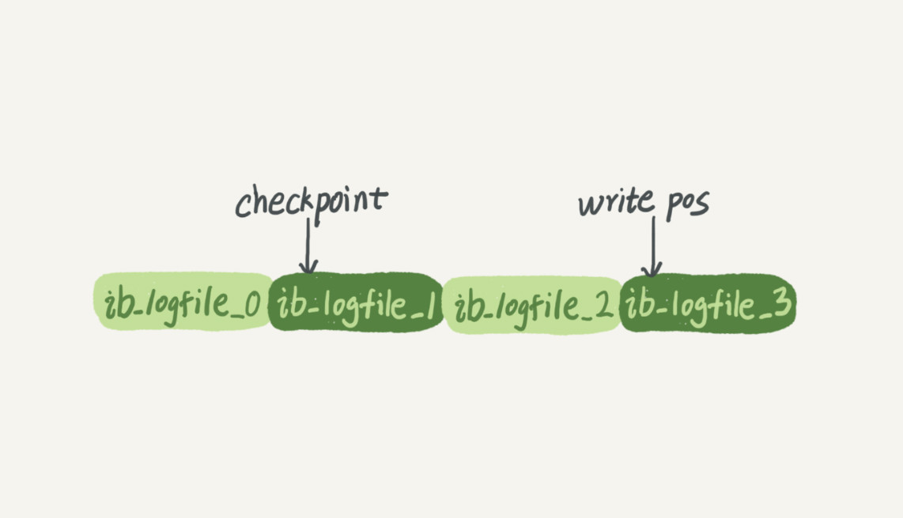
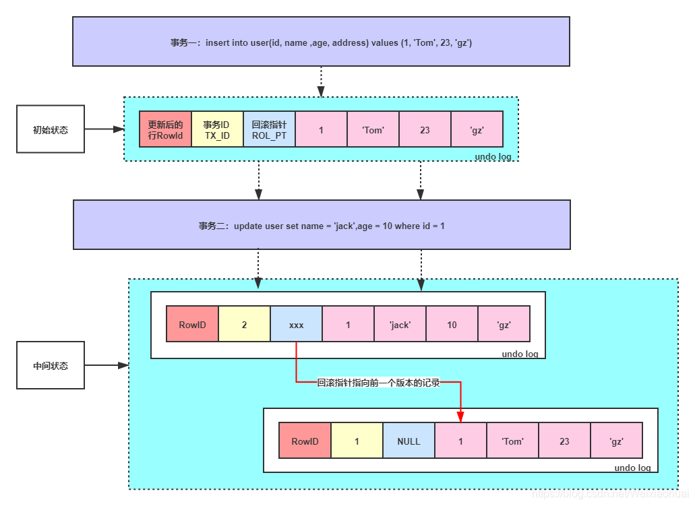

# MySQL日志

[TOC]


## 分类

- 错误日志
- 查询日志
- 慢查询日志
- 事务日志(Redo & Undo)
- 二进制日志(Bin)
- 中继日志


## 慢查询日志

慢查询会导致CPU，IOPS，内存消耗过高。当数据库遇到性能瓶颈时，大部分时间都是由于慢查询导致的。 开启慢查询日志，可以让MySQL记录下查询超过指定时间的语句，之后运维人员通过定位分析，能够很好的优化数据库性能。

慢查询日志记录的慢查询不仅仅是执行比较慢的SELECT语句，还有INSERT，DELETE，UPDATE，CALL等DML操作，只要超过了指定时间，都可以称为"慢查询"，被记录到慢查询日志中。

默认情况下，慢查询日志是不开启的，只有手动开启了，慢查询才会被记录到慢查询日志中。

- slow_query_log: 慢查询开关，表示是否打开慢查询日志

~~~mysql
mysql> show variables like "%slow%";
+---------------------------+-------------------------------------------------+
| Variable_name             | Value                                           |
+---------------------------+-------------------------------------------------+
| log_slow_admin_statements | OFF                                             |
| log_slow_slave_statements | OFF                                             |
| slow_launch_time          | 2                                               |
| slow_query_log            | OFF                                             |
| slow_query_log_file       | /var/lib/mysql/iz2zeaf3cg1099kiidi06mz-slow.log |
+---------------------------+-------------------------------------------------+
5 rows in set (0.00 sec)

# 打开慢查询
mysql> set global slow_query_log='ON';
Query OK, 0 rows affected (0.00 sec)


mysql> show variables like "slow_query_log";
+---------------------------+-------------------------------------------------+
| Variable_name             | Value                                           |
+---------------------------+-------------------------------------------------+                                        |
| slow_query_log            | ON                                              |
| slow_query_log_file       | /var/lib/mysql/iz2zeaf3cg1099kiidi06mz-slow.log |
+---------------------------+-------------------------------------------------+
2   rows in set (0.00 sec)
~~~

> 但是使用 set global slow_query_log='ON' 开启慢查询日志，只是对当前数据库有效，如果MySQL数据库重启后就会失效。所以如果要永久生效，就要修改配置文件 my.cnf (其他系统变量也是如此)，如下：

```mysql
[mysqld]
slow_query_log=1
```

- long_query_time: 慢查询指定时间设置，表示"多长时间的查询"被认定为"慢查询"，单位是秒(s)，默认是10s，即超过10s的查询都被认定为慢查询。

~~~mysql
mysql> show variables like 'long_query_time';
+-----------------+-----------+
| Variable_name   | Value     |
+-----------------+-----------+
| long_query_time | 10.000000 |
+-----------------+-----------+
1 row in set (0.00 sec)

# 设置慢查询时间
mysql> set global long_query_time=0.05;
Query OK, 0 rows affected (0.00 sec)

设置long_query_time这个阈值之后，MySQL数据库会记录运行时间超过该值的所有SQL语句，但对于运行时间正好等于 long_query_time 的情况，并不会被记录下。而设置 long_query_time为0来捕获所有的查询
~~~


## 事物日志

数据库数据存放的文件称为data file；日志文件称为log file；数据库数据是有缓存的，如果没有缓存，每次都写或者读物理disk，那性能就太低下了。数据库数据的缓存称为data buffer，日志（redo）缓存称为log buffer；既然数据库数据有缓存，就很难保证缓存数据（脏数据）与磁盘数据的一致性。

也就是说，数据库中，既有存放数据的文件，也有存放日志的文件。日志在内存中也是有缓存Log buffer，也有磁盘文件log file

**但是万一数据库发生断电，因为缓存的数据没有写入磁盘，导致缓存在内存中的数据丢失而导致数据不一致怎么办？** 

为了保证事务的ACID特性，就不得不说MySQL InnoDB引擎的事务日志: **重做日志redo和回滚日志undo**

innodb通过**force log at commit**机制实现事务的持久性，即在事务提交的时候，必须**先将该事务的所有事务日志**写入到磁盘上的redo log file和undo log file中进行持久化。

> **注: 在数据库的世界里，数据从来都不重要，日志才是最重要的，有了日志就有了一切**


### Redo Log

#### 概念

当数据库对数据做修改的时候，需要把数据页从磁盘读到buffer pool中，然后在buffer pool中进行修改，那么这个时候buffer pool中的数据页就与磁盘上的数据页内容不一致，称buffer pool的数据页为dirty page 脏数据，如果这个时候发生非正常的DB服务重启，那么这些数据还没在内存，并没有同步到磁盘文件中（注意，同步到磁盘文件是个随机IO），也就是会发生数据丢失，如果这个时候，能够在有一个文件，当buffer pool 中的data page变更结束后，把相应修改记录记录到这个文件（注意，记录日志是顺序IO），那么当DB服务发生crash的情况，恢复DB的时候，也可以根据这个文件的记录内容，重新应用到磁盘文件，数据保持一致。

  这个文件就是redo log ，用于**记录数据修改后的记录，顺序记录**。它可以带来这些好处：

- 当buffer pool中的dirty page 还没有刷新到磁盘的时候，发生crash，启动服务后，可通过redo log 找到需要重新刷新到磁盘文件的记录；
- buffer pool中的数据直接flush到disk file，是一个随机IO，效率较差，而把buffer pool中的数据记录到redo log，是一个顺序IO，可以提高事务提交的速度；

  假设修改 tba 表中 id=2的行数据，把Name='B' 修改为Name = 'B2' ，那么redo日志就会用来存放Name='B2'的记录，如果这个修改在flush 到磁盘文件时出现异常，可以使用redo log实现重做操作，保证事务的持久性。



write pos是当前记录的位置，一边写一边后移，写到第3号文件末尾后就回到0号文件开头。checkpoint是当前要擦除的位置，也是往后推移并且循环的，擦除记录前要把记录更新到数据文件。

**有了redo log，InnoDB就可以保证即使数据库发生异常重启，之前提交的记录都不会丢失，这个能力称为crash-safe**

**redo log通常是物理日志，记录的是数据页的物理修改，而不是某一行或某几行修改成怎样怎样，它用来恢复提交后的物理数据页(恢复数据页，且只能恢复到最后一次提交的位置)。**


> redo log什么时候落盘

1）如果写入redo log buffer的日志已经占据了redo log buffer总容量的一半了，也就是超过了8MB的redo log在缓冲里了，此时就会把他们刷入到磁盘文件里去

（2）一个事务提交的时候，必须把他的那些redo log所在的redo log block都刷入到磁盘文件里去，只有这样，当事务提交之后，他修改的数据绝对不会丢失，因为redo log里有重做日志，随时可以恢复事务做的修改 （PS：redo log哪怕事务提交的时候写入磁盘文件，也是先进入os cache的，进入os的文件缓冲区里，所以是否提交事务就强行把redo log刷入物理磁盘文件中，这个需要设置对应的参数)

（3）后台线程定时刷新，有一个后台线程每隔1秒就会把redo log buffer里的redo log block刷到磁盘文件里去

（4）MySQL关闭的时候，redo log block都会刷入到磁盘里去


### Undo Log

#### 概念

undo日志用于**存放数据修改被修改前的值**，假设修改 tba 表中 id=2的行数据，把Name='B' 修改为Name = 'B2' ，那么undo日志就会用来存放Name='B'的记录，如果这个修改出现异常，可以使用undo日志来实现回滚操作，保证事务的一致性。

对数据的变更操作，主要来自 INSERT UPDATE DELETE，而Undo Log中分为两种类型，

一种是 **INSERT_UNDO**（INSERT操作），记录插入的唯一键值；

一种是 **UPDATE_UNDO**（包含UPDATE及DELETE操作），记录修改的唯一键值以及old column记录。


#### 作用

undo log有两个作用：**提供回滚**和**多版本控制**(MVCC)。

在数据修改的时候，不仅记录了redo，还记录了相对应的undo，如果因为某些原因导致事务失败或回滚了，可以借助该undo进行回滚。

undo log和redo log记录物理日志不一样，它是**逻辑日志**。可以认为当delete一条记录时，undo log中会记录一条对应的insert记录，反之亦然，当update一条记录时，它记录一条对应相反的update记录。

当执行rollback时，就可以从undo log中的逻辑记录读取到相应的内容并进行回滚。有时候应用到行版本控制的时候，也是通过undo log来实现的：当读取的某一行被其他事务锁定时，它可以从undo log中分析出该行记录以前的数据是什么，从而提供该行版本信息，让用户实现非锁定一致性读取。


#### 具体实现




不仅存放着数据更新前的记录，还记录着RowID、事务ID、回滚指针。其中事务ID每次递增，回滚指针第一次如果是insert语句的话，回滚指针为NULL，第二次update之后的undo log的回滚指针就会指向刚刚那一条undo log日志，依次类推，就会形成一条undo log的回滚链，方便找到该条记录的历史版本。


### Redo和Undo如何记录事务

#### 过程

 假设有A、B两个数据，值分别为1,2，开始一个事务，事务的操作内容为：把1修改为3，2修改为4，那么实际的记录如下（简化）：

 A.事务开始.
 B.记录A=1到undo log.
 C.修改A=3.
 D.记录A=3到redo log.
 E.记录B=2到undo log.
 F.修改B=4.
 G.记录B=4到redo log.
 H.将redo log写入磁盘。

 I.事务提交


#### IO影响

 Undo + Redo的设计主要考虑的是提升IO性能，增大数据库吞吐量。可以看出，B D E G H，均是新增操作，但是B D E G 是缓冲到buffer区，只有G是增加了IO操作，为了保证Redo Log能够有比较好的IO性能，InnoDB 的 Redo Log的设计有以下几个特点：

 

 A. **尽量保持Redo Log存储在一段连续的空间上**。因此在系统第一次启动时就会将日志文件的空间完全分配。 以顺序追加的方式记录Redo Log,通过顺序IO来改善性能。

 B. **批量写入日志**。日志并不是直接写入文件，而是先写入redo log buffer.当需要将日志刷新到磁盘时 (如事务提交),将许多日志一起写入磁盘.

 C. **并发的事务共享Redo Log的存储空间**，它们的Redo Log按语句的执行顺序，依次交替的记录在一起，
   以减少日志占用的空间。例如,Redo Log中的记录内容可能是这样的：
   记录1: <trx1, insert …>
   记录2: <trx2, update …>
   记录3: <trx1, delete …>
   记录4: <trx3, update …>
   记录5: <trx2, insert …>
 D. 因为C的原因,当一个事务将Redo Log写入磁盘时，**也会将其他未提交的事务的日志写入磁盘**。

 E. Redo Log上**只进行顺序追加的操作**，当一个事务需要回滚时，它的Redo Log记录也**不会**从Redo Log中删除掉。


#### 恢复

未提交的事务和回滚了的事务也会记录Redo Log，因此在进行恢复时,这些事务要进行特殊的的处理。有2种不同的恢复策略：

 

 A. 进行恢复时，只重做已经提交了的事务。
 B. 进行恢复时，重做所有事务包括未提交的事务和回滚了的事务。然后通过Undo Log回滚那些未提交的事务。

 

 **MySQL数据库InnoDB存储引擎使用了B策略,** InnoDB存储引擎中的恢复机制有几个特点：

 A. 在重做Redo Log时，并**不关心事务性**。 恢复时，没有BEGIN，也没有COMMIT,ROLLBACK的行为。也不关心每个日志是哪个事务的。尽管事务ID等事务相关的内容会记入Redo Log，这些内容只是被当作要操作的数据的一部分。

 B. 使用B策略就必须要将Undo Log持久化，而且必须要在写Redo Log之前将对应的Undo Log写入磁盘。Undo和Redo Log的这种关联，使得持久化变得复杂起来。为了降低复杂度，InnoDB将Undo Log看作数据，因此记录Undo Log的操作也会记录到redo log中。这样undo log就可以象数据一样缓存起来，而不用在redo log之前写入磁盘了。

   包含Undo Log操作的Redo Log，看起来是这样的：
   记录1: <trx1, **Undo log insert** <undo_insert …>>
   记录2: <trx1, insert …>
   记录3: <trx2, **Undo log insert** <undo_update …>>
   记录4: <trx2, update …>
   记录5: <trx3, ***\*Undo log insert\**** <undo_delete …>>
   记录6: <trx3, delete …>
 C. 到这里，还有一个问题没有弄清楚。既然Redo没有事务性，那岂不是会重新执行被回滚了的事务？
   确实是这样。同时Innodb也会将事务回滚时的操作也记录到redo log中。回滚操作本质上也是
   对数据进行修改，因此回滚时对数据的操作也会记录到Redo Log中。
   一个回滚了的事务的Redo Log，看起来是这样的：
   记录1: <trx1, Undo log insert <undo_insert …>>
   记录2: <trx1, **insert A**…>
   记录3: <trx1, Undo log insert <undo_update …>>
   记录4: <trx1, **update B**…>
   记录5: <trx1, Undo log insert <undo_delete …>>
   记录6: <trx1, **delete C**…>
   记录7: <trx1, **insert C**>
   记录8: <trx1, **update B** to old value>

   记录9: <trx1, **delete A>**

   一个被回滚了的事务在恢复时的操作就是先redo再undo，因此不会破坏数据的一致性。


## Bin Log

### 概念

Binary log 用来**记录数据库中发生的修改情况，比如数据的修改、表格的创建及修改等，它既可以记录涉及修改的SQL，也可以记录数据修改的行变化记录，同时也记录了执行时间**。比如，执行sql：update tabname set cola='a' where id between 1 and 5，修改了5行记录。当开启binlog记录的时候，根据设置的binlog格式，可能记录的是这一条SQL语句，也可能记录的是5行数据记录的修改情况，也可能两者都有

redo log是InnoDB引擎特有的日志，而**Server层也有自己的日志，称为binlog**

> 为什么MySQL有两份日志呢，因为最开始MySQL自带的引擎是MyISAM，没有crash-safe的能力，既然只依靠binlog是没有crash-safe能力的，所以InnoDB使用另外一套日志系统——也就是redo log来实现crash-safe能力

MySQL的二进制日志（binary log）是一个二进制文件，主要记录**所有数据库表结构变更**（例如CREATE、ALTER TABLE…）以及**表数据修改**（INSERT、UPDATE、DELETE…）的所有操作。二进制日志（binary log）中记录了对MySQL数据库执行更改的所有操作，并且记录了语句发生时间、执行时长、操作数据等其它额外信息，但是它不记录SELECT、SHOW等那些不修改数据的SQL语句。


### 与redo log区别

1. redo log是InnoDB存储引擎产生的；binlog是MySQL的Server层实现的，所有引擎都可以使用。
2. redo log是**物理日志**，记录的是“在某个数据页上做了什么修改”；binlog是**逻辑日志**，记录的是这个语句的**原始逻辑**，比如“给ID=2这一行的c字段加1 ”。
3. 依靠binlog是没有crash-safe能力的，主要是用于**主从复制的时候做同步用的**。直接把binlog给从机，从机按照binlog执行语句就行了
4. redo log作为异常宕机或者介质故障后的数据恢复使用
5. redo log是循环写的，空间固定会用完；**binlog是可以追加写入**。“追加写”是指binlog文件写到一定大小后会切换到下一个，并不会覆盖以前的日志。

> 假设一个大事务，对tba做10万行的记录插入，在这个过程中，一直不断的往redo log顺序记录，而binary log不会记录，知道这个事务提交，才会一次写入到binary log文件中。binary log的记录格式有3种：row，statement跟mixed，不同格式记录形式不一样。


### 与general log区别

binnary log是记录**数据库内部的修改情况**，而general log是记录所有**数据库的SQL操作情况**，比如像select或者show这种语句，不会发生数据修改，则不会记录到binnary log，但是属于数据库操作记录，会记录到general log。

那么，开启它，有什么好处，有什么确定呢 ？

首先，好处有3个：

- 搭建复制架构的时候，需要binary log 来记录数据库的修改event；
- 数据库宕机恢复使用；
- 异常操作，紧急恢复数据使用；

那么，当开启binlog记录日志的时候，也就以为着有一定的IO量被占用，相对而言，数据库会比不开启的时候稍微慢些。但是由于带来的好处比较多且重要，这点性能影响在大多数情况下可以忽略。


### Redo Log和Bin Log两阶段提交

**先写入Redo Log，再写入Bin Log**

> 图中浅色框表示是在InnoDB内部执行的，深色框表示是在执行器中执行的


1. 执行器先找引擎取ID=2这一行。ID是主键，引擎直接用树搜索找到这一行。如果ID=2这一行所在的数据页本来就在内存中，就直接返回给执行器；否则，需要先从磁盘读入内存，然后再返回。
2. 执行器拿到引擎给的行数据，把这个值加上1，比如原来是N，现在就是N+1，得到新的一行数据，再调用引擎接口写入这行新数据。
3. 引擎将这行新数据**更新到内存**中，同时将这个更新操作记录到**redo log**里面，此时redo log处于**prepare状态**。然后告知执行器执行完成了，随时可以提交事务。
4. 执行器**生成这个操作的binlog**，并把binlog**写入磁盘**。
5. 执行器调用引擎的提交事务接口，引擎把刚刚写入的**redo log改成提交（commit）状态**，更新完成。


当MySQL写完redolog并将它标记为prepare状态时，并且会在redolog中记录一个XID，它**全局唯一的标识着这个事务**。只要这个XID和binlog中记录的XID是一致的，MySQL就会认为binlog和redolog逻辑上一致，就会commit。而如果仅仅是rodolog中记录了XID，binlog中没有，MySQL就会RollBack

可以注意到，最后将redo log的写入拆成了两个步骤，prepare和commit，即两阶段提交，这是为了让两份日志之间的逻辑一致


### 为什么需要两阶段提交

由于redo log和binlog是两个独立的逻辑，如果不用两阶段提交，要么就是先写完redo log再写binlog，或者采用反过来的顺序。

仍然用前面的update语句来做例子。假设当前ID=2的行，字段c的值是0，再假设执行update语句过程中在写完第一个日志后，第二个日志还没有写完期间发生了crash，会出现的情况如下

1. **先写redo log后写binlog**。
   
   先写redo log的一个原因是考虑了主从一致性，如果先写binlog，在写入的那一刻，就有可能同步到备节点并执行，后续崩溃删除这个binlog后，被删除的 `binlog` 已经被备节点执行了


2. **先写binlog后写redo log**。

   如果在binlog写完之后crash，由于redo log还没写，崩溃恢复以后这个事务无效，所以这一行c的值是0。但是binlog里面已经记录了“把c从0改成1”这个日志。所以，在之后用binlog来恢复的时候就多了一个事务出来，恢复出来的这一行c的值就是1，与原库的值不同。

如果不使用“两阶段提交”，**那么数据库的状态就有可能和用它的日志恢复出来的库的状态不一致**。

简单说，redo log和bin log都可以用于表示事务的提交状态，而两阶段提交就是让这两个状态保持逻辑上的一致。


### 作用

恢复（recovery）：某些数据的恢复需要二进制日志。例如，在一个数据库全备文件恢复后，用户可以通过二进制日志进行point-in-time的恢复。

复制（replication）：其原理与恢复类似，通过复制和执行二进制日志使一台远程的MySQL数据库（一般称为slave或者standby）与一台MySQL数据库（一般称为master或者primary）进行实时同步。

审计（audit）：用户可以通过二进制日志中的信息来进行审计，判断是否有对数据库进行注入攻击。

除了上面介绍的几个作用外，对于事务存储引擎的崩溃恢复也有非常重要的作用。在开启binlog的情况下，为了保证binlog与redo的一致性，MySQL将采用事务的**两阶段提交协议**。当MySQL系统发生崩溃时，事务在存储引擎内部的状态可能为prepared和commit两种。**对于prepared状态的事务，是进行提交操作还是进行回滚操作，这时需要参考binlog：如果事务在binlog中存在，那么将其提交；如果不在binlog中存在，那么将其回滚**，这样就保证了数据在主库和从库之间的一致性。

为了管理所有的binlog文件，MySQL额外创建了一个base-name.index文件，它按顺序记录了MySQL使用的所有binlog文件。如果你想自定义index文件的名称，可以设置log_bin_index=file参数。千万不要在mysqld运行的时候手动修改index文件的内容，这样会使mysqld产生混乱。

如果想开启binlog，默认关闭，可以在MySQL配置文件中通过配置参数log-bin = [base-name]启动二进制日志。如果不指定base-name，则默认二进制日志文件名为主机名，并以自增的数字作为后缀，例如mysql-bin.000001，所在目录为数据库所在目录（datadir）。顺序说一下，对于二进制文件当满足下面三种情况时会创建新的文件，文件后缀会自增。

- 文件大小达到max_binlog_size参数设置值时。
- 执行flush logs命令。
- 重启mysqld进程。

> 你可能会有顾虑，当文件后缀从000001增长到999999时会怎样？有网友测试过，当文件达到999999时又会回到000001，并不会有什么异常。


### 记录格式

binlog格式分为: STATEMENT、ROW和MIXED三种，详情如下:

- STATEMENT

STATEMENT格式的binlog记录的是数据库上执行的**原生SQL语句**。这种方式有好处也有坏处。

好处就是相当简单，简单地记录和执行这些语句，能够让主备保持同步，在主服务器上执行的SQL语句，在从服务器上执行同样的语句。另一个好处是二进制日志里的时间更加紧凑，所以相对而言，基于语句的复制模式不会使用太多带宽，同时也节约磁盘空间。并且通过mysqlbinlog工具容易读懂其中的内容。

坏处就是同一条SQL在主库和从库上执行的时间可能稍微或很大不相同，因此在传输的二进制日志中，除了查询语句，还包括了一些元数据信息，如当前的时间戳。即便如此，还存在着一些无法被正确复制的SQL。例如，使用INSERT INTO TB1 VALUE(CUURENT_DATE())这一条使用函数的语句插入的数据复制到当前从服务器上来就会发生变化。存储过程和触发器在使用基于语句的复制模式时也可能存在问题。另外一个问题就是基于语句的复制必须是串行化的。这要求大量特殊的代码，配置，例如InnoDB的next-key锁等。并不是所有的存储引擎都支持基于语句的复制。

- ROW

从MySQL5.1开始支持基于行的复制，也就是基于数据的复制，基于行的更改。这种方式会将**实际数据记录在二进制日志中**，它有其自身的一些优点和缺点，最大的好处是可以**正确地复制每一行数据**。一些语句可以被更加有效地复制，另外就是**几乎没有基于行的复制模式无法处理的场景**，对于所有的SQL构造、触发器、存储过程等都能正确执行。主要的缺点就是二进制日志**可能会很大，而且不直观**，所以，你不能使用mysqlbinlog来查看二进制日志。也无法通过看二进制日志判断当前执行到那一条SQL语句了。

现在对于ROW格式的二进制日志基本是标配了，主要是因为它的优势远远大于缺点。并且由于ROW格式记录行数据，所以可以基于这种模式做一些DBA工具，比如数据恢复，不同数据库之间数据同步等。

- MIXED

MIXED也是MySQL**默认使用**的二进制日志记录方式，但MIXED格式默认采用基于语句的复制，一旦发现基于语句的无法精确的复制时，就会采用基于行的复制。比如用到UUID()、USER()、CURRENT_USER()、ROW_COUNT()等无法确定的函数。


### 参数

- max_binlog_size

可以通过max_binlog_size参数来限定单个binlog文件的大小（默认1G），如果当前binlog文件的大小达到了参数指定的阈值，会创建一个新的binlog文件作为当前活跃的binlog文件，后续所有对数据库的修改都会记录到新的binlog文件中。

对于binlog文件的大小，有个需要注意的地方是，binlog文件可能会大于max_binlog_size参数设定的阈值。由于一个事务所产生的所有事件必须记录在同一个binlog文件中，所以即使binlog文件的大小达到max_binlog_size参数指定的大小，也要等到当前事务的所有事件全部写入到binlog文件中才能切换，这样就会出现binlog文件的大小大于max_binlog_size参数指定的大小的情况。

- binlog_cache_size

当使用事务的表存储引擎（如InnoDB存储引擎）时，所有未提交（uncommitted）的二进制日志会被记录到一个缓存中去，等该事务提交（committed）时直接将缓冲中的二进制日志写入二进制日志文件，而该缓冲的大小由binlog_cache_size决定，默认大小为32K。此外，binlog_cache_size是基于会话（session）的，也就是说，当一个线程开始一个事务时，MySQL会自动分配一个大小为binlog_cache_size的缓存，因此该值的设置需要相当小心，不能设置过大。当一个事务的记录大于设定的binlog_cache_size时，MySQL会把缓冲中的日志写入一个临时文件中，因此该值又不能设得太小。通过SHOW GLOBAL STATUS命令查看binlog_cache_use、binlog_cache_disk_use的状态，可以判断当前binlog_cache_size的设置是否合适。binlog_cache_use记录了使用缓冲写二进制日志的次数，binlog_cache_disk_use记录了使用临时文件写二进制日志的次数。

- sync_binlog

在MySQL 5.7之前版本默认情况下，二进制日志并不是在每次写的时候同步的磁盘（用户可以理解为缓冲写）。因此，当数据库所在的操作系统发生宕机时，可能会有最后一部分数据没有写入二进制文件中，这会给恢复和复制带来问题。参数sync_binlog=[N]中的N表示每提交多少个事务就进行binlog刷新到磁盘。如果将N设为1，即sync_binlog**=1表示采用同步写磁盘的方式来写二进制日志**，**每次事务提交时就会刷新binlog到磁盘**；sync_binlog**为0表示刷新binlog时间点由操作系统自身来决定，操作系统自身会每隔一段时间就会刷新缓存数据到磁盘**；sync_binlog**为N表示每N个事务提交会进行一次binlog刷新**。如果使用Innodb存储引擎进行复制，并且想得到最大的高可用性，需要将此值设置为1。不过该值为1时，确时会对数据库IO系统带来一定的开销。

但是，即使将sync_binlog设为1，还是会有一种情况导致问题的发生。当使用InnoDB存储引擎时，在一个事务发出COMMIT动作之前，由于sync_binlog为1，因此会将二进制日志立即写入磁盘。如果这时已经写入了二进制日志，**但是提交还没有发生，并且此时发生了宕机**，那么在MySQL数据库下次启动时，由于COMMIT操作并没有发生，这个事务会被**回滚掉**。但是**二进制日志已经记录了该事务信息，不能被回滚**。对于这个问题，MySQL使用了两阶段提交来解决的，简单说就是对于已经写入到binlog文件的事务一定会提交成功， **而没有写入到binlog文件的事务就会进行回滚**，从而保证二进制日志和InnoDB存储引擎数据文件的一致性，保证主从复制的安全。

- binlog-do-db&binlog-ignore-db

参数binlog-do-db和binlog-ignore-db表示需要写入或者忽略写入哪些库的二进制日志。默认为空，表示需要同步所有库的日志到二进制日志。

- log-slave-update

如果当前数据库是复制中的slave角色，则它不会将master取得并执行的二进制日志写入自己的二进制日志文件中去。如果需要写入，要设置log-slave-update。如果需要搭建master–>slave–>slave架构的复制，则必须设置该参数。

- binlog-format

binlog_format参数十分重要，用来设置二进制日志的记录格式,详情参考(6.5 binlog格式)

- log_bin_trust_function_creators

默认为OFF，这个参数开启会限制存储过程、Function、触发器的创建。


