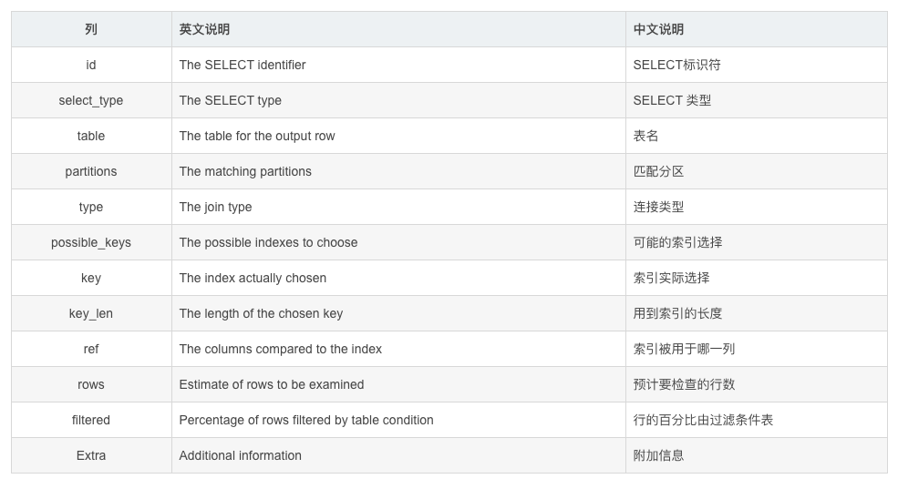
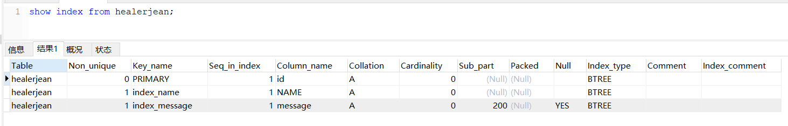
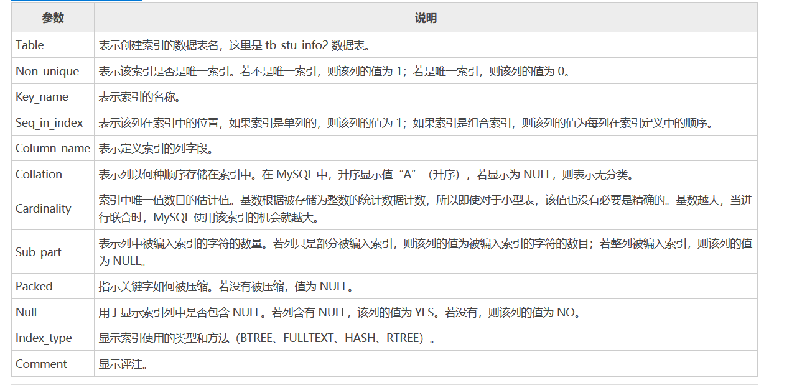

# SQL优化

[TOC]


## 通过explain查询和分析SQL的执行计划

```mysql
explain select .. from ...
```



|     信息      |                             描述                             |
| :-----------: | :----------------------------------------------------------: |
|      id       | 查询的序号，包含一组数字，表示查询中执行select子句或操作表的顺序 **两种情况** id相同，执行顺序从上往下 id不同，id值越大，优先级越高，越先执行 |
|  select_type  | 查询类型，主要用于区别普通查询，联合查询，子查询等的复杂查询 1、simple ——简单的select查询，查询中不包含子查询或者UNION 2、primary ——查询中若包含任何复杂的子部分，最外层查询被标记 3、subquery——在select或where列表中包含了子查询 4、derived——在from列表中包含的子查询被标记为derived（衍生），MySQL会递归执行这些子查询，把结果放到临时表中 5、union——如果第二个select出现在UNION之后，则被标记为UNION，如果union包含在from子句的子查询中，外层select被标记为derived 6、union result:UNION 的结果 |
|     table     |                      输出的行所引用的表                      |
|     type      | 显示联结类型，显示查询使用了何种类型，按照从最佳到最坏类型排序 1、system：表中仅有一行（=系统表）这是const联结类型的一个特例。 2、const：表示通过索引一次就找到，const用于比较primary key或者unique索引。因为只匹配一行数据，所以如果将主键置于where列表中，mysql能将该查询转换为一个常量 3、eq_ref:唯一性索引扫描，对于每个索引键，表中只有一条记录与之匹配。常见于唯一索引或者主键扫描 4、ref:非唯一性索引扫描，返回匹配某个单独值的所有行，本质上也是一种索引访问，它返回所有匹配某个单独值的行，可能会找多个符合条件的行，属于查找和扫描的混合体 5、range:只检索给定范围的行，使用一个索引来选择行。key列显示使用了哪个索引，一般就是where语句中出现了between,in等范围的查询。这种范围扫描索引扫描比全表扫描要好，因为它开始于索引的某一个点，而结束另一个点，不用全表扫描 6、index:index 与all区别为index类型只遍历索引树。通常比all快，因为索引文件比数据文件小很多。 7、all：遍历全表以找到匹配的行 注意:一般保证查询至少达到range级别，最好能达到ref。 |
| possible_keys |            指出MySQL能使用哪个索引在该表中找到行             |
|      key      | 显示MySQL实际决定使用的键(索引)。如果没有选择索引,键是NULL。查询中如果使用覆盖索引，则该索引和查询的select字段重叠。 |
|    key_len    | 表示索引中使用的字节数，该列计算查询中使用的索引的长度在不损失精度的情况下，长度越短越好。如果键是NULL,则长度为NULL。该字段显示为索引字段的最大可能长度，并非实际使用长度。 |
|      ref      | 显示索引的哪一列被使用了，如果有可能是一个常数，哪些列或常量被用于查询索引列上的值 |
|     rows      | 根据表统计信息以及索引选用情况，大致估算出找到所需的记录所需要读取的行数 |
|     Extra     | 包含不适合在其他列中显示，但是十分重要的额外信息 1、Using filesort：说明mysql会对数据适用一个外部的索引排序。而不是按照表内的索引顺序进行读取。MySQL中无法利用索引完成排序操作称为“文件排序” 2、Using temporary:使用了临时表保存中间结果，mysql在查询结果排序时使用临时表。常见于排序order by和分组查询group by。 3、Using index:表示相应的select操作用使用覆盖索引，避免访问了表的数据行。如果同时出现using where，表名索引被用来执行索引键值的查找；如果没有同时出现using where，表名索引用来读取数据而非执行查询动作。 4、Using where :表明使用where过滤，5、using join buffer:使用了连接缓存 6、impossible where:where子句的值总是false，不能用来获取任何元组 7、select tables optimized away：在没有group by子句的情况下，基于索引优化Min、max操作或者对于MyISAM存储引擎优化count（*），不必等到执行阶段再进行计算，查询执行计划生成的阶段即完成优化。 8、distinct：优化distinct操作，在找到第一匹配的元组后即停止找同样值的动作。 |


• EXPLAIN不会告诉你关于触发器、存储过程的信息或用户自定义函数对查询的影响情况
• EXPLAIN不考虑各种Cache
• EXPLAIN不能显示MySQL在执行查询时所作的优化工作
• 部分统计信息是估算的，并非精确值
• EXPALIN只能解释SELECT操作，其他操作要重写为SELECT后查看执行计划。


## 查看索引

~~~mysql
SHOW INDEX FROM <表名> [ FROM <数据库名>]
~~~





