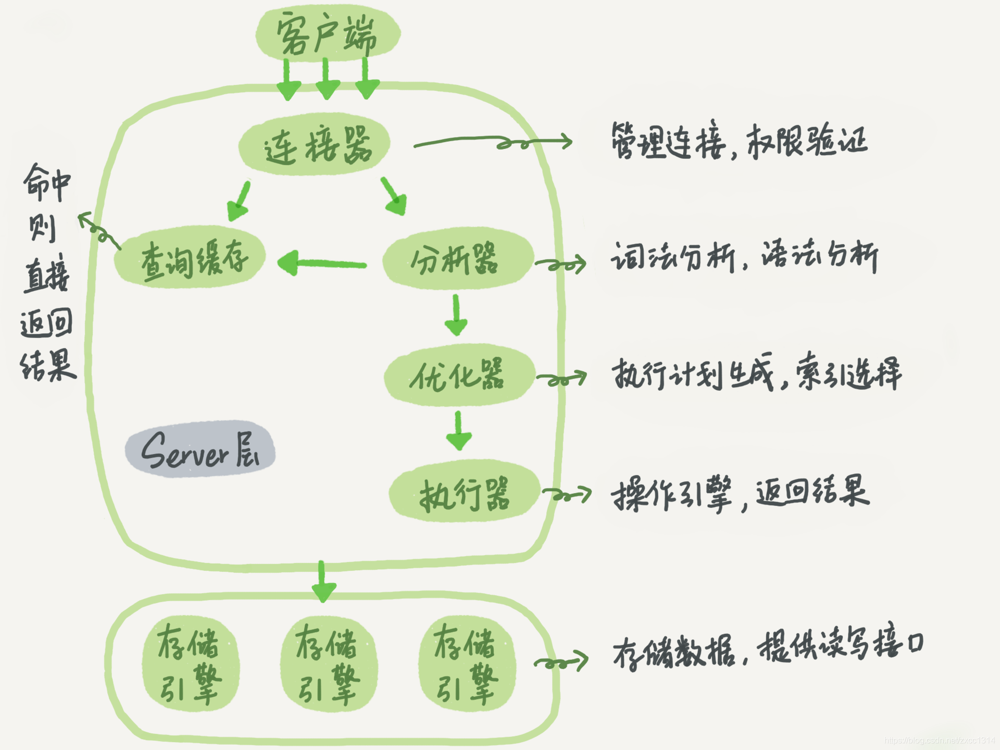
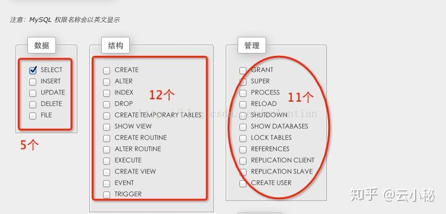
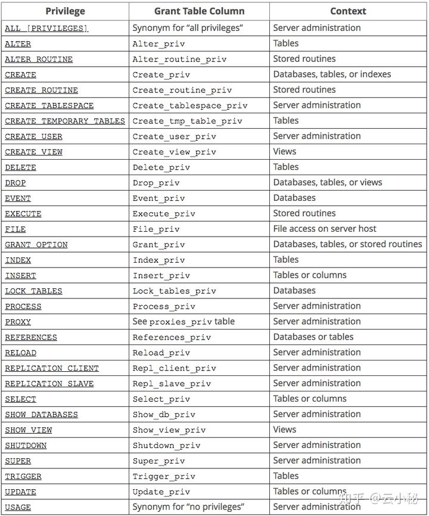
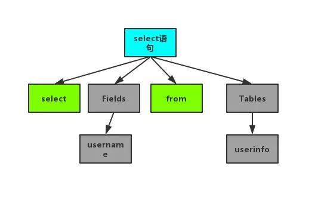
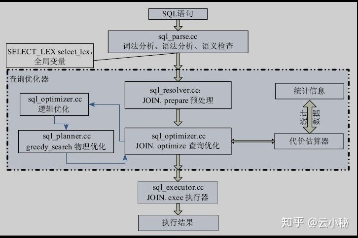

## SQL查询执行过程

### 架构

MySQL分为**Server层**和**存储引擎层**两部分



> 连接器：负责跟客户端建立连接、获取权限、维持和管理连接。
> 查询缓存：查询请求先访问缓存(key 是查询的语句，value 是查询的结果)。命中直接返回。不推荐使用缓存，更新会把缓存清除(关闭缓存：参数 query_cache_type 设置成 DEMAND)。
> 分析器：对 SQL 语句做解析，判断SQL是否正确。
> 优化器：决定使用哪个索引，多表关联（join）的时候，决定各个表的连接顺序。
> 执行器：执行语句，先判断用户有无查询权限，使用表定义的存储引擎。
>
> 存储引擎：不同的存储引擎共用一个Server层，负责的是数据的存储和提取，其架构模式是插件式的，支持InnoDB，MyISAM等，在Mysql5.5.5之后，InnoDB成为了默认的存储引擎，在create table语句中使用engine=memory, 可以自定义使用内存引擎创建表


### 应用层

应用层（客户端）是MySQL体系架构的最上层，它可其他client-server架构一样，主要包含如下内容:

- 连接处理
- 用户鉴权
- 安全管理


**1. 连接处理**当一个客户端向服务端发送连接请求后，MySQL server会从线程池中分配一个线程来和客户端进行连接，以后该客户端的请求都会被分配到该线程上。MySQL Server为了提高性能，提供了线程池，减少了创建线程和释放线程所花费的时间。

**2. 用户鉴权** 当客户端向MySQL服务端发起连接请求后，MySQL server会对发起连接的用户进行鉴权处理，MySQL鉴权依据是: 用户名，客户端主机地址和用户密码

**3. 安全管理** 当客户连接到MySQL server后，MySQL server会根据用户的权限来判断用户具体可执行哪些操作。


### Service层

#### 连接器

##### MySQL的连接方式

到MySQL5.7为止，总共有五种连接方式，分别是TCP/IP，TLS/SSL，Unix Sockets，Shared Memory，Named pipes，具体区别如下：


> 如何选择连接方式呢？
>
> 1. 如果程序和数据库在同一台机子(类Unix系统)上，推荐使用Unix Sockets，因为它效率更高；
> 2. 若数据库分布在不同的机子上，且能确保连接安全或者安全性要求不是那么高，推荐使用TCP/IP，反之使用TLS/SSL；


连接器与客户端建立连接，获取权限、维持和管理连接

> Mysql -u root -p


mysql客户端和服务器之间的通讯协议是“**半双工**”的，这意味着，在任何一个时刻，要么由服务器向客户端发送数据，要么由客户端向服务器发送数据，这两个动作不能同时发生。这种协议让mysql通信简单快速，但也限制了mysql。一个明显的限制是，这意味着**没办法进行流量限制**。一旦一端开始发生消息，另一端要**接收完整个消息**才能响应他。

客户端用一个单独的数据包将查询传给服务器。一旦客户端发送了请求，他能做的事情就只是等待结果了。

相反的，一般服务器响应给用户的数据通常很多，由多个数据包组成。当服务器开始响应客户端请求时，客户端必须完整的接受整个返回结果，而不是简单的只收取前面几条结果，然后让服务器停止发送数据。

连接命令中的mysql是客户端工具，用来跟服务端建立连接，TCP握手后，连接器开始认证身份

- 如果用户名或密码不对，你就会收到一个"Access denied for user"的错误，然后客户端程序结束执行。
- 如果用户名密码认证通过，连接器会到**权限表**里面查出你拥有的权限。之后，这个连接里面的权限判断逻辑，都将依赖于此时读到的权限。


###### 长连接

数据库里面，长连接是指连接成功后，如果客户端持续有请求，则一直使用同一个连接。短连接则是指每次执行完很少的几次查询就断开连接，下次查询再重新建立一个。


建立连接的过程通常是比较复杂的，所以在使用中要尽量减少建立连接的动作，也就是尽量使用长连接，但是全部使用长连接后，有些时候MySQL占用内存涨得特别快，这是因为MySQL在执行过程中**临时使用的内存是管理在连接对象里面的**，这些资源会在连接断开的时候才释放，所以如果长连接累积下来，可能导致内存占用太大，被系统强行杀掉（OOM），从现象看就是MySQL异常重启了

> 定期断开长连接。使用一段时间，或者程序里面判断执行过一个占用内存的大查询后，断开连接，之后要查询再重连。
>
> 如果是MySQL 5.7或更新版本，可以在每次执行一个比较大的操作后，通过执行 mysql_reset_connection来**重新初始化连接资源**。这个过程**不需要**重连和重新做权限验证，但是会将连接恢复到刚刚创建完时的状态


###### 短连接

短连接是指程序和数据库通信时需要建立连接，执行操作后，连接关闭。短连接简单来说就是每一次操作数据库，都要打开和关闭数据库连接，基本步骤是：连接→数据传输→关闭连接。

在慢速网络下使用短连接，连接的开销会很大；在生产繁忙的系统中，连接也可能会受到系统端口数的限制，如果要每秒建立几千个连接，那么连接断开后，端口不会被马上回收利用，必须经历一个“FIN”阶段的等待，直到可被回收利用为止，这样就可能会导致端口资源不够用。在Linux上，可以通过调整/proc/sys/net/ipv4/ip_local_port_range来扩大端口的使用范围；调整/proc/sys/net/ipv4/tcp_fin_timeout来减少回收延期（如果想在应用服务器上调整这个参数，一定要慎重！）。

另外一个办法是主机使用多个IP地址。端口数的限制其实是基于同一个IP:PORT的，如果主机增加了IP，MySQL就可以监听多个IP地址，客户端也可以选择连接某个IP:PORT，这样就增加了端口资源。


###### 连接池

由于一些数据库创建和销毁连接的开销很大，或者相对于所执行的具体数据操作，连接所耗的资源过多，此时就可能需要添加连接池来改进性能。

数据库连接池是一些网络代理服务或应用服务器实现的特性，如J2EE服务器，它实现了一个持久连接的“池”，允许其他程序、客户端来连接，这个连接池将被所有连接的客户端共享使用，连接池可以加速连接，也可以减少数据库连接，降低数据库服务器的负载。


> 持久连接和连接池的区别
>
> 长连接是一些驱动、驱动框架、ORM工具的特性，由驱动来保持连接句柄的打开，以便后续的数据库操作可以重用连接，从而减少数据库的连接开销。而连接池是应用服务器的组件，它可以通过参数来配置连接数、连接检测、连接的生命周期等。
>
> 如果连接池或长连接使用的连接数很多，有可能会超过数据库实例的限制，那么就需要留意连接相关的设置了，比如连接池的最小、最大连接数设置，以及php-fpm的进程个数等，否则程序将不能申请新的连接。


#### 权限问题

问题如下，

1. MySQL如何认证一个用户
2. MySQL的权限分哪几种及存储在什么地方
3. MySQL是如何控制用户访问


##### 用户认证

用户认证形式是: 用户名+主机，MySQL中的权限分配都是分配到用户+主机的实体上。MySQL的主机信息可以是本地(localhost)，某个IP，某个IP段，以及任何地方等，即用户的地址可以限制到某个具体的IP，或者某个IP范围，或者任意地方。MySQL用户分为普通用户和root用户。root用户是超级管理员，拥有所有权限，普通用户只拥有被授予的各种权限。


##### 权限分类及存储

###### 用户权限层级

- 全局层级：全局权限适用于一个给定MySQL Server中的所有数据库，这些权限存储在mysql.user表中。

~~~mysql
GRANT ALL ON *.* TO 'user'@'host';  # *.* 表示数据库库的所有库和表，对应权限存储在mysql.user表中
~~~

- 数据库层级：数据库权限适用于一个给定数据库中的所有目标，这些权限存储在mysql.db表中。

~~~mysql
GRANT ALL ON mydb.* TO 'user'@'host';  #mydb.* 表示mysql数据库下的所有表，对应权限存储在mysql.db表中
~~~

- 表层级：表权限适用于一个给定表中的所有列，这些权限存储在mysql.tables_priv表中。

~~~mysql
GRANT ALL ON mydb.mytable TO 'user'@'host';  #mydb.mytable 表示mysql数据库下的mytable表，对应权限存储在mysql.tables_priv表
~~~

- 列层级：列权限使用于一个给定表中的单一列，这些权限存储在mysql.columns_priv表中。

~~~mysql
GRANT ALL (col1， col2， col3)  ON mydb.mytable TO 'user'@'host'; #mydb.mytable 表示mysql数据库下的mytable表， col1, col2,  col3表示mytable表中的列名
~~~

- 子程序层级：CREATE ROUTINE、ALTER ROUTINE、EXECUTE和GRANT权限适用于已存储的子程序。这些权限可以被授予为全局层级和数据库层级。而且，除了CREATE ROUTINE外，这些权限可以被授予子程序层级，并存储在mysql.procs_priv表中。

~~~mysql
GRANT EXECUTE ON PROCEDURE mydb.myproc TO 'user'@'host'; #mydb.mytable 表示mysql数据库下的mytable表，PROCEDUR表示存储过程
~~~

###### 权限分类

- **数据权限**分为：库、表和字段三种级别
- **管理权限**主要是管理员要使用到的权限，包括：数据库创建，临时表创建、主从部署、进程管理等
- **程序权限**主要是触发器、存储过程、函数等权限。



**权限详情**




> 第一列表示可以在grant命令中制定的权限第二列对应着几张权限表(user,db,tables_priv, columns_priv, procs_priv)中的列第三列表示权限的作用范围，其中Global（Server administration）对应 mysql.user 表，Database 对应 mysql.db 表，Tables 对应 mysql.tables_priv 表，Columns 对应 mysql.columns_priv 表，Stored routines 对应 mysql.procs_priv 表。


MYSQL的权限如何分布，就是针对表可以设置什么权限，针对列可以设置什么权限等等，这个可以从官方文档中的一个表来说明：

**权限分布可能设置的权限**表权限Select, Insert, Update, Delete, Create, Drop, Grant, References, Index, Alter列权限Select, Insert, Update, References程序权限Execute, Alter Routine, Grant


##### MySQL访问控制

MySQL访问控制分为两个阶段:

1. 用户连接检查阶段
2. 执行SQL语句时检查阶段

###### 用户连接时的检查

1）当用户连接时，MySQL服务器首先从user表里匹配host, user, password，匹配不到则拒绝该连接

2）接着检查user表的max_connections和max_user_connections，如果超过上限则拒绝连接

3）检查user表的SSL安全连接，如果有配置SSL，则需确认用户提供的证书是否合法只有上面3个检查都通过后，服务器才建立连接，连接建立后，当用户执行SQL语句时，需要做SQL语句执行检查。


###### 执行SQL语句时的检查

1）从user表里检查max_questions和max_updates，如果超过上限则拒绝执行SQL下面几步是进行权限检查：

2）首先检查user表，看是否具有相应的全局性权限，如果有，则执行，没有则继续下一步检查

3）接着到db表，看是否具有数据库级别的权限，如果有，则执行，没有则继续下一步检查

4）最后到tables_priv, columns_priv, procs_priv表里查看是否具有相应对象的权限从以上的过程我们可以知道，MySQL检查权限是一个比较复杂的过程，所以为了提高性能，MySQL的启动时就会把这5张权限表加载到内存。


#### 缓存

连接建立之后一个分支就是查询缓存，MySQL拿到一个查询请求后，会先到查询缓存看看，之前是不是执行过这条语句。之前执行过的语句及其结果可能会以**key-value**对的形式，被直接缓存在**内存**中，key是查询的语句，value是查询的结果。如果你的查询能够直接在这个缓存中找到key，那么这个value就会被直接返回给客户端。

如果语句不在查询缓存中，就会继续后面的执行阶段。执行完成后，执行结果会被存入查询缓存中。你可以看到，如果查询命中缓存，MySQL不需要执行后面的复杂操作，就可以直接返回结果，这个效率会很高。

**多数情况下建议不要使用查询缓存**

> 查询缓存的失效非常频繁，只要有对一个表的更新，这个表上所有的查询缓存都会被清空。因此很可能你费劲地把结果存起来，还没使用呢，就被一个更新全清空了。对于更新压力大的数据库来说，查询缓存的命中率会非常低。除非你的业务就是有一张静态表，很长时间才会更新一次。比如，一个系统配置表，那这张表上的查询才适合使用查询缓存。

好在MySQL也提供了这种“按需使用”的方式。你可以将参数query_cache_type设置成DEMAND，这样对于默认的SQL语句都不使用查询缓存。而对于你确定要使用查询缓存的语句，可以用SQL_CACHE显式指定

~~~mysql
select SQL_CACHE * from T where ID=10；
~~~

自MySQL 5.6（2013）以来，默认情况下已禁用查询缓存，MySQL 8.0版本直接将查询缓存的整块功能删掉了，也就是说8.0开始彻底没有这个功能了。


#### 分析器

##### 词法分析

扫描字符流，根据构词规则识别单个单词。

MySQL使用Flex来生成词法扫描程序

在sql/lex.h中定义了MySQL关键字和函数关键字，用两个数组存储

生成一棵语法树

~~~mysql
select username from userinfo
~~~

从左到右一个字符、一个字符地输入，然后根据构词规则识别单词


##### 语法分析

在词法分析的基础上将单词序列组成语法短语，最后生成语法树，提交给优化器

语法分析器使用Bison，在sql/sql_yacc.yy中定义了语法规则。

根据关系代数理论生成语法树，判断输入的SQL语句是否满足MySQL语法，然后生成一棵语法树，输入的是一条SQL语句，输出的是一棵多叉树。



在sql目录下，有许多以sql_开头命名的文件，用于接受语法树，执行不同的查询，如sql_select.cc用于select查询，（根据语法树和系统的元信息进行语义检查，本阶段是对语法分析树进行逻辑判断，树的结构不发生变化。对语法分析树上的各个节点进行语义分析，判断对象是否存在、是否重名等，对不合语义的地方报告错误）

语法不对，则`You have an error in your SQL syntax`


#### 查询优化器

当语法树被认为是合法的了，并且由优化器将其转化成执行计划。一条查询可以有很多种执行方式，最后都返回相同的结果。**优化器的作用就是找到这其中最好的执行计划。**

执行计划：MySQL不会生成查询字节码来执行查询，MySQL生成查询的一棵指令树，然后通过存储引擎执行完成这棵指令树并返回结果。最终的执行计划包含了重构查询的全部信息

查询的生命周期的下一步是将一个SQL转换成一个执行计划，MySQL在依照这个执行计划和存储引擎进行交互。这包含多个子阶段：***解析SQL、预处理、优化SQL执行计划***。这个过程中任何错误都可能终止查询。


SQL优化通常包括两项工作:一是**逻辑优化**、二是**物理优化**。这两项工作都要对语法分析树的形态进行修改，把语法分析树变为查询树。其中，逻辑查询优化将生成逻辑查询执行计划。在生成逻辑查询执行计划过程中，根据关系代数的原理，把语法分析树变为关系代数语法树的样式，原先SQL语义中的一些谓词变化为逻辑代数的操作符等样式，这些样式是一个临时的中间状态，经过进一步的逻辑查询优化，如执行常量传递、选择下推等(如一些节点下移，一些节点上移)，从而生成逻辑查询执行计划。在生成逻辑查询计划后，查询优化器会进一步对查询树进行物理查询优化。物理优化会对逻辑查询进行改造，改造的内容主要是对连接的顺序进行调整。SQL语句确定的连接顺序经过多表连接算法的处理，可能导致表之间的连接顺序发生变化，所以树的形态有可能调整。物理查询优化除了进行表的连接顺序调整外，还会使用代价估算模型对单个表的扫描方式、两表连接的连接算法进行评估，选择每一项操作中代价最小的操作为下一步优化的基础。物理查询优化的最终结果是生成最终物理查询执行计划。


##### 1.逻辑优化

##### 逻辑优化思路

优化器在逻辑优化阶段主要解决的问题是: 如何找出SQL语句等价的变换形式，使得SQL执行更高效。一条SQL查询语句结构复杂，包含多种类型的字句，优化操作依赖于表的一些属性(如索引和约束等)。可用于优化的思路包括:

- 字句局部优化: 每种类型字句都可能存在优化方式，如等价谓词重写、where和having条件化简中的大部分情况，都属于这种字句范围内的优化。
- 字句间关联优化: 字句与字句之间关联的语义存在优化的可能，如外连接消除、连接消除、子查询优化、视图重写等都属于字句间的关联优化，因为他们的优化都需要借助其他字句、表定义或列属性等信息进行。
- 局部与整体的优化: 需要协同考虑局部表达式和整体的关系，如OR重写并集规则需要考虑UNION操作(UNION师变换后的整体的形式)的花费和OR操作(OR是局部表达式)的花费。
- 形式变化优化: 多个字句存在嵌套，可以通过形式的变化完成优化，如嵌套连接消除。
- 语义优化:根据完整性约束、SQL表达的含义等信息对语句进行语义优化。

##### 重写规则

传统的联机事务处理(OLTP)使用基于选择(SELECT)、投影(PROJECT)、连接(JOIN)3种基本操作相结合的查询，这种查询称为SPJ查询。数据库在查询优化的过程中，会对这3种基本操作进行优化。优化的方式如下:

- 选择操作: 对应的是限制条件(格式类似field consant，field表示列对象，op是操作符，如=，>等)，优化方式是选择操作下推，目的是尽量减少连接操作前的远组数，使得中间临时关系尽量少(元组数少，连接得到的远组数就少)，这样可减少IO和CPU的消耗，节约内存空间。

- 投影操作: 对应的SELECT查询的目的列对象，优化方式是投影操作下推，目的是尽量减少连接操作前的列数，使得中间临时关系尽量小(特别注意差别:选择操作是使元组的个数"尽量少"，投影操作是使一条元组"尽量小")，这样虽然不能减少IO(多数数据库存储方式是行存储，元组是读取的最基本单位，所以要想操作列则必须读取一行数据)，但可以减少连接后中间关系的元组大小，节约内存空间)。

- 连接关系: 对应的是连接条件(格式类似field_1, field_2，field_1和field_2表示不同表上的列对象，op是操作符，如=，>等)，表示两个表连接的条件。这里涉及以下两个子问题:

- - 多表连接中每个表被连接的顺序决定着效率。如果一个查询语句只有一个表，则这样的语句很简单；但如果有多个表，则会涉及表之间以什么样的顺序连接效率最高效(如A、B、C三表连接，如果ABC、ACB、BCA等连接后的结果集一样，则计算哪种连接次序的效率最高，是需要考虑的问题)。
  - 多表连接每个表被连接的顺序由用户语义决定。查询语句多表连接有着不同的语义(如笛卡尔积、内连接 、还是外连接中的左外连接等)，这决定着表之间的额前后连接次序是不能随意更换的，否则结果集中数据是不同的。因此，表的前后连接次序是不能随意交换的。

- 根据SQL语句的形式特点，可以针对SPJ的查询优化，如基于选择、投影、连接3种基本操作相结合的查询。

**一定能带来优化效果的，主要包括**

- 优先做选择和投影(选择条件在查询树上下推)
- 子查询的消除
- 嵌套连接的消除
- 外连接的消除
- 连接的消除
- 使用等价谓词重写，对条件化简
- 语义优化
- 剪掉冗余操作(一些剪枝优化技术)、最小化查询块。

 **变换未必会带来性能的提高，需根据代价选择，主要包括**

- 分组的合并
- 借用索引优化分组、排序、DISTINCT等操作
- 对视图的查询变为基于表的查询
- 连接条件的下推
- 分组的下推
- 连接提取公共表达式
- 谓词的上拉
- 用连接取代集合操作
- 用UNIONALL取代OR操作


##### 2.物理优化

主要解决的问题如下:

- 从可选的单表扫描方式中，挑选什么样的单表扫描方式是最优的？
- 对于两个表连接时，如何选择是最优的？
- 对多个表连接，连接顺序有多种组合，是否要对每种组合都探索？如果不全部探索，怎么找到最优的一种组合？

在查询优化器实现的早期，使用的是逻辑优化技术，即使用关系代数规则和启发式规则对查询进行优化后，认为生成的执行计划就是最优的。在引入了基于代价的查询优化方式后，对查询执行计划做了定量的分析，对每一个可能的执行方式进行评估，挑出代价最小的作为最优的计划。目前数据库的查询优化器通常融合这两种方式。

  **MySQL查询执行过程**

MySQL查询执行过程分为4个阶段，如下所示:

- 语法分析阶段: 将SQL查询语句经词法和语法分析后变换成为一棵查询树st_select_lex传给优化器，并对SQL表达的语义进行检查。
- 生成逻辑查询执行计划阶段: 优化器在查询树中遍历每个关系，确定关系是否是常量表、为每个关系查找可用的索引、运用关系代数原理和启发式规则进行逻辑上的查询优化(如消除子查询、消除外连接等)。
- 生成物理查询执行计划阶段: 优化器对各个连接的表进行排序，然后求解多表连接最优路径，对于每个关系尽量利用索引计算其代价，找出代价最小的路径后保存到JOIN类的bets_positions
- 执行查询执行计划阶段: 把查询执行计划传到执行器进行执行




#### 执行器

在SQL执行阶段，依据物理查询计划执行查询，逐步调用相关算法进行执行。算法包括一趟算法、嵌套循环连接、基于排序的两趟算法、基于散列的两趟算法、基于索引的算法、使用超过两趟的算法等。

开始执行的时候，要先判断一下你对这个表T有没有执行查询的权限，如果没有，就会返回没有权限的错误，如下所示。

```mysql
mysql> select * from T where ID=10;

ERROR 1142 (42000): SELECT command denied to user 'b'@'localhost' for table 'T'
```

如果有权限，就打开表继续执行。打开表的时候，执行器就会根据表的引擎定义，去使用这个引擎提供的接口。

比如我们这个例子中的表T中，ID字段没有索引，那么执行器的执行流程是这样的：

1. 调用InnoDB引擎接口取这个表的第一行，判断ID值是不是10，如果不是则跳过，如果是则将这行存在结果集中；
2. 调用引擎接口取“下一行”，重复相同的判断逻辑，直到取到这个表的最后一行。
3. 执行器将上述遍历过程中所有满足条件的行组成的记录集作为结果集返回给客户端。

至此，这个语句就执行完成了。

对于有索引的表，执行的逻辑也差不多。第一次调用的是“取满足条件的第一行”这个接口，之后循环取“满足条件的下一行”这个接口，这些接口都是引擎中已经定义好的。

你会在数据库的慢查询日志中看到一个rows_examined的字段，表示这个语句执行过程中扫描了多少行。这个值就是在执行器每次调用引擎获取数据行的时候累加的。

在有些场景下，执行器调用一次，在引擎内部则扫描了多行，因此**引擎扫描行数跟rows_examined并不是完全相同的。**