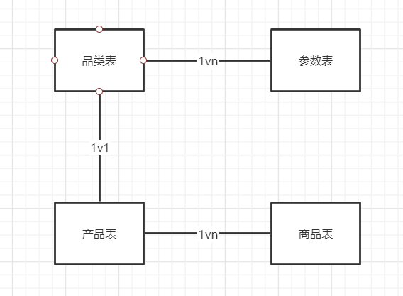
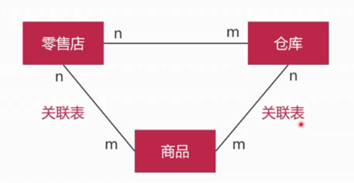

# 数据库设计相关

[TOC]

## 概念

**SKU**

> stock keeping unit 是库存进出计量的单位，是物理上不可分割的最小存货单元

**SPU**

> standard product unit 标准产品单位，描述一个产品的各种特性

B2C修改SKU对搜索权重影响不大，B2B修改SKU对搜索权重影响很大。

**SKU如何和参数对应**

如上衣品类不同参数不同，有颜色，领袖等。手机就有屏幕内存等不同参数。

采用品类表和参数表，1vn解决每个产品参数不同问题。列如手机是品类表，内存，屏幕，cpu就是参数表。

产品表和品类表是1v1关系，产品表和商品表是1vn关系

库存的设计例如苏宁易购的新零售

