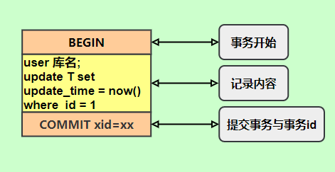

# MySQL日志

[TOC]


## 分类

- 错误日志
- 查询日志
- 慢查询日志
- 事务日志(Redo & Undo)
- 二进制日志(Bin)
- 中继日志


> MySQL 的 WAL （Write-ahead logging）机制，先写日志，再写数据库
>
> *binlog* 是server层的日志,而*redo log* 和*undo log都是*引擎层(innodb)的日志


## 慢查询日志

慢查询会导致CPU，IOPS，内存消耗过高。当数据库遇到性能瓶颈时，大部分时间都是由于慢查询导致的。 开启慢查询日志，可以让MySQL记录下查询超过指定时间的语句，之后运维人员通过定位分析，能够很好的优化数据库性能。

慢查询日志记录的慢查询不仅仅是执行比较慢的SELECT语句，还有INSERT，DELETE，UPDATE，CALL等DML操作，只要超过了指定时间，都可以称为"慢查询"，被记录到慢查询日志中。

默认情况下，慢查询日志是不开启的，只有手动开启了，慢查询才会被记录到慢查询日志中。

- slow_query_log: 慢查询开关，表示是否打开慢查询日志

~~~mysql
mysql> show variables like "%slow%";
+---------------------------+-------------------------------------------------+
| Variable_name             | Value                                           |
+---------------------------+-------------------------------------------------+
| log_slow_admin_statements | OFF                                             |
| log_slow_slave_statements | OFF                                             |
| slow_launch_time          | 2                                               |
| slow_query_log            | OFF                                             |
| slow_query_log_file       | /var/lib/mysql/iz2zeaf3cg1099kiidi06mz-slow.log |
+---------------------------+-------------------------------------------------+
5 rows in set (0.00 sec)

# 打开慢查询
mysql> set global slow_query_log='ON';
Query OK, 0 rows affected (0.00 sec)


mysql> show variables like "slow_query_log";
+---------------------------+-------------------------------------------------+
| Variable_name             | Value                                           |
+---------------------------+-------------------------------------------------+                                        |
| slow_query_log            | ON                                              |
| slow_query_log_file       | /var/lib/mysql/iz2zeaf3cg1099kiidi06mz-slow.log |
+---------------------------+-------------------------------------------------+
2   rows in set (0.00 sec)
~~~

> 但是使用 set global slow_query_log='ON' 开启慢查询日志，只是对当前数据库有效，如果MySQL数据库重启后就会失效。所以如果要永久生效，就要修改配置文件 my.cnf (其他系统变量也是如此)，如下：

```mysql
[mysqld]
slow_query_log=1
```

- long_query_time: 慢查询指定时间设置，表示"多长时间的查询"被认定为"慢查询"，单位是秒(s)，默认是10s，即超过10s的查询都被认定为慢查询。

~~~mysql
mysql> show variables like 'long_query_time';
+-----------------+-----------+
| Variable_name   | Value     |
+-----------------+-----------+
| long_query_time | 10.000000 |
+-----------------+-----------+
1 row in set (0.00 sec)

# 设置慢查询时间
mysql> set global long_query_time=0.05;
Query OK, 0 rows affected (0.00 sec)

设置long_query_time这个阈值之后，MySQL数据库会记录运行时间超过该值的所有SQL语句，但对于运行时间正好等于 long_query_time 的情况，并不会被记录下。而设置 long_query_time为0来捕获所有的查询
~~~


## Redo Log

### 概念

Redo Log 是一个顺序写入，大小固定的环形日志（物理）


> 维护两个指针，**write pos**是当前记录的位置，表示当前 redo log 的写入位置。**checkpoint **用于当前要擦除的位置，同样是往后推移且循环的，擦除记录需要把数据持久化到.ibd文件中
>
> 两个指针中间位置就是当前能够写入的空间

**有了redo log，InnoDB就可以保证即使数据库发生异常重启，之前提交的记录都不会丢失，称为crash-safe**

**redo log通常是物理日志，记录的是数据页的物理修改，而不是某一行或某几行修改成怎样怎样，它用来恢复提交后的物理数据页(恢复数据页，且只能恢复到最后一次提交的位置)。**


### 写入机制


1、在 MySQL 应用的 redo log buffer 中

2、write 到文件系统的 page cache 中，但是没有进行实际的写盘操作（fsync）

3、执行 fsync 之后，写盘结束


InnoDB 有一个后台线程，每隔 1 秒钟 就会将 redo log buffer 中的日志，调用 write 写入到 文件系统的 page cache 中，然后再调用 fsync 持久化到磁盘中。redo log buffer 是共享的，因此一些正在执行中的事务的 redo log 也有可能被持久化到磁盘中


**innodb_flush_log_at_trx_commit**

- **设置为0的时候，表示每次事务提交时不进行刷盘操作**
- **设置为1的时候，表示每次事务提交时都将进行刷盘操作（默认值）**
- **设置为2的时候，表示每次事务提交时都只把redo log buffer内容写入page cache，但并不马上调用fsync来刷新IO缓存，而是每秒只做一次磁盘IO缓存刷新**


## Undo Log

### 概念

undo log 和 bin log 一样都属于逻辑日志，主要作用是实现事务的回滚 和 MVCC

Undo Log中分为两种类型：

一种是 **INSERT_UNDO**（INSERT操作），记录插入的唯一键值；

一种是 **UPDATE_UNDO**（包含UPDATE及DELETE操作），记录修改的唯一键值以及old column记录。


undo log 是通过一个单向链表串起来


### 作用

undo log有两个作用：**提供回滚**和**多版本控制**(MVCC)。

在数据修改的时候，不仅记录了redo，还记录了相对应的undo，如果因为某些原因导致事务失败或回滚了，可以借助该undo进行回滚。

undo log和redo log记录物理日志不一样，它是**逻辑日志**。可以认为当delete一条记录时，undo log中会记录一条对应的insert记录，反之亦然，当update一条记录时，它记录一条对应相反的update记录。

当执行rollback时，就可以从undo log中的逻辑记录读取到相应的内容并进行回滚。有时候应用到行版本控制的时候，也是通过undo log来实现的：当读取的某一行被其他事务锁定时，它可以从undo log中分析出该行记录以前的数据是什么，从而提供该行版本信息，让用户实现非锁定一致性读取。


### 具体实现


不仅存放着数据更新前的记录，还记录着RowID、事务ID、回滚指针。其中事务ID每次递增，回滚指针第一次如果是insert语句的话，回滚指针为NULL，第二次update之后的undo log的回滚指针就会指向刚刚那一条undo log日志，依次类推，就会形成一条undo log的回滚链，方便找到该条记录的历史版本。


## Redo和Undo如何记录事务

### 过程

 假设有A、B两个数据，值分别为1,2，开始一个事务，事务的操作内容为：把1修改为3，2修改为4，那么实际的记录如下（简化）：

 A.事务开始.
 B.记录A=1到undo log.
 C.修改A=3.
 D.记录A=3到redo log.
 E.记录B=2到undo log.
 F.修改B=4.
 G.记录B=4到redo log.
 H.将redo log写入磁盘。

 I.事务提交


### IO影响

 Undo + Redo的设计主要考虑的是提升IO性能，增大数据库吞吐量。可以看出，B D E G H，均是新增操作，但是B D E G 是缓冲到buffer区，只有G是增加了IO操作，为了保证Redo Log能够有比较好的IO性能，InnoDB 的 Redo Log的设计有以下几个特点：

 

 A. **尽量保持Redo Log存储在一段连续的空间上**。因此在系统第一次启动时就会将日志文件的空间完全分配。 以顺序追加的方式记录Redo Log,通过顺序IO来改善性能。

 B. **批量写入日志**。日志并不是直接写入文件，而是先写入redo log buffer.当需要将日志刷新到磁盘时 (如事务提交),将许多日志一起写入磁盘.

 C. **并发的事务共享Redo Log的存储空间**，它们的Redo Log按语句的执行顺序，依次交替的记录在一起，
   以减少日志占用的空间。例如,Redo Log中的记录内容可能是这样的：
   记录1: <trx1, insert …>
   记录2: <trx2, update …>
   记录3: <trx1, delete …>
   记录4: <trx3, update …>
   记录5: <trx2, insert …>
 D. 因为C的原因,当一个事务将Redo Log写入磁盘时，**也会将其他未提交的事务的日志写入磁盘**。

 E. Redo Log上**只进行顺序追加的操作**，当一个事务需要回滚时，它的Redo Log记录也**不会**从Redo Log中删除掉。


### 恢复

未提交的事务和回滚了的事务也会记录Redo Log，因此在进行恢复时,这些事务要进行特殊的的处理。有2种不同的恢复策略：

 

 A. 进行恢复时，只重做已经提交了的事务。
 B. 进行恢复时，重做所有事务包括未提交的事务和回滚了的事务。然后通过Undo Log回滚那些未提交的事务。

 

 **MySQL数据库InnoDB存储引擎使用了B策略,** InnoDB存储引擎中的恢复机制有几个特点：

 A. 在重做Redo Log时，并**不关心事务性**。 恢复时，没有BEGIN，也没有COMMIT,ROLLBACK的行为。也不关心每个日志是哪个事务的。尽管事务ID等事务相关的内容会记入Redo Log，这些内容只是被当作要操作的数据的一部分。

 B. 使用B策略就必须要将Undo Log持久化，而且必须要在写Redo Log之前将对应的Undo Log写入磁盘。Undo和Redo Log的这种关联，使得持久化变得复杂起来。为了降低复杂度，InnoDB将Undo Log看作数据，因此记录Undo Log的操作也会记录到redo log中。这样undo log就可以象数据一样缓存起来，而不用在redo log之前写入磁盘了。

   包含Undo Log操作的Redo Log，看起来是这样的：
   记录1: <trx1, **Undo log insert** <undo_insert …>>
   记录2: <trx1, insert …>
   记录3: <trx2, **Undo log insert** <undo_update …>>
   记录4: <trx2, update …>
   记录5: <trx3, ***\*Undo log insert\**** <undo_delete …>>
   记录6: <trx3, delete …>
 C. 到这里，还有一个问题没有弄清楚。既然Redo没有事务性，那岂不是会重新执行被回滚了的事务？
   确实是这样。同时Innodb也会将事务回滚时的操作也记录到redo log中。回滚操作本质上也是
   对数据进行修改，因此回滚时对数据的操作也会记录到Redo Log中。
   一个回滚了的事务的Redo Log，看起来是这样的：
   记录1: <trx1, Undo log insert <undo_insert …>>
   记录2: <trx1, **insert A**…>
   记录3: <trx1, Undo log insert <undo_update …>>
   记录4: <trx1, **update B**…>
   记录5: <trx1, Undo log insert <undo_delete …>>
   记录6: <trx1, **delete C**…>
   记录7: <trx1, **insert C**>
   记录8: <trx1, **update B** to old value>

   记录9: <trx1, **delete A>**

   一个被回滚了的事务在恢复时的操作就是先redo再undo，因此不会破坏数据的一致性。


## Bin Log

### 概念

Binary log 用来**记录数据库中发生的修改情况，比如数据的修改、表格的创建及修改等，它既可以记录涉及修改的SQL，也可以记录数据修改的行变化记录，同时也记录了执行时间**。比如，执行sql：update tabname set cola='a' where id between 1 and 5，修改了5行记录。当开启binlog记录的时候，根据设置的binlog格式，可能记录的是这一条SQL语句，也可能记录的是5行数据记录的修改情况，也可能两者都有

redo log是InnoDB引擎特有的日志，而**Server层也有自己的日志，称为binlog**

> 为什么MySQL有两份日志呢，因为最开始MySQL自带的引擎是MyISAM，没有crash-safe的能力，既然只依靠binlog是没有crash-safe能力的，所以InnoDB使用另外一套日志系统——也就是redo log来实现crash-safe能力

MySQL的二进制日志（binary log）是一个二进制文件，主要记录**所有数据库表结构变更**（例如CREATE、ALTER TABLE…）以及**表数据修改**（INSERT、UPDATE、DELETE…）的所有操作。二进制日志（binary log）中记录了对MySQL数据库执行更改的所有操作，并且记录了语句发生时间、执行时长、操作数据等其它额外信息，但是它不记录SELECT、SHOW等那些不修改数据的SQL语句。


### 与redo log区别

1. redo log是InnoDB存储引擎产生的，只适合InnoDB引擎；binlog是MySQL的Server层实现的，所有引擎都可以使用。
2. redo log是**物理日志**，记录的是“在某个数据页上做了什么修改”；binlog是**逻辑日志**，记录的是这个语句的**原始逻辑**，比如“给ID=2这一行的c字段加1 ”，不记录select
3. 依靠binlog是没有crash-safe能力的，主要是用于**主从复制的时候做同步用的**。直接把binlog给从机，从机按照binlog执行语句就行了
4. redo log作为异常宕机或者介质故障后的数据恢复使用
5. redo log是**循环写**的，空间固定会用完；**binlog是可以追加写**。“追加写”是指binlog文件写到一定大小后会切换到下一个，并不会覆盖以前的日志。


### Redo Log和Bin Log两阶段提交

**先写入Redo Log，再写入Bin Log**

> 图中浅色框表示是在InnoDB内部执行的，深色框表示是在执行器中执行的


1. 执行器先找引擎取ID=2这一行。ID是主键，引擎直接用树搜索找到这一行。如果ID=2这一行所在的数据页本来就在内存中，就直接返回给执行器；否则，需要先从磁盘读入内存，然后再返回。
2. 执行器拿到引擎给的行数据，把这个值加上1，比如原来是N，现在就是N+1，得到新的一行数据，再调用引擎接口写入这行新数据。
3. 引擎将这行新数据**更新到内存**中，同时将这个更新操作记录到**redo log**里面，此时redo log处于**prepare状态**。然后告知执行器执行完成了，随时可以提交事务。
4. 执行器**生成这个操作的binlog**，并把binlog**写入磁盘**。
5. 执行器调用引擎的提交事务接口，引擎把刚刚写入的**redo log改成提交（commit）状态**，更新完成。


当MySQL写完redolog并将它标记为prepare状态时，并且会在redolog中记录一个XID，它**全局唯一的标识着这个事务**。只要这个XID和binlog中记录的XID是一致的，MySQL就会认为binlog和redolog逻辑上一致，就会commit。而如果仅仅是rodolog中记录了XID，binlog中没有，MySQL就会RollBack

可以注意到，最后将redo log的写入拆成了两个步骤，prepare和commit，即两阶段提交，这是为了让两份日志之间的逻辑一致


### 为什么需要两阶段提交

> 保证两者之间的一致性

由于redo log和binlog是两个独立的逻辑，如果不用两阶段提交，要么就是先写完redo log再写binlog，或者采用反过来的顺序。

仍然用前面的update语句来做例子。假设当前ID=2的行，字段c的值是0，再假设执行update语句过程中在写完第一个日志后，第二个日志还没有写完期间发生了crash，会出现的情况如下

1. **先写redo log后写binlog**。
   
   先写redo log的一个原因是考虑了主从一致性，如果先写binlog，在写入的那一刻，就有可能同步到备节点并执行，后续崩溃删除这个binlog后，被删除的 `binlog` 已经被备节点执行了


2. **先写binlog后写redo log**。

   如果在binlog写完之后crash，由于redo log还没写，崩溃恢复以后这个事务无效，所以这一行c的值是0。但是binlog里面已经记录了“把c从0改成1”这个日志。所以，在之后用binlog来恢复的时候就多了一个事务出来，恢复出来的这一行c的值就是1，与原库的值不同。

如果不使用“两阶段提交”，**那么数据库的状态就有可能和用它的日志恢复出来的库的状态不一致**。

简单说，redo log和bin log都可以用于表示事务的提交状态，而两阶段提交就是让这两个状态保持逻辑上的一致。


### 作用

**恢复**（recovery）：某些数据的恢复需要二进制日志。例如，在一个数据库全备文件恢复后，用户可以通过二进制日志进行point-in-time的恢复。

**复制**（replication）：其原理与恢复类似，通过复制和执行二进制日志使一台远程的MySQL数据库（一般称为slave或者standby）与一台MySQL数据库（一般称为master或者primary）进行实时同步。

在开启binlog的情况下，为了保证binlog与redo的一致性，MySQL将采用事务的**两阶段提交协议**。当MySQL系统发生崩溃时，事务在存储引擎内部的状态可能为prepared和commit两种。**对于prepared状态的事务，是进行提交操作还是进行回滚操作，这时需要参考binlog：如果事务在binlog中存在，那么将其提交；如果不在binlog中存在，那么将其回滚**，这样就保证了数据在主库和从库之间的一致性。

为了管理所有的binlog文件，MySQL额外创建了一个base-name.index文件，它按顺序记录了MySQL使用的所有binlog文件。自定义index文件的名称，可以设置log_bin_index=file参数。


### 记录格式

> statement  row  mixed

- **statement**



statement格式的binlog记录的是数据库上执行的**原生SQL语句**。这种方式有好处也有坏处。

- 日志量小，减少磁盘IO，提升存储和恢复速度


- 在某些情况下会导致主从数据不一致

比如同一条SQL在主库和从库上执行的时间可能稍微或很大不相同，在传输的二进制日志中，除了查询语句，还包括了一些元数据信息

如当前的时间戳，`update_time=now()`这里会获取当前系统时间，直接执行会导致与原库的数据不一致。


- **row**


`row`格式记录的内容看不到详细信息，要通过`mysqlbinlog`工具解析出来。

update_time=now()`变成了具体的时间`update_time=1627112756247，条件后面的@1、@2、@3都是该行数据第1个~3个字段的原始值（**假设这张表只有3个字段**）。

但是这种格式的记录需要更大的容量来记录，占用空间，恢复与同步时会更消耗 IO 资源，影响执行速度


- **mixed**

`MySQL`会判断这条`SQL`语句是否可能引起数据不一致，如果是，就用`row`格式，否则就用`statement`格式。


### 参数

- max_binlog_size

binlog文件大小，默认1G

如果是row模式，需要增加binlog文件的大小，因为row模式产生的日志量相对较大。如果超过了该值，就会产生新的日志文件，后缀名+1，并且记录到.index文件里面。


- binlog_cache_size

设置binlog cache(默认32K)，每个线程单独分配内存空间

所有未提交的二进制日志文件会被记录到用户工作空间的binlog cache中，等该事务提交时直接将缓冲区中的binlog写入二进制日志文件里


- sync_binlog

控制 write 和 fsync 的写入时机

1. sync_binlog=0：每次事务提交都只 write，不 fsync；
2. sync_binlog=1：每次事务提交都会fsync；
3. sync_binlog=N（N>1）：每次提交事务都会 write，但累计N 个后才再执行 fsync。


- binlog-do-db&binlog-ignore-db

参数binlog-do-db和binlog-ignore-db表示需要写入或者忽略写入哪些库的二进制日志。默认为空，表示需要同步所有库的日志到二进制日志


- log-slave-update

如果当前数据库是复制中的slave角色，则它不会将master取得并执行的二进制日志写入自己的二进制日志文件中去。如果需要写入，要设置log-slave-update。如果需要搭建master–>slave–>slave架构的复制，则必须设置该参数。


- binlog-format

设置二进制日志的记录格式


- log_bin_trust_function_creators

默认为OFF，开启会限制存储过程、Function、触发器的创建


### 写入机制

事务执行时，binlog 首先会被写入到 binlog cache中

事务提交时，再将 binlog cache 写入到 binlog 文件中

如果binlog cache 超过阀值，就会临时持久化到磁盘


每个客户端线程都会被分配到一个 binlog cache ，大小由 binlog_cache_size 控制

每个线程共享一份 binlog files

write 是指把binlog cache 写到文件系统的 page cache，fsync 是实际的写盘操作

write 和 fsync 的时机，是由参数 sync_binlog 控制的


