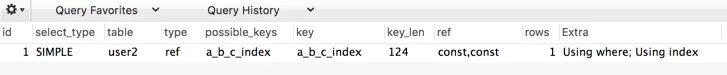

# MySQL索引分类

[TOC]

索引是辅助存储引擎高效获取数据的一种数据结构。


## 分类

从以下几个方面对索引进行分类

### 从数据结构的角度

- B+tree
- Hash
- Full-texts 索引

### 从物理存储角度

- 聚簇索引
- 二级索引(辅助索引)

### 从索引字段特性角度分类

- 主键索引
- 唯一索引
- 普通索引
- 前缀索引

### 从组成索引的字段个数角度分类

- 单列索引
- 联合索引（复合索引）


## 从数据结构角度看索引

下表是 MySQL 常见的存储引擎 InnoDB，MyISAM 和 Memory 分别支持的索引类型

|                | InnoDB | MyISAM | Memory |
| :------------: | :----: | :----: | :----: |
|  B+tree 索引   |  Yes   |  Yes   |  Yes   |
|   Hash 索引    |   No   |   No   |  Yes   |
| Full-text 索引 |  Yes   |  Yes   |   No   |

InnoDB 作为 MySQL 建表时默认的存储引擎

对上表进行横向查看可以了解到，B+tree 是 MySQL 中被存储引擎采用最多的索引类型。


### 区别

#### B+tree & B-tree

B+tree **只在叶子节点存储数据**，而 B-tree 非叶子节点也存储数据

因此，B+tree 单个节点的数量更小，在相同的磁盘 IO 下能查询更多的节点。

另外 B+tree 叶子节点采用单链表链接适合 MySQL 中常见的基于范围的顺序检索场景，而 B-tree 无法做到这一点。

#### B+tree & 红黑树


对于有 N 个叶子节点的 B+tree，搜索复杂度为 **O(logdN)** ,**d 是指 degree 是指 B+tree 的度**，表示节点允许的最大子节点个数为 d 个，在实际的运用中 d 值是大于 100 的，即使数据达到千万级别时候 B+tree 的高度依然维持在 3-4 左右，保证了 3-4 次磁盘 I/O 就能查到目标数据.


从上图中可以看出红黑树是二叉树，节点的子节点个数最多为 2 个，意味着其搜索复杂度为 **O(logN)**,比 B+ 树高出不少，因此红黑树检索到目标数据所需经理的磁盘 I/O 次数更多。

#### B+tree 索引与 Hash 表

范围查询是 MySQL 数据库中常见的场景，而 Hash 表不适合做范围查询，Hash 表更适合做等值查询，另外 Hash 表还存在 Hash 函数选择和 Hash 值冲突等问题。

因为这些原因，B+tree 索引要比 Hash 表索引有更广的适用场景。


## 物理存储角度看索引

### InnoDB索引

InnoDB 表的索引按照叶子节点存储的是否为完整表数据分为**聚簇索引和二级索引**。


全表数据就是存储在聚簇索引中  | 聚簇索引以外的其它索引叫做二级索引。


#### 聚簇索引


把聚簇索引建立在字段 id 上，B+tree如下


聚簇索引的**每个叶子节点存储了一行完整的表数据**，叶子节点间采用单向链表按 id 列递增连接，可以方便的进行顺序检索

InnoDB 表要求**必须有聚簇索引**，默认在**主键字段**上建立聚簇索引，在没有主键字段的情况下，表的**第一个 NOT NULL 的唯一索引**将被建立为聚簇索引，在前两者都没有的情况下，InnoDB 将自动生成一个**隐式自增 id 列**并在此列上创建聚簇索引。


聚簇索引和非聚簇索引的区别如下，最主要的区别是**数据和索引是否分开存储**

**聚簇索引(innoDB)的叶子结点就是数据结点**，数据和索引放到一起存储，索引结构的叶子节点**保留了数据行**。

**非聚簇索引(myisam)的叶子结点任然是索引文件，这个索引文件包含指向对应数据块的指针**，数据和索引分开存储，索引叶子节点存储的是**指向数据行的地址**。

对于非聚簇索引来说，每次通过索引检索到所需行号后，还需要通过叶子上的磁盘地址去磁盘内取数据（回行）消耗时间。为了优化这部分回行取数据时间，InnoDB引擎采用了聚簇索引。

聚簇索引，即将数据存入索引叶子页面上。对于Innodb引擎来说，叶子页面不再存改行对应的地址，而是直接存储数据。这样便避免了回行操作所带来的时间消耗。

>  **非聚簇索引一定会进行回表查询吗**
>
> 上面是说了非聚簇索引的叶子节点存储的是主键，也就是说要先通过非聚簇索引找到主键，再通过聚簇索引找到主键所对应的数据，后面这个再通过聚簇索引找到主键对应的数据的过程就是回表查询，那么非聚簇索引就一定会进行回表查询吗？
>
> 答案是不一定的，这里涉及到一个**索引覆盖**的问题，如果查询的数据再辅助索引上**完全能获取到便不需要回表查询**。例如有一张表存储着个人信息包括id、name、age等字段。假设聚簇索引是以ID为键值构建的索引，非聚簇索引是以name为键值构建的索引，`select id,name from user where name = 'zhangsan';`这个查询便不需要进行回表查询因为，通过非聚簇索引已经能全部检索出数据，这就是索引覆盖的情况。如果查询语句是这样，`select id,name,age from user where name = 'zhangsan';`则需要进行回表查询，因为通过非聚簇索引**不能检索出age的值**。那应该如何解决那呢？只需要将索引覆盖即可，建立**age和name的联合索引**再使用`select id,name,age from user where name = 'zhangsan';`进行查询即可。
>
> 所以通过索引覆盖能解决非聚簇索引回表查询的问题。


#### 二级索引

在 name 字段上添加二级索引 index_name

~~~mysql
 alter table  workers add index  index_name(name);
~~~


可以看出二级索引的叶子节点**并不存储一行完整的表数据**，而是**存储了聚簇索引所在列的值**，也就是表中的 id 列的值


#### 回表查询

**什么是回表**

建立几个索引，就会生成几棵B+Tree，但是带有原始数据行的B+Tree只有一棵，另外一棵树上的叶子节点带的是主键值

例如，通过主键建立了主键索引，然后在叶子节点上存放的是数据


创建了两个索引时，一个是主键，一个是name，它还会生成一棵B+Tree，这棵树的叶子节点存放的是主键，当通过name进行查找的时候，会得到一个主键，**然后再通过主键再去上面的这个主键B+Tree中进行查找**，称这个操作为 **回表**


当我们的SQL语句使用的是下面这种的时候，它会查找第一颗树，直接返回我们的数据

~~~mysql
select * from tb where id = 1
~~~

当我们使用下面这种查询的时候，它会先查找第二棵树得到我们的主键，然后拿着主键**再去查询第一棵树**

~~~mysql
select * from tb where name = 'gang'
~~~

回表就是通过普通列的索引进行检索，然后再去主键列进行检索，这个操作就是回表

但是我们在使用检索的时候，尽量避免回表，因为这会造成两次B+Tree的查询，假设一次B+Tree查询需要三次IO操作，那么查询两次B+Tree就需要六次IO操作。


---

由于二级索引的叶子节点不存储完整的表数据，所以当通过二级索引查询到聚簇索引的列值后，还需要回到聚簇索引也就是表数据本身进一步获取数据。

~~~mysql
select * from workers where name='吕归尘';
~~~


在二级索引 index_name 中查询到主键 id=8 ,接着带着 id=8 这个条件**，进一步回到聚簇索引查询以后才能获取到完整的数据**，很显然回表需要额外的 B+tree 搜索过程，必然增大查询耗时。

---

**索引覆盖**

注意 -> 通过二级索引查询时，回表不是必须的过程,当 Query 的所有字段在二级索引中**就能找到时，就不需要回表**，MySQL 称此时的二级索引为**覆盖索引或称触发了索引覆盖**，也就是这样一个不要进行回表操作的过程，称之为索引覆盖

比如：

~~~mysql
 select id,name from workers where name='吕归尘';
~~~

这句 sql 只查询了 id，和 name,二级索引就已经包含了 Query 所以需要的所有字段，就无需回表查询。

---

使用 explain 查看此条 sql 的执行计划


执行计划的 Extra 字段中出现了 Using where;Using index 表明查询触发了索引 index_name 的索引覆盖,且对索引做了 where 筛选，这里不需要回表。

下面做对比，查询一下没有索引的

```mysql
 explain select id,name,sales from workers where name='吕归尘';
```

Extra 为 **Using Index Condition** 表示会先条件过滤索引，过滤完索引后找到所有符合索引条件的数据行，随后用 WHERE 子句中的其他条件去过滤这些数据行。Index Condition Pushdown (ICP)是 MySQL 5.6 以上版本中的新特性,是一种在**存储引擎层**使用索引过滤数据的一种优化方式。ICP 开启时的执行计划含有 Using index condition 标示 ，表示优化器使用了 ICP 对数据访问进行优化。

当关闭 ICP 时,Index 仅仅是 data access 的一种访问方式，存储引擎通过索引回表获取的数据会传递到 MySQL Server 层进行 WHERE 条件过滤。


Extra 为 **Using where** 只是提醒我们 MySQL 将用 where 子句来过滤结果集。这个一般发生在 MySQL 服务器，而不是存储引擎层。一般发生在不能走索引扫描的情况下或者走索引扫描，但是有些查询条件不在索引当中的情况下。

这里表明没有触发索引覆盖，进行回表查询。


### MyISAM索引

MyISAM 存储引擎存储的表不存在聚簇索引


MyISAM 表中的**主键索引和非主键索引的结构是一样的**，从上图中我们可以看到

他们的**叶子节点是不存储表数据的**，节点中存放的是**表数据的地址**，所以 MyISAM 表**可以没有主键**。

MyISAM 表的数据和索引是分开的，是单独存放的。

MyISAM 表中的主键索引和非主键索引的区别仅在于主键索引 B+tree 上的 key 必须符合主键的限制，

非主键索引 B+tree 上的 key 只要符合相应字段的特性就可以了。


## 索引字段特性角度看索引

### 主键索引

- 建立在主键字段上的索引
- 一张表最多只有一个主键索引
- 索引列值**不允许为 null**
- 通常在创建表的时候一起创建

如果你在创建索引的时候，使用的是主键这个值，那么就是主键索引，primary key

~~~sql
CREATE TABLE `t_blog_sort` (
    `uid` varchar(32) NOT NULL COMMENT '唯一uid',
    `sort_name` varchar(255) DEFAULT NULL COMMENT '分类内容',
    `content` varchar(255) DEFAULT NULL COMMENT '分类简介',
    `create_time` timestamp NOT NULL DEFAULT '0000-00-00 00:00:00' COMMENT '创建时间',
    `update_time` timestamp NOT NULL DEFAULT '0000-00-00 00:00:00' COMMENT '更新时间',
    `status` tinyint(1) unsigned NOT NULL DEFAULT '1' COMMENT '状态',
    `sort` int(11) DEFAULT '0' COMMENT '排序字段，越大越靠前',
    `click_count` int(11) DEFAULT '0' COMMENT '点击数',
    PRIMARY KEY (`uid`)
) ENGINE=InnoDB DEFAULT CHARSET=utf8 COMMENT='博客分类表';

~~~

这里面有使用到 PRIMARY KEY (`uid`)，这就是主键索引


### 唯一索引

- 建立在 UNIQUE 字段上的索引就是唯一索引
- 一张表可以有多个唯一索引，索引列值**允许为 null**
- 如果是组合索引，则列值的组合必须唯一

唯一索引 类似于普通索引，索引列的值**必须唯一**

唯一索引和主键索引的区别就是，唯一索引允许出现空值，而**主键索引不能为空**

~~~mysql
create unique index index_name on table(column)
~~~

或者创建表时指定

~~~mysql
unique index_name column
~~~


### 普通索引

由关键字KEY或INDEX定义的索引

~~~sql
create index  index_name on table(column)
-- 或者创建表时指定
create table(..., index index_name column)
-- add
ALTER mytable ADD INDEX [indexName] ON (username(length))
-- delete
DROP INDEX [indexName] ON mytable
~~~


### 前缀索引

前缀索引是指对**字符类型字段**的**前几个字符或对二进制类型字段的前几个 bytes** 建立的索引，而不是在整个字段上建索引。

前缀索引可以建立在类型为

- char
- varchar
- binary
- varbinary

的列上，可以大大减少索引占用的存储空间，也能提升索引的查询效率。

一般情况下，某个列前缀的选择性也是足够高的，足以满足查询的性能，但是对应**BLOG，TEXT，VARCHAR**类型的列，必须要使用前缀索引，因为mysql不允许索引这些列的完整长度，使用该方法的诀窍在于选择足够长的前缀以保证较高的选择性，通过又不能太长 。


## 索引列个数角度看索引

- 建立在单个列上的索引为单列索引
- 建立在多列上的称为联合索引（复合索引）


联合索引的 B+tree 示意图


组合索引的非叶子节点保存了两个字段的值作为 B+tree 的 key 值，当 B+tree 上插入数据时，先按字段 id 比较，在 id 相同的情况下按 name 字段比较


## 全文索引

MyISAM 存储引擎支持全文索引，用于查找文本中的关键词，而不是直接比较是否相等。

查找条件使用 MATCH AGAINST，而不是普通的 WHERE。

全文索引使用倒排索引实现，它记录着关键词到其所在文档的映射。

InnoDB 存储引擎在 MySQL 5.6.4 版本中也开始支持全文索引。

lunce、solr和ElasticSearch就是做全文检索的，里面涉及到了倒排索引的概念，mysql很少使用全文索引。

要用来查找文本中的关键字，不是直接与索引中的值相比较，像是一个搜索引擎，配合 match against 使用，现在只有char，varchar，text上可以创建索引，在数据量比较大时，先将数据放在一个没有全文索引的表里，然后在利用create index创建全文索引，比先生成全文索引在插入数据快很多。


## 组合索引（联合索引）扩展


目前，在业务不是特别复杂的时候，可能使用**一个列作为索引**，或者**直接采用主键索引**即可，但是如果业务变得复杂的时候，就需要用到组合索引，通过对**多个列**建立索引。

组合索引的用处，假设我现在表有个多个字段：id、name、age、gender，然后我经常使用以下的查询条件

~~~sql
select * from user where name = 'xx' and age = xx
~~~

这个时候，我们就可以通过组合 name 和 age 来建立一个组合索引，加快查询效率，建立成组合索引后，我的**索引将包含两个key值，**必须要先匹配name，才能匹配到age，称之为**最左索引**


### 最左匹配

> **最左匹配原则都是针对联合索引来说的 => 最左优先,以最左边的为起点任何连续的索引都能匹配上**

在多个字段上创建索引，遵循**最左匹配**原则

~~~mysql
CREATE TABLE `user2` (
  `userid` int(11) NOT NULL AUTO_INCREMENT,
  `username` varchar(20) NOT NULL DEFAULT '',
  `password` varchar(20) NOT NULL DEFAULT '',
  `usertype` varchar(20) NOT NULL DEFAULT '',
  PRIMARY KEY (`userid`),
  KEY `a_b_c_index` (`username`,`password`,`usertype`)
) ENGINE=InnoDB AUTO_INCREMENT=2 DEFAULT CHARSET=utf8;
~~~

上表中有一个联合索引，下面开始验证最左匹配原则。
当存在username时会使用索引查询：

~~~mysql
explain select * from user2 where username = '1' and password = '1';
~~~



当没有username时，不会使用索引查询：

~~~mysql
explain select * from user2 where password = '1';
~~~


当有username，但顺序乱序时也可以使用索引：

~~~mysql
explain select * from user2 where password = '1' and username = '1';
~~~


在最左匹配原则中，有如下说明：

1. 最左前缀匹配原则，非常重要的原则，**mysql会一直向右匹配直到遇到范围查询(>、<、between、like)就停止匹配**，比如a = 1 and b = 2 and c > 3 and d = 4 如果建立(a,b,c,d)顺序的索引，d是用不到索引的，如果建立(a,b,d,c)的索引则都可以用到，a,b,d的顺序可以任意调整。

2. **=和in可以乱序**，比如a = 1 and b = 2 and c = 3 建立(a,b,c)索引可以任意顺序，mysql的查询优化器会帮你优化成索引可以识别的形式

3. **对于列为字符串的情况，只有前缀匹配可以使用索引，中缀匹配和后缀匹配只能进行全表扫描**

   ~~~mysql
   select * from table_name where a like 'ab%'; 
   select * from table_name where  a like '%ab'
   select * from table_name where  a like '%ab%'
   ~~~

   


### 索引下推

~~~mysql
select * from tb1 where name = ? and age = ?
~~~

在mysq 5.6之前，会先根据name去存储引擎中拿到所有的数据，然后在server层对age进行数据过滤

在mysql5.6之后，根据name 和 age**两个列的值去获取数据**，直到把数据返回。

通过对比能够发现，第一个的效率低，第二个的效率高，因为整体的IO量少了，原来是把数据查询出来在server层进行筛选，**而现在在存储引擎层面进行筛选，然后返回结果**。

这个过程就称为 **索引下推**，**也就是对索引中包含的字段先做判断，直接过滤掉不满足条件的记录，减少回表次数**


## 聚簇索引和非聚簇索引扩展


索引整体就可分为这两种，聚簇和非聚簇

聚簇索引  索引叶子节点key为主键value包含**整行数据**（如主键索引）

非聚簇索引的叶子结点存放主键


### 聚簇索引

InnoDB中，表数据文件本身就是按B+Tree组织的一个索引结构，**聚簇索引就是按每张表的主键构造一棵B+树**，同时叶子节点中存放的就是整张表的行记录数据，也将聚簇索引的叶子节点称为数据页，这个特性就决定了索引组织表中的数据也是索引的一部分。

**一句话来说：将索引和数据放在一起的，就称为聚簇索引**

根据实际情况自行添加的索引，都是**辅助索引或者称为普通索引**

辅助索引就是为了查找主键索引的二级索引，先找到**主键索引**然后**再通过主键索引找数据**，但是 注意 **可能会存在回表的问题**。（非聚簇索引会有回表的问题）


### 聚簇索引的优点

- **数据访问更快**，因为聚簇索引将索引和数据保存在一个B+树中，因此从聚簇索引中获取数据比非聚簇索引更快
- 聚簇索引对**主键的排序和范围查找速度非常快**

### 聚簇索引的缺点

- 插入速度严重依赖于排序，**按照主键的顺序插入是最快的方式**，否者会出现页分裂，严重影响性能。因此，对于InnoDB表，我们一般都会定义一个自增的ID列作为主键

  > 为了让数据在叶子节点向右连续增加，避免树随便查数据时调整平衡所带来的消耗

- **更新主键的代价很高，因为将会导致被更新的行移动**，因此，对于InnoDB表，我们一般定义主键不可更新

- 二级索引访问需要两次索引查找，第一次找到主键值，第二次 根据主键值查找行数据，一般我们需要尽量避免出现索引的二次查找，这个时候，用到的就是**索引的覆盖**


### 非聚簇索引

非聚簇索引也被称为辅助索引，辅助索引在我们访问数据的时候总是需要**两次查找**。辅助索引**叶子节点**存储的不再是行的物理位置，而是**主键值**。通过辅助索引首先找到主键值，然后在通过主键值找到数据行的数据页，在通过数据页中的Page Directory找到数据行。

> 所以非聚簇索引一般都会导致回表查询，但是如果全部命中了索引，那么就不必再进行回表查询。

InnoDB辅助索引的叶子节点并不包含行记录的全部数据，叶子节点除了包含键值外，还包含了行数据的聚簇索引建。辅助索引的存在不影响数据在聚簇索引中的组织，所以一张表可以有多个辅助索引。在InnoDB中有时也称为辅助索引为二级索引


InnoDB使用的是聚簇索引，将主键组织到一棵B+树中，而行数据就储存在叶子节点上，若使用"where id = 14"这样的条件查找主键，则按照B+树的检索算法即可查找到对应的叶节点，之后获得行数据。


若对Name列进行条件搜索，则需要两个步骤：第一步在辅助索引B+树中检索Name，到达其叶子节点获取对应的主键。第二步使用主键在主索引B+树种再执行一次B+树检索操作，最终到达叶子节点即可获取整行数据。（重点在于通过其他键需要建立辅助索引）


### 聚簇索引的特点


1. 聚簇索引具有唯一性，由于聚簇索引是将数据跟索引结构放在一起，因此一个表仅有一个聚簇索引


2. **表中行的物理顺序和索引中行的物理顺序是相同的**，**在创建任何非聚簇索引之前创建聚簇索引**，这是因为聚簇索引改变了表中行的物理顺序，数据行 按照一定的顺序排列，并且自动维护这个顺序；


3. **聚簇索引默认是主键**，如果表中没有定义主键，InnoDB 会选择一个**唯一且非空的索引**代替。如果没有这样的索引，InnoDB 会**隐式定义一个主键（类似oracle中的RowId）**来作为聚簇索引。如果已经设置了主键为聚簇索引又希望再单独设置聚簇索引，必须先删除主键，然后添加我们想要的聚簇索引，最后恢复设置主键即可。


---


MyISAM使用的是非聚簇索引，**非聚簇索引的两棵B+树看上去没什么不同**，节点的结构完全一致只是存储的内容不同而已，主键索引B+树的节点存储了主键，辅助键索引B+树存储了辅助键。表数据存储在独立的地方，这两颗B+树的叶子节点都使用一个地址指向真正的表数据，对于表数据来说，这两个键没有任何差别。由于**索引树是独立的，通过辅助键检索无需访问主键的索引树**。


**注意**

**使用聚簇索引的优势：**

**每次使用辅助索引检索都要经过两次B+树查找，**看上去聚簇索引的效率明显要低于非聚簇索引，这不是多此一举吗？聚簇索引的优势在哪？

1.由于行数据和聚簇索引的叶子节点存储在一起，**同一页中会有多条行数据**，访问同一数据页不同行记录时，已经把页加载到了Buffer中（缓存器），再次访问时，会在内存中完成访问，不必访问磁盘。这样主键和行数据是一起被载入内存的，找到叶子节点就可以立刻将行数据返回了，如果按照主键Id来组织数据，获得数据更快。


2.辅助索引的叶子节点，存储主键值，而不是数据的存放地址。好处是当行数据放生变化时，索引树的节点也需要分裂变化；或者是我们需要查找的数据，在上一次IO读写的缓存中没有，需要发生一次新的IO操作时，可以**避免对辅助索引的维护工作，只需要维护聚簇索引树就好了**。另一个好处是，因为辅助索引存放的是主键值，**减少了辅助索引占用的存储空间大小**。大量增删改导致地址经常发生变化

注：我们知道一次io读写，可以获取到16K大小的资源，我们称之为读取到的数据区域为Page。而B树，B+树的索引结构，叶子节点上存放好多个关键字（索引值）和对应的数据，都会在一次IO操作中被读取到缓存中，所以在访问同一个页中的不同记录时，会在内存里操作，而不用再次进行IO操作了。除非发生了页的分裂，即要查询的行数据不在上次IO操作的换村里，才会触发新的IO操作。


3.因为MyISAM的主索引并非聚簇索引，那么他的数据的物理地址必然是凌乱的，拿到这些物理地址，按照合适的算法进行I/O读取，于是开始不停的寻道不停的旋转。聚簇索引则只需一次I/O。（强烈的对比）


4.不过，如果涉及到大数据量的排序、全表扫描、count之类的操作的话，还是MyISAM占优势些，因为索引所占空间小，这些操作是需要在内存中完成的。


---


**聚簇索引需要注意的地方**

当使用主键为聚簇索引时，主键最好不要使用uuid，因为uuid的值太过离散，不适合排序且可能出现新增加记录的uuid，会插入在索引树中间的位置，**导致索引树调整复杂度变大，消耗更多的时间和资源**。

建议使用int类型的自增，方便排序并且默认会在索引树的末尾增加主键值，对索引树的结构影响最小。而且，主键值占用的存储空间越大，辅助索引中保存的主键值也会跟着变大，占用存储空间，也会影响到IO操作读取到的数据量。

**为什么主键通常建议使用自增id**

**聚簇索引的数据的物理存放顺序与索引顺序是一致的**，即：**只要索引是相邻的，那么对应的数据一定也是相邻地存放在磁盘上的**。如果主键不是自增id，那么可以想 象，它会干些什么，不断地调整数据的物理地址、分页，当然也有其他一些措施来减少这些操作，但却无法彻底避免。但，如果是自增的，那就简单了，它只需要一 页一页地写，索引结构相对紧凑，磁盘碎片少，效率也高。


### 区别

**聚簇索引：**将数据存储与索引放到了一块，索引结构的叶子节点保存了行数据

**非聚簇索引：**将数据与索引分开存储，索引结构的叶子节点指向了数据对应的位置
