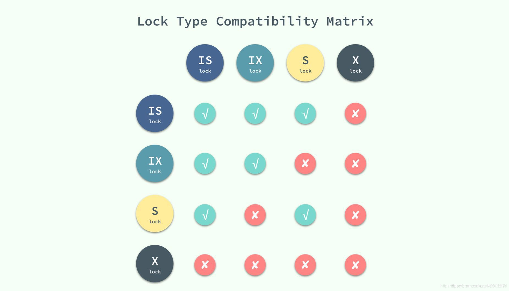
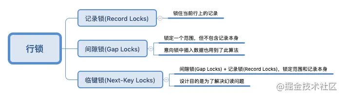
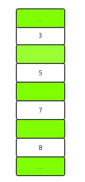
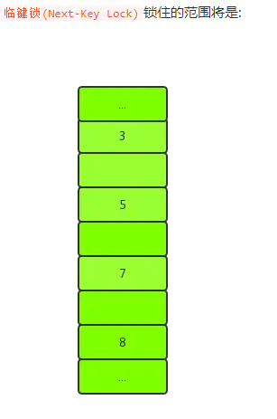

# MySQL锁

[TOC]


## 锁的种类

1. 按照锁的粒度划分：行锁、表锁、页锁（前两者的折中）
2. 按照锁的使用方式划分：共享锁、排它锁（悲观锁的一种实现）
3. 还有两种思想上的锁：悲观锁、乐观锁
4. InnoDB中有几种行级锁类型：Record Lock、Gap Lock（间隙锁）、Next-key Lock（Record Lock+Gap Lock）
5. 意向锁：意向共享锁（IS）、意向排它锁（IX）


## 行锁

> 注意 MySQL 的行锁是**针对索引加的锁**,不是针对记录加的锁,所以虽然是访问不同行 的记录,但是如果是使用相同的索引键,是会出现锁冲突的。

粒度最细的锁，只对当前操作的行加锁，**行级锁能大大减少数据库操作的冲突。**

**其加锁粒度最小，但加锁的开销也最大。有可能会出现死锁的情况。**

行级锁按照使用方式分为**共享锁（S锁，读锁）和排他锁（X锁，写锁）**。


### 共享锁

> 共享锁就是多个事务对于同一数据可以**共享一把锁**，都能访问到数据，但是**只能读不能改**

若事务T对数据对象A加上S锁，则事务T**可以读A但不能修改A**，其他事务**只能再对A加S锁**，**而不能加X锁**，直到T释放A上的S锁。这保证了其他事务可以读A，但在T释放A上的S锁之前不能对A做任何修改。

~~~mysql
select ... lock in share mode;
~~~


**允许多个线程同时获取一个锁，一个锁可以同时被多个线程拥有**


## 意向锁

InnoDB支持多粒度的锁，即：允许表锁和行锁同时存在。

但是，假如表锁覆盖了行锁的数据，所以**表锁和行锁也会产生冲突**。

为了解决这种表行锁共存带来的问题，就有了意向锁

- `意向共享锁`。它预示着，事务有意向对表中的"某些行"加S锁。`select xxxx lock in share mode`，要设置`IS`锁。
- `意向排他锁`。它预示着，事务有意向表中的“某些行”加X锁。`select xxx for update`，要设置`IX`锁。

但意向锁仅仅是表明意向，它其实非常弱，意向锁之间可以相互并行，并不是排斥的




### 排它锁

> 排它锁不能与其它锁并存，如一个事务获取了一个数据行的排它锁，其它事务就不能再获得该行的其它锁，**包括共享锁和排它锁**，但是获取此数据行排它锁的事务可以对数据进行读取和修改

若事务T对数据对象A加上X锁，事务T**可以读A也可以修改A**，其他事务不能再对A加任何锁，直到T释放A上的锁。这**保证了其他事务在T释放A上的锁之前不能再读取和修改A**。

~~~mysql
select ... for update
~~~


**排它锁，也称作独占锁，一个锁在某一时刻只能被一个线程占有，其它线程必须等待锁被释放之后才可能获取到锁。**


## 表锁

粒度最大的一种锁，表示当前的操作对整张表加锁，资源开销比行锁小，不会出现死锁的情况，但是发生锁冲突的概率很大，MyISAM和InnoDB都支持表级锁，但是InnoDB默认的是行级锁。

**共享锁用法**：

```mysql
LOCK TABLE table_name [ AS alias_name ] READ
1
```

**排它锁用法**：

```mysql
LOCK TABLE table_name [AS alias_name][ LOW_PRIORITY ] WRITE
1
```

**解锁用法**：

```mysql
unlock tables;
```


## 悲观锁

操作数据时直接把数据锁住，直到操作完成后才会释放锁；上锁期间其他人不能修改数据。

在尝试任意记录进行修改前，先尝试为该记录加上排它锁，如果加锁失败，说明该记录正在被修改，那么当前操作可能要等待或者抛出异常。

**先取锁在访问**，为安全性提供了保证，但是，额外的加锁机制产生了额外的开销，并且**增加了死锁的机会，降低了并发性**

比较适合写入操作比较频繁的场景


## 乐观锁

在数据进**行提交更新（去执行修改）的时候，才会对数据的冲突与否进行检测**，如果发现冲突了，则让返回用户错误的信息，让用户决定如何去做。

相对于悲观锁，在对数据库进行处理的时候，乐观锁并不会使用数据库提供的锁机制。一般的实现乐观锁的方式就是记录**数据版本或者时间戳**

> 数据版本,为数据增加的一个版本标识。当读取数据时，将版本标识的值一同读出，数据每更新一次，同时对版本标识进行更新。当我们提交更新的时候，判断数据库表对应记录的当前版本信息与第一次取出来的版本标识进行比对，如果数据库表当前版本号与第一次取出来的版本标识值相等，则予以更新，否则认为是过期数据。

乐观并发控制相信事务之间的数据竞争(data race)的概率是比较小的，因此尽可能直接做下去，直到提交的时候才去锁定，所以**不会产生任何锁和死锁**。但如果直接简单这么做，还是有可能会遇到不可预期的结果，例如两个事务都读取了数据库的某一行，经过修改以后写回数据库，这时就遇到了问题。

比较适合读取操作比较频繁的场景，如果出现大量的写入操作，数据发生冲突的可能性就会增大，为了保证数据的一致性，应用层需要不断的重新获取数据，这样会增加大量的查询操作，降低了系统的吞吐量。


---




## Record Lock

> 锁直接加在索引记录上面，锁住的是key。假如没有任何一个索引，那么InnoDB会锁住隐形创建的那个主键。


## Gap Lock

> 间隙锁开启的事务隔离级别是 `Repeatable Read`，如果把数据库事务级别降为`Read Committed`，间隙锁则会自动失效

- 因为行锁只能锁住行，但是新插入记录的动作，要更新的是记录之间的间隙（更具体而言是索引叶子结点的next指针），锁住两个值之间的间隙，不允许之间再插入一个值
- 一个空表就只有一个间隙，也就是**间隙锁可能包括单个索引值，多个索引值，或者甚至为空**
- 另外注意，间隙锁即使产生冲突也可以**共存**，比如，事务A在间隙上拥有共享锁，事务B在同样的间隙上拥有排他锁。


**间隙锁只会出现在辅助索引（又叫普通索引或非聚集索引）上**

**唯一索引（行锁就可以）和主键索引是没有间隙锁。**

**间隙锁（无论是S还是X）只会阻塞insert操作**



> **对主键索引或者唯一索引而言**

- 对于**指定查询某一条记录**的加锁语句，如果该记录不存在，会产生记录锁和间隙锁；如果记录存在，则只会产生记录锁，此时无间隙锁。
- 对于查找某一范围内的查询语句，会产生间隙锁。


~~~mysql
select * from t where id = 10 for update;
-- 注意：普通查询是快照读，不需要加锁
-- 如果，上面语句中id列没有建立索引或者是非唯一索引时，则语句会产生间隙锁
~~~


> 对于普通索引而言

在普通索引列上，不管是何种查询，**只要加锁，都会产生间隙锁**，这跟唯一索引不一样；
在普通索引跟唯一索引中，数据间隙的分析，数据行是优先根据普通索引排序，再根据唯一索引排序。


### 如何解决幻读问题

在一行行扫描的过程中， 不仅将给行加上了行锁， 还给行两边的空隙， 也加上了间隙锁。


## Next-key Lock

> 既封锁了"缝隙"，又封锁了索引本身。左开右闭
>
> **Next-Key Lock = Record Lock + Gap Lock**

`Next-key Lock`在索引具有唯一性的时候，例如主键索引的数据，将会降级为`记录锁(Read Lock)`，以增加并发性。



record lock、gap lock、next-key lock，都是加在索引上的。假设有记录1,3,5,7，则5上的记录锁会锁住5，5上的gap lock会锁住(3,5)，5上的next-key lock会锁住(3,5]。

