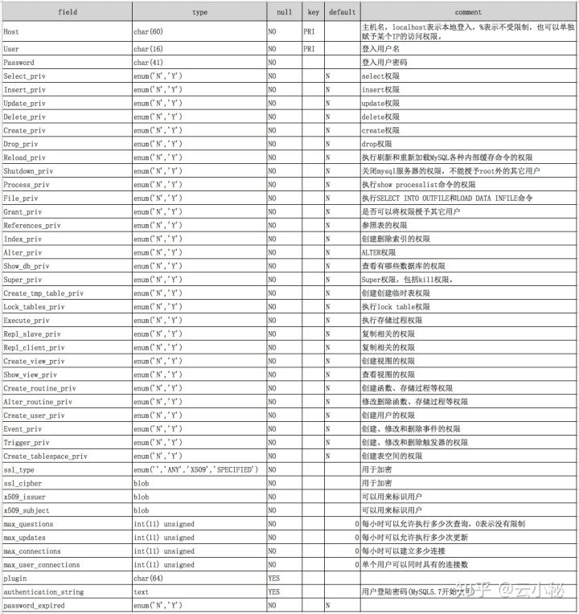
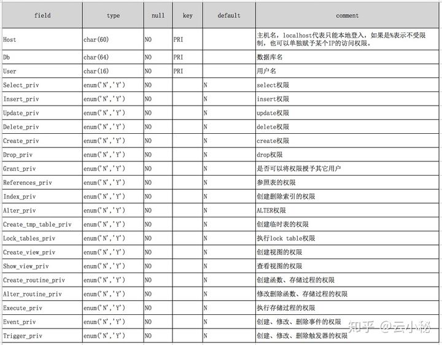
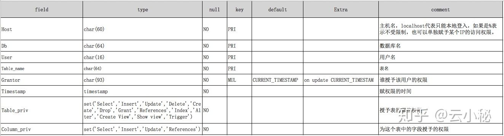
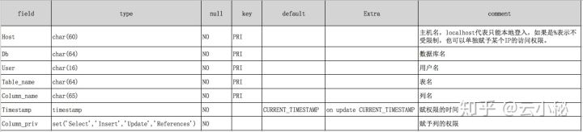
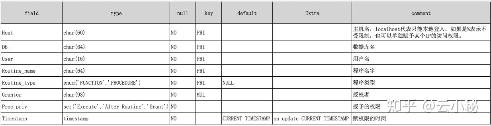

## MySQL权限详解

### 权限表字段详解

**1.user表**

user表的权限是基于服务器范围的所有权限，比如用户拥有服务器中所有数据库的select权限那么在user表中的Select_priv列为Y,如果用户单单只拥有某个一数据库的select权限那么user表中的Select_priv为N,会在DB表中记录一条信息在DB表中的select_priv为Y。

~~~mysql
desc mysql.user;
~~~




**2.db表**

如果授予一个用户单独某个数据库的权限，就会在db表中记录一条相关信息。

```mysql
desc mysql.db;
```




**3.tables_priv表**

```mysql
desc mysql.tables_priv;
```



> 上面的Column_priv比较奇怪，因为照理说tables_priv只显示表级别的权限，列级别的权限应该在columns_priv里显示才对。后来查了资料才知道，原来这是为了提高权限检查时的性能，试想一下，权限检查时，如果发现tables_priv.Column_priv为空，就不需要再检查columns_priv表了，这种情况在现实中往往占大多数。


**4. columns_priv表**

```mysql
desc mysql.columns_priv;
```




**5. procs_priv表**

```mysql
desc mysql.procs_priv;
```




### 权限管理

#### 1.用户创建

- 通过create user语句创建用户

在执行CREATE USER或CRANT语句后，MySQL服务器会修改相应的用户权限表，添加或修改用户及权限。

```mysql
create user 'USERNAME'@'HOST' identified by 'PASSWORD';
```

> mysqlHOST的形式：1. IP地址，如172.16.16.1；2. 主机名，如localhost；3. 网络地址，如172.16.0.04. 通配符，如%：匹配任意字符_：匹配任意单个字符如172.16.16._(允许172.16.16.1-172.16.16.9)

eg:

```mysql
mysql> CREATE USER 'jeffrey'@'localhost' IDENmysqlTIFIED BY 'mypass';
Query OK, 0 rows affected (0.00 sec)
```

- 通过grant语句创建新用户

GRANT语句是添加新用户并授权它们访问MySQL对象的**首选方法**，其语法格式为：

```mysql
grant all on DB_NAME.TABLE_NAME to 'USERNAME'@'HOST' identified by 'PASSWORD';
```

> HOST的表现形式和create user一样

eg：

```mysql
-- 用户 testUser对所有的数据有查询和更新权限，并授于对所有数据表的SELECT和UPDATE权限
mysql> GRANT SELECT,UPDATE  ON *.* TO 'testUser'@'localhost' IDENTIFIED BY 'testpwd';
Query OK, 0 rows affected (0.00 sec)
```

1) 创建root用户

```mysql
mysql> GRANT ALL PRIVILEGES ON *.* TO 'root'@'localhost' IDENTIFIED BY 'root' WITH GRANT OPTION;
mysql> flush privileges;
```

2). 创建一个基本的增删改查用户

```mysql
mysql> GRANT UPDATE, DELETE, INSERT, SELECT ON *.* TO 'test'@'%' identified by 'test' WITH MAX_QUERIES_PER_HOUR 0 MAX_CONNECTIONS_PER_HOUR 0 MAX_UPDATES_PER_HOUR 0 MAX_USER_CONNECTIONS 0; 
mysql> flush privileges;
# MAX_QUERIES_PER_HOUR，MAX_CONNECTIONS_PER_HOUR，MAX_UPDATES_PER_HOUR设置为0表示不限制
```

3). 创建数据库基本的增删改查用户

```mysql
mysql> GRANT SELECT, INSERT, UPDATE, DELETE, SHOW VIEW, EXECUTE ON `db_name`.* TO 'test'@'%' identified by  'test';
mysql> flush privileges;
```

4). 授予数据库名以db开头的数据库的权限

```mysql
mysql> GRANT SELECT, INSERT, UPDATE, DELETE, SHOW VIEW, EXECUTE ON `db%`.* TO 'perform'@'%';
mysql> flush privileges;
```

5). 创建备份用户权限

```mysql
mysql> GRANT SELECT,EVENT,SHOW DATABASES,LOCK TABLES,SUPER,REPLICATION CLIENT ON *.* TO 'backup'@'localhost' identified by 'backup';
mysql> flush privileges;
```

6). 备份恢复用户权限

```mysql
mysql> GRANT INSERT, UPDATE, DELETE, CREATE, DROP, INDEX, ALTER,CREATE VIEW, SHOW VIEW, CREATE ROUTINE, ALTER ROUTINE, EVENT, TRIGGER ON *.* TO 'restore'@'localhost' identified by '123456';
mysql> flush privileges;
```

7). 复制用户权限

```mysql
mysql> GRANT PROCESS, REPLICATION SLAVE, REPLICATION CLIENT ON *.* TO 'repl'@'%' IDENTIFIED BY '123456';
mysql> flush privileges;
```


#### 2.用户删除

```mysql
mysql> drop user 'USERNAME'@'HOST';
# 删除MySQL默认的无用账户;
mysql> drop user 'root'@'localhost.localdomain';
 
# 删除MySQL默认的无用账户;
mysql> drop user 'root'@'127.0.0.1';
```


#### 3.更改用户名

```mysql
mysql> rename user OLD_NAME to NEW_NAME; 
```


#### 4.修改用户密码

- 通过mysqladmin工具

```mysql
# 给root@localhost用户登录mysql设置密码为"redhat";
$ mysqladmin -u root -h localhost password "redhat" 
 
# 修改root@localhost用户登录mysql数据库的密码;
$ mysqladmin -u root -h localhost password "new passwd" -p "old passwd"
```

- 通过直接修改mysql.user表的用户记录

```mysql
# MySQL 5.6
mysql> update mysql.user set password=PASSWORD('redhat') where user='root';
mysql> flush privileges;
 
# MySQL 5.7
mysql> update mysql.user set authentication_string=PASSWORD('redhat') where user='root';
mysql> flush privileges;
```

- set password语句

```mysql
mysql> set password for 'root'@'localhost'=PASSWORD('redhat');
mysql> flush privileges;
```

- ALTER USER语句(MYSQL5.7版本)

```mysql
mysql> use mysql
mysql> alter user root@'localhost' identified by '123456';
mysql> flush privileges;
```


### 经验

**1. 用户管理经验**

- 1)、尽量使用create user, grant等语句，而不要直接修改权限表。

虽然create user, grant等语句底层也是修改权限表，和直接修改权限表的效果是一样的，但是，对于非高手来说，采用封装好的语句肯定不会出错，而如果直接修改权限表，难免会漏掉某些表。而且，修改完权限表之后，还需要执行flush privileges重新加载到内存，否则不会生效。

- 2). 把匿名用户删除掉。

匿名用户没有密码，不但不安全，还会产生一些莫名其妙的问题，强烈建议删除。

**2. 权限管理经验**

- 1)、只授予能满足需要的最小权限，防止用户干坏事。比如用户只是需要查询，那就只给select权限就可以了，不要给用户赋予update、insert或者delete权限。
- 2)、创建用户的时候限制用户的登录主机，一般是限制成指定IP或者内网IP段。
- 3)、初始化数据库的时候删除没有密码的用户。安装完数据库的时候会自动创建一些用户，这些用户默认没有密码。
- 4)、为每个用户设置满足密码复杂度的密码。
- 5)、定期清理不需要的用户，回收权限或者删除用户。


