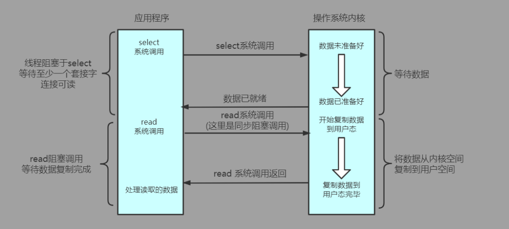

# IO多路复用

[TOC]

> I/O多路复用就通过一种机制，可以监视多个描述符，一旦某个描述符就绪（一般是读就绪或者写就绪），能够通知程序进行相应的读写操作
>
> 在一次事件循环中只需要进行一次I/O多路复用的系统调用就能得到所传递文件描述符集合的I/O状态，减少了原始NIO模型中不必要的系统调用开销。
>
> 多路复用I/O模型大致可以分为三种实现**（select、poll、epoll）**

## 水平触发和边缘触发

**水平触发LT**:

只要文件描述符关联的 内核读缓冲区 非空，有数据可以读取，就一直发出可读信号进行通知

只要文件描述符关联的 内核写缓冲区 非空，有空间可以写入，就一直发出可写信号进行通知

存在大量不需要读写的就绪文件描述符，每次都会返回（降低效率）

**优缺点**：

- **优点:** 主要在于其简单且稳定,不容易出现问题.传统的select和poll都是使用这个模式
- **缺点:** 事件触发过多导致效率降低

 **边缘触发ET**:

当文件描述符关联的 内核读缓冲区 由空转化为非空，发出 可读信号

当文件描述符关联的 内核写缓冲区 由满转化为不满，发出 可写信号

若未将数据全部读写完，不会再次通知，直到该文件描述符上 出现第二次可读写事件 才通知

**优缺点:**

- **优点:** 减少了epoll的触发次数,但是也带来了巨大的代价
- **缺点:** 要求必须一次性将所有的数据处理完,虽然效率得到了提高,但是代码的复杂程度大大的增加了 Nginx就是默认采用ET模式

**边触只有在新数据到来的情况下才会触发事件**，而水触只要缓冲区还有数据，就会一直触发事件

在收到一个IO事件通知后要尽可能多的执行IO操作,因为如果在一次通知中没有执行完IO那么就需要等到下一次新的IO活动到来才能获取到就绪的描述符.信号驱动式IO就属于边缘触发.epoll既支持水平触发也支持边缘触发，默认是水平触发。

## select

select I/O多路复用器允许应用程序传递需要监听事件变化的文件描述符集合，监听其读/写，接受连接等I/O事件的状态。

select系统调用本身是**同步、阻塞**的，当所传递的文件描述符集合中都没有就绪的I/O事件时，执行select系统调用的线程将会进入阻塞态，直到至少一个文件描述符对应的I/O事件就绪，则唤醒被select阻塞的线程(**可以指定超时时间来强制唤醒并返回**)。唤醒后获得CPU的线程在select系统调用返回后可以遍历所传入的文件描述符集合，处理完成了I/O事件的文件描述符。

**select的优点：**

　　**1. select多路复用避免了上述原始NIO模型中无谓的多次查询I/O状态的系统调用，将其聚合成集合，批量的进行监听并返回结果集。**

　　**2. select实现相对简单，windows、linux等主流的操作系统都实现了select系统调用，跨平台的兼容性好。**

**select的缺点：**

　　**1. 在事件循环中，每次select系统调用都需要从用户态全量的传递所需要监听的文件描述符集合，并且select返回后还需要全量遍历之前传入的文件描述符集合的状态。**

　　**2. 出于性能的考量，内核设置了select所监听文件描述符集合元素的最大数量(一般为1024，可在内核启动时指定)，使得单次select所能监听的连接数受到了限制。**

　　**3. 抛开性能的考虑，从接口设计的角度来看，select将系统调用的参数与返回值混合到了一起(返回值覆盖了参数)，增加了使用者理解的困难度。**

## poll

poll I/O多路复用器在使用上和select大同小异，也是通过传入指定的文件描述符集合以及指定内核监听对应文件描述符上的I/O事件集合，但在实现的细节上**基于select做了一定的优化**。

和select一样，poll系统调用在没有任何就绪事件发生时也是**同步、阻塞**的(**可以指定超时时间强制唤醒并返回**)，当返回后要判断是否有就绪事件时，也一样需要全量的遍历整个返回的文件描述符集合。

**poll的优点：**

　　**1. poll解决了select系统调用受限于内核配置参数的限制问题，可以同时监听更多文件描述符的I/O状态(但不能超过内核限制当前进程所能拥有的最大文件描述符数目限制)。**

　　**2. 优化了接口设计，将参数与返回值的进行了分离。**

**poll的缺点：**

　　**1. poll优化了select，但在处理大量闲置连接时，即使真正产生I/O就绪事件的活跃文件描述符数量很少，依然免不了线性的遍历整个监听的文件描述符集合。每次调用时，需要全量的将整个感兴趣的文件描述符集合从用户态复制到内核态。**

　　**2. 由于select/poll都需要全量的传递参数以及遍历返回值，因此其时间复杂度为O(n)，即处理的开销随着并发连接数n的增加而增加，而无论并发连接本身活跃与否。但一般情况下即使并发连接数很多，大量连接都产生I/O就绪事件的情况并不多，更多的情况是1W的并发连接，可能只有几百个是处于活跃状态的，这种情况下select/poll的性能并不理想，还存在优化的空间。**

## epoll

epoll是linux系统中**独有的**，针对select/poll上述缺点进行改进的高性能I/O多路复用器。

**针对poll系统调用介绍中的第一个缺点：在每次事件循环时都需要从用户态全量传递整个需要监听的文件描述符集合**。

　　epoll在内核中分配内存空间用于缓存被监听的文件描述符集合。通过创建epoll的系统调用（epoll_create），在内核中维护了一个epoll结构，而在应用程序中只需要保留epoll结构的句柄就可对其进行访问(也是一个文件描述符)。可以动态的在epoll结构的内核空间中增加/删除/更新所要监听的文件描述符以及不同的监听事件（epoll_ctl），而不必每次都全量的传递需要监听的文件描述符集合。

　　**针对select/poll的第二个缺点：在系统调用返回后通过修改所监听文件描述符结构的状态，来标识文件描述符对应的I/O事件是否就绪。每次系统调用返回时，都需要全量的遍历整个监听文件描述符集合，而无论是否真的完成了I/O。**

　　epoll监听事件的系统调用完成后，只会将真正活跃的、完成了I/O事件的文件描述符返回，避免了全量的遍历。在并发的连接数很大，但闲置连接占比很高时，epoll的性能大大优于select/poll这两种I/O多路复用器。**epoll的时间复杂度为O(m)，即处理的开销不随着并发连接n的增加而增加，而是仅仅和监控的活跃连接m相关；在某些情况下n远大于m，epoll的时间复杂度甚至可以认为近似的达到了O(1)。**

　　**通过epoll_wait系统调用，监听参数中传入对应epoll结构中关联的所有文件描述符的对应I/O状态。epoll_wait本身是同步、阻塞的(可以指定超时时间强制唤醒并返回)，当epoll_wait同步返回时，会返回处于活跃状态的完成I/O事件的文件描述符集合，避免了select/poll中的无效遍历。同时epoll使用了mmap机制，将内核中的维护的就绪文件描述符集合所在空间映射到了用户态，令应用程序与epoll的内核共享这一区域的内存，避免了epoll返回就绪文件描述符集合时的一次内存复制。**

**epoll的优点：**

　　epoll是目前性能最好的I/O多路复用器之一，具有I/O多路复用优点的情况下很好的解决了select/poll的缺陷。目前linux平台中，像nginx、redis、netty等高性能服务器都是首选epoll作为基础来实现网络I/O功能的。

epoll**没有最大并发连接的限制**，上限是最大可以打开文件的数目頭條萊垍

效率更高，epoll**只管活跃的连接**，而与连接总数无关頭條萊垍

内存使用上epoll使用了共享内存，所以内存拷贝也省略了(Epoll 使用了 mmap 加速内核与用户空间的消息传递。这点涉及了 epoll 的具体实现。无论是select, poll，还是 epoll，都需要内核把 FD 消息通知给用户空间，如何避免不必要的内存拷贝就很 重要。在这点上，Epoll 是通过内核与用户空间 mmap 同一块内存实现的。

**epoll的缺点：**

  　　1. 常规情况下闲置连接占比很大，epoll的性能表现的很好。但是也有少部分场景中，绝大多数连接都是活跃的，那么其性能与select/poll这种基于位图、数组等简单结构的I/O多路复用器相比，就不那么有优势了。因为select/poll被诟病的一点就是通常情况下进行了无谓的全量检查，而当活跃连接数占比一直超过90%甚至更高时，就不再是浪费了;相反的，由于epoll内部结构比较复杂，在这种情况下其性能比select/poll还要低一点。

  　　2. epoll是linux操作系统下独有的，使得基于epoll实现的应用程序的跨平台兼容性受到了一定影响。

