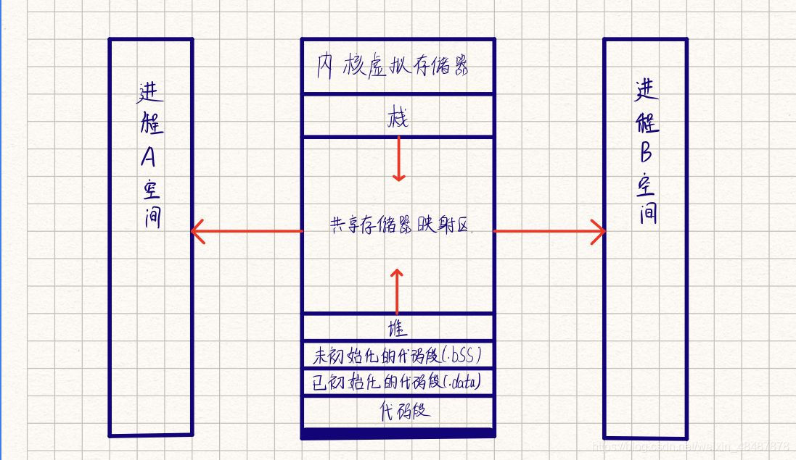

# 共享内存

共享内存就是在内存中划出一块区域作为公共区域，**允许多个进程共享这个存储区，允许两个不相关的进程访问同一个逻辑内存**，在操作系统中，这段物理内存属于临界区资源，正是因为临界区资源可以共享数据不需要在客户端和服务器的多进程之间复制（即数据传递不再与内核相关），所以这是最快的一种进程间通信的方式

**共享内存的特点**

1. 共享内存允许两个不相关的进程访问同一个内存
2. 共享内存是两个正在运行的进程之间和传递数据的最有效方式，因为进程可以直接读写内存，而不需要任何数据的拷贝
3. 不同进程之间共享的内存通常安排为同一段物理内存
4. 共享内存不提供任何互斥和同步机制，一般用信号量对临界资源进行保护。

共享内存并未提供同步机制，也就是说，在第一个进程结束对共享内存的写操作之前，并无自动机制可以阻止第二个进程开始对它进行读取。一般情况下：信号量/记录锁/互斥量用于同步共享内存访问。

- **标识符**：是用来标识共享内存的，相当于共享内存的身份证，**意味着不同的进程可以通过标识符找到这个共享内存**
- **操作句柄**：进程可以通过操作句柄来**对共享内存进行操作(附加，分离，删除)**
- **共享内存被释放掉之后，但是还是有进程在附加着共享内存，当前描述共享内存的结构体并没有被释放，直到当前共享内存的附加进程数量为0的时候才会释放掉**。

