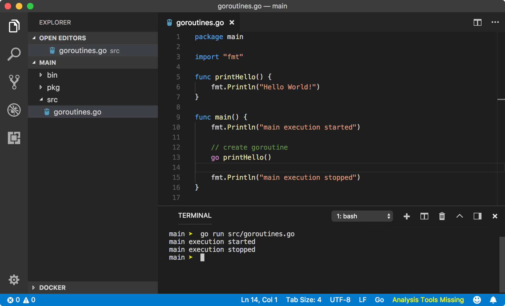
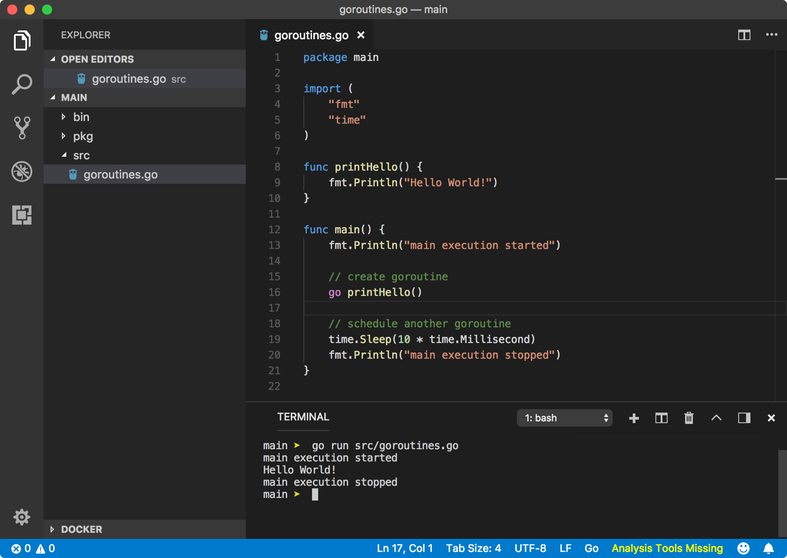

# 协程

[TOC]

## 区别

 **进程：**是资源分配的最小单位，一个进程可以有多个线程，多个线程共享进程的堆和方法区资源，不共享栈、程序计数器

 **线程：**是任务调度和执行的最小单位，线程并行执行存在资源竞争和上下文切换的问题

 **协程：**是一种比线程更加轻量级的存在，正如一个进程可以拥有多个线程一样，一个线程可以拥有多个协程。

## go协程

Go 中提供了一个关键字 `go` 来让我们创建一个 Go 协程，当我们在函数或方法的调用之前添加一个关键字 `go`，这样我们就开启了一个 Go 协程，该函数或者方法就会在这个 Go 协程中运行。

奇怪的是，`Hello World` 并没有如同我们预料的那样输出，这期间究竟发生了什么？

go 协程总是在后台运行，当一个 Go 协程执行的时候（在这个例子中是 `go printHello()`）, Go 直接忽略了 Go 协程的返回并继续执行 main 函数剩下的语句。**即便如此，我们为什么没法看到函数的输出呢？**

在默认情况下，每个独立的 Go 应用运行时就创建了一个 Go 协程，其 `main` 函数就在这个 Go 协程中运行，这个 Go 协程就被称为 `go 主协程（main Goroutine，下面简称主协程）`。在上面的例子中，`主协程` 中又产生了一个 `printHello` 这个函数的 Go 协程，我们暂且叫它 `printHello 协程` 吧，因而我们在执行上面的程序的时候，就会存在两个 Go 协程（`main` 和 `printHello`）同时运行。正如同以前的程序那样，go 协程们会进行协同调度。因此，当 `主协程` 运行的时候，Go 调度器在 `主协程` 执行完之前并不会将控制权移交给 `printHello 协程`。不幸的是，一旦 `主协程` 执行完毕，整个程序会立即终止，调度器再也没有时间留给 `printHello 协程` 去运行了。

上图所示，我们修改了程序，程序在 main 函数的最后一条语句之前调用了 `time.Sleep(10 * time.Millisecond)`，使得 `主协程` 在执行最后一条指令之前调度器就将控制权转移给了 `printhello 协程`。在这个例子中，我们通过调用 `time.Sleep(10 * time.Millisecond)` 强行让 `主协程` 休眠 10ms 并且在在这个 10ms 内不会再被调度器重新调度运行。

