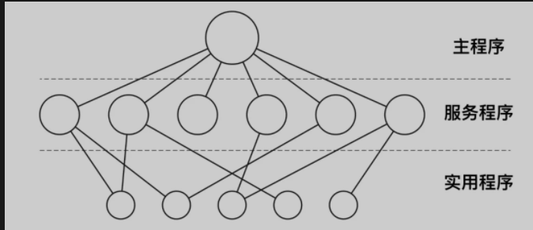
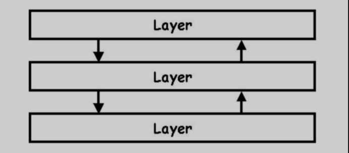
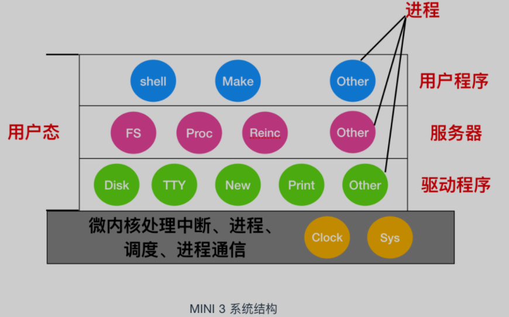
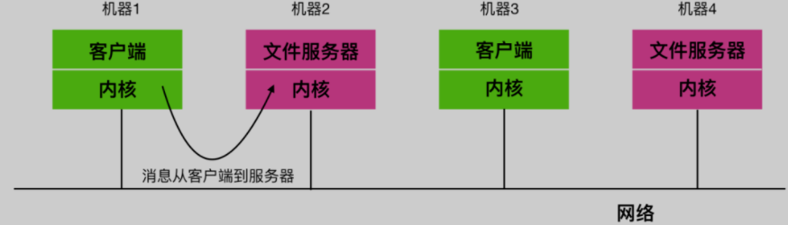

# 操作系统基础

[TOC]

## 基础概念

- **操作系统（英语：Operating System，简称OS）是管理计算机硬件与软件资源的程序，是计算机系统的内核与基石；**
- **操作系统本质上是运行在计算机上的软件程序 ；**
- **为用户提供一个与系统交互的操作界面 ；**
- **操作系统分内核与外壳（我们可以把外壳理解成围绕着内核的应用程序，而内核就是能操作硬件的程序）。**

操作系统是运行在计算机上最重要的一种**软件**，它管理**计算机的资源和进程以及所有的硬件和软件**。它为计算机硬件和软件提供了一种**中间层**

通常情况下，计算机上会运行着许多应用程序，它们都需要对内存和 CPU 进行交互，操作系统的目的就是为了保证这些访问和交互能够准确无误的进行

## 主要作用

- 管理计算机资源，这些资源包括 CPU、内存、磁盘驱动器、打印机等。
- 提供一种图形界面，就像我们前面描述的那样，它提供了用户和计算机之间的桥梁。
- 为其他软件提供服务，操作系统与软件进行交互，以便为其分配运行所需的任何必要资源。

## 基本功能

1. 进程管理

进程控制、进程同步、进程通信、死锁处理、处理机调度等。

2. 内存管理

内存分配、地址映射、内存保护与共享、虚拟内存等。

3. 文件管理

文件存储空间的管理、目录管理、文件读写管理和保护等。

4. 设备管理

完成用户的 I/O 请求，方便用户使用各种设备，并提高设备的利用率。

主要包括缓冲管理、设备分配、设备处理、虛拟设备等。

## 基本特征

- 并发

  并发是指宏观上在一段时间内能同时运行多个程序，而并行则指同一时刻能运行多个指令。

  并行需要硬件支持，如多流水线、多核处理器或者分布式计算系统。

  操作系统通过引入进程和线程，使得程序能够并发运行。

- 共享

  共享是指系统中的资源可以被多个并发进程共同使用。

  有两种共享方式：互斥共享和同时共享。

  互斥共享的资源称为临界资源，例如打印机等，在同一时刻只允许一个进程访问，需要用同步机制来实现互斥访问。

- 虚拟

  虚拟技术把一个物理实体转换为多个逻辑实体。

  主要有两种虚拟技术：时（时间）分复用技术和空（空间）分复用技术。

  多个进程能在同一个处理器上并发执行使用了时分复用技术，让每个进程轮流占用处理器，每次只执行一小个时间片并快速切换。

  虚拟内存使用了空分复用技术，它将物理内存抽象为地址空间，每个进程都有各自的地址空间。地址空间的页被映射到物理内存，地址空间的页并不需要全部在物理内存中，当使用到一个没有在物理内存的页时，执行页面置换算法，将该页置换到内存中。

- 异步

  异步指进程不是一次性执行完毕，而是走走停停，以不可知的速度向前推进。

## 操作系统结构

### 单体系统

在大多数系统中，整个系统在内核态以单一程序的方式运行。整个操作系统是以程序集合来编写的，链接在一块形成一个大的二进制可执行程序，这种系统称为单体系统。

在单体系统中构造实际目标程序时，会首先编译所有单个过程（或包含这些过程的文件），然后使用系统链接器将它们全部绑定到一个可执行文件中

在单体系统中，对于每个系统调用都会有一个服务程序来保障和运行。需要一组实用程序来弥补服务程序需要的功能，例如从用户程序中获取数据。可将各种过程划分为一个三层模型

除了在计算机初启动时所装载的核心操作系统外，许多操作系统还支持额外的扩展。比如 I/O 设备驱动和文件系统。这些部件可以按需装载。在 UNIX 中把它们叫做 共享库(shared library)，在 Windows 中则被称为 动态链接库(Dynamic Link Library,DLL)。

### 分层系统

分层系统使用层来分隔不同的功能单元。每一层只与该层的上层和下层通信。每一层都使用下面的层来执行其功能。层之间的通信通过预定义的固定接口通信。

### 微内核

为了实现高可靠性，将操作系统划分成小的、层级之间能够更好定义的模块是很有必要的，只有一个模块 --- 微内核 --- 运行在内核态，其余模块可以作为普通用户进程运行。由于把每个设备驱动和文件系统分别作为普通用户进程，这些模块中的错误虽然会使这些模块崩溃，但是不会使整个系统死机。

MINIX 3 是微内核的代表作，它的具体结构如下

在内核的外部，系统的构造有三层，它们都在用户态下运行，最底层是设备驱动器。由于它们都在用户态下运行，所以不能物理的访问 I/O 端口空间，也不能直接发出 I/O 命令。相反，为了能够对 I/O 设备编程，驱动器构建一个结构，指明哪个参数值写到哪个 I/O 端口，并声称一个内核调用，这样就完成了一次调用过程。

### 客户-服务器模式

微内核思想的策略是把进程划分为两类：服务器，每个服务器用来提供服务；客户端，使用这些服务。这个模式就是所谓的 客户-服务器模式。

客户-服务器模式会有两种载体，一种情况是一台计算机既是客户又是服务器，在这种方式下，操作系统会有某种优化；但是普遍情况下是客户端和服务器在不同的机器上，它们通过局域网或广域网连接。

客户通过发送消息与服务器通信，客户端并不需要知道这些消息是在本地机器上处理，还是通过网络被送到远程机器上处理。对于客户端而言，这两种情形是一样的：都是发送请求并得到回应。

## 内核

在计算机中，内核是一个计算机程序，它是操作系统的核心，可以控制操作系统中所有的内容。内核通常是在 boot loader 装载程序之前加载的第一个程序。

boot loader 又被称为引导加载程序，它是一个程序，能够将计算机的操作系统放入内存中。在电源通电或者计算机重启时，BIOS 会执行一些初始测试，然后将控制权转移到引导加载程序所在的主引导记录(MBR) 。

