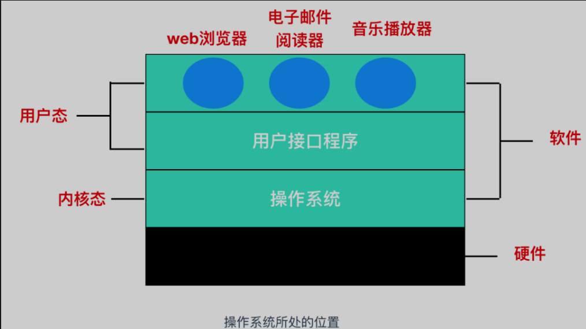

# 用户态内核态

[TOC]

## 简介

内核态：cpu可以访问内存的所有数据，包括外围设备，例如硬盘，网卡，cpu也可以将自己从一个程序切换到另一个程序。**当一个任务（进程）执行系统调用而陷入内核代码中执行时，称进程处于内核运行态（内核态）。**

用户态：只能受限的访问内存，且不允许访问外围设备，占用cpu的能力被剥夺，cpu资源可以被其他程序获取。**当进程在执行用户自己的代码时，则称其处于用户运行态（用户态）**。

## 为什么要有这两态

> 由于需要限制不同的程序之间的访问能力, 防止他们获取别的程序的内存数据, 或者获取外围设备的数据, 并发送到网络

## 切换

这三种方式是系统在运行时由用户态切换到内核态的最主要方式，其中系统调用可以认为是用户进程主动发起的，异常和外围设备中断则是被动的。

从触发方式上看，切换方式都不一样，但从最终实际完成由用户态到内核态的切换操作来看，涉及步骤是一样的，都相当于执行了一个中断响应的过程。系统调用实际上最终是中断机制实现的，而异常和中断的处理机制基本一致。

### 系统调用

这是用户态进程**主动要求切换到内核态**的一种方式。用户态进程通过系统调用申请使用操作系统提供的服务程序完成工作。例如fork（）就是执行了一个创建新进程的系统调用。系统调用的机制核心是使用了操作系统为用户特别开放的一个中断来实现，如Linux的int 80h中断。

### 异常

当cpu在执行运行在用户态下的程序时，发生了一些没有预知的异常，这时会触发由当前运行进程**切换到处理此异常的内核相关进程中**，也就是**切换到了内核态**，如缺页异常。

### 外围设备的中断

 当外围设备完成用户请求的操作后，会向CPU发出相应的中断信号，这时CPU会由用户态到内核态的切换。