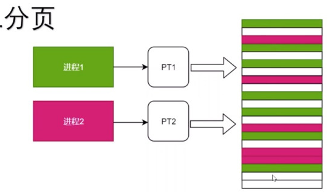
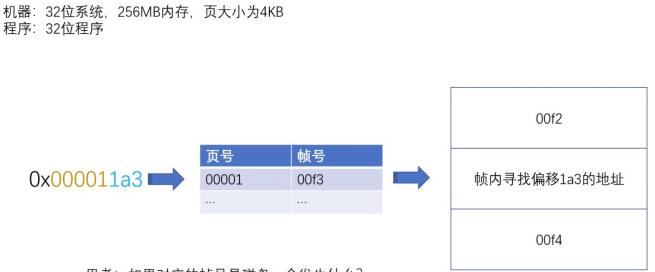

# 虚拟内存

[TOC]

虚拟内存是一种**内存分配方案**，是一项可以用来辅助内存分配的机制。应用程序是**按页装载进内存中**的。但并不是所有的页都会装载到内存中，计算机中的硬件和软件会将数据**从 RAM 临时传输到磁盘中**来弥补内存的不足。对于虚拟内存，计算机可以执行操作是查看**内存中最近未使用过的区域，然后将其复制到硬盘上**。

虚拟内存的基本思想是，每个进程有用独立的逻辑地址空间，内存被分为大小相等的多个块,称为页(Page)（Linux默认页大小是4kb）.每个页都是一段连续的地址。**对于进程来看,逻辑上貌似有很多内存空间，其中一部分对应物理内存上的一块(称为页框，通常页和页框大小相等)，还有一些没加载在内存中的对应在硬盘上**

虚拟内存实际上可以比物理内存大。当访问虚拟内存时，会访问**MMU（内存管理单元，负责把虚拟地址转化为物理地址，再通过总线访问内存，内存从总线中获取物理地址，无需直到虚拟地址）**去匹配对应的物理地址

**而如果虚拟内存的页并不存在于物理内存中，会产生缺页中断，从磁盘中取得缺的页放入内存，如果内存已满，还会根据某种算法将磁盘中的页换出。**

而虚拟内存和物理内存的匹配是通过页表实现，页表存在MMU中

## 没有虚拟内存的问题

- 多个程序需要运行，但是内存空间不足了，就需要将其他程序暂时拷贝到硬盘当中，然后将新的程序装入内存运行.由于大量的数据装入装出，内存的使用效率低
- 程序可以直接访问物理内存，一个进程可以修改其他进程的内存数据
- 多线程情况下，不知道哪些物理内存可用

虚拟内存主要提供了如下三个重要的能力：

- 它把主存看作为一个存储在硬盘上的虚拟地址空间的高速缓存，并且只在主存中缓存活动区域（按需缓存）。
- 它为每个进程提供了一个一致的地址空间，从而降低了程序员对内存管理的复杂性。
- 它还保护了每个进程的地址空间不会被其他进程破坏。

## 内存分配

内存分配申请的是虚拟的内存空间，并没有拿到真正的物理内存空间。但是**在第一次访问该内存的时候**，程序会发现虚拟内存地址没有影射到物理内存地址，于是触发缺页中断（异常）

此时，进程会陷入内核态，执行一下操作：

1. 检查要访问的虚拟地址是否合法
2. 查找分配一个物理页
3. 填充物理内容（读取磁盘，或者直接置0）。
4. 建立虚拟内存和物理内存的映射关系

## 逻辑地址和物理地址的映射

MMU为了实现地址转换，需要一个用来记录虚拟地址到物理地址页框的映射关系（也即页表）

### 分页机制

程序或操作系统逻辑地址分为多个**页**（page），将物理地址分为多个**帧**（page frame 也叫页，这里方便区分称为帧）。

**逻辑地址页到物理地址帧的映射**称为 **页表**（page table）。页号和帧号进行映射，其实页表不仅仅存了映射关系，还存当前页、帧的状态（例如是否可用，权限是否足够等）。

**每一个进程都有一张自己的页表**

分页内存寻址过程小例子

机器：32位操作系统 256MB内存 页大小4KB

程序：32位

4K=12bit

逻辑地址 32bit=20bit页号+12bit偏移

物理地址 28bit=16bit帧号+12bit偏移

对于地址0x000011a3 页号00001 偏移 1a3。根据页号找到帧号，帧号+偏移=物理地址。

根据页号去页表中找到对应帧号，对应帧号+偏移量就是真实物理地址

1. 如果查表后发现帧号是磁盘会发生什么？

这时候会触发**缺页中断**，切换到内核态，内核从磁盘读取数据加载到内存中，然后把物理地址在page table进行更新，然后重新进行内存寻址的过程。

2. 如果从磁盘加载进内存时，内存帧满了怎么办？

这时候会触发**页面置换（页面置换算法）**，将不太常用的帧 从RAM中逐出到磁盘中，让出位置来存储。

> 当通过页面置换算法的时候，原本存在内存中的页现在存哪里去了

linux中存到swap中去了。因为swap速度比磁盘快。swap就是磁盘分出了一部分当作swap区。**如果物理内存的数据被修改过之后，需要重新写回磁盘**

Swap空间的作用可简单描述为：当系统的物理内存不够用的时候，就需要将物理内存中的一部分空间释放出来，以供当前运行的程序使用。那些被释放的空间可能来自一些很长时间没有什么操作的程序，这些被释放的空间被临时保存到Swap空间中，等到那些程序要运行时，再从Swap中恢复保存的数据到内存中。这样，系统总是在物理内存不够时，才进行Swap交换。

