#  进程与线程

[TOC]

## 进程

进程是**资源分配的基本单位**。

例如，当进程要从硬盘读取数据时，CPU 不需要阻塞等待数据的返回，而是去执行另外的进程。当硬盘数据返回时，CPU 会收到个**中断**，于是 CPU 再继续运行这个进程。

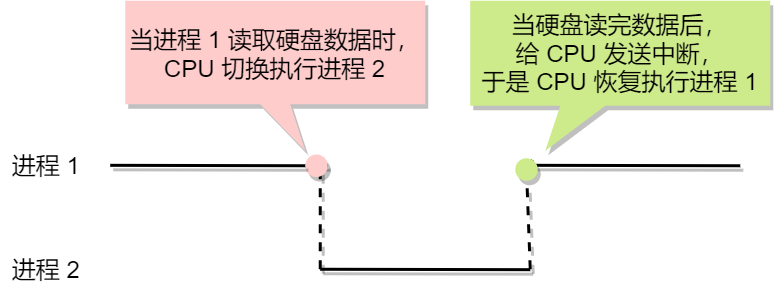

虽然单核的 CPU 在某一个瞬间，**只能运行一个进程**。但在 1 秒钟期间，它可能会运行多个进程，这样就产生**并行的错觉**，实际上这是**并发**

### 并行与并发

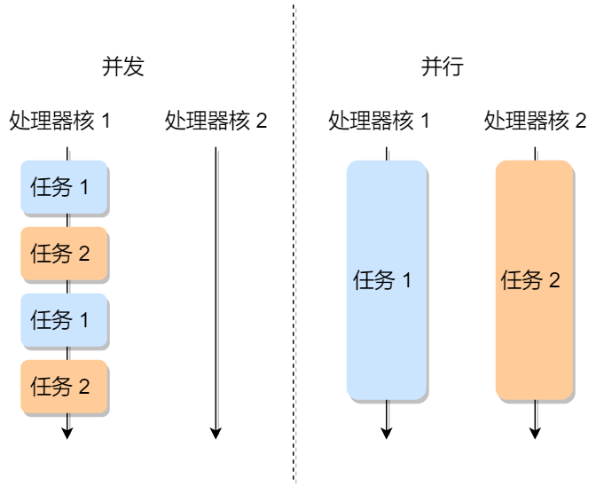

**CPU 可以从一个进程切换到另外一个进程，在切换前必须要记录当前进程中运行的状态信息，以备下次切换回来的时候可以恢复执行。**进程有着「**运行 - 暂停 - 运行**」的活动规律

> 并行就是**两个任务同时运行**，就是甲任务进行的同时，乙任务也在进行。并发是指两个任务都请求运行，而处理器只能按受一个任务，就把这两个任务安排轮流进行，由于时间间隔较短，使人感觉两个任务都在运行。比如我跟两个网友聊天，左手操作一个电脑跟甲聊，同时右手用另一台电脑跟乙聊天，这就叫并行。如果用一台电脑我先给甲发个消息，然后立刻再给乙发消息，然后再跟甲聊，再跟乙聊。这就叫并发

并行与并发的关键点在于**是否同时**

> 并发的关键是你有处理多个任务的能力，不一定要同时。
> 并行的关键是你有同时处理多个任务的能力。

并发是两个队列**交替**使用一台咖啡机，并行是两个队列**同时**使用两台咖啡机，

并发强调了其实现的前提是:要处理的任务必须是可分步骤的(队列中的人数大于等于2)

并行强调了其实现的前提是:必须是多个处理器(咖啡机的数量大于等于2)

如果环境是只有一个单核处理器,首先肯定实现不了并行,这时候任务可分步骤,就可以实现并发,任务不可分步骤,并发并行都实现不了

### 进程的状态

**在一个进程的活动期间至少具备三种基本状态，即运行状态、就绪状态、阻塞状态**

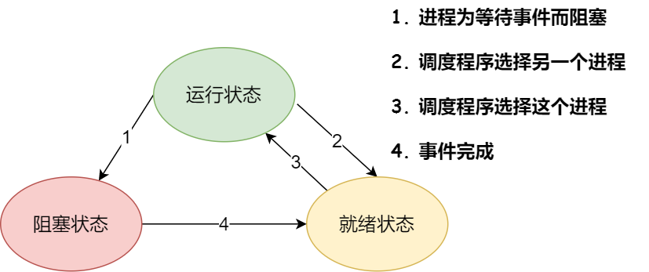

上图中各个状态的意义：

- 运行状态（*Runing*）：该时刻进程占用 CPU；
- 就绪状态（*Ready*）：可运行，但因为其他进程正在运行而暂停停止；
- 阻塞状态（*Blocked*）：该进程正在等待某一事件发生（如等待输入/输出操作的完成）而暂时停止运行，这时，即使给它CPU控制权，它也无法运行；

当然，进程另外两个基本状态：

- 创建状态（*new*）：进程正在被创建时的状态；
- 结束状态（*Exit*）：进程正在从系统中消失时的状态；

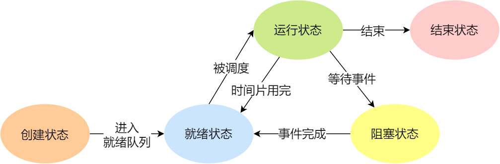

再来详细说明一下进程的状态变迁：

- *NULL -> 创建状态*：一个新进程被创建时的第一个状态；
- *创建状态 -> 就绪状态*：当进程被创建完成并初始化后，一切就绪准备运行时，变为就绪状态，这个过程是很快的；
- *就绪态 -> 运行状态*：处于就绪状态的进程被操作系统的进程调度器选中后，就分配给 CPU 正式运行该进程；
- *运行状态 -> 结束状态*：当进程已经运行完成或出错时，会被操作系统作结束状态处理；
- *运行状态 -> 就绪状态*：处于运行状态的进程在运行过程中，由于分配给它的运行时间片用完，操作系统会把该进程变为就绪态，接着从就绪态选中另外一个进程运行；
- *运行状态 -> 阻塞状态*：当进程请求某个事件且必须等待时，例如请求 I/O 事件；
- *阻塞状态 -> 就绪状态*：当进程要等待的事件完成时，它从阻塞状态变到就绪状态；

另外，还有一个状态叫**挂起状态**，它表示进程没有占有物理内存空间。这跟阻塞状态是不一样，阻塞状态是等待某个事件的返回。

由于虚拟内存管理原因，进程的所使用的空间可能并没有映射到物理内存，而是在硬盘上，这时进程就会出现挂起状态，另外调用 sleep 也会被挂起。

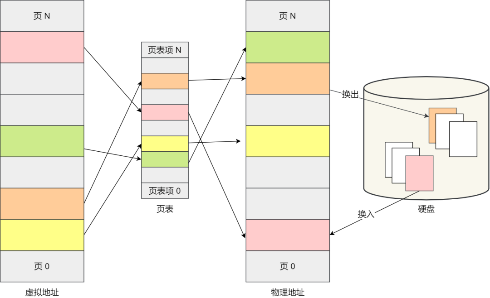

挂起状态可以分为两种：

- 阻塞挂起状态：进程在外存（硬盘）并等待某个事件的出现；
- 就绪挂起状态：进程在外存（硬盘），但只要进入内存，即刻立刻运行；

这两种挂起状态加上前面的五种状态，就变成了七种状态变迁（留给我的颜色不多了），见如下图：

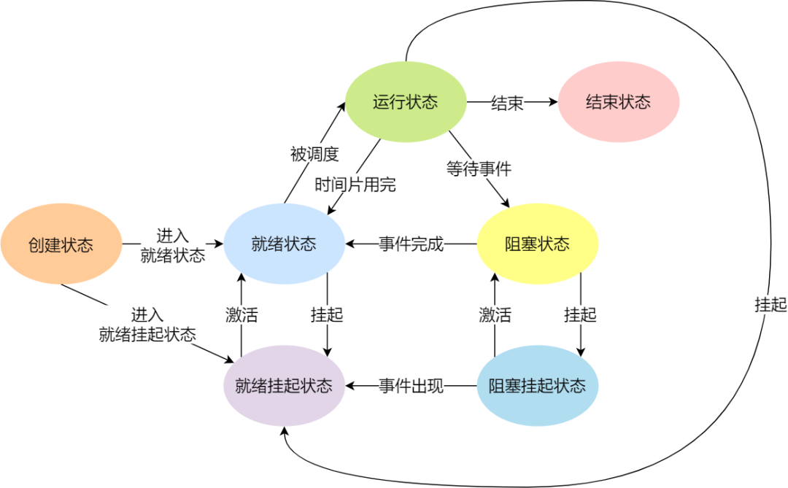

### 进程的控制结构

在操作系统中，是用**进程控制块**（*process control block，PCB*）数据结构来描述进程的。

**PCB 是进程存在的唯一标识**，这意味着一个进程的存在，必然会有一个 PCB，如果进程消失了，那么 PCB 也会随之消失。

#### PCB 具体包含的信息

**进程描述信息：**

- 进程标识符：标识各个进程，每个进程都有一个并且唯一的标识符；
- 用户标识符：进程归属的用户，用户标识符主要为共享和保护服务；

**进程控制和管理信息：**

- 进程当前状态，如 new、ready、running、waiting 或 blocked 等；
- 进程优先级：进程抢占 CPU 时的优先级；

**资源分配清单：**

- 有关内存地址空间或虚拟地址空间的信息，所打开文件的列表和所使用的 I/O 设备信息。

**CPU 相关信息：**

- CPU 中各个寄存器的值，当进程被切换时，CPU 的状态信息都会被保存在相应的 PCB 中，以便进程重新执行时，能从断点处继续执行。

#### PCB的组织方式

通常是通过**链表**的方式进行组织，把具有**相同状态的进程链在一起，组成各种队列**。比如：

- 将所有处于就绪状态的进程链在一起，称为**就绪队列**；
- 把所有因等待某事件而处于等待状态的进程链在一起就组成各种**阻塞队列**；
- 另外，对于运行队列在单核 CPU 系统中则只有一个运行指针了，因为单核 CPU 在某个时间，只能运行一个程序。

那么，就绪队列和阻塞队列链表的组织形式如下图：

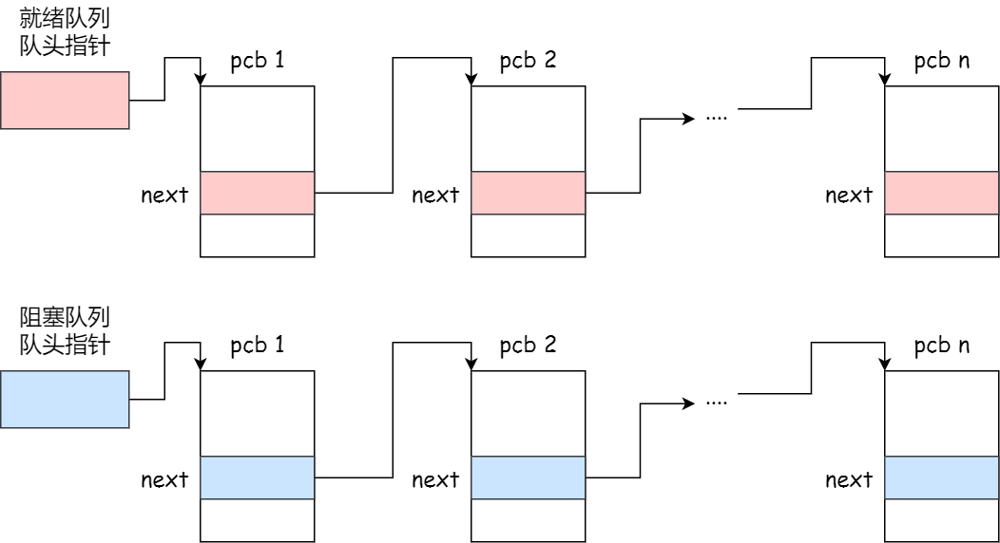

除了链接的组织方式，还有索引方式，它的工作原理：将同一状态的进程组织在一个索引表中，索引表项指向相应的 PCB，不同状态对应不同的索引表。

一般会选择链表，因为可能面临进程创建，销毁等调度导致进程状态发生变化，所以链表能够更加灵活的插入和删除。

### 进程的控制

我们熟知了进程的状态变迁和进程的数据结构 PCB 后，再来看看进程的**创建、终止、阻塞、唤醒**的过程，这些过程也就是进程的控制。

**01 创建进程**

操作系统允许一个进程创建另一个进程，而且允许子进程继承父进程所拥有的资源，当子进程被终止时，其在父进程处继承的资源应当还给父进程。同时，终止父进程时同时也会终止其所有的子进程。

创建进程的过程如下：

- 为新进程分配一个唯一的进程标识号，并申请一个空白的 PCB，PCB 是有限的，若申请失败则创建失败；
- 为进程分配资源，此处如果资源不足，进程就会进入等待状态，以等待资源；
- 初始化 PCB；
- 如果进程的调度队列能够接纳新进程，那就将进程插入到就绪队列，等待被调度运行；

**02 终止进程**

进程可以有 3 种终止方式：正常结束、异常结束以及外界干预（信号 `kill` 掉）。

终止进程的过程如下：

- 查找需要终止的进程的 PCB；
- 如果处于执行状态，则立即终止该进程的执行，然后将 CPU 资源分配给其他进程；
- 如果其还有子进程，则应将其所有子进程终止；
- 将该进程所拥有的全部资源都归还给父进程或操作系统；
- 将其从 PCB 所在队列中删除；

**03 阻塞进程**

当进程需要等待某一事件完成时，它可以调用阻塞语句把自己阻塞等待。而一旦被阻塞等待，它只能由另一个进程唤醒。

阻塞进程的过程如下：

- 找到将要被阻塞进程标识号对应的 PCB；
- 如果该进程为运行状态，则保护其现场，将其状态转为阻塞状态，停止运行；
- 将该 PCB 插入的阻塞队列中去；

**04 唤醒进程**

进程由「运行」转变为「阻塞」状态是由于进程必须等待某一事件的完成，所以处于阻塞状态的进程是绝对不可能叫醒自己的。

如果某进程正在等待 I/O 事件，需由别的进程发消息给它，则只有当该进程所期待的事件出现时，才由发现者进程用唤醒语句叫醒它。

唤醒进程的过程如下：

- 在该事件的阻塞队列中找到相应进程的 PCB；
- 将其从阻塞队列中移出，并置其状态为就绪状态；
- 把该 PCB 插入到就绪队列中，等待调度程序调度；

进程的阻塞和唤醒是一对功能相反的语句，如果某个进程调用了阻塞语句，则必有一个与之对应的唤醒语句。

### 进程的上下文切换

各个进程之间是共享 CPU 资源的，在不同的时候进程之间需要切换，让不同的进程可以在 CPU 执行，那么这个**一个进程切换到另一个进程运行，称为进程的上下文切换**。

> CPU上下问切换

大多数操作系统都是多任务，通常支持大于 CPU 数量的任务同时运行。实际上，这些任务并不是同时运行的，只是因为系统在很短的时间内，让各个任务分别在 CPU 运行，于是就造成同时运行的错觉。

任务是交给 CPU 运行的，那么在每个任务运行前，CPU 需要知道任务从哪里加载，又从哪里开始运行。

所以，操作系统需要事先帮 CPU 设置好 **CPU 寄存器和程序计数器**。

CPU 寄存器是 CPU 内部一个容量小，但是速度极快的内存（缓存）。我举个例子，寄存器像是你的口袋，内存像你的书包，硬盘则是你家里的柜子，如果你的东西存放到口袋，那肯定是比你从书包或家里柜子取出来要快的多。

再来，程序计数器则是用来存储 CPU 正在执行的指令位置、或者即将执行的下一条指令位置。

所以说，CPU 寄存器和程序计数是 CPU 在运行任何任务前，所必须依赖的环境，这些环境就叫做 **CPU 上下文**。

既然知道了什么是 CPU 上下文，那理解 CPU 上下文切换就不难了。

CPU 上下文切换就是先把前一个任务的 CPU 上下文（CPU 寄存器和程序计数器）保存起来，然后加载新任务的上下文到这些寄存器和程序计数器，最后再跳转到程序计数器所指的新位置，运行新任务。

系统内核会存储保持下来的上下文信息，当此任务再次被分配给 CPU 运行时，CPU 会重新加载这些上下文，这样就能保证任务原来的状态不受影响，让任务看起来还是连续运行。

上面说到所谓的「任务」，主要包含进程、线程和中断。所以，可以根据任务的不同，把 CPU 上下文切换分成：**进程上下文切换、线程上下文切换和中断上下文切换**。

> 进程上下文切换

进程是由内核管理和调度的，所以进程的切换只能发生在内核态。

所以，**进程的上下文切换不仅包含了虚拟内存、栈、全局变量等用户空间的资源，还包括了内核堆栈、寄存器等内核空间的资源。**

通常，会把交换的信息保存在进程的 PCB，当要运行另外一个进程的时候，我们需要从这个进程的 PCB 取出上下文，然后恢复到 CPU 中，这使得这个进程可以继续执行，如下图所示：

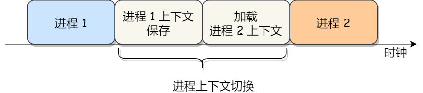

进程的上下文开销是很关键的，我们希望它的开销越小越好，这样可以使得进程可以把更多时间花费在执行程序上，而不是耗费在上下文切换。

> 发生进程上下文切换的场景

- 为了保证所有进程可以得到公平调度，CPU 时间被划分为一段段的时间片，这些时间片再被轮流分配给各个进程。这样，当某个进程的时间片耗尽了，就会被系统挂起，切换到其它正在等待 CPU 的进程运行；
- 进程在系统资源不足（比如内存不足）时，要等到资源满足后才可以运行，这个时候进程也会被挂起，并由系统调度其他进程运行；
- 当进程通过睡眠函数 sleep 这样的方法将自己主动挂起时，自然也会重新调度；
- 当有优先级更高的进程运行时，为了保证高优先级进程的运行，当前进程会被挂起，由高优先级进程来运行；
- 发生硬件中断时，CPU 上的进程会被中断挂起，转而执行内核中的中断服务程序；

## 线程

线程是程序执行的任务，它是程序使用**CPU的基本单位**

同一个进程内多个线程之间可以共享代码段、数据段、打开的文件等资源，但**每个线程都有独立一套的寄存器和栈**，这样可以确保线程的控制流是**相对独立的**。

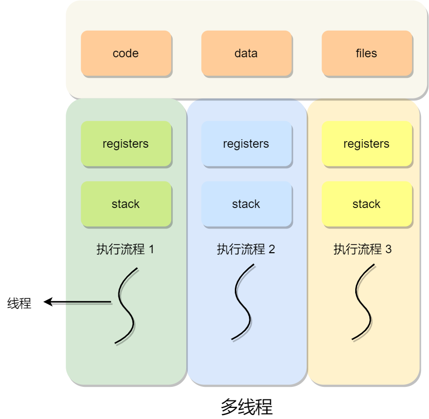

> 线程的优缺点

线程的优点：

- 一个进程中可以同时存在多个线程；
- 各个线程之间可以并发执行；
- 各个线程之间可以共享地址空间和文件等资源；

线程的缺点：

- 当进程中的一个线程奔溃时，会导致其所属进程的所有线程奔溃。

举个例子，对于游戏的用户设计，则不应该使用多线程的方式，否则一个用户挂了，会影响其他同个进程的线程。

### 线程与进程的不同

线程与进程的比较如下：

- 进程是**资源**（包括内存、打开的文件等）分配的单位，线程是 **CPU 调度**的单位；

  这也是，线程与进程之间最大的区别，所谓操作系统的任务调度，**实际上的调度对象是线程**，而进程只是**给线程提供了虚拟内存、全局变量等资源**

- 进程拥有一个**完整的资源平台**，而线程**只独享必不可少的资源**，如寄存器和栈；
- 线程同样具有就绪、阻塞、执行三种基本状态，同样具有状态之间的转换关系；
- 线程能减少并发执行的时间和空间开销；

对于线程和进程，我们可以这么理解：

- 当进程只有一个线程时，可以认为进程就等于线程；
- 当进程拥有多个线程时，这些**线程会共享相同的虚拟内存和全局变量等资源**，这些资源在上下文切换时是不需要修改的；

另外，线程也有自己的私有数据，比如栈和寄存器等，这些在上下文切换时也是需要保存的

对于，线程相比进程能减少开销，体现在：

- 线程的创建时间比进程快，因为进程在创建的过程中，还需要资源管理信息，比如内存管理信息、文件管理信息，而线程在创建的过程中，不会涉及这些资源管理信息，而是共享它们；
- 线程的终止时间比进程快，因为线程释放的资源相比进程少很多；
- 同一个进程内的线程切换比进程切换快，因为线程具有相同的地址空间（虚拟内存共享），这意味着同一个进程的线程都具有同一个页表，那么在切换的时候不需要切换页表。而对于进程之间的切换，切换的时候要把页表给切换掉，而页表的切换过程开销是比较大的；
- 由于同一进程的各线程间共享内存和文件资源，那么在线程之间数据传递的时候，就不需要经过内核了，这就使得线程之间的数据交互效率更高了；

所以，线程比进程不管是时间效率，还是空间效率都要高。

> 线程的上下文切换

这还得看线程是不是属于同一个进程：

- 当两个线程不是属于同一个进程，则切换的过程就跟进程上下文切换一样；
- **当两个线程是属于同一个进程，因为虚拟内存是共享的，所以在切换时，虚拟内存这些资源就保持不动，只需要切换线程的私有数据、寄存器等不共享的数据**；

所以，线程的上下文切换相比进程，开销要小很多。

### 线程上下文切换时机

1. 导致自发性上下文切换：
   - Thread.sleep()
   - Object.wait()
   - Thread.yeild()
   - Thread.join()
   - LockSupport.park()
2. 导致非自发性上下文切换
   - 切出线程的时间片用完
   - 有一个比切出线程优先级更高的线程需要被运行
   - 虚拟机的垃圾回收动作

### 线程的实现

主要有三种线程的实现方式：

- **用户线程（\*User Thread\*）**：在用户空间实现的线程，不是由内核管理的线程，是由用户态的线程库来完成线程的管理；
- **内核线程（\*Kernel Thread\*）**：在内核中实现的线程，是由内核管理的线程；
- **轻量级进程（\*LightWeight Process\*）**：在内核中来支持用户线程；

那么，这还需要考虑一个问题，用户线程和内核线程的对应关系。

首先，第一种关系是**多对一**的关系，也就是多个用户线程对应同一个内核线程：

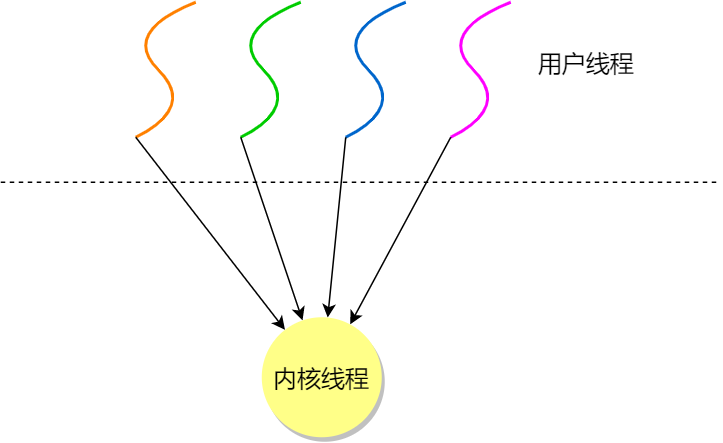

第二种是**一对一**的关系，也就是一个用户线程对应一个内核线程：

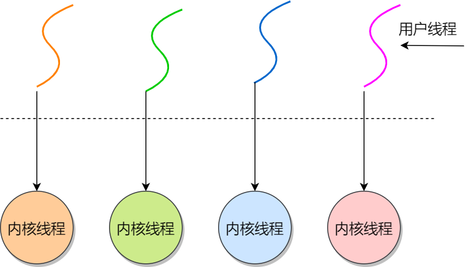

第三种是**多对多**的关系，也就是多个用户线程对应到多个内核线程：

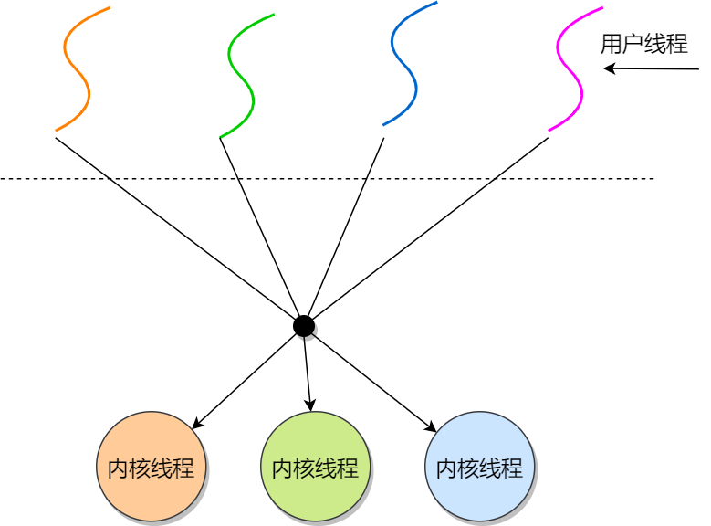

#### 用户线程

用户线程是基于用户态的线程管理库来实现的，那么**线程控制块（Thread Control Block, TCB）** 也是在库里面来实现的，对于操作系统而言是看不到这个 TCB 的，它只能看到整个进程的 PCB。

所以，**用户线程的整个线程管理和调度，操作系统是不直接参与的，而是由用户级线程库函数来完成线程的管理，包括线程的创建、终止、同步和调度等。**

用户级线程的模型，也就类似前面提到的**多对一**的关系，即多个用户线程对应同一个内核线程，如下图所示：

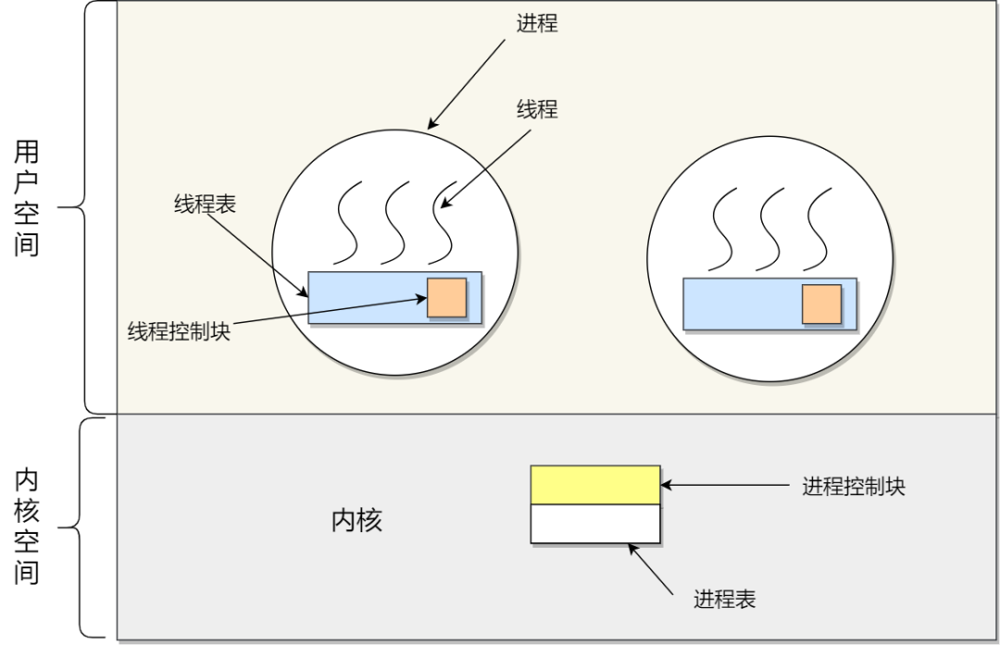

用户线程的**优点**：

- 每个进程都需要有它私有的线程控制块（TCB）列表，用来跟踪记录它各个线程状态信息（PC、栈指针、寄存器），TCB 由用户级线程库函数来维护，可用于不支持线程技术的操作系统；
- 用户线程的切换也是由线程库函数来完成的，无需用户态与内核态的切换，所以速度特别快；

用户线程的**缺点**：

- 由于操作系统不参与线程的调度，如果一个线程发起了系统调用而阻塞，那进程所包含的用户线程都不能执行了。
- 当一个线程开始运行后，除非它主动地交出 CPU 的使用权，否则它所在的进程当中的其他线程无法运行，因为用户态的线程没法打断当前运行中的线程，它没有这个特权，只有操作系统才有，但是用户线程不是由操作系统管理的。
- 由于时间片分配给进程，故与其他进程比，在多线程执行时，每个线程得到的时间片较少，执行会比较慢；

#### 内核的理解

**内核线程是由操作系统管理的，线程对应的 TCB 自然是放在操作系统里的，这样线程的创建、终止和管理都是由操作系统负责。**

内核线程的模型，也就类似前面提到的**一对一**的关系，即一个用户线程对应一个内核线程，如下图所示：

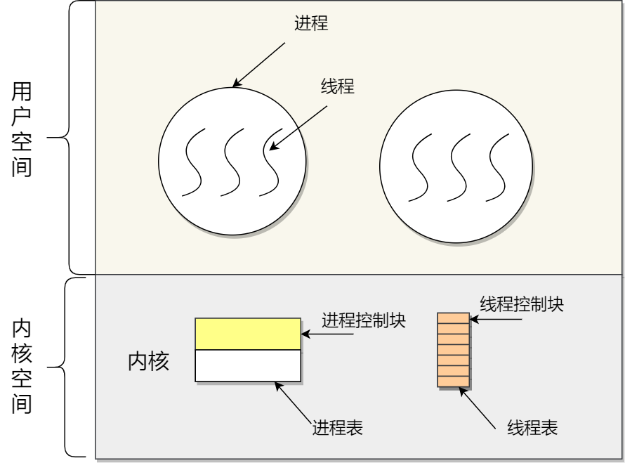

内核线程的**优点**：

- 在一个进程当中，如果某个内核线程发起系统调用而被阻塞，并不会影响其他内核线程的运行；
- 分配给线程，多线程的进程获得更多的 CPU 运行时间；

内核线程的**缺点**：

- 在支持内核线程的操作系统中，由内核来维护进程和线程的上下问信息，如 PCB 和 TCB；
- 线程的创建、终止和切换都是通过系统调用的方式来进行，因此对于系统来说，系统开销比较大；

## 轻量级进程

**轻量级进程（\*Light-weight process，LWP\*）是内核支持的用户线程，一个进程可有一个或多个 LWP，每个 LWP 是跟内核线程一对一映射的，也就是 LWP 都是由一个内核线程支持。**

另外，LWP 只能由内核管理并像普通进程一样被调度，Linux 内核是支持 LWP 的典型例子。

在大多数系统中，**LWP与普通进程的区别也在于它只有一个最小的执行上下文和调度程序所需的统计信息**。一般来说，一个进程代表程序的一个实例，而 LWP 代表程序的执行线程，因为一个执行线程不像进程那样需要那么多状态信息，所以 LWP 也不带有这样的信息。

在 LWP 之上也是可以使用用户线程的，那么 LWP 与用户线程的对应关系就有三种：

- `1 : 1`，即一个 LWP 对应 一个用户线程；
- `N : 1`，即一个 LWP 对应多个用户线程；
- `N : N`，即多个 LMP 对应多个用户线程；

接下来针对上面这三种对应关系说明它们优缺点。先下图的 LWP 模型：

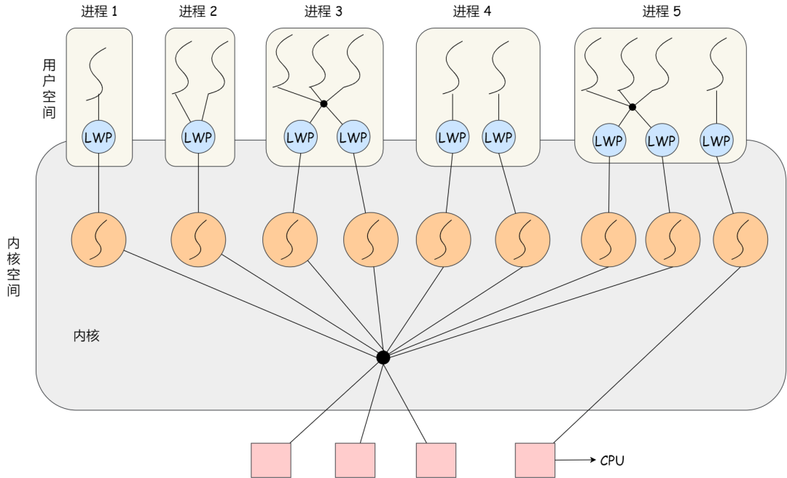

**1 : 1 模式**

一个线程对应到一个 LWP 再对应到一个内核线程，如上图的进程 4，属于此模型。

- 优点：实现并行，当一个 LWP 阻塞，不会影响其他 LWP；
- 缺点：每一个用户线程，就产生一个内核线程，创建线程的开销较大。

**N : 1 模式**

多个用户线程对应一个 LWP 再对应一个内核线程，如上图的进程 2，线程管理是在用户空间完成的，此模式中用户的线程对操作系统不可见。

- 优点：用户线程要开几个都没问题，且上下文切换发生用户空间，切换的效率较高；
- 缺点：一个用户线程如果阻塞了，则整个进程都将会阻塞，另外在多核 CPU 中，是没办法充分利用 CPU 的。

**M : N 模式**

根据前面的两个模型混搭一起，就形成 `M:N` 模型，该模型提供了两级控制，首先多个用户线程对应到多个 LWP，LWP 再一一对应到内核线程，如上图的进程 3。

- 优点：综合了前两种优点，大部分的线程上下文发生在用户空间，且多个线程又可以充分利用多核 CPU 的资源。

**组合模式**

如上图的进程 5，此进程结合 `1:1` 模型和 `M:N` 模型。开发人员可以针对不同的应用特点调节内核线程的数目来达到物理并行性和逻辑并行性的最佳方案。

