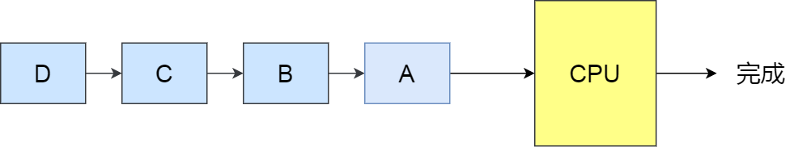
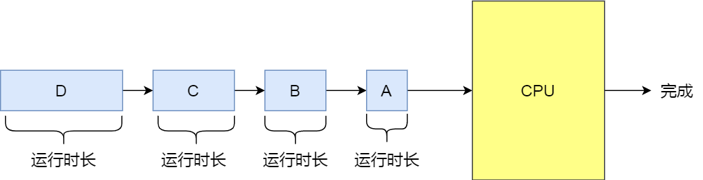
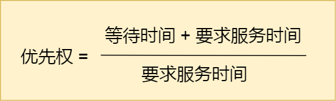
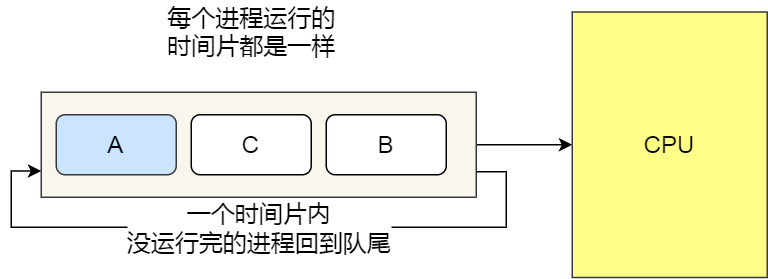
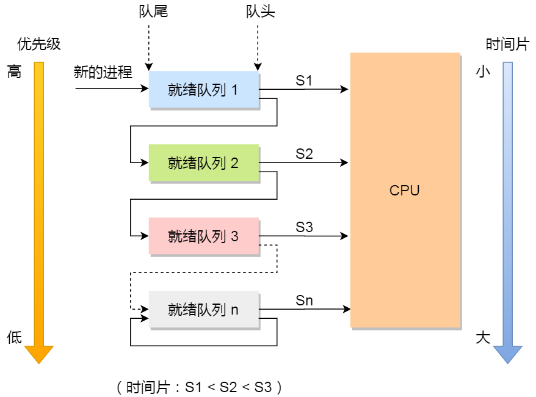

# 进程调度算法

[TOC]

进程都希望自己能够占用 CPU 进行工作，那么这涉及到前面说过的进程上下文切换。

一旦操作系统把进程切换到运行状态，也就意味着该进程占用着 CPU 在执行，但是当操作系统把进程切换到其他状态时，那就不能在 CPU 中执行了，于是操作系统会选择下一个要运行的进程。

**选择一个进程运行**这一功能是在操作系统中完成的，通常称为**调度程序**（*scheduler*）。

## 调度时机

在进程的生命周期中，当进程从一个运行状态到另外一状态变化的时候，其实会触发一次调度。

比如，以下状态的变化都会触发操作系统的调度：

- *从就绪态 -> 运行态*：当进程被创建时，会进入到就绪队列，操作系统会从就绪队列选择一个进程运行；
- *从运行态 -> 阻塞态*：当进程发生 I/O 事件而阻塞时，操作系统必须另外一个进程运行；
- *从运行态 -> 结束态*：当进程退出结束后，操作系统得从就绪队列选择另外一个进程运行；

因为，这些状态变化的时候，操作系统需要考虑是否要让新的进程给 CPU 运行，或者是否让当前进程从 CPU 上退出来而换另一个进程运行。

另外，如果硬件时钟提供某个频率的周期性中断，那么可以根据如何处理时钟中断 ，把调度算法分为两类：

- **非抢占式调度算法**挑选一个进程，然后让该进程运行直到被阻塞，或者直到该进程退出，才会调用另外一个进程，也就是说不会理时钟中断这个事情。
- **抢占式调度算法**挑选一个进程，然后让该进程只运行某段时间，如果在该时段结束时，该进程仍然在运行时，则会把它挂起，接着调度程序从就绪队列挑选另外一个进程。这种抢占式调度处理，需要在时间间隔的末端发生**时钟中断**，以便把 CPU 控制返回给调度程序进行调度，也就是常说的**时间片机制**。

## 调度原则

*原则一*：如果运行的程序，发生了 I/O 事件的请求，那 CPU 使用率必然会很低，因为此时进程在阻塞等待硬盘的数据返回。这样的过程，势必会造成 CPU 突然的空闲。所以，**为了提高 CPU 利用率，在这种发送 I/O 事件致使 CPU 空闲的情况下，调度程序需要从就绪队列中选择一个进程来运行。**

*原则二*：有的程序执行某个任务花费的时间会比较长，如果这个程序一直占用着 CPU，会造成系统吞吐量（CPU 在单位时间内完成的进程数量）的降低。所以，**要提高系统的吞吐率，调度程序要权衡长任务和短任务进程的运行完成数量。**

*原则三*：从进程开始到结束的过程中，实际上是包含两个时间，分别是进程运行时间和进程等待时间，这两个时间总和就称为周转时间。进程的周转时间越小越好，**如果进程的等待时间很长而运行时间很短，那周转时间就很长，这不是我们所期望的，调度程序应该避免这种情况发生。**

*原则四*：处于就绪队列的进程，也不能等太久，当然希望这个等待的时间越短越好，这样可以使得进程更快的在 CPU 中执行。所以，**就绪队列中进程的等待时间也是调度程序所需要考虑的原则。**

*原则五*：对于鼠标、键盘这种交互式比较强的应用，我们当然希望它的响应时间越快越好，否则就会影响用户体验了。所以，**对于交互式比较强的应用，响应时间也是调度程序需要考虑的原则。**

针对上面的五种调度原则，总结成如下：

- **CPU 利用率**：调度程序应确保 CPU 是始终匆忙的状态，这可提高 CPU 的利用率；
- **系统吞吐量**：吞吐量表示的是单位时间内 CPU 完成进程的数量，长作业的进程会占用较长的 CPU 资源，因此会降低吞吐量，相反，短作业的进程会提升系统吞吐量；
- **周转时间**：周转时间是进程运行和阻塞时间总和，一个进程的周转时间越小越好；
- **等待时间**：这个等待时间不是阻塞状态的时间，而是进程处于就绪队列的时间，等待的时间越长，用户越不满意；
- **响应时间**：用户提交请求到系统第一次产生响应所花费的时间，在交互式系统中，响应时间是衡量调度算法好坏的主要标准。

说白了，这么多调度原则，目的就是**要使得进程要「快」**。

## 调度算法

不同的调度算法适用的场景也是不同的。

在**单核 CPU 系统**中常见的调度算法

### 先来先服务调度算法（FCFS）

非抢占式的**先来先服务（First Come First Severd, FCFS）算法**

顾名思义，先来后到，**每次从就绪队列选择最先进入队列的进程，然后一直运行，直到进程退出或被阻塞，才会继续从队列中选择第一个进程接着运行。**

这似乎很公平，但是当一个长作业先运行了，那么后面的短作业等待的时间就会很长，不利于短作业。

FCFS 对长作业有利，适用于 CPU 繁忙型作业的系统，而不适用于 I/O 繁忙型作业的系统。

- 用于作业/进程调度： 是否可抢占：非抢占的算法
- 优缺点：
  - 优点：公平、算法实现简单；
  - 缺点：排在长作业后面的短作业需要等待很长时间，带权周转时间很大，对短作业来说体验很不好。 是否会导致饥饿：不会

### 最短作业优先调度算法（SJF）

**最短作业优先（Shortest Job First, SJF）调度算法**同样也是顾名思义，它会**优先选择运行时间最短的进程来运行**，这有助于提高系统的吞吐量。

这显然对长作业不利，很容易造成一种极端现象。

比如，一个长作业在就绪队列等待运行，而这个就绪队列有非常多的短作业，那么就会使得长作业不断的往后推，周转时间变长，致使长作业长期不会被运行。

- 是否可抢占: SJF和SPF是非抢占的算法。但是也有抢占式的版本–最短剩余时间优先算法
- 优缺点：
  优点：“最短的”平均等待事件、平均周转时间
  缺点：不公平。对短作业有利。可能产生饥饿喜爱你想。
- 是否会导致饥饿：会。如果有不断地短作业到来，可能使长作业长时间得不到服务，产生“饥饿”现象。如果一直得不到服务，则称为饿死。

### 高响应比优先调度算法（HRRN）

前面的「先来先服务调度算法」和「最短作业优先调度算法」都没有很好的权衡短作业和长作业。

那么，**高响应比优先 （Highest Response Ratio Next, HRRN）调度算法**主要是权衡了短作业和长作业。

**每次进行进程调度时，先计算「响应比优先级」，然后把「响应比优先级」最高的进程投入运行**，「响应比优先级」的计算公式：

从上面的公式，可以发现：

- 如果两个进程的「等待时间」相同时，「要求的服务时间」越短，「响应比」就越高，这样短作业的进程容易被选中运行；
- 如果两个进程「要求的服务时间」相同时，「等待时间」越长，「响应比」就越高，这就兼顾到了长作业进程，因为进程的响应比可以随时间等待的增加而提高，当其等待时间足够长时，其响应比便可以升到很高，从而获得运行的机会；

- 是否可抢占：非抢占的算法。因此只有当前运行的作业或者进程主动放弃处理机时，才需要调度，才需要计算响应比。
- 优缺点：综合考虑了等待时间和运行时间（要求服务时间）；等待时间相同时，要求服务时间短的优先；服务时 间相等时，要求等待时间长的优先，对于长时间来说，随着等待时间越来越久，其响应比也会越来越大，从而避免长作业饥饿的问题。
- 是否会导致饥饿：否

### 时间片轮转调度算法（RR）

最古老、最简单、最公平且使用最广的算法就是**时间片轮转（Round Robin, RR）调度算法**。

- 如果时间片用完，进程还在运行，那么将会把此进程从 CPU 释放出来，并把 CPU 分配另外一个进程；
- 如果该进程在时间片结束前阻塞或结束，则 CPU 立即进行切换；

另外，时间片的长度就是一个很关键的点：

- 如果时间片太小，进程调度、切换是有时间代价的，它会导致进程切换过于频繁，系统会花费大量的时间来处理进程间的切换，从而导致实际用于进程执行的时间比例减少。可见时间片也不能太小
- 如果时间片太大，使得每个进程都会在一个时间片内完成，时间片调度算法就会退化为先来先服务算法，并且会增大进程响应时间。

- 是否可抢占：可抢占（时钟装置发出时钟中断来通知CPU时间片已到）
- 优点：公平；响应快，适用于分时操作系统；
- 缺点：由于高频的进程切换,因此有一定开销；不区分任务的紧急程度。
- 是否会导致饥饿：不会

### 最高优先级调度算法（HPF）

前面的「时间片轮转算法」做了个假设，即让所有的进程同等重要，也不偏袒谁，大家的运行时间都一样。

但是，对于多用户计算机系统就有不同的看法了，它们希望调度是有优先级的，即希望调度程序能**从就绪队列中选择最高优先级的进程进行运行，这称为最高优先级（Highest Priority First，HPF）调度算法**。

进程的优先级可以分为，静态优先级或动态优先级：

- 静态优先级：创建进程时候，就已经确定了优先级了，然后整个运行时间优先级都不会变化；
- 动态优先级：根据进程的动态变化调整优先级，比如如果进程运行时间增加，则降低其优先级，如果进程等待时间（就绪队列的等待时间）增加，则升高其优先级，也就是**随着时间的推移增加等待进程的优先级**。

该算法也有两种处理优先级高的方法，非抢占式和抢占式：

- 非抢占式：当就绪队列中出现优先级高的进程，运行完当前进程，再选择优先级高的进程。
- 抢占式：当就绪队列中出现优先级高的进程，当前进程挂起，调度优先级高的进程运行。

- 优点：有优先级区分紧急程度，适用于实时操作系统。可灵活地调整对各个作业/进程的编号程度。
- 缺点：若有源源不断的高优先级进程到来，低优先级进程可能会导致饥饿。
- 是否会导致饥饿：会

但是依然有缺点，可能会导致低优先级的进程永远不会运行。

###  多级反馈队列调度算法（MFQ）

**多级反馈队列（Multilevel Feedback Queue）调度算法**是「时间片轮转算法」和「最高优先级算法」的综合和发展。

顾名思义：

- 「多级」表示有多个队列，每个队列优先级从高到低，同时优先级越高时间片越短。
- 「反馈」表示如果有新的进程加入优先级高的队列时，立刻停止当前正在运行的进程，转而去运行优先级高的队列；

- 算法思想：对其他调度算法的综合
- 算法规则：
  1、设置多级就绪队列，各级队列优先级从高到低，时间片从小到大
  2、新进程到达时先进入1级队列，按照先来先服务原则排队等待被分配时间片，若用完时间片还未结束，则进程进入下一级队列，则重新放回该队列队尾。
  3、只有第k级队列为空时，才会为k+1级队头的进程分配时间片
- 是否可抢占：抢占式算法，在K级队列的进程运行过程中，如果更上级别的队列中新进入了一个进程，则由于新进程处于优先级更高的队列中，因此新进程先在处理机运行，原来运行的进程放回k级队列队尾。
- 优点：对各类型进程相对公平（FCFS的优点）；每个新到达的进程都可以很快就得到响应（RR的优点）；短进程只用较少的时间就可完成。（SPF的优点）；不必实现估计进程的运行时间（避免用户作假）；可灵活地调整对各类进程的偏好程度，比如CpU密集型进程、I/O密集型进程（拓展：可以将因I/O而阻塞的进程重新放回原队列，这样I/O型进程就可以保持较高优先级）
- 是否会导致饥饿： 会

- 设置了多个队列，赋予每个队列不同的优先级，每个**队列优先级从高到低**，同时**优先级越高时间片越短**；
- 新的进程会被放入到第一级队列的末尾，按先来先服务的原则排队等待被调度，如果在第一级队列规定的时间片没运行完成，则将其转入到第二级队列的末尾，以此类推，直至完成；
- 当较高优先级的队列为空，才调度较低优先级的队列中的进程运行。如果进程运行时，有新进程进入较高优先级的队列，则停止当前运行的进程并将其移入到原队列末尾，接着让较高优先级的进程运行；

可以发现，对于短作业可能可以在第一级队列很快被处理完。对于长作业，如果在第一级队列处理不完，可以移入下次队列等待被执行，虽然等待的时间变长了，但是运行时间也会更长了，所以该算法很好的**兼顾了长短作业，同时有较好的响应时间**。