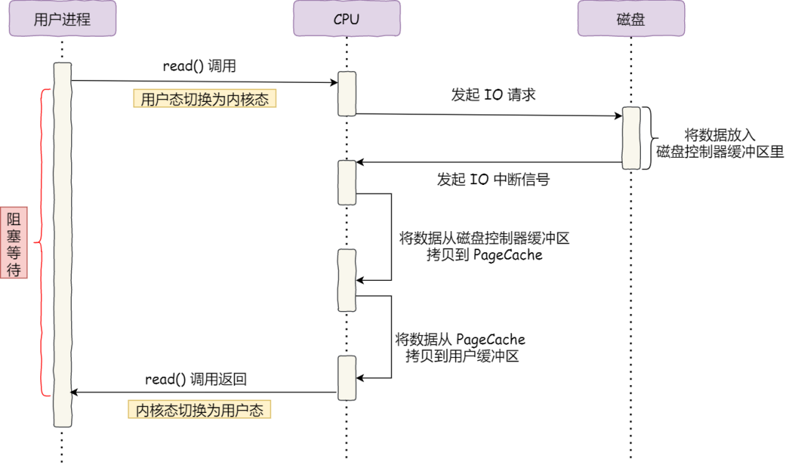
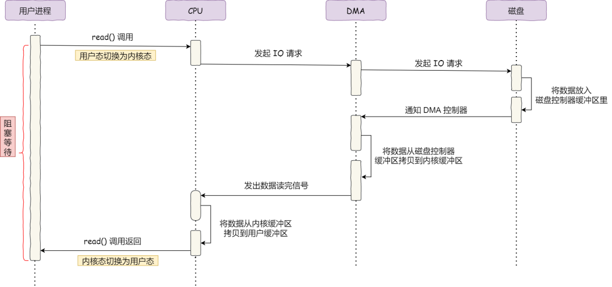

# 零拷贝

## 原始IO

整个数据的传输过程，都需要CPU亲自参与搬运数据，而且这个过程阻塞，CPU不能做其他事情

## DMA

直接内存访问 Direct Memory Access

在进行 I/O 设备和内存的数据传输的时候，数据搬运的工作全部交给DMA控制器，而CPU不再参与任何与数据搬运相关的事情，这样CPU就可以去处理别的事务

整个数据传输的过程，CPU 不再参与数据搬运的工作，而是全程由 DMA 完成，但是 CPU 在这个过程中也是必不可少的，因为传输什么数据，从哪里传输到哪里，都需要 CPU 来告诉 DMA 控制器。

