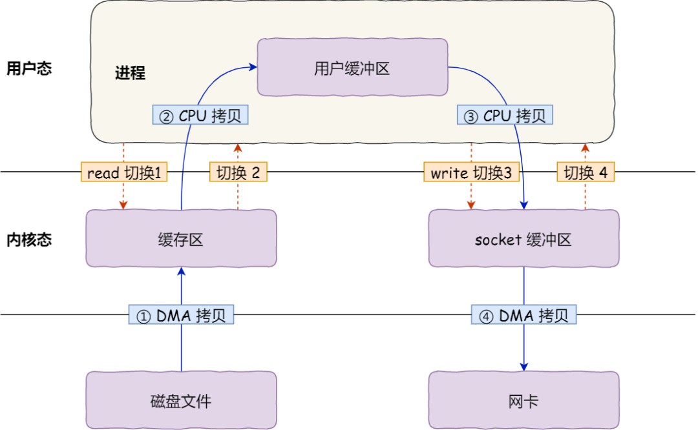

# 零拷贝

[TOC]

## 原始IO

整个数据的传输过程，都需要CPU亲自参与搬运数据，而且这个过程阻塞，CPU不能做其他事情

## DMA

直接内存访问 Direct Memory Access

**在进行 I/O 设备和内存的数据传输的时候，数据搬运的工作全部交给DMA控制器，而CPU不再参与任何与数据搬运相关的事情，这样CPU就可以去处理别的事务**

整个数据传输的过程，CPU 不再参与数据搬运的工作，而是全程由 DMA 完成，但是 CPU 在这个过程中也是必不可少的，因为传输什么数据，从哪里传输到哪里，都需要 CPU 来告诉 DMA 控制器。

## 文件传输

**4 次用户态与内核态的上下文切换**，**提高文件传输的性能，就需要减少「用户态与内核态的上下文切换」和「内存拷贝」的次数。**

## 实现零拷贝

- mmap + write
- sendfile

### mmap + write

**mmap** 系统调用函数会直接把内核缓冲区里的数据**「映射」**到用户空间，内核与用户之间就不需要任何的数据拷贝操作了

- 应用进程调用了 **mmap** 后，DMA 会把磁盘的数据拷贝到内核的缓冲区里。接着，应用进程跟操作系统内核「共享」这个缓冲区；
- 应用进程再调用 **write**，操作系统直接将**内核缓冲区**的数据拷贝到 socket 缓冲区中，这一切**都发生在内核**态，由 CPU 来搬运数据；
- 最后，把内核的 socket 缓冲区里的数据，拷贝到网卡的缓冲区里，这个过程是由 DMA 搬运的。

使用 **mmap** 来代替**read**， 可以减少一次数据拷贝的过程

### sendfile

