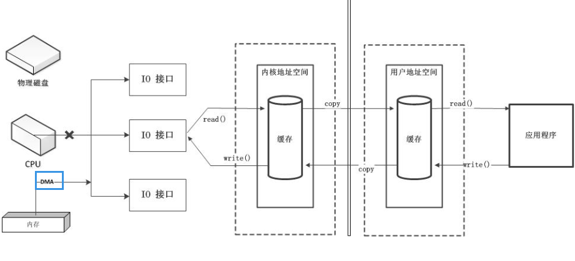
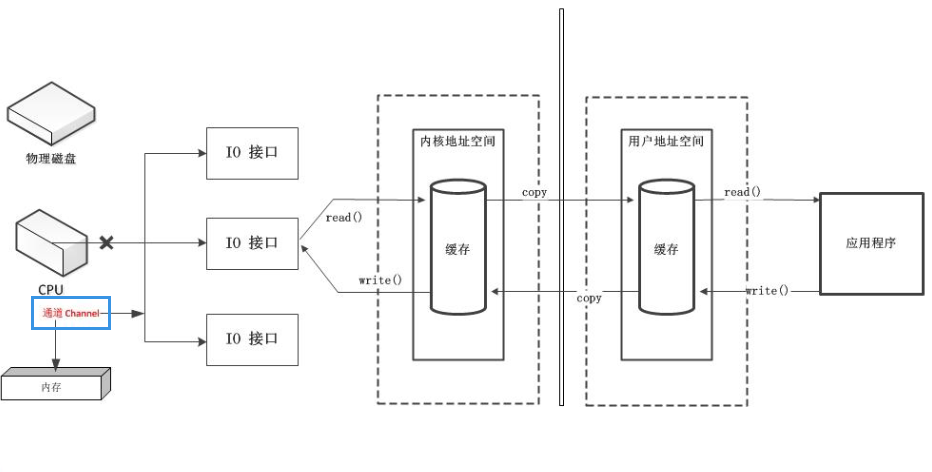
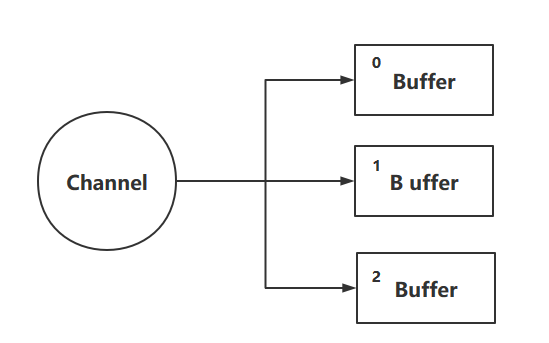
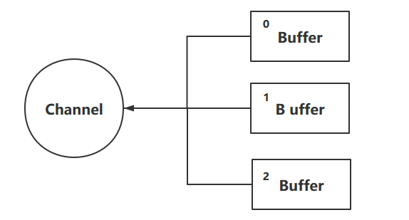
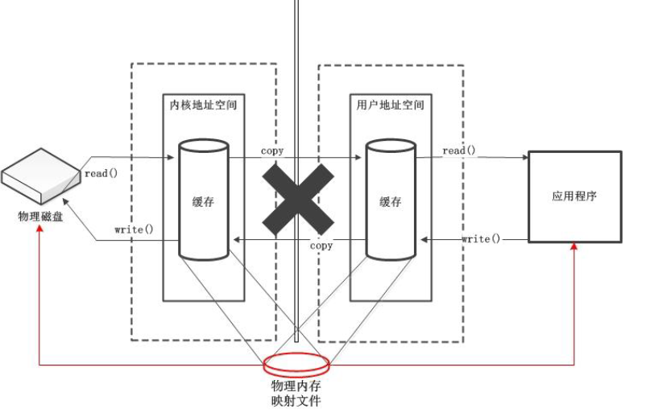
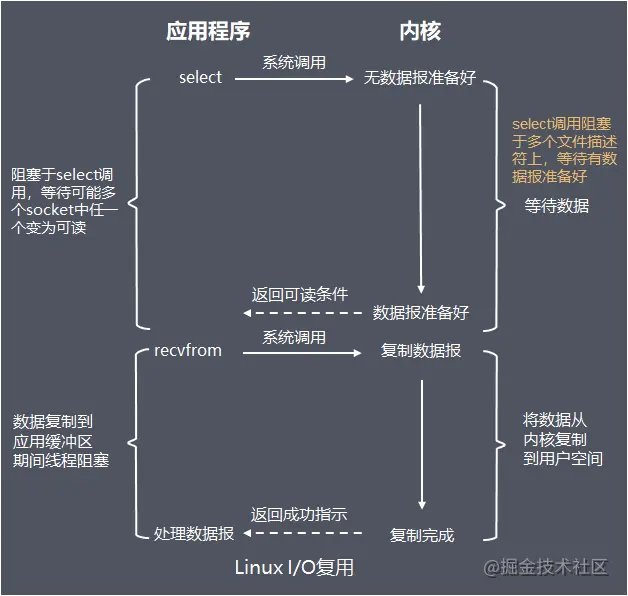
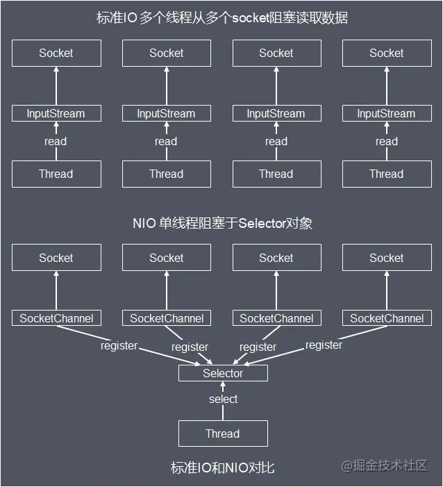

# Java NIO

[TOC]

在1.4版本之前，Java IO类库是阻塞IO；从1.4版本开始，引进了新的异步IO库，被称为Java New IO 类库，简称为JAVA NIO。也就是说，这里的n表示的是new

New IO类库的目标，就是要让Java支持非阻塞IO，基于这个原因，更多的人喜欢称Java NIO为非阻塞IO（Non-Block IO），称“老的”阻塞式Java IO为OIO（Old IO）。总体上说，NIO弥补了原来面向流的OIO同步阻塞的不足，它为标准Java代码提供了高速的、面向缓冲区的IO。


## 对比

|           OIO           |             NIO             |
| :---------------------: | :-------------------------: |
| 面向流(Stream Oriented) | 面向缓冲区(Buffer Oriented) |
|   阻塞IO(Blocking IO)   |  非阻塞IO(NonBlocking IO)   |
|                         |      选择器(Selectors)      |

> 面向流和面向缓冲区

OIO是面向字节流或字符流的，在一般的OIO操作中，我们以**流式的方式**顺序地从一个流（Stream）中 读取一个或多个字节，因此，我们不能随意地改变读取指针的位置。

而在NIO操作中则不同，NIO中引入了 Channel（通道）和Buffer（缓冲区）的概念。读取和写入，**只需要从通道中读取数据到缓冲区中**，或将数据**从缓冲区中写入到通道中**。NIO不像OIO那样是顺序操作，可以**随意**地读取Buffer中任意位置的数据。

NIO在传输数据时，会在输入输出端之间建立通道，然后将数据放入到缓冲区中，缓冲区通过通道来传输数据，这里通道就像是铁路，能够连通两个地点。缓冲区就像是火车，能够真正地进行数据的传输


> NIO如何做到非阻塞

OIO操作都是阻塞的，例如，我们调用一个read方法读取一个 文件的内容，那么调用read的线程会被阻塞住，直到read操作完成。

而在NIO的非阻塞模式中，当我们调用read方法时，如果此时有数据，则read读取数据并返回；如果此时 没有数据，则read直接返回，而不会阻塞当前线程，也就是说，NIO使用了通道和通道的多路复用技术。


> 选择器

NIO的实现，是基于底层的选择器的系统调用。NIO的选择器，**需要底层操作系统提供支持**。而OIO不需要用到选择器。


## 特点

与OIO相比，NIO的主要特点如下

（1）在NIO中，**服务器接收新连接的工作，是异步进行的**。不像Java的OIO那样，服务器监听连接，是同步的、阻塞的。NIO可以通过选择器（也可以说成：多路复用器），后续不断地轮询选择器的选择键集 合，选择新到来的连接

（2）在NIO中，**SocketChannel传输通道的读写操作都是异步的**。如果没有可读写的数据，负责IO通信的线程不会同步等待。这样，线程就可以处理其他连接的通道；不需要像OIO那样，线程一直阻塞，等待所负责的连接可用为止。 

（3）在NIO中，**一个选择器线程可以同时处理成千上万个客户端连接**，性能不会随着客户端的增加而线性下降。


## 组成

Java NIO由以下三个核心组件组成：

1. Channel（通道）
2. Buffer（缓冲区）
3. Selector（选择器）


## Channel

> NIO中一个连接就是用一个Channel（通道）来表示。从更广泛的层面来说，一个 通道可以表示一个底层的文件描述符，例如硬件设备、文件、网络连接等。然而，远远不止如此，除了可以对应到底层文件描述符，Java NIO的通道还可以更加细化。例如，对应不同的网络传输协议类型，在Java中都有不同的NIO Channel（通道）实现。

Channel由java.nio.channels 包定义的。Channel 表示**IO 源与目标打开的连接**。Channel 类似于传统的“流”。只不过**Channel 本身不能直接访问数据，Channel 只能与Buffer 进行交互**


### 图解

应用程序进行读写操作调用函数时，**底层调用的操作系统提供给用户的读写API**，调用这些API时会生成对应的指令，CPU则会执行这些指令。在计算机刚出现的那段时间，**所有读写请求的指令都有CPU去执行**，过多的读写请求会导致CPU无法去执行其他命令，从而CPU的利用率降低


后来，**DMA**(Direct Memory Access，直接内存存取，是一种允许外围设备（硬件子系统）直接访问系统主内存的机制。基于 DMA 访问方式，系统主内存与硬件设备的数据传输可以省去CPU 的全程调度)出现了。当IO请求传到计算机底层时，**DMA会向CPU请求，让DMA去处理这些IO操作**，从而可以让CPU去执行其他指令。DMA处理IO操作时，会请求获取总线的使用权。**当IO请求过多时，会导致大量总线用于处理IO请求，从而降低效率**



于是便有了**Channel(通道)**，Channel相当于一个**专门用于IO操作的独立处理器**，它具有独立处理IO请求的能力，当有IO请求时，它会自行处理这些IO请求




### 实现


- 本地文件IO
  - FileChannel（文件通道，用于文件的数据读写）
- 网络IO
  - SocketChanel（套接字通道，用于Socket套接字TCP连接的数据读写）、ServerSocketChannel（服务器嵌套字通道（或服务器监听通道），允许我们监听TCP连接请求，为每 个监听到的请求，创建一个SocketChannel套接字通道）
  - DatagramChannel（数据报通道，用于UDP协议的数据读写）

这个四种通道，涵盖了文件IO、TCP网络、UDP IO基础IO。下面从Channel（通道）的获取、读取、写 入、关闭四个重要的操作


### 获取通道的方法

获取通道的一种方式是对支持通道的**对象调用getChannel() 方法**。支持通道的类如下：

- FileInputStream
- FileOutputStream
- RandomAccessFile
- DatagramSocket
- Socket
- ServerSocket

~~~java
public class Demo2 {
   public static void main(String[] args) throws IOException {
      // 本地通道
      FileInputStream fileInputStream = new FileInputStream("");
      FileChannel channel1 = fileInputStream.getChannel();

      FileOutputStream fileOutputStream = new FileOutputStream("");
      FileChannel channel2 = fileOutputStream.getChannel();
   
      // 网络通道
      Socket socket = new Socket();
      SocketChannel channel3 = socket.getChannel();
      
      ServerSocket serverSocket = new ServerSocket();
      ServerSocketChannel channel4 = serverSocket.getChannel();

      DatagramSocket datagramSocket = new DatagramSocket();
      DatagramChannel channel5 = datagramSocket.getChannel();
       
      // 最后要关闭通道
       
   }
}
~~~

**也可以通过通道的静态方法open()来获取**

~~~java
public static void main(String[] args) throws IOException {
   FileChannel open = FileChannel.open(Paths.get(""));
   
   SocketChannel open1 = SocketChannel.open();
   
   ...
}
~~~


####  getChannel()+非直接缓冲区

- getChannel()获得通道
- allocate()获得**非直接缓冲区**

通过非直接缓冲区读写数据，需要通过通道来传输缓冲区里的数据

~~~java
public class Demo4 {
   public static void main(String[] args) {
      FileInputStream is = null;
      FileOutputStream os = null;
      // 获得通道
      FileChannel inChannel = null;
      FileChannel outChannel = null;
       
      // 利用 try-catch-finally 保证关闭
      try {
         is = new FileInputStream("F:\\JDKLearning\\src\\main\\NIO\\day1\\1.jpg");
         os = new FileOutputStream("F:\\JDKLearning\\src\\main\\NIO\\day1\\2.jpg");

         // 获得通道
         inChannel = is.getChannel();
         outChannel = os.getChannel();

         // 获得缓冲区，用于在通道中传输数据
         ByteBuffer byteBuffer = ByteBuffer.allocate(1024);

         // 循环将字节数据放入到buffer中，然后写入磁盘中
         while (inChannel.read(byteBuffer) != -1) {
            // 切换模式
            byteBuffer.flip();
            outChannel.write(byteBuffer);
            byteBuffer.clear();
         }
      } catch (IOException e) {
         e.printStackTrace();
      } finally {
         if (inChannel != null) {
            try {
               inChannel.close();
            } catch (IOException e) {
               e.printStackTrace();
            }
         }
         if (outChannel != null) {
            try {
               outChannel.close();
            } catch (IOException e) {
               e.printStackTrace();
            }
         }
         if (is != null) {
            try {
               is.close();
            } catch (IOException e) {
               e.printStackTrace();
            }
         }
         if (os != null) {
            try {
               os.close();
            } catch (IOException e) {
               e.printStackTrace();
            }
         }
      }
   }
}
~~~

**图片读取后，被写入到了指定位置**


#### open()+直接缓冲区

- 通过open获得通道
- 通过FileChannel.map()获取直接缓冲区

使用直接缓冲区时，无需通过通道来传输数据，直接将数据放在缓冲区内即可

~~~java
public class Demo5 {
   public static void main(String[] args) throws IOException {
      // 通过open()方法来获得通道
      FileChannel inChannel = FileChannel.open(Paths.get("F:\\JDKLearning\\src\\main\\NIO\\day1\\1.jpg"), StandardOpenOption.READ);

      // outChannel需要为 READ WRITE CREATE模式
      // READ WRITE是因为后面获取直接缓冲区时模式为READ_WRITE模式
      // CREATE是因为要创建新的文件
      FileChannel outChannel = FileChannel.open(Paths.get("F:\\JDKLearning\\src\\main\\NIO\\day1\\3.jpg"), StandardOpenOption.READ, StandardOpenOption.WRITE, StandardOpenOption.CREATE);

      // 获得直接缓冲区
      MappedByteBuffer inMapBuf = inChannel.map(FileChannel.MapMode.READ_ONLY, 0, inChannel.size());
      MappedByteBuffer outMapBuf = outChannel.map(FileChannel.MapMode.READ_WRITE, 0, inChannel.size());

      // 字节数组
      byte[] bytes = new byte[inMapBuf.limit()];

      // 因为是直接缓冲区，可以直接将数据放入到内存映射文件，无需通过通道传输
      inMapBuf.get(bytes);
      outMapBuf.put(bytes);

      // 关闭缓冲区，这里没有用try-catch-finally
      inChannel.close();
      outChannel.close();
   }
}
~~~

**运行结果，图片被创建**


####  通道间直接传输

~~~java
public static void channelToChannel() throws IOException {
   long start = System.currentTimeMillis();
   // 通过open()方法来获得通道
   FileChannel inChannel = FileChannel.open(Paths.get("F:\\JDKLearning\\src\\main\\NIO\\day1\\1.mp4"), StandardOpenOption.READ);

   // outChannel需要为 READ WRITE CREATE模式
   // READ WRITE是因为后面获取直接缓冲区时模式为READ_WRITE模式
   // CREATE是因为要创建新的文件
   FileChannel outChannel = FileChannel.open(Paths.get("F:\\JDKLearning\\src\\main\\NIO\\day1\\4.mp4"), StandardOpenOption.READ, StandardOpenOption.WRITE, StandardOpenOption.CREATE);

   // 通道间直接传输
   inChannel.transferTo(0, inChannel.size(), outChannel);
   // 对应的还有transferFrom
   // outChannel.transferFrom(inChannel, 0, inChannel.size());

   inChannel.close();
   outChannel.close();
}
~~~

### 直接缓冲区和S非直接缓冲区

**效率**

读取一个MP4文件，通过二者花费时间的多少来判定执行的速度

```
// getChannel() + 非直接缓冲区耗时
708
// open() + 直接缓冲区耗时
115
// channel transferTo channel耗时
47Copy
```

**内存占用**

直接缓冲区的读写速度虽然很快，但是会占用很多很多内存空间。如果文件过大，会使得计算机运行速度变慢


### 分散和聚集

#### 分散读取

分散读取（Scattering Reads）是指**从Channel 中读取的数据“分散”到多个Buffer 中**

**注意**：按照缓冲区的**顺序**，从Channel 中读取的数据依次将 Buffer 填满




#### 聚集写入

聚集写入（Gathering Writes）是指将**多个Buffer 中的数据“聚集”到Channel**

按照缓冲区的**顺序**，写入position 和limit 之间的数据到Channel



~~~java
public class Demo2 {
   public static void main(String[] args) throws IOException {
      FileInputStream is = new FileInputStream("F:\\JDKLearning\\src\\main\\nio\\day2\\计划.txt");
      FileOutputStream os = new FileOutputStream("F:\\JDKLearning\\src\\main\\nio\\day2\\计划2.txt");

      FileChannel inChannel = is.getChannel();
      FileChannel outChannel = os.getChannel();

      // 获得多个缓冲区，并且放入到缓冲区数组中
      ByteBuffer byteBuffer1 = ByteBuffer.allocate(50);
      ByteBuffer byteBuffer2 = ByteBuffer.allocate(1024);
      ByteBuffer[] byteBuffers = {byteBuffer1, byteBuffer2};

      // 分散读取
      inChannel.read(byteBuffers);
      
      byteBuffer1.flip();
      byteBuffer2.flip();
      
      // 聚集写入
      outChannel.write(byteBuffers);
   }
}
~~~


## Buffer

NIO的Buffer（缓冲区）本质上是一个内存块，既可以写入数据，也可以从中读取数据，NIO的Buffer类，是一个抽象类，位于java.nio包中，其内部是一个内存块（数组）

NIO的Buffer与普通的内存块（Java数组）不同的是：NIO Buffer对象，提供了一组更加有效的方法，用来进行**写入和读取的交替访问**。

需要强调的是：**Buffer类是一个非线程安全类**。


### 类型

在NIO中有8种缓冲区类，分别如下：

1. ByteBuffer
2. CharBuffer
3. DoubleBuffer
4. FloatBuffer
5. IntBuffer
6. LongBuffer
7. ShortBuffer
8. MappedByteBuffer

前7种Buffer类型，覆盖了能在IO中传输的所有的Java基本数据类型。

第8种类型MappedByteBuffer是专门用于内存映射的一种ByteBuffer类型。 

实际上，使用最多的还是ByteBuffer二进制字节缓冲区类型


**各种类型的缓冲区中，都有一个对应类型的数组**，如

ByteBuffer

```java
final byte[] hb;                  // Non-null only for heap buffersCopy
```

IntBuffer

```java
final int[] hb;                  // Non-null only for heap buffers
```

继承关系如下


通过**allocate方法**可以获取一个对应缓冲区的对象，它是缓冲区类的一个静态方法

~~~java
// 获取一个容量大小为1024字节的字节缓冲区
ByteBuffer byteBuffer = ByteBuffer.allocate(1024);
~~~


### 核心属性

Buffer类在其内部，有一个byte[]数组内存块，作为内存缓冲区。

为了记录读写的状态和位置，Buffer类提供了一些重要的属性。

其中，有三个重要的成员属性：


#### capacity

缓冲区的容量**。**

**通过构造函数赋予，一旦设置，无法更改**，因为在Buffer类的对象在初始化时，会按照capacity分配内部的内存，分配之后大小不可改变

**注意，capacity不是指内存块byte[]数组的字节数量，capacity容量指的是**写入的数据对象的数量


#### position

**下一个**读写位置的索引（类似PC）。缓冲区的位置不能为负，并且**不能大于limit**

> 在不同的模式下，position属性的值是不同的。当缓冲区进行读写的模式改变时，position会进行调整
>
> 在写入模式下，position的值变化规则如下：
>
> （1）在刚进入到写模式时，position值为0，表示当前的写入 位置为从头开始。（2）每当一个数据写到缓冲区之后，position会向后移动到下一个可写的位置。（3）初始 的position值为0，最大可写值position为limit– 1。当position值达到limit时，缓冲区就已经无空间可写了。
>
> 在读模式下，position的值变化规则如下：
>
> （1）当缓冲区刚开始进入到读模式时，position会被重置为0。 
>
> （2）当从缓冲区读取时，也是从position位置开始读。读取数据后，position向前移动到下一个可读的位置。 
>
> （3）position最大的值为最大可读上限limit，当position达到limit时，表明缓冲区已经无数据可读。
>
> 数据写入后，如果要开始从缓冲区读数据，需要进行模式切换，使用flip翻转方法，
>
> position会进行非常巨大的调整，具体的规则是：position由原来的写入位置，变成 新的可读位置，也就是0，表示可以从头开始读。flip翻转的另外一半工作，就是要调整limit属性


#### limit

表示**读写的最大上限**

limit属性，也与缓冲区的读写模式有关。在不同的模式 下，limit的值的含义是不同的。

在写模式下，limit属性值的含义为可以写入的数据最大上限。在刚进入到写模式时，limit的值会被设置成缓冲区的capacity容量值，表示可以一直将缓冲区的容量写满。 

在读模式下，limit的值含义为最多能从缓冲区中读取到多少数据

一般来说，是先写入再读取。当缓冲区写入完成后，就可以开始从Buffer读取数据，可以使用flip翻转方法，这时，limit的值也会进行非常大的调整。

将写模式下的position值，设置成读模式下的limit值，也就是说，将之前写入的最大数量，作为可以读取的上限值。

例如：

首先，创建缓冲区。刚开始，缓冲区处于写模式。position为0，limit为最大容量。

 然后，向缓冲区写数据。每写入一个数据，position向后面移动一个位置，也就是position的值加1。假定写入了5个数，当写入完成后，position的值为5。 

这时，使用（即调用）flip方法，将缓冲区切换到读模式。limit的值，**先会被设置成写模式时的position 值**。这里新的limit是5，表示可以读取的最大上限是5个数。同时，**新的position会被重置为0，表示可以从0开始读**


#### mark

记录当前position的值。**position被改变后，可以通过调用reset() 方法恢复到mark的位置**，可以将当前的position临时存入mark中；需要的时候，可以再从mark标记恢复到position位置。

以上四个属性必须满足以下要求

**mark <= position <= limit <= capacity**


### 核心方法

#### put

- put()方法可以将一个数据放入到缓冲区中。
- 进行该操作后，postition的值会+1，指向下一个可以放入的位置。capacity = limit ，为缓冲区容量的值。
- 


#### flip

- flip()方法会**切换对缓冲区的操作模式**，由写->读 / 读->写
- 进行该操作后
  - 如果是写模式->读模式，position = 0 ， limit 指向最后一个元素的下一个位置，capacity不变
  - 如果是读->写，则恢复为put()方法中的值


#### get

- get()方法会读取缓冲区中的一个值
- 进行该操作后，position会+1，如果超过了limit则会抛出异常


#### rewind

- 该方法**只能在读模式下使用**
- rewind()方法后，会恢复position、limit和capacity的值，变为进行get()前的值


#### clean

- clean()方法会将缓冲区中的各个属性恢复为最初的状态，position = 0, capacity = limit
- **此时缓冲区的数据依然存在**，处于“被遗忘”状态，下次进行写操作时会覆盖这些数据


#### mark()和reset()方法

- mark()方法会将postion的值保存到mark属性中
- reset()方法会将position的值改为mark中保存的值

~~~java
public class Demo1 {
	public static void main(String[] args) {
		ByteBuffer byteBuffer = ByteBuffer.allocate(1024);

		System.out.println("放入前参数");
		System.out.println("position " + byteBuffer.position());
		System.out.println("limit " + byteBuffer.limit());
		System.out.println("capacity " + byteBuffer.capacity());
		System.out.println();

		System.out.println("------put()------");
		System.out.println("放入3个数据");
		byte bt = 1;
		byteBuffer.put(bt);
		byteBuffer.put(bt);
		byteBuffer.put(bt);

		System.out.println("放入后参数");
		System.out.println("position " + byteBuffer.position());
		System.out.println("limit " + byteBuffer.limit());
		System.out.println("capacity " + byteBuffer.capacity());
		System.out.println();

		System.out.println("------flip()-get()------");
		System.out.println("读取一个数据");
		// 切换模式
		byteBuffer.flip();
		byteBuffer.get();

		System.out.println("读取后参数");
		System.out.println("position " + byteBuffer.position());
		System.out.println("limit " + byteBuffer.limit());
		System.out.println("capacity " + byteBuffer.capacity());
		System.out.println();

		System.out.println("------rewind()------");
		byteBuffer.rewind();
		System.out.println("恢复后参数");
		System.out.println("position " + byteBuffer.position());
		System.out.println("limit " + byteBuffer.limit());
		System.out.println("capacity " + byteBuffer.capacity());
		System.out.println();

		System.out.println("------clear()------");
		// 清空缓冲区，这里只是恢复了各个属性的值，但是缓冲区里的数据依然存在
		// 但是下次写入的时候会覆盖缓冲区中之前的数据
		byteBuffer.clear();
		System.out.println("清空后参数");
		System.out.println("position " + byteBuffer.position());
		System.out.println("limit " + byteBuffer.limit());
		System.out.println("capacity " + byteBuffer.capacity());
		System.out.println();
		System.out.println("清空后获得数据");
		System.out.println(byteBuffer.get());

	}
}
放入前参数
position 0
limit 1024
capacity 1024

------put()------
放入3个数据
放入后参数
position 3
limit 1024
capacity 1024

------flip()-get()------
读取一个数据
读取后参数
position 1
limit 3
capacity 1024

------rewind()------
恢复后参数
position 0
limit 3
capacity 1024

------clear()------
清空后参数
position 0
limit 1024
capacity 1024

清空后获得数据
1
~~~


### 非直接缓冲区和直接缓冲区

#### 非直接缓冲区

通过**allocate()**方法获取的缓冲区都是非直接缓冲区。这些缓冲区是建立在JVM**堆内存**之中的。

```java
public static ByteBuffer allocate(int capacity) {
    if (capacity < 0)
    throw new IllegalArgumentException();

    // 在堆内存中开辟空间
    return new HeapByteBuffer(capacity, capacity);
}

HeapByteBuffer(int cap, int lim) {        // package-private
    // new byte[cap] 创建数组，在堆内存中开辟空间
    super(-1, 0, lim, cap, new byte[cap], 0);
    /*
    hb = new byte[cap];
    offset = 0;
    */
}Copy
```

[](https://nyimapicture.oss-cn-beijing.aliyuncs.com/img/20201109151057.png)

通过非直接缓冲区，想要将数据写入到物理磁盘中，或者是从物理磁盘读取数据。**都需要经过JVM和操作系统**，数据在两个地址空间中传输时，会**copy**一份保存在对方的空间中。所以费直接缓冲区的读取效率较低

#### 直接缓冲区

**只有ByteBuffer可以获得直接缓冲区**，通过allocateDirect()获取的缓冲区为直接缓冲区，这些缓冲区是建立在**物理内存**之中的。

```java
public static ByteBuffer allocateDirect(int capacity) {
    return new DirectByteBuffer(capacity);
}

DirectByteBuffer(int cap) {                   // package-private
	...
    // 申请物理内存
	boolean pa = VM.isDirectMemoryPageAligned();
	...
}Copy
```

[](https://nyimapicture.oss-cn-beijing.aliyuncs.com/img/20201109151520.png)

直接缓冲区通过在操作系统和JVM之间创建**物理内存映射文件**加快缓冲区数据读/写入物理磁盘的速度。放到物理内存映射文件中的数据就不归应用程序控制了，操作系统会自动将物理内存映射文件中的数据写入到物理内存中


## Selector

> 用于检查一个或多个NIO Channel（通道）的状态是否处于可读、可写。如此可以实现单线程管理多个channels,也就是可以管理多个网络链接。
>
> **使用Selector的好处在于：** 使用更少的线程来就可以来处理通道了， 相比使用多个线程，避免了线程上下文切换带来的开销。基于操作系统提供的I/O复用功能，单个线程可以同时监视多个连接描述符，一旦某个连接就绪（一般是写就绪或读就绪），能够通知程序进行相应的读写操作，常见有select、poll、epoll等不同实现







选择器的使命就是完成IO的多路复用，一个通道代表一条连接通路，通过选择器可以同时监控多个通道的IO（输入输出）状况，**选择器和通道的关系，是监控和被监控的关系。**

选择器提供了独特的API方法，能够选出（select）所监控的通道拥有哪些已经准备好的、就绪的IO操作事件。

一般来说，一个单线程处理一个选择器，一个选择器可以监控很多通道。通过选择器，一个单线程可以处理数百、数千、数万、甚至更多的通道。在极端情况下（数万个连接），只用一个线程就可以处理所有的通道，这样会大量地减少线程之间上下文切换的开销。 

通道和选择器之间的关系，通过register（注册）的方式完成。调用通道的Channel.register（Selector sel，int ops）方法，可以将通道实例注册到一个选择器中。register方法有两个参数：第一个参数，指定通道注册到的选择器实例；第二个参数，指定选择器要监控的IO事件类型

可供选择器监控的通道IO事件类型，包括以下四种：

 （1）可读：SelectionKey.OP_READ 

（2）可写：SelectionKey.OP_WRITE 

（3）连接：SelectionKey.OP_CONNECT 

（4）接收：SelectionKey.OP_ACCEPT

这里的IO事件不是对通道的IO操作，而是**通道的某个IO操作的一种就绪状态**，表示通道**具备完成某个IO操作的条件**。

比方说，某个SocketChannel通道，完成了和对端的握手连接，则处于“连接就绪”（OP_CONNECT）状态。


### 步骤

#### 获取选择器实例

~~~java
//调用静态工厂方法open()来获取Selector实例
Selector selector = Selector.open();
~~~


#### 将通道注册到选择器中

~~~java
// 2.获取通道
ServerSocketChannelserverSocketChannel = ServerSocketChannel.open();
// 3.设置为非阻塞
serverSocketChannel.configureBlocking(false);
// 4.绑定连接
serverSocketChannel.bind(new InetSocketAddress(SystemConfig.SOCKET_SERVER_PORT));
// 5.将通道注册到选择器上,并制定监听事件为：“接收连接”事件
serverSocketChannel.register(selector，SelectionKey.OP_ACCEPT);
~~~

注册到选择器的通道，必须处于非阻塞模式下，否则将抛出IllegalBlockingModeException 异常。这意味着，FileChannel文件通道不能与选择器一起使用，因为FileChannel文件通道只有阻塞模式，不 能切换到非阻塞模式；而Socket套接字相关的所有通道都可以。

一个通道，并不一定要支持所有的四种IO事件。例如服务器监听通道 ServerSocketChannel，仅仅支持Accept（接收到新连接）IO事件；而SocketChannel传输通道，则不支持 Accept（接收到新连接）IO事件


#### 轮询感兴趣的IO就绪事件

通过Selector选择器的select()方法，选出已经注册的、已经就绪的IO事件，保存到SelectionKey选择键集合中。

SelectionKey集合保存在选择器实例内部，是一个元素为SelectionKey类型的集合（Set）。调用选择器的selectedKeys()方法，可以取得选择键集合

~~~java
//轮询，选择感兴趣的IO就绪事件（选择键集合）
while (selector.select() > 0) {
    Set selectedKeys = selector.selectedKeys();
    Iterator keyIterator = selectedKeys.iterator();
    while(keyIterator.hasNext()) {
        SelectionKey key = keyIterator.next();
        //根据具体的IO事件类型，执行对应的业务操作
        if(key.isAcceptable()) {
            // IO事件：ServerSocketChannel服务器监听通道有新连接
        } else if (key.isConnectable()) {
            // IO事件：传输通道连接成功
        } else if (key.isReadable()) {
            // IO事件：传输通道可读
        } else if (key.isWritable()) {
            // IO事件：传输通道可写
        }
        //处理完成后，移除选择键
        keyIterator.remove();
    }
}
~~~

处理完成后，需要将选择键从这个SelectionKey集合中移除，防止下一次循环的时候，被重复的处理。

 SelectionKey集合不能添加元素，如果试图向SelectionKey选择键集合中添加元素，则将抛出 java.lang.UnsupportedOperationException异常。

 用于选择就绪的IO事件的select()方法，有多个重载的实现版本，具体如下： 

（1）select()：阻塞调用，一直到至少有一个通道发生了注册的IO事件。

（2）select(long timeout)：和select()一样，但最长阻塞时间为timeout指定的毫秒数。 

（3）selectNow()：非阻塞，不管有没有IO事件，都会立刻返回。

 select()方法返回的整数值（int整数类型），表示发生了IO事件的通道数量。更准确地说，是从上一次 select到这一次select之间，有多少通道发生了IO事件。强调一下，select()方法返回的数量，指的是通道数， 而不是IO事件数，准确地说，是指发生了选择器感兴趣的IO事件的通道数。


