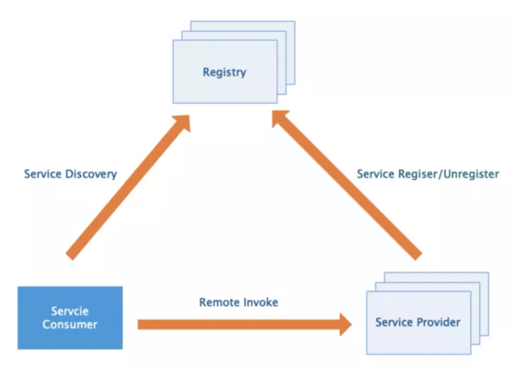
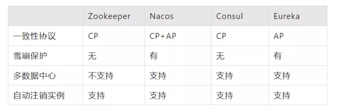
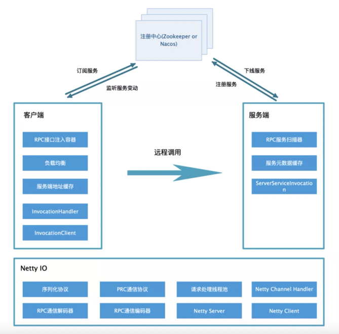

# RPC区别

> 区别一般与HTTP做对比

RPC是指远程过程调用，也就是说两台服务器A，B，一个应用部署在A服务器上，想要调用B服务器上应用提供的函数/方法，由于不在一个内存空间，不能直接调用，需要通过网络来表达调用的语义和传达调用的数据。

## 与HTTP的区别


> 1. 传输协议上 -> RPC是一种API，而HTTP是一种无状态的网络协议。
> 2. 数据传输格式 -> RPC并没有规定数据传输格式，这个格式可以任意指定，不同的RPC协议，数据格式不一定相同。
> 3. 调用细节：
>    - RPC需要满足像调用本地服务一样调用远程服务，也就是对调用过程在API层面进行封装。
>    - Http协议没有API调用层面的要求，因此请求、响应等细节需要我们自己去实现。


1. 具体的实现

   RPC：可以基于TCP，也可以基于HTTP实现

   > dubbo、cxf、（RMI远程方法调用）Hessian 都是基于TCP协议实现，避免了进行http协议的数据封装，可以实现高效的数据传输调用。

   HTTP: 基于HTTP协议

2. 效率

   RPC：自定义具体实现可以减少很多无用的报文内容，使得报文体积更小

   HTTP：如果是HTTP1.1，它的报文中有很多内容都是无用的。如果是HTTP2.0以后和RPC相差不大，缺少的是RPC的一些服务治理功能。

3. 连接方式

   RPC：长连接

   HTTP：每次连接都是三次握手

4. 性能

   RPC可以基于很多种序列化方式。如：thrift实现高效的二进制传输

   HTTP主要通过JSON，序列化和反序列化，这样的效率较低

5. 注册中心

   RPC：一般RPC框架都带有注册中心

   HTTP：都是直连

6. 负载均衡

   绝大多数RPC框架都带有负载均衡

   HTTP：一般都需要借助第三方工具。如Nginx


## 两者优缺点及场景

RPC优缺点：

- 优势：

  1. RPC方式进行API封装的调用方式，对用户更方便，更加透明。
  2. 基于原生TCP通信，速度快，效率高。而http协议的信息封装比较臃肿。

  > 如：在通用定义的HTTP1.1协议的TCP报文中包含太多废信息

- 缺点：

  1. RPC方式需要在API层面进行封装，限制了开发的语言环境。要求服务提供方和服务消费方都必须使用统一的RPC框架。
  2. RPC框架的实现难度比较大。

HTTP协议优缺点：

- 优点：无需关注服务使用的编程语言，通用性强，不关心实现细节，跨平台、跨语言。
- 缺点：为保证HTTP协议的通用性，进行了较为复杂的数据封装。HTTP大部分是通过Json来实现的，字节大小和序列化耗时都比使用纯二进制传输的RPC效率低。

场景：

1. RPC主要是用在大型网站里面，因为大型网站里面系统繁多，业务线复杂，而且效率优势非常重要的一块
2. HTTP主要是用在中小型企业里面，业务线没那么繁多的情况。如果需要更加灵活，跨语言、跨平台，显然http更合适


## 性能对比

在通用定义的HTTP1.1协议的TCP报文中包含太多废信息

```html
HTTP/1.1 200 OK 
Content-Type: text/plain
Content-Length: 137582
Expires: Thu, 05 Dec 1997 16:00:00 GMT
Last-Modified: Wed, 5 August 1996 15:55:28 GMT
Server: Apache 0.84

<html>
  <body>Hello World</body>
</html>
```

即使编码协议即Body采用的是二进制编码协议，但是报文元数据也就是Header头的键值对还是使用了文本编码，我们可以看到上面的这条协议，其实有效字节数只有30%，虽然实际应用中报文内容不会那么短，但是累计下来报头的占比也是相当可观的。

自定义报文头，可以大大精简传输内容。

这里的效率优势仅仅是针对 HTTP1.1协议来说的，HTTP2.0协议已经有优化了编码效率，而且也支持了**多路复用**等等高性能的能力，例如GRPC这种RPC库就是使用了HTTP2.0协议。所以其实在性能上，两者的差距已经不在那么巨大。但仅针对于HTTP1.1协议与RPC协议来对比，后者的性能能够达到前者的10倍甚至100倍。


## RPC框架分析

一般分布式RPC框架离不开三个基本要素：

- **服务提供者 Service Provider**，其需要对外提供服务接口，它需要在应用启动时连接注册中心，将服务名及其服务元数据发往注册中心。
- **注册中心 Registry**，主要是用来完成服务注册和发现的工作。
- **服务消费者 Service Consumer**，客户端需要有从注册中心获取服务的基本能力，它需要在应用启动时，扫描依赖的RPC服务，并为其生成代理调用对象，同时从注册中心拉取服务元数据存入本地缓存，然后发起监听各服务的变动做到及时更新缓存。

围绕上面三个基本要素可以进一步扩展服务路由、负载均衡、服务熔断降级、序列化协议、通信协议等等。




### 注册中心

目前成熟的有Zookeeper，Nacos，Consul，Eureka



### IO通信框架

Netty、MINA等等均可以作为底层通信框架，目前使用Netty作为通信框架的居多。

而Netty框架不局限于RPC，更多的是作为一种网络协议的实现框架，比如HTTP，由于RPC需要高效的网络通信，就可能选择以Netty作为基础。除了网络通信，RPC还需要有比较高效的序列化框架，以及一种寻址方式。如果是带会话（状态）的RPC调用，还需要有会话和状态保持的功能。

### 通信协议

TCP通信过程中会根据TCP缓冲区的实际情况进行包的划分，所以在业务上认为一个完整的包可能会被TCP拆分成多个包进行发送，也有可能把多个小的包封装成一个大的数据包发送，这就是所谓的**TCP粘包和拆包问题**。所以需要对发送的数据包封装到一种通信协议里。

业界的主流协议的解决方案可以归纳如下：

1. 消息定长，例如每个报文的大小为固定长度100字节，如果不够用空格补足。
2. 在包尾特殊结束符进行分割。
3. 将消息分为消息头和消息体，消息头中包含表示消息总长度（或者消息体长度）的字段。

很明显1，2都有些局限性，方案一造成了传输的浪费，方案二作为切割的特殊处理方式首先不优雅，其次若特殊字符用于传输则会导致切割问题


### 序列化协议

目前有多种的序列化协议如JavaSerializer、Protobuf及Hessian。





## Java基于Spring实现思路

注册中心使用zookeeper，通信框架使用Netty

1. 项目架构.
   1. 封装通用的rpc-spring-starter的底层jar包，用于其他需要rpc框架的项目引用。
   2. 服务间接口调用接口单独出interface，供 serviceProvider与 serviceConsumer引用
2. spring-starter提供@RpcProvider与@RpcConsumer注解，@RpcProvider用于标注与类上，而@RpcConsumer用于标注于字段上
3. 在spring上下文 RefreshEvent中，根据获serviceId注册zookeeper持久节点，取所有@RpcProvider注解，注册临时节点于serviceId下。对应的内容为调用的nettyServer的host、port、及调用类、版本。
4. 服务信息注册完成后，拉取其他节点的注册信息，根据同样的路径解析，缓存到本地的ServiceMateDataCache
5. 启动Netty的server服务器
6. 使用动态代理，在spring初始化过程中对@RpcConsumer注解的字段，注入代理对象。代理对象中对方法进行拦截，包装成rpcRequest使用netty传输。
7. NettyServer接收到rpcRequest，获取rpcRequest中的，class、method、parameter、parameterClass，使用反射调用本地的serviceProvider
8. 调用结果封装成rpcResponse进行返回，包含成功标志、data、errorMsg
9. 动态代理获取到调用rpcResponse，获取data，转换成对应的对象作为方法调用返回结果。

