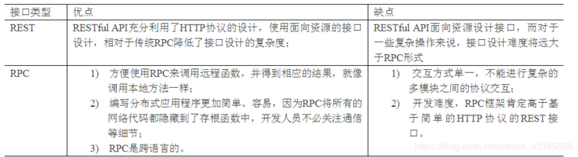
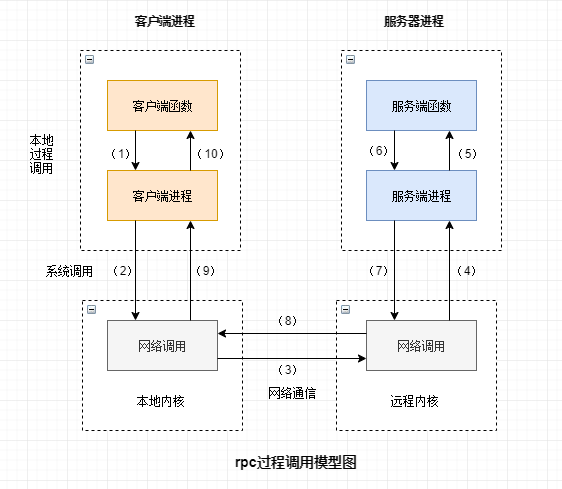

# RPC问与答

[TOC]

### RPC服务的概念，RPC服务一般都怎么做序列化？怎么处理传输层的字节流？

远程过程调用协议，是一种网络协议，是一套规范，具体的实现有Dubbo、Thrift、GRPC、Hetty等

**RPC序列化选择的维度**

1. 性能及效率：指讲一个对象序列化所花费的时间；
2. 空间开销：指的是序列化一个对象所占用的空间。因为RPC中需要在序列化后进行通信，将对象在网络中传输，所以同样会影响带宽及包传输速率；
3. 安全性：如果安全性存在问题，则容易被攻击入侵；
4. 通用性和兼容性：是否支持跨语言、跨平台，以及支持的序列化对象的程度。例如有些协议对一些数据类型不支持等问题；

|          |                          优点                           |                             缺点                             |
| :------: | :-----------------------------------------------------: | :----------------------------------------------------------: |
| JAVA原生 |                       兼容性较好                        |           性能较差，序列化后对象较大，不支持跨语言           |
|   JSON   |                  可读性好，支持跨语言                   |                      性能及空间开销较大                      |
| Hessian  |         性能及空间开销小，效率高，较多语言支持          | 兼容性不太好（Linked 系列，LinkedHashMap、LinkedHashSet 等，但是可以通过扩展 CollectionDeserializer 类修复；Locale 类，可以通过扩展 ContextSerializerFactory 类修复；Byte/Short 反序列化的时候变成 Integer） |
| Protobuf | 性能及空间开销小，效率高。通过IDL支持跨语言类型，效率高 | 单语言时需要定义IDL，如单纯java语言，可使用ProtoStuff。不支持 null；ProtoStuff 不支持单纯的 Map、List 集合对象，需要包在对象里面。 |
|   XML    |                    文本类序列化方式                     |                  序列化的额外空间开销比较大                  |
|  Thrift  |       Thrift并不仅仅是序列化协议，而是一个RPC框架       | Thrift框架本身并没有透出序列化和反序列化接口，这导致其很难和其他传输层协议共同使用（例如HTTP） |
|   kryo   |                 速度快，序列化后体积小                  |                       跨语言支持较复杂                       |

### 如何测试rpc服务的并发量

主要指标 QPS CPU的使用率  内存使用率

top命令观察cpu的使用率服务管理平台查看QPS

客户端并发量增大，Socket数量增大，指标的变化情况。

### RPC相对于传统的API调用的优点

> 除了rpc还有什么能够实现远程调用？webservice

### RPC的流程

### 如果rpc调用别的服务超时怎么办

> **首先还是为什么会超时，导致超时的原因**

一可能是网络原因导致的超时，也可能是被调用方服务出了问题迟迟得不到响应而超时，根据监控机制，查看是否由大量的尖刺或攀升，如果是断断续续或者持续，对其进一步排查

首先查网络通信，cup内存相关的指标，该调用是否每台服务都出现，超时是否是序列化大对象导致的超时；

上游服务的请求量超过了下游服务能承受的吞吐量，一般通过链路追踪；

依赖的部分非核心接口没有加缓存，做降级，导致整个请求失败；或者这些非核心接口性能较差，导致后续请求一直被阻塞，直至超时异常返回；

下游提供的查询接口比较重量级，但上游服务仅需要返参中的部分字段，导致单次查询RT一直下不去；

无状态查询接口没有加缓存，导致了频繁的RPC调用；

也有可能是频繁gc导致stw

> **如何解决**

对于网络抖动出现的问题，为了防止这种临时性的异常导致业务操作失败造成损失，可以给核心接口设置重试机制，对于一些长而复杂的调用链，分析是否有冗余调用或者多次重复调用，下游分支是否有依赖关系，可以通过加缓存，多线程，异步进行优化

利用ReentrantLock的Condition进行等待阻塞，等待相应的超时时间后，发现依然没有收到服务端的响应结果后，判断为超时

**超时重试机制**，但是超时重试机制也会带来许多问题

　1、**重复请求**：有可能provider执行完了，但是因为网络抖动consumer认为超时了，这种情况下重试机制就会导致重复请求，从而带来脏数据问题，因此服务端必须考虑接口的**幂等性**。

　2、**降低consumer的负载能力**：如果provider并不是临时性的抖动，而是确实存在性能问题，这样重试多次也是没法成功的，反而会使得consumer的平均响应时间变长。比如正常情况下provider的平均响应时间是1s，consumer将超时时间设置成1.5s，重试次数设置为2次，这样单次请求将耗时3s，consumer的整体负载就会被拉下来，如果consumer是一个高QPS的服务，还有可能引起连锁反应造成雪崩。

　3、**爆炸式的重试风暴**：假如一条调用链路经过了4个服务，最底层的服务D出现超时，这样上游服务都将发起重试，假设重试次数都设置的3次，那么B将面临正常情况下3倍的负载量，C是9倍，D是27倍，整个服务集群可能因此雪崩。

> 如何合理地设置超时时间

- 设置调用方的超时时间之前，先了解清楚依赖服务的TP99响应时间是多少（如果依赖服务性能波动大，也可以看TP95），调用方的超时时间可以在此基础上加50%；统计出弱依赖接口 TP99（RT较稳定的接口）/ TP95 （RT波动较大接口）的RT，设置它们的超时时间为 **(1 + 50%) (TP99 或 TP95)**
- 如果RPC框架支持多粒度的超时设置，则：全局超时时间应该要略大于接口级别最长的耗时时间，每个接口的超时时间应该要略大于方法级别最长的耗时时间，每个方法的超时时间应该要略大于实际的方法执行时间
- 区分是可重试服务还是不可重试服务，如果接口没实现幂等则不允许设置重试次数。注意：读接口是天然幂等的，写接口则可以使用业务单据ID或者在调用方生成唯一ID传递给服务端，通过此ID进行防重避免引入脏数据
- 如果RPC框架支持服务端的超时设置，同样基于前面3条规则依次进行设置，这样能避免客户端不设置的情况下配置是合理的，减少隐患
- 如果从业务角度来看，服务可用性要求不用那么高（比如偏内部的应用系统），则可以不用设置超时重试次数，直接人工重试即可，这样能减少接口实现的复杂度，反而更利于后期维护
- 重试次数设置越大，服务可用性越高，业务损失也能进一步降低，但是性能隐患也会更大，这个需要综合考虑设置成几次（一般是2次，最多3次）
- 如果调用方是高QPS服务，则必须考虑服务方超时情况下的降级和熔断策略。（比如超过10%的请求出错，则停止重试机制直接熔断，改成调用其他服务、异步MQ机制、或者使用调用方的缓存数据）

### RPC调用中服务注册设计

> 注册中心是如何存储服务信息的

把服务注册到服务中心，其实就是在注册中心进行一个登记，注册中心存储了该服务的IP、端口、调用方式(协议、序列化方式)等。在zookeeper中，进行服务注册，实际上就是在zookeeper中创建了一个znode节点，该节点存储了上面所说的服务信息。该节点承担着最重要的职责，它由服务提供者(发布服务时)创建，以供服务消费者获取节点中的信息，从而定位到服务提供者真正网络拓扑位置以及得知如何调用。

### 断线重连的设计

- 客户端掉线：服务端删除map中的映射，并删除redis中的数据
- 客户端宕机：心跳机制来检测是否存活，长时间未收到心跳包，断开连接，若检测到服务器宕机就删除对应的节点

### RPC调用中如果出错怎么处理

捕获异常，重试机制

### RPC调用中服务器宕机怎么处理

服务注销钩子，心跳检测，二次请求

> 如果如果插入5个数据，插入完第一个服务器宕机了怎么处理

和服务注册中心维护一个执行偏移量，然后从偏移点继续执行

### RPC心跳机制

客户端启动一个定时器用来定时发送请求，服务端接到请求进行响应，如果多次没有接受到响应，那么客户端认为连接已经断开，可以断开半打开的连接或者进行重连处理

### 微服务RPC下，发现使用TCP的效率比UDP高，可能是什么原因

**UDP无法智能利用空闲带宽导致资源利用率低**，由于网络情况是动态变化的，UDP无法根据变化进行调整，发包过大或过小，从而导致带宽利用率低下，有效吞吐量下降

**UDP无法动态调整发包**，由于UDP没有确认机制，没有流量控制和拥塞控制，这样在网络出现拥塞或通信两端处理能力不匹配的时候，UDP并不会进行调整发送速率，从而导致大量丢包。不合理的简单重传策略会导致重传风暴，进一步加剧网络的拥塞

### 对于一个外部请求，如何在尽可能短的时间处理完成

1**.提升调用链上各节点的处理速度**

从数据库层面，可以考虑加索引，读写分离，分库分表；在应用层面，可以考虑加缓存（本地缓存，分布式缓存，或者两者叠加）、复杂查询走ES索引；在代码编写时，可以考虑更高效的算法和数据结构，比如：读多写少用数组、写多读少用链表、取余采用位运算等

从业务角度考虑，尽量避免一些重复查询，对于一些查询类操作，尽可能采用批量查询；上游调用方尽可能使用更适合的下游接口

2.**请求做并行化处理**

并行化请求，字面意思就是当有多个外部请求进来时，可以让系统内部多个节点分别处理这些请求，或者节点内部做并行处理，比如：节点采用集群部署，并通过负载均衡，将用户请求分摊到不同的节点进行处理，节点内部采用线程池，通过另开线程来实现

将单个请求拆分成多个子请求，各子请求并行处理，最后对子请求结果合并返回，可以考虑多采用CompletableFuture

3.**请求处理异步化**

最典型的方法就是采用消息队列，对于一些非核心的后置流程，可以采用消息队列做异步化处理；

在进程内，另开一个线程执行一些非核心流程；

将这些非核心操作数据暂存在某种介质（DB表，redis等）中，然后采用定时任务定期扫描并执行这些操作

> 1.自定义了一个简单协议，自定义的协议头里包括哪些内容，多少字节，各自的作用是什么（魔数，消息长度，请求id，消息类型）
> 2.网络通信使用的nettt，通过那些设置对netty进行过调优（netty的bootstrap的option设置基本都是模仿netty官方案例搞的，backlog是什么意思）
> 3.心跳检测，心跳检测处理和业务处理是一起处理的吗（是的，evenrtriggered和channelread的确写在了一个handler里）
> 4.有为你的业务处理开辟专门的线程吗，具体是怎么做的（在bootstrap绑定线程）
> 5.用来作为不同服务的识别标识是接口名，用的接口名是全路径名吗，在服务端如何对应到具体的方法上
> 6.如果现在在一部分机器上更新了我的接口，如何做到或者你将如何去做能让客户端区分新版和旧版
> 7.如果服务下架了，在客户端需要做什么事
> 8.如果框架拿去给上层写实现的去用，如何做到...(定义注解是如何去实现的)
> 9.像springmvc提供给用户自定义拦截器的功能，框架有没有提供类似的接口，可以给用户做一些拓展
>
>  1. 知道哪些RPC的方式？有哪些框架？如果让你设计RPC数据交换报文格式你会怎么设计？最重要的是什么？
>  2. RPC基于TCP/IP协议的，http基于http协议的，http是传输层TCP之上的，效率上rpc更好；以及更详细的
> 3. Rpc的原理？有哪些应用