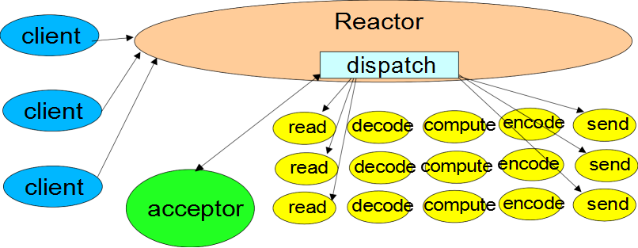

# Reactor模式

[TOC]

## 对比

首先将Reactor模式和其他模式进行对比，先入为主，简单理解Reactor模式的基本局面

### 反应器模式和生产者消费者模式对比

- 相似之处：在一点程度上，反应器模式类似生产者消费者模式，在生产者消费者模式中，一个或多个生产者将事件加入到一个队列中，一个或多个消费者主动地从这个队列中提取（Pull）事件来处理
- 不同之处：反应器模式是**基于查询的**，**没有专门的队列去缓冲存储IO事件**，查询到IO事件之后，反应器会**根据不用IO选择键（事件）**将其**分发给对应的Handle处理器**来处理

### 反应器模式和观察者模式对比

- 相似之处：在反应器模式中，当查询到IO事件之后，服务处理程序**使用单路/多路分发（Dispatch）策略**，同步地分发这些IO事件；观察者模式也被称作为发布订阅模式，它定义了一种**依赖关系**，让多个观察者同时监听某一个主题（Topic），这个主题对象在状态发生变化时，会通知所有观察者，它们能够执行响应地处理
- 不同之处：在反应器模式中，Handle处理器实例和IO事件（选择键）的订阅关系，基本上是**一个事件绑定到一个Handle处理器**；每一个IO事件（选择键）被查询后，反应器会将事件分发给绑定的Handle处理器，而在观察者模式中，同一时刻，同一个主题**可以被订阅过的多个观察者处理**

## 优缺点

### 优点

- 1）响应快，不必为单个同步时间所阻塞，虽然Reactor本身依然是同步的；
- 2）编程相对简单，可以最大程度的避免复杂的多线程及同步问题，并且避免了多线程/进程的切换开销；
- 3）可扩展性，可以方便的通过增加Reactor实例个数来充分利用CPU资源；
- 4）可复用性，reactor框架本身与具体事件处理逻辑无关，具有很高的复用性；

### 缺点

- 1）相比传统的简单模型，Reactor增加了一定的复杂性，因而有一定的门槛，并且不易于调试。
- 2）Reactor模式需要底层的Synchronous Event Demultiplexer（事件分离器）支持，比如Java中的Selector支持，操作系统的select系统调用支持，如果要自己实现Synchronous Event Demultiplexer可能不会有那么高效。也就是说需要操作系统底层的IO多路复用的支持，如Linux中的epoll。
- 3） Reactor模式在IO读写数据时还是在同一个线程中实现的，即使使用多个Reactor机制的情况下，那些共享一个Reactor的Channel如果出现一个长时间的数据读写，会影响这个Reactor中其他Channel的相应时间，同一个Handle业务线程中，如果出现一个长时间的数据读写，会影响这个反应器中其他通道的IO处理，比如在大文件传输时，IO操作就会影响其他Client的相应时间，因而对这种操作，使用传统的Thread-Per-Connection或许是一个更好的选择，或则此时使用改进版的Reactor模式如Proactor模式。

## 简介

反应器模式是高性能网络编程在设计和架构层面的基础模式，netty就是基于反应器模式的

在Java进行网络通信时，通常有两种体系结构，分别为：**thread-based architecture（基于线程）**、**event-driven architecture（事件驱动）**

### 基于线程

这也是传统的服务设计模式，为每一个连接的处理开启一个新的线程，每一个连接的处理都会对应分配一个新的线程

基于线程的体系结构通常会使用多线程来处理客户端的请求，**每当接收到一个请求，便开启一个独立的线程来处理**。这种方式虽然是直观的，但是仅适用于并发访问量不大的场景，因为线程需要占用一定的内存资源，且操作系统在线程之间的切换也需要一定的开销，当线程数过多时显然会降低web服务器的性能。并且，当线程在处理I/O操作，在等待输入的这段时间线程处于空闲的状态，同样也会造成cpu资源的浪费。一个典型的设计如下：

**Connection Per Thread（一个线程处理一个连接）**

> 这种方式解决的是前面的新连接被严重阻塞的问题（最原始的就是while循环，不断地监听端口是否有新的连接，有就调用一个处理函数，没处理完后面的请求通通被阻塞），一定程度上，提高了服务器的吞吐量

~~~java
package com.crazymakercircle.iodemo.OIO;
//...省略: 导入的Java类
class ConnectionPerThread implements Runnable {
    public void run() {
        try {
            //服务器监听socket
            ServerSocketserverSocket =
                new ServerSocket(NioDemoConfig.SOCKET_SERVER_PORT);
            while (!Thread.interrupted()) {
                Socket socket = serverSocket.accept();
                //接收一个连接后，为socket连接，新建一个专属的处理器对象
                Handler handler = new Handler(socket);
                //创建新线程，专门负责一个连接的处理
                new Thread(handler).start();
            }
        } catch (IOException ex) { /* 处理异常 */ }
    }
    //处理器对象
    static class Handler implements Runnable {
        final Socket socket;
        Handler(Socket s) {
            socket = s;
        }
        public void run() {
            while (true) {
                try {
                    byte[] input = new byte[NioDemoConfig.SERVER_BUFFER_SIZE];
                    /* 读取数据 */
                    socket.getInputStream().read(input);
                    /* 处理业务逻辑，获取处理结果*/
                    byte[] output =null;
                    /* 写入结果 */
                    socket.getOutputStream().write(output);
                } catch (IOException ex) { /*处理异常*/ }
            }
        }
    }
}
~~~

> 看上去，没有什么不可以。但是，实际上没有用。为什么？传统OIO编程中每一个socket的IO读写操作，都是阻塞的。在同一时刻，**一个线程里只能处理一个socket**，前一个socket被阻塞了，后面连接的IO操作是无法被并发执行的。所以，不论怎么处理，OIO中一个线程也只能是处理一个连接的IO操作。
>
> Connection Per Thread模式的缺点是：对应于大量的连接，**需要耗费大量的线程资源，对线程资源要求太高**。在系统中，线程是比较昂贵的系统资源。如果线程数太多，系统无法承受。而且，**线程的反复创建、 销毁、线程的切换也需要代价**。因此，在高并发的应用场景下，多线程OIO的缺陷是致命的。

**问题**

在构建高性能可伸缩IO服务过程中，应达到一下的目标

①　能够在海量负载连接情况下优雅降级；

②　能够随着硬件资源的增加，性能持续改进；

③　具备低延迟、高吞吐量、可调节的服务质量等特点；

**而分发处理就是实现上述目标的一个最佳方式。**

### 分发模式

分发模式具有以下几个机制：

①　将一个完整处理过程分解为一个个细小的任务；

②　每个任务执行相关的动作且不产生阻塞；

③　在任务执行状态被触发时才会去执行，例如只在有数据时才会触发读操作；

在一般的服务开发当中，IO事件通常被当做任务执行状态的触发器使用，在hander处理过程中主要针对的也就是IO事件；

java.nio包就很好的实现了上述的机制：

**①　非阻塞的读和写**

**②　通过感知IO事件分发任务的执行**

所以结合一系列基于事件驱动模式的设计，给高性能IO服务的架构与设计带来丰富的可扩展性；

### 事件驱动

基于事件驱动的架构设计通常比其他架构模型更加有效，因为可以节省一定的性能资源，事件驱动模式下通常**不需要为每一个客户端建立一个线程**，这意味这**更少的线程开销，更少的上下文切换和更少的锁互斥，但任务的调度可能会慢一些**，而且通常实现的复杂度也会增加，相关功能必须分解成简单的非阻塞操作，类似与GUI的事件驱动机制，当然也不可能把所有阻塞都消除掉，特别是GC， page faults(内存缺页中断)等。由于是基于事件驱动的，所以需要跟踪服务的相关状态（因为你需要知道什么时候事件会发生）;

下图是AWT中事件驱动设计的一个简单示意图，可以看到，在不同的架构设计中的基于事件驱动的IO操作使用的基本思路是一致的；

## Reactor模式

反应器模式由Reactor反应器线程、Handles处理器两大角色组成：

- Reactor反应器线程的职责：负责响应IO事件，并且分发到Handle处理器
- Handles处理器的职责：与IO事件（或者选择键）绑定， 负责IO事件的处理，完成真正的连接建立、通道的读取、处理业务逻辑、负责将结果写出到通道

特点如下

①　Reactor模式中会通过分配适当的handler(处理程序)来响应IO事件，类似与AWT 事件处理线程；

②　每个handler执行非阻塞的操作，类似于AWT ActionListeners 事件监听

③　通过将handler绑定到事件进行管理，类似与AWT addActionListener 添加事件监听；

### 单线程下基本的Reactor模式

~~~java
package com.crazymakercircle.ReactorModel;
//...
class Reactor implements Runnable {
    Selector selector;
    ServerSocketChannelserverSocket;
    EchoServerReactor() throws IOException {
        // ...省略：打开选择器、serverSocket连接监听通道
        // 注册serverSocket的接受（accept）事件
        SelectionKeysk =
            serverSocket.register(selector, SelectionKey.OP_ACCEPT);
        // 将新连接处理器作为附件，绑定到sk选择键
        sk.attach(new AcceptorHandler());
    }
    public void run() {
        // 选择器轮询
        try {
            while (!Thread.interrupted()) {
                selector.select();
                Set selected = selector.selectedKeys();
                Iterator it = selected.iterator();
                while (it.hasNext()) {
                    //反应器负责dispatch收到的事件
                    SelectionKeysk=it.next();
                    dispatch(sk);
                }
                selected.clear();
            }
        } catch (IOException ex) { ex.printStackTrace(); }
    }
    // 反应器的分发方法
    void dispatch(SelectionKey k) {
        Runnable handler = (Runnable) (k.attachment());
        // 调用之前绑定到选择键的handler处理器对象
        if (handler != null) {
            handler.run();
        }
    }
    // 新连接处理器 也即Handle处理器
    class AcceptorHandler implements Runnable {
        public void run() {
            // 1.接受新连接
            // 2.需要为新连接，创建一个输入输出的handler处理器，称之为IOHandle
        }
    }
    //…
}
// 负责socket的数据输入、业务处理、结果输出
class IOHandler implements Runnable {
    // 将新的SocketChannel传输通道，注册到了反应器Reactor类的同一个选择器中。这样保证了Reactor类和Handler类在同一个线程中执行。
    final SocketChannel channel;
    final SelectionKeysk;
    IOHandler (Selector selector, SocketChannel c) throws IOException {
        channel = c;
        c.configureBlocking(false);
        // 仅仅取得选择键，稍候设置感兴趣的IO事件
        sk = channel.register(selector, 0);
        // 将IOHandler自身作为附件，attach到了选择键中。这样，在Reactor类分发事件（选择键）时，能执行到IOHandler的run方法
        sk.attach(this);
        // 注册读写就绪事件
        sk.interestOps(SelectionKey.OP_READ|SelectionKey.OP_WRITE);
    }
    public void run() {
        // ...处理输入和输出
    }
}

~~~

#### 缺点

单线程Reactor反应器模式，是基于Java的NIO实现的。相对于传统的多线程OIO，反应器模式不再需要 启动成千上万条线程，效率自然是大大提升了。

 在单线程反应器模式中，Reactor反应器和Handler处理器，都执行在同一条线程上。这样，带来了一个问 题：**当其中某个Handler阻塞时，会导致其他所有的Handler都得不到执行**。在这种场景下，如果被阻塞的 Handler不仅仅负责输入和输出处理的业务，还**包括负责连接监听的AcceptorHandler处理器**。这个是非常严重 的问题。 

为什么？一旦AcceptorHandler处理器阻塞，会导致整个服务**不能接收新的连接**，使得服务器变得不可用。因为这个缺陷，因此单线程反应器模型用得比较少。

 另外，目前的服务器都是多核的，单线程反应器模式模型**不能充分利用多核资源**。总之，在高性能服务器应用场景中，单线程反应器模式实际使用的很少。

### 多线程的Reactor反应器模式

处理解决上述单线程带来的问题

> - 战略性的添加线程以增加通信模型的可扩展性，主要是利用多核处理器架构体系。
> - 工作线程：多线程版本利用工作线程加速Handler的处理过程，并且它将非I/O的处理工作卸载到其他线程处理。
> - Reactor模型（MultiThread 版本）：Reactor线程可以更加专注与执行I/O事件监听操作。

**Worker Thread Pools**

> 将处理器的执行放入线程池，多线程进行业务处理。但Reactor仍为单个线程。

**WorkThreads**

> - 卸载非I/O处理任务以加速Reactor线程的监听事件处理工作
> - 将计算绑定处理的模型重新转换为事件驱动的模型形式，这种方式更加简单快速
> - 但是这种方式很难与I/O模式下重叠处理
> - 使用线程池可以很方便的调整和控制任务的执行

**继续改进，充分利用系统资源，将Reactor拆分成两部分**

**Using Multiple Reactors**

> mainReactor负责监听连接，accept连接给subReactor处理，为什么要单独分一个Reactor来处理监听呢？因为像TCP这样需要经过3次握手才能建立连接，这个建立连接的过程也是要耗时间和资源的，单独分一个Reactor来处理，可以提高性能。

#### 演进

多线程池Reactor反应器的演进，分为两个方面： 

（1）首先是升级Handler处理器。既要使用多线程，又要尽可能的高效率，则可以考虑使用线程池。 

（2）其次是升级Reactor反应器。可以考虑引入多个Selector选择器，提升选择大量通道的能力。 

总体来说，多线程池反应器的模式，大致如下：

 （1）将负责输入输出处理的IOHandler处理器的执行，放入**独立的线程池**中。这样，**业务处理线程与负责服务监听和IO事件查询的反应器线程相隔离**，避免服务器的连接监听受到阻塞。 

（2）如果服务器为多核的CPU，可以**将反应器线程拆分为多个子反应器**（SubReactor）线程；同时，引入多个选择器，每一个SubReactor子线程负责一个选择器。这样，充分释放了系统资源的能力；也提高了反应器管理大量连接，提升选择大量通道的能力。

## Netty线程模型

常用的Reactor线程模型有三种，分别如下：

### Reactor单线程模型

指的是**所有的I/O操作都在同一个NIO线程上面完成**。对于一些小容量应用场景，可以使用单线程模型。

### Reactor多线程模型

Rector多线程模型与单线程模型最大的区别就是**由一组NIO线程处理I/O操作**。主要用于高并发、大业务量场景。

### 主从Reactor多线程模型

主从Reactor线程模型的特点是服务端用于**接收客户端连接的不再是个1个单独的NIO线程，而是一个独立的NIO线程池**。利用主从NIO线程模型，可以解决1个服务端监听线程无法有效处理所有客户端连接的性能不足问题。

事实上，Netty的线程模型并非固定不变，通过在启动辅助类中创建不同的EventLoopGroup实例并通过适当的参数配置，就可以支持上述三种Reactor线程模型.

在大多数场景下，**并行**多线程处理可以提升系统的并发性能。但是，如果对于共享资源的并发访问处理不当，会带来严重的**锁竞争**，**这最终会导致性能的下降**。为了尽可能的避免锁竞争带来的性能损耗，可以通过**串行化设计**，即**消息的处理尽可能在同一个线程内完成**，期间不进行线程切换，这样就避免了多线程竞争和同步锁。

为了尽可能提升性能，Netty采用了**串行无锁化设计**，在I/O线程内部进行串行操作，避免多线程竞争导致的性能下降。表面上看，串行化设计似乎CPU利用率不高，并发程度不够。但是，通过调整NIO线程池的线程参数，可以同时**启动多个串行化的线程并行运行**，这种局部无锁化的串行线程设计相比一个队列-多个工作线程模型性能更优。

Netty的NioEventLoop读取到消息之后，直接调用ChannelPipeline的fireChannelRead(Object msg)，只要用户不主动切换线程，一直会由NioEventLoop调用到用户的Handler，期间不进行线程切换，这种**串行化处理方式避免了多线程操作导致的锁的竞争**，从性能角度看是最优的。

