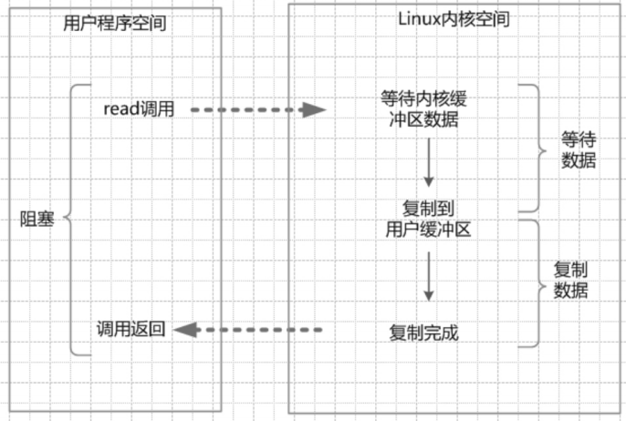
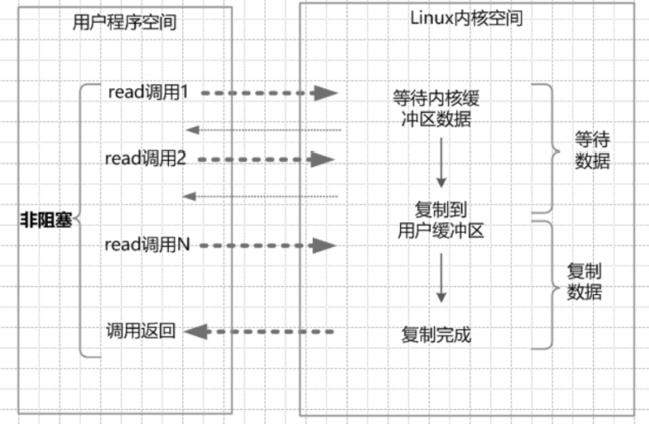
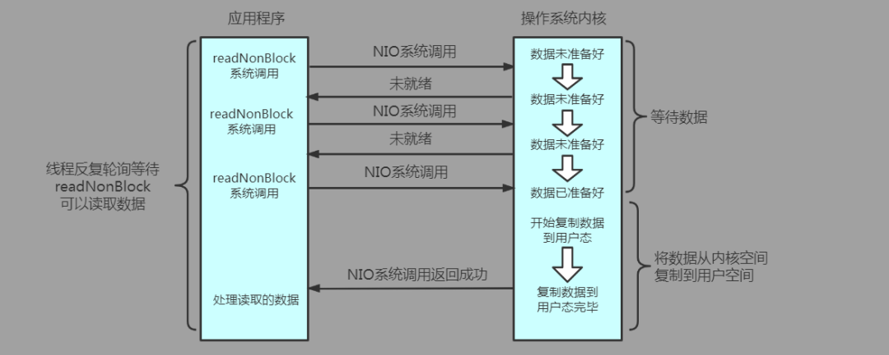
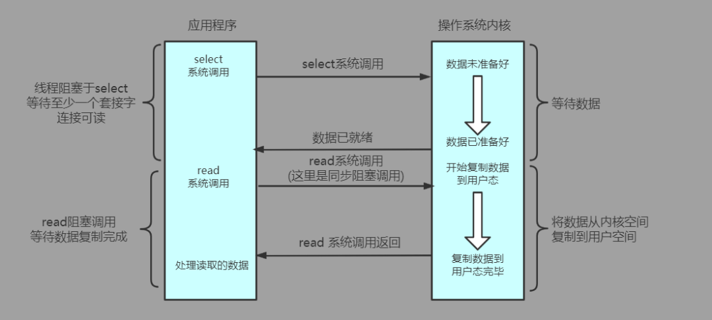
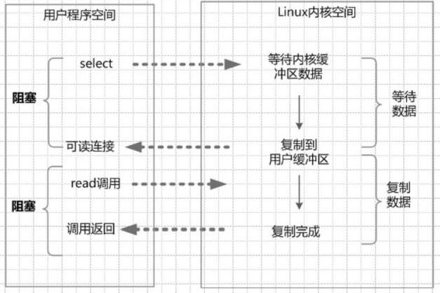
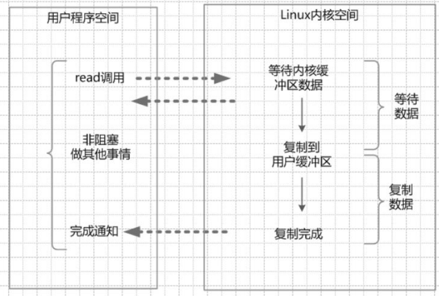
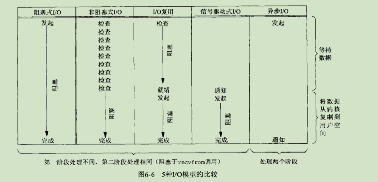

# IO模型

[TOC]

## 水平触发和边缘触发

**水平触发LT**:

如果文件描述符已经就绪可以非阻塞的执行IO操作了,此时会触发通知.

允许在任意时刻重复检测IO的状态.select,poll就属于水平触发.

**优缺点**：

- **优点:** 主要在于其简单且稳定,不容易出现问题.传统的select和poll都是使用这个模式
- **缺点:** 事件触发过多导致效率降低

 **边缘触发ET**:

触发条件:

- **可读事件:**(不关心接收缓存区是否有数据) 每当有新数据到来时才会触发事件
- **可写事件:** 剩余空间从无到有的时候才会触发事件

**优缺点:**

- **优点:** 减少了epoll的触发次数,但是也带来了巨大的代价
- **缺点:** 要求必须一次性将所有的数据处理完,虽然效率得到了提高,但是代码的复杂程度大大的增加了 Nginx就是默认采用ET模式

**边触只有在新数据到来的情况下才会触发事件**，而水触只要缓冲区还有数据，就会一直触发事件

在收到一个IO事件通知后要尽可能多的执行IO操作,因为如果在一次通知中没有执行完IO那么就需要等到下一次新的IO活动到来才能获取到就绪的描述符.信号驱动式IO就属于边缘触发.epoll既支持水平触发也支持边缘触发，默认是水平触发。

## 同步异步阻塞非阻塞

同步I/O与异步I/O的主要区别就在于站在应用程序的视角看，真正读取/写入数据时是否是由应用程序主导的。如果需要用户程序主动发起最终的I/O请求就被称为同步I/O；而如果是内核自动完成I/O后通知用户程序，则被称为异步I/O。(可以类比在下文硬件I/O模型中，站在CPU视角的同步、异步I/O模型，只不过这里CPU变成了应用程序，而外设/DMA变成了操作系统内核)

在处理 IO 的时候，阻塞和非阻塞都是同步 IO。
只有使用了特殊的 API 才是异步 IO。

> 阻塞相当于没抢到互斥锁的线程，会被挂起，不占用CPU，当锁被释放时又会被唤醒起来抢锁。非阻塞相当于没抢到自旋锁的线程，不会被挂起，会一直轮询，占用CPU。

## 硬件IO模型

**计算机中的I/O本质上是CPU/内存与外设(网卡、磁盘等)进行数据的单向或双向传输**

从外设读入数据到CPU/内存称作Input输入，从CPU/内存中写出数据到外设称作Output输出。硬件I/O模型大致可以分为三种：**程序控制I/O、中断驱动I/O、使用DMA的I/O**。

1. 程序控制I/O：

   通过指令控制CPU**不断的轮询**外设是否就绪，当硬件就绪时一点一点的反复读/写数据

   从CPU的角度来说，程序控制I/O模型是同步、阻塞的(同步指的是I/O操作依然是处于程序指令控制，由CPU主导的；阻塞指的是在发起I/O后CPU必须持续轮询完成状态，无法执行别的指令)。

   

   程序控制I/O的优点：

   　　硬件结构简单，编写对应程序也简单。

   

   程序控制I/O的缺点：

   　　十分消耗CPU，持续的轮训令宝贵的CPU资源无谓的浪费在了等待I/O完成的过程中，导致CPU利用率不高。

2. 中断驱动I/O：

   为了解决上述程序控制I/O模型对CPU资源利用率不高的问题，计算机硬件的设计者令CPU拥有了处理中断的功能。

   在中断驱动I/O模型中，CPU发起对外设的I/O请求后，**就直接去执行别的指令了**。当硬件处理完I/O请求后，通过中断异步的**通知CPU**。接到读取完成中断通知后，CPU负责将数据从外设缓冲区中写入内存；接到写出完成中断通知后，CPU需要将内存中后续的数据接着写出交给外设处理。

   从CPU的角度来说，中断驱动I/O模型是**同步、非阻塞的**(同步指的是I/O操作依然是处于程序指令控制，由CPU主导的；非阻塞指的是在发起I/O后CPU不会停下等待，而是可以执行别的指令)。

   

   中断驱动I/O的优点：

   　　由于I/O总是相对耗时的，比起通过程序控制I/O模型下CPU不停的轮训。在等待硬件I/O完成的过程中CPU可以解放出来执行另外的命令，大大提高了I/O密集程序的CPU利用率。

   

   中断驱动I/O的缺点：

   　　受制于硬件缓冲区的大小，一次硬件I/O可以处理的数据是相对有限的。在处理一次大数据的I/O请求中，**CPU需要被反复的中断**，而处理读写中断事件本身也是有一定开销的。

3. 使用DMA的I/O：

   为了解决中断驱动I/O模型中，大数据量的I/O传输使得CPU需要反复处理中断的缺陷，计算机硬件的设计者提出了基于DMA模式的I/O(**DMA Direct Memory Access 直接存储器访问**)。DMA也是一种处理器芯片，和CPU一样也可以访问内存和外设，但DMA芯片是被设计来专门处理I/O数据传输的，因此其成本相对CPU较低。

   　　在使用DMA的I/O模型中，CPU与DMA芯片交互，指定需要读/写的数据块大小和需要进行I/O数据的目的内存地址后，**便异步的处理别的指令了**。由DMA与外设硬件进行交互，一次大数据量的I/O需要DMA反复的与外设进行交互，当DMA完成了整体数据块的I/O后(**完整的将数据读入到内存或是完整的将某一内存块的数据写出到外设**)，再发起DMA中断通知CPU。

   　　从CPU的角度来说，使用DMA的I/O模型是**异步、非阻塞的**(异步指的是整个I/O操作并不是由CPU主导，而是由DMA芯片与外设交互完成的；非阻塞指的是在发起I/O后CPU不会停下等待，而是可以执行别的指令)。

   

   使用DMA的I/O优点：

   　　比起外设硬件中断通知，对于一次完整的大数据内存与外设间的I/O，CPU只需要处理一次中断。CPU的利用效率相对来说是最高的。

   

   使用DMA的I/O缺点：

   　　1. 引入DMA芯片令硬件结构变复杂，成本较高。

   　　2. 由于DMA芯片的引入，使得DMA和CPU并发的对内存进行操作，在拥有高速缓存的CPU中，引入了高速缓存与内存不一致的问题。

自DMA技术被发明以来，由于其极大减少了CPU在I/O时的性能损耗，已经成为了绝大多数通用计算机的硬件标配。随着技术的发展又出现了更先进的**通道I/O方式**，相当于并发的DMA，允许并发的处理涉及多个不同内存区域、外设硬件的I/O操作。

## IO引言

注意一点：上层程序的IO操作，实际上不是物理设别级别的读写，而是缓存的复制，无论是Socket的IO，还是文件的IO操作，都属于上层应用的开发

缓存区的目的，就是为了减少频繁地与设备之间的物理交换，有了内存缓冲区，上层应用使用read系统调用时，仅仅把数据从内核缓冲区复制到上层应用的缓冲区（进程缓冲区）；上层应用使用write系统调用时，仅仅把数据从进程缓冲区复制到内核缓冲区。底层操作系统会对内核缓冲区进行监控，等待缓冲区达到一定数量时，再进行IO设备的中断处理，集中执行物理设备的实际IO操作

具体的来说，在Java服务器端，完成一次socket请求和响应，完整的流程如下：

1. 客户端请求：Linux通过网卡读取客户端的请求数据，将数据读取到内核缓冲区
2. 获取请求数据：Java服务器通过read系统调用，从Linux内核缓冲区读取数据，再送入Java进程缓冲区
3. 服务器端业务处理：Java服务器在自己的用户空间中处理客户端的请求
4. 服务器返回数据：Java服务器完成处理后，构建好的响应数据，将这些数据从用户缓冲区写入内核缓冲区，这里用到的是write系统调用
5. 发送给客户端：Linux内核通过网络IO，将内核缓冲区中的数据写入网卡，网卡通过底层的通信协议，将数据发送给目标客户端

## 操作系统IO模型

操作系统帮我们屏蔽了诸多硬件外设的差异，为应用程序的开发者提供了友好、统一的服务。为了避免应用程序破坏操作系统内核，CPU提供了保护模式机制，使得应用程序无法直接访问被操作系统管理起来的外设，而必须通过内核提供的**系统调用**间接的访问外设。关于操作系统I/O模型的讨论针对的就是**应用程序与内核**之间进行I/O交互的系统调用模型。

常见的IO模型有如下的四种

1. 同步阻塞IO（Blocking IO）
2. 同步非阻塞IO （Non-blocking IO）
3. IO多路复用 (IO Multiplexing)
4. 异步IO （Asynchronous IO）

> 另外，还有一种信号驱动IO（内核在IO就绪发送SIGIO信号通知应用进程），不常见，信号驱动式模型的一个显著特点是用户态进程不再等待内核态的数据准备好，直接可以去做别的事情，但是等待数据从内核缓冲区拷贝到进程缓冲区仍然是阻塞的

## 同步阻塞BIO

> 我们已经知道，高效的硬件层面I/O模型对于CPU来说是异步的，但应用程序开发者总是希望在执行完I/O系统调用后能同步的返回，线性的执行后续逻辑(例如当磁盘读取的系统调用返回后，下一行代码中就能直接访问到所读出的数据)。但这与硬件层面耗时、异步的I/O模型相违背(程序控制I/O过于浪费CPU)，因此操作系统内核提供了基于同步、阻塞I/O的系统调用(BIO)来解决这一问题。
>
> 　　举个例子：当线程通过基于BIO的系统调用进行磁盘读取时，内核会令当前线程进入阻塞态，让出CPU资源给其它并发的就绪态线程，以便更有效率的利用CPU。当DMA完成读取，异步的I/O中断到来时，内核会找到先前被阻塞的对应线程，将其唤醒进入就绪态。当这个就绪态的线程被内核CPU调度器选中再度获得CPU时，便能从对应的缓冲区结构中得到读取到的磁盘数据，程序同步的执行流便能顺利的向下执行了。(感觉好像线程卡在了那里不动，过了一会才执行下一行，且指定的缓冲区中已经有了所需的数据)

在Java应用程序进程中，默认情况下，**所有的socket连接**的IO操作都是同步阻塞IO（Blocking IO）。 在阻塞式IO模型中，Java应用程序**从IO系统调用开始，直到系统调用返回**，在这段时间内，Java进程是阻塞的。返回成功后，应用进程开始处理用户空间的缓存区数据。 同步阻塞IO的具体流程如下

举个例子，在Java中发起一个socket的read读操作的系统调用，流程大致如下：

 （1）从Java启动IO读的read系统调用开始，用户线程就进入阻塞状态。

 （2）当系统内核收到read系统调用，就开始准备数据。一开始，数据可能还没有到达内核缓冲区（例如，还没有收到一个完整的socket数据包），这个时候内核就要**等待**。

 （3）内核一直等到完整的数据到达，就会将数据从内核缓冲区复制到用户缓冲区（用户空间的内存），然后内核返回结果（例如返回复制到用户缓冲区中的字节数）。

 （4）直到内核返回后，**用户线程才会解除阻塞的状态，重新运行起来**。

 总之，阻塞IO的特点是：**在内核进行IO执行的两个阶段，用户线程都被阻塞了**。 

阻塞IO的优点是：应用的程序开发非常简单；在阻塞等待数据期间，**用户线程挂起**。在阻塞期间，用户线程**基本不会占用CPU资源。**

阻塞IO的缺点是：

1. 一般情况下，会为每个连接配备一个独立的线程；反过来说，就是**一个线程维护一个连接的IO操作**。在并发量小的情况下，这样做没有什么问题。但是，当在高并发的应用场景下，需要大量的线程来维护大量的网络连接，**内存、线程切换开销会非常巨大**。因此，基本上阻塞IO模型在高并发应用场景下是不可用的。
2. 由于BIO在等待I/O完成的时间中，线程虽然被阻塞不消耗CPU，但内核维护一个系统级线程本身也是有一定的开销(维护线程控制块、内核线程栈空间等等)。
3. 不同线程在调度时的**上下文切换CPU开销较大**，在如今大量用户、高并发的互联网时代越来越成为web服务器性能的瓶颈。线程上下文切换本身需要需要保存、恢复现场，同时还会清空CPU指令流水线，以及令高速缓存大量失效。对于一个web服务器，如果使用BIO模型，服务器将至少需要1:1的维护同等数量的系统级线程(内核线程)，由于持续并发的网络数据交互，导致不同线程由于网络I/O的完成事件被内核反复的调度。

## 同步非阻塞NIO

> NIO模型的系统调用不会阻塞当前调用线程。但由于I/O本质上的耗时特性，无法立即得到I/O处理的结果，NIO的系统调用在I/O未完成时会返回特定标识，代表对应的I/O事件还未完成。因此需要应用程序按照一定的频率反复调用，以获取最新的IO状态。

socket连接默认是阻塞模式，在Linux系统下，可以通过设置将socket变成为非阻塞的模式（Non-Blocking）。

使用非阻塞模式的IO读写，叫作同步非阻塞IO（None Blocking IO），简称为NIO模式。在 NIO模型中，应用程序一旦开始IO系统调用，会出现以下两种情况：

（1）在内核缓冲区中没有数据的情况下，系统调用会**立即返回**，**返回一个调用失败的信息**。 

（2）在内核缓冲区中**有数据的情况下，是阻塞的**，直到数据从内核缓冲复制到用户进程缓冲。复制完成后，**系统调用返回成功**，应用进程开始处理用户空间的缓存数据。

同步非阻塞IO的流程如下

举个例子。发起一个非阻塞socket的read读操作的系统调用，流程如下： 

（1）在内核数据没有准备好的阶段，用户线程发起IO请求时，立即返回。所以，为了读取到最终的数据，用户线程需要**不断地发起IO系统调用**。 

（2）内核数据到达后，用户线程发起系统调用，**用户线程阻塞**。内核开始复制数据，它会将数据从内核缓冲区复制到用户缓冲区（用户空间的内存），然后内核返回结果（例如返回复制到的用户缓冲区的字节数）。 

（3）**用户线程读到数据后，才会解除阻塞状态**，重新运行起来。也就是说，用户进程**需要经过多次的尝试，才能保证最终真正读到数据，而后继续执行**。

同步非阻塞IO的特点：应用程序的线程需要不断地进行IO系统调用，轮询数据是否已经准备好，如果没有准备好，就继续轮询，直到完成IO系统调用为止。

同步非阻塞IO的优点：每次发起的IO系统调用，在内核等待数据过程中**可以立即返回**。**用户线程不会阻塞，实时性较好**。

同步非阻塞IO的缺点：**不断地轮询内核**，这将占用大量的CPU时间，效率低下。

总体来说，在高并发应用场景下，同步非阻塞IO**也是不可用的**。一般Web服务器不使用这种IO模型。这 种IO模型一般很少直接使用，而是在其他IO模型中使用非阻塞IO这一特性。在Java的实际开发中，也不会涉及这种IO模型。 这里说明一下，同步非阻塞IO，可以简称为NIO，但是，它不是Java中的NIO，虽然它们的英文缩写一 样。

Java的NIO（New IO），对应的不是四种基础IO模型中的NIO（None Blocking IO）模型，而是另外的一种模型，叫作IO多路复用模型（IO Multiplexing）。

## IO多路复用

> I/O多路复用就通过一种机制，可以监视多个描述符，一旦某个描述符就绪（一般是读就绪或者写就绪），能够通知程序进行相应的读写操作
>
> 在一次事件循环中只需要进行一次I/O多路复用的系统调用就能得到所传递文件描述符集合的I/O状态，减少了原始NIO模型中不必要的系统调用开销。
>
> 多路复用I/O模型大致可以分为三种实现（select、poll、epoll）

### select多路复用器

select I/O多路复用器允许应用程序传递需要监听事件变化的文件描述符集合，监听其读/写，接受连接等I/O事件的状态。

select系统调用本身是**同步、阻塞**的，当所传递的文件描述符集合中都没有就绪的I/O事件时，执行select系统调用的线程将会进入阻塞态，直到至少一个文件描述符对应的I/O事件就绪，则唤醒被select阻塞的线程(**可以指定超时时间来强制唤醒并返回**)。唤醒后获得CPU的线程在select系统调用返回后可以遍历所传入的文件描述符集合，处理完成了I/O事件的文件描述符。

**select的优点：**

　　**1. select多路复用避免了上述原始NIO模型中无谓的多次查询I/O状态的系统调用，将其聚合成集合，批量的进行监听并返回结果集。**

　　**2. select实现相对简单，windows、linux等主流的操作系统都实现了select系统调用，跨平台的兼容性好。**

**select的缺点：**

　　**1. 在事件循环中，每次select系统调用都需要从用户态全量的传递所需要监听的文件描述符集合，并且select返回后还需要全量遍历之前传入的文件描述符集合的状态。**

　　**2. 出于性能的考量，内核设置了select所监听文件描述符集合元素的最大数量(一般为1024，可在内核启动时指定)，使得单次select所能监听的连接数受到了限制。**

　　**3. 抛开性能的考虑，从接口设计的角度来看，select将系统调用的参数与返回值混合到了一起(返回值覆盖了参数)，增加了使用者理解的困难度。**

### poll多路复用器

poll I/O多路复用器在使用上和select大同小异，也是通过传入指定的文件描述符集合以及指定内核监听对应文件描述符上的I/O事件集合，但在实现的细节上**基于select做了一定的优化**。

和select一样，poll系统调用在没有任何就绪事件发生时也是**同步、阻塞**的(**可以指定超时时间强制唤醒并返回**)，当返回后要判断是否有就绪事件时，也一样需要全量的遍历整个返回的文件描述符集合。

**poll的优点：**

　　**1. poll解决了select系统调用受限于内核配置参数的限制问题，可以同时监听更多文件描述符的I/O状态(但不能超过内核限制当前进程所能拥有的最大文件描述符数目限制)。**

　　**2. 优化了接口设计，将参数与返回值的进行了分离。**

**poll的缺点：**

　　**1. poll优化了select，但在处理大量闲置连接时，即使真正产生I/O就绪事件的活跃文件描述符数量很少，依然免不了线性的遍历整个监听的文件描述符集合。每次调用时，需要全量的将整个感兴趣的文件描述符集合从用户态复制到内核态。**

　　**2. 由于select/poll都需要全量的传递参数以及遍历返回值，因此其时间复杂度为O(n)，即处理的开销随着并发连接数n的增加而增加，而无论并发连接本身活跃与否。但一般情况下即使并发连接数很多，大量连接都产生I/O就绪事件的情况并不多，更多的情况是1W的并发连接，可能只有几百个是处于活跃状态的，这种情况下select/poll的性能并不理想，还存在优化的空间。**

### epoll多路复用器

epoll是linux系统中**独有的**，针对select/poll上述缺点进行改进的高性能I/O多路复用器。

**针对poll系统调用介绍中的第一个缺点：在每次事件循环时都需要从用户态全量传递整个需要监听的文件描述符集合**。

　　epoll在内核中分配内存空间用于缓存被监听的文件描述符集合。通过创建epoll的系统调用（epoll_create），在内核中维护了一个epoll结构，而在应用程序中只需要保留epoll结构的句柄就可对其进行访问(也是一个文件描述符)。可以动态的在epoll结构的内核空间中增加/删除/更新所要监听的文件描述符以及不同的监听事件（epoll_ctl），而不必每次都全量的传递需要监听的文件描述符集合。

　　**针对select/poll的第二个缺点：在系统调用返回后通过修改所监听文件描述符结构的状态，来标识文件描述符对应的I/O事件是否就绪。每次系统调用返回时，都需要全量的遍历整个监听文件描述符集合，而无论是否真的完成了I/O。**

　　epoll监听事件的系统调用完成后，只会将真正活跃的、完成了I/O事件的文件描述符返回，避免了全量的遍历。在并发的连接数很大，但闲置连接占比很高时，epoll的性能大大优于select/poll这两种I/O多路复用器。**epoll的时间复杂度为O(m)，即处理的开销不随着并发连接n的增加而增加，而是仅仅和监控的活跃连接m相关；在某些情况下n远大于m，epoll的时间复杂度甚至可以认为近似的达到了O(1)。**

　　**通过epoll_wait系统调用，监听参数中传入对应epoll结构中关联的所有文件描述符的对应I/O状态。epoll_wait本身是同步、阻塞的(可以指定超时时间强制唤醒并返回)，当epoll_wait同步返回时，会返回处于活跃状态的完成I/O事件的文件描述符集合，避免了select/poll中的无效遍历。同时epoll使用了mmap机制，将内核中的维护的就绪文件描述符集合所在空间映射到了用户态，令应用程序与epoll的内核共享这一区域的内存，避免了epoll返回就绪文件描述符集合时的一次内存复制。**

**epoll的优点：**

　　epoll是目前性能最好的I/O多路复用器之一，具有I/O多路复用优点的情况下很好的解决了select/poll的缺陷。目前linux平台中，像nginx、redis、netty等高性能服务器都是首选epoll作为基础来实现网络I/O功能的。

epoll**没有最大并发连接的限制**，上限是最大可以打开文件的数目頭條萊垍

效率更高，epoll**只管活跃的连接**，而与连接总数无关頭條萊垍

内存使用上epoll使用了共享内存，所以内存拷贝也省略了(Epoll 使用了 mmap 加速内核与用户空间的消息传递。这点涉及了 epoll 的具体实现。无论是select, poll，还是 epoll，都需要内核把 FD 消息通知给用户空间，如何避免不必要的内存拷贝就很 重要。在这点上，Epoll 是通过内核与用户空间 mmap 同一块内存实现的。

**epoll的缺点：**

　　1. 常规情况下闲置连接占比很大，epoll的性能表现的很好。但是也有少部分场景中，绝大多数连接都是活跃的，那么其性能与select/poll这种基于位图、数组等简单结构的I/O多路复用器相比，就不那么有优势了。因为select/poll被诟病的一点就是通常情况下进行了无谓的全量检查，而当活跃连接数占比一直超过90%甚至更高时，就不再是浪费了;相反的，由于epoll内部结构比较复杂，在这种情况下其性能比select/poll还要低一点。

　　2. epoll是linux操作系统下独有的，使得基于epoll实现的应用程序的跨平台兼容性受到了一定影响。

### IO多路复用

在IO多路复用模型中，引入了一种新的系统调用，查询IO的就绪状态。

在Linux系统中，对应的系统调用为**select/epoll系统调用**。通过该系统调用，一个进程可以**监视**多个文件描述符，一旦某个描述符就绪（一般是 核缓冲区可读/可写），内核能够**将就绪的状态返回给应用程序**。随后，应用程序根据就绪的状态，进行相应的IO系统调用。

目前支持IO多路复用的系统调用，有select、epoll等等。select系统调用，几乎在所有的操作系统上都有支持，具有良好的跨平台特性。epoll是在Linux 2.6内核中提出的，是select系统调用的Linux增强版本。

在IO多路复用模型中通过select/epoll系统调用，**单个应用程序的线程**，可以**不断地轮询成百上千的socket连接**，当某个或者某些socket网络连接有IO就绪的状态，就返回对应的可以执行的读写操作。

流程如下：

举个例子，发起一个多路复用IO的read读操作的系统调用，流程如下：

（1）选择器注册。在这种模式中，首先，将需要read操作的目标socket网络连接，提前**注册到select/epoll选择器中**，Java中对应的选择器类是Selector类。然后，才可以开启整个IO多路复用模型的轮询流程。

（2）就绪状态的轮询。通过选择器的查询方法，查询注册过的所有socket连接的**就绪状态**。通过查询的系统调用，**内核会返回一个就绪的socket列表**。当任何一个注册过的socket中的数据准备好了，内核缓冲区有数据（就绪）了，内核就**将该socket加入到就绪的列表中**。 当用户进程**调用了select查询方法，那么整个线程会被阻塞掉**。

（3）用户线程获得了就绪状态的列表后，根据其中的socket连接，发起read系统调用，**用户线程阻塞**。 内核开始复制数据，将数据从内核缓冲区复制到用户缓冲区。 

（4）复制完成后，**内核返回结果，用户线程才会解除阻塞的状态**，用户线程读取到了数据，继续执行。

IO多路复用模型的特点：IO多路复用模型的IO涉及两种系统调用（System Call）

**一种是 select/epoll（就绪查询），另一种是IO操作。**

IO多路复用模型建立在操作系统的基础设施之上，即操作系统的内核必须能够提供多路分离的系统调用select/epoll。 和NIO模型相似，多路复用IO**也需要轮询**。负责select/epoll状态查询调用的线程，需要**不断地进行 select/epoll轮询**，查找出达到IO操作就绪的socket连接。 

IO多路复用模型与同步非阻塞IO模型是有密切关系的。对于注册在选择器上的**每一个可以查询的socket 连接，一般都设置成为同步非阻塞模型**。仅是这一点，对于用户程序而言是**无感知的**。

 IO多路复用模型的优点：与一个线程维护一个连接的阻塞IO模式相比，使用select/epoll的最大优势在于，一个选择器查询线程**可以同时处理成千上万个连接**。系统不必创建大量的线程，也不必维护这些线程，从而大大减小了系统的开销。

Java语言的NIO（New IO）技术，使用的就是IO多路复用模型。在Linux系统上，使用的是epoll系统调用。

IO多路复用模型的缺点：本质上，select/epoll系统调用是**阻塞式的，属于同步IO**。都需要在读写事件**就绪后，由系统调用本身负责进行读写**，也就是说这个**读写过程是阻塞**的。

## 异步AIO

> windows没有模仿linux，而是提供了被称为**IOCP**(**Input/Output Completion Port 输入输出完成端口**)的功能解决select性能的问题。IOCP采用异步非阻塞IO(AIO)的模型，其与epoll同步非阻塞IO的最大区别在于，epoll调用完成后，仅仅返回了就绪的文件描述符集合；而IOCP则在内核中自动的完成了epoll中原本应该由应用程序主动发起的I/O操作。
>
> 举个例子，当监听到就绪事件开始读取某一网络连接的请求报文时，epoll依然需要通过程序主动的发起读取请求，将数据从内核中读入用户空间。而windows下的IOCP则是通过注册回调事件的方式工作，由内核自动的将数据放入指定的用户空间，当处理完毕后会调度激活注册的回调事件，被唤醒的线程能直接访问到所需要的数据。
>
> 这也是为什么BIO/NIO/IO多路复用被称为同步I/O，而IOCP被称为异步I/O的原因。

异步IO模型（Asynchronous IO，简称为AIO）。AIO的基本流程是：用户线程通过系统调用，向内核注册某个IO操作。内核在整个IO操作（包括数据准备、数据复制）**完成后，通知**用户程序，用户执行后续的业务操作。

在异步IO模型中，在整个内核的数据处理过程中，包括内核将数据从网络物理设备（网卡）读取到内核缓冲区、将内核缓冲区的数据复制到用户缓冲区，用户程序**都不需要阻塞**。

异步IO模型流程：

举个例子。发起一个异步IO的read读操作的系统调用，流程如下： 

（1）当用户线程发起了read系统调用，立刻就可以开始去做**其他的事**，用户线程不阻塞。 

（2）内核就开始了IO的第一个阶段：准备数据。等到数据准备好了，内核就会将数据从内核缓冲区复制 到用户缓冲区（用户空间的内存）。 

（3）内核会给用户线程发送一个**信号**（Signal），或者**回调**用户线程注册的回调接口，告诉用户线程 read操作完成了。 

（4）用户线程读取用户缓冲区的数据，完成后续的业务操作。 

异步IO模型的特点：在内核等待数据和复制数据的两个阶段，用户线程都不是阻塞的。用户线程需要接收内核的IO操作完成的事件，或者用户线程需要注册一个IO操作完成的回调函数。正因为如此，异步IO有的时候也被称为信号驱动IO。

 异步IO异步模型的缺点：应用程序**仅需要进行事件的注册与接收**，其余的工作都留给了操作系统，也就是说，需要底层内核提供支持。 理论上来说，异步IO是真正的异步输入输出，它的吞吐量高于IO多路复用模型的吞吐量。 就目前而言，Windows系统下通过IOCP实现了真正的异步IO。而在Linux系统下，异步IO模型在2.6版本才引入，目前并不完善，其底层实现仍使用epoll，与IO多路复用相同，因此在性能上没有明显的优势。 大多数的高并发服务器端的程序，一般都是基于Linux系统的。因而，目前这类高并发网络应用程序的开发，大多采用IO多路复用模型。Netty框架，**使用的就是IO多路复用模型**，而不是异步IO模型。

## 总结

