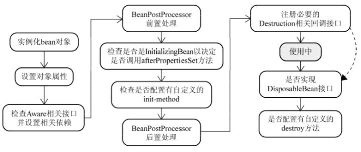
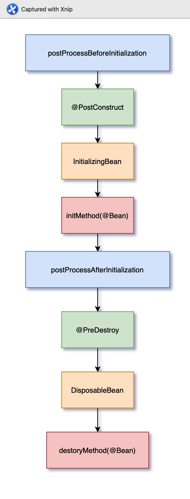

# Bean生命周期

[TOC]

**单例对象：** singleton

总结：单例对象的生命周期和容器相同

**多例对象：** prototype

出生：使用对象时spring框架为我们创建

活着：对象只要是在使用过程中就一直活着

死亡：当对象长时间不用且没有其它对象引用时，由java的垃圾回收机制回收

## IOC容器初始化Bean

~~~java
@Override
public void refresh() throws BeansException, IllegalStateException { synchronized (this.startupShutdownMonitor) {
    // 第一步:刷新前的预处理 
    prepareRefresh();
    //第二步: 获取BeanFactory并注册到 BeanDefitionRegistry
    ConfigurableListableBeanFactory beanFactory = obtainFreshBeanFactory();
    // 第三步:加载BeanFactory的预准备工作(BeanFactory进行一些设置，比如context的类加载器等)
    prepareBeanFactory(beanFactory);
    try {
        // 第四步:完成BeanFactory准备工作后的前置处理工作 
        postProcessBeanFactory(beanFactory);
        // 第五步:实例化BeanFactoryPostProcessor接口的Bean 
        invokeBeanFactoryPostProcessors(beanFactory);
        // 第六步:注册BeanPostProcessor后置处理器，在创建bean的后执行 
        registerBeanPostProcessors(beanFactory);
        // 第七步:初始化MessageSource组件(做国际化功能;消息绑定，消息解析); 
        initMessageSource();
        // 第八步:注册初始化事件派发器 
        initApplicationEventMulticaster();
        // 第九步:子类重写这个方法，在容器刷新的时候可以自定义逻辑 
        onRefresh();
        // 第十步:注册应用的监听器。就是注册实现了ApplicationListener接口的监听器
        registerListeners();
        // 第十一步:初始化所有剩下的非懒加载的单例bean 初始化创建非懒加载方式的单例Bean实例(未设置属性)
        finishBeanFactoryInitialization(beanFactory);
        // 第十二步: 完成context的刷新。主要是调用LifecycleProcessor的onRefresh()方法，完成创建
        finishRefresh();
    }
    ……
} 
~~~

**总结**

**四个阶段**

- 实例化 Instantiation
- 属性赋值 Populate
- 初始化 Initialization
- 销毁 Destruction

**多个扩展点**

- 影响多个Bean
  - BeanPostProcessor
  - InstantiationAwareBeanPostProcessor
- 影响单个Bean
  - Aware

## 完整流程

1. 实例化一个Bean－－也就是我们常说的**new**；
2. 按照Spring上下文对实例化的Bean进行配置－－**也就是IOC注入**；
3. 如果这个Bean已经实现了`BeanNameAware`接口，会调用它实现的`setBeanName`(String)方法，也就是根据就是Spring配置文件中**Bean的id和name进行传递**
4. 如果这个Bean已经实现了`BeanFactoryAware`接口，会调用它实现`setBeanFactory`(BeanFactory)也就是Spring配置文件配置的**Spring工厂自身进行传递**；
5. 如果这个Bean已经实现了`ApplicationContextAware`接口，会调用`setApplicationContext`(ApplicationContext)方法，和4传递的信息一样但是因为ApplicationContext是BeanFactory的子接口，所以**更加灵活**
6. 如果这个Bean关联了`BeanPostProcessor`接口，将会调用`postProcessBeforeInitialization`()方法，BeanPostProcessor经常被用作是Bean内容的更改，由于这个是在Bean初始化结束时调用那个的方法，也可以被应用于**内存或缓存技术**
7. 如果Bean实现了`InitializingBean`接口，执行`afterPropertiesSet()`方法。
8. 如果Bean在Spring配置文件中配置了init-method属性会自动调用其配置的初始化方法。
9. 如果这个Bean关联了`BeanPostProcessor`接口，将会调用`postProcessAfterInitialization`()，**打印日志或者三级缓存技术里面的bean升级**
10. 以上工作完成以后就可以应用这个Bean了，那这个Bean是一个Singleton的，所以一般情况下我们调用同一个id的Bean会是在内容地址相同的实例，当然在Spring配置文件中也可以配置非Singleton，这里不做赘述。
11. 当Bean不再需要时，会经过清理阶段，如果Bean实现了`DisposableBean`这个接口，或者根据spring配置的`destroy-method`属性，调用实现的destroy()方法

**对上面进行补充**

spring初始化bean有两种方式：

1. 实现InitializingBean接口，继而实现afterPropertiesSet的方法
2. 反射原理，配置文件使用init-method标签直接注入bean

### Bean初始化顺序

~~~markdown
【BeanDefinitionRegistryPostProcessor接口】初始化
【BeanDefinitionRegistryPostProcessor接口】调用postProcessBeanDefinitionRegistry方法
【BeanDefinitionRegistryPostProcessor接口】调用postProcessBeanFactory方法
【BeanFactoryPostProcessor接口】初始化
【BeanFactoryPostProcessor接口】调用postProcessBeanFactory方法
【BeanPostProcessor接口】初始化
【InstantiationAwareBeanPostProcessor接口】初始化

【InstantiationAwareBeanPostProcessor接口】调用postProcessBeforeInstantiation
        【Bean对象】具体初始化
【InstantiationAwareBeanPostProcessor接口】调用postProcessAfterInstantiation
【InstantiationAwareBeanPostProcessor接口】调用postProcessProperties
        【BeanNameAware接口】调用BeanNameAware.setBeanName()
        【BeanFactoryAware接口】调用BeanFactoryAware.setBeanFactory()
    【BeanPostProcessor接口】方法postProcessBeforeInitialization对属性进行更改！
【InitializingBean接口】调用InitializingBean.afterPropertiesSet()
    【init-method】调用@bean的init-method属性指定的初始化方法
    【BeanPostProcessor接口】方法postProcessAfterInitialization对属性进行更改！
【DisposableBean接口】调用DisposableBean.destroy()
【destroy-method】调用@bean的destroy-method属性指定的初始化方法

IOC:
invokeBeanFactoryPostProcessors(beanFactory);  -> BeanFactoryProcessor

finishBeanFactoryInitialization(beanFactory);  -> InstantiationAwareBeanPostProcessor、BeanPostProcessor
~~~

