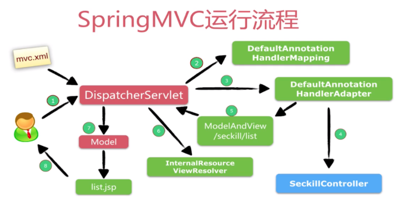
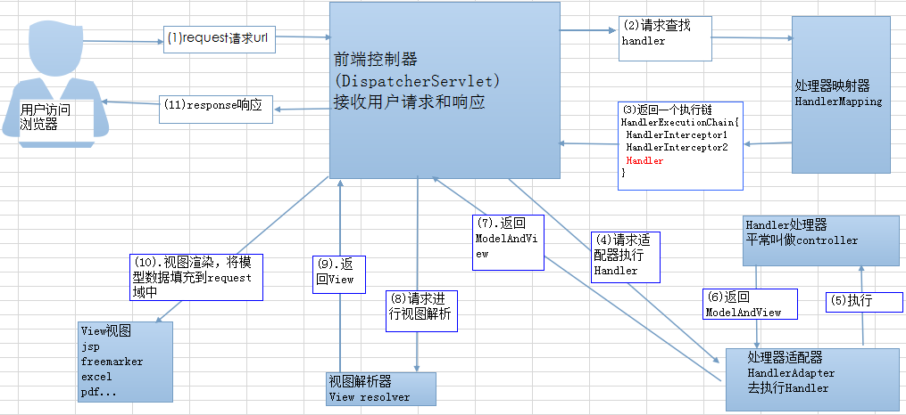
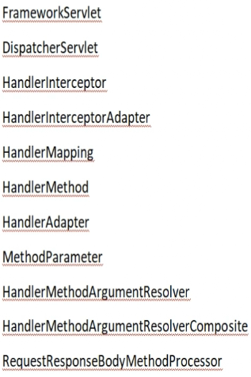

# SpringMVC流程

[TOC]

1. 客户端（浏览器）发送请求，直接请求到 DispatcherServlet 。
2. DispatcherServlet 根据请求信息调⽤ HandlerMapping ，解析请求对应的 Handler 。
3. 解析到对应的 Handler （也就是 Controller 控制器）后，开始由HandlerAdapter 适配器处理。
4. HandlerAdapter 会根据 Handler 来调⽤真正的处理器开处理请求，并处理相应的业务逻辑。
5. 处理器处理完业务后，会返回⼀个 ModelAndView 对象， Model 是返回的数据对象
6. ViewResolver 会根据逻辑 View 查找实际的 View 。
7. DispaterServlet 把返回的 Model 传给 View （视图渲染）。
8. 把 View 返回给请求者（浏览器）

**SpringMVC通过DispatcherServlet拦截所有的请求, 并通过HandlerMapping与指定的请求找出匹配的handler, handler实际是HandlerMethod对象。 再通过与handler适配的HandlerAdapter执行目标方法, 执行完目标方法后会返回ModelAndView对象, 最后通过ViewResolver解析ModelAndView的View视图。**

**MVC里重要的类**

## 源码剖析

~~~java
// FrameworkServlet#doGet
@Override
protected final void doGet(HttpServletRequest request, HttpServletResponse response)
    throws ServletException, IOException {
    processRequest(request, response);
}

// 
protected final void processRequest(HttpServletRequest request, HttpServletResponse response)
    throws ServletException, IOException {

    long startTime = System.currentTimeMillis();
    Throwable failureCause = null;

    LocaleContext previousLocaleContext = LocaleContextHolder.getLocaleContext();
    LocaleContext localeContext = buildLocaleContext(request);

    RequestAttributes previousAttributes = RequestContextHolder.getRequestAttributes();
    ServletRequestAttributes requestAttributes = buildRequestAttributes(request, response, previousAttributes);

    WebAsyncManager asyncManager = WebAsyncUtils.getAsyncManager(request);
    asyncManager.registerCallableInterceptor(FrameworkServlet.class.getName(), new RequestBindingInterceptor());

    initContextHolders(request, localeContext, requestAttributes);

    try {
        // 模板方法的体现
        doService(request, response);
    }
    catch (ServletException | IOException ex) {
        failureCause = ex;
        throw ex;
    }
    catch (Throwable ex) {
        failureCause = ex;
        throw new NestedServletException("Request processing failed", ex);
    }

    finally {
        resetContextHolders(request, previousLocaleContext, previousAttributes);
        if (requestAttributes != null) {
            requestAttributes.requestCompleted();
        }
        logResult(request, response, failureCause, asyncManager);
        publishRequestHandledEvent(request, response, startTime, failureCause);
    }
}
~~~

~~~java
protected void doDispatch(HttpServletRequest request, HttpServletResponse response) throws Exception {
    HttpServletRequest processedRequest = request;
    HandlerExecutionChain mappedHandler = null;
    boolean multipartRequestParsed = false;

    WebAsyncManager asyncManager = WebAsyncUtils.getAsyncManager(request);

    try {
        ModelAndView mv = null;
        Exception dispatchException = null;

        try {
            processedRequest = checkMultipart(request);
            multipartRequestParsed = (processedRequest != request);

            // Determine handler for the current request.
            mappedHandler = getHandler(processedRequest);
            if (mappedHandler == null) {
                noHandlerFound(processedRequest, response);
                return;
            }

            // Determine handler adapter for the current request.
            HandlerAdapter ha = getHandlerAdapter(mappedHandler.getHandler());

            // Process last-modified header, if supported by the handler.
            String method = request.getMethod();
            boolean isGet = HttpMethod.GET.matches(method);
            if (isGet || HttpMethod.HEAD.matches(method)) {
                long lastModified = ha.getLastModified(request, mappedHandler.getHandler());
                if (new ServletWebRequest(request, response).checkNotModified(lastModified) && isGet) {
                    return;
                }
            }

            if (!mappedHandler.applyPreHandle(processedRequest, response)) {
                return;
            }

            // Actually invoke the handler.
            mv = ha.handle(processedRequest, response, mappedHandler.getHandler());

            if (asyncManager.isConcurrentHandlingStarted()) {
                return;
            }

            applyDefaultViewName(processedRequest, mv);
            mappedHandler.applyPostHandle(processedRequest, response, mv);
        }
        catch (Exception ex) {
            dispatchException = ex;
        }
        catch (Throwable err) {
            // As of 4.3, we're processing Errors thrown from handler methods as well,
            // making them available for @ExceptionHandler methods and other scenarios.
            dispatchException = new NestedServletException("Handler dispatch failed", err);
        }
        processDispatchResult(processedRequest, response, mappedHandler, mv, dispatchException);
    }
    catch (Exception ex) {
        triggerAfterCompletion(processedRequest, response, mappedHandler, ex);
    }
    catch (Throwable err) {
        triggerAfterCompletion(processedRequest, response, mappedHandler,
                               new NestedServletException("Handler processing failed", err));
    }
    finally {
        if (asyncManager.isConcurrentHandlingStarted()) {
            // Instead of postHandle and afterCompletion
            if (mappedHandler != null) {
                mappedHandler.applyAfterConcurrentHandlingStarted(processedRequest, response);
            }
        }
        else {
            // Clean up any resources used by a multipart request.
            if (multipartRequestParsed) {
                cleanupMultipart(processedRequest);
            }
        }
    }
}
~~~

~~~java
// 遍历，找到符合请求的handlerMapper
protected HandlerExecutionChain getHandler(HttpServletRequest request) throws Exception {
    if (this.handlerMappings != null) {
        for (HandlerMapping mapping : this.handlerMappings) {
            HandlerExecutionChain handler = mapping.getHandler(request);
            if (handler != null) {
                return handler;
            }
        }
    }
    return null;
}
~~~

~~~java
protected Object doInvoke(Object... args) throws Exception {
    Method method = getBridgedMethod();
    ReflectionUtils.makeAccessible(method); // 其实就是method.setAccessible(true)，即便方法为private也能iji
    try {
        if (KotlinDetector.isSuspendingFunction(method)) {
            return CoroutinesUtils.invokeSuspendingFunction(method, getBean(), args);
        }
        return method.invoke(getBean(), args);
    }
    catch (IllegalArgumentException ex) {
        assertTargetBean(method, getBean(), args);
        String text = (ex.getMessage() != null ? ex.getMessage() : "Illegal argument");
        throw new IllegalStateException(formatInvokeError(text, args), ex);
    }
    catch (InvocationTargetException ex) {
        // Unwrap for HandlerExceptionResolvers ...
        Throwable targetException = ex.getTargetException();
        if (targetException instanceof RuntimeException) {
            throw (RuntimeException) targetException;
        }
        else if (targetException instanceof Error) {
            throw (Error) targetException;
        }
        else if (targetException instanceof Exception) {
            throw (Exception) targetException;
        }
        else {
            throw new IllegalStateException(formatInvokeError("Invocation failure", args), targetException);
        }
    }
}
~~~

