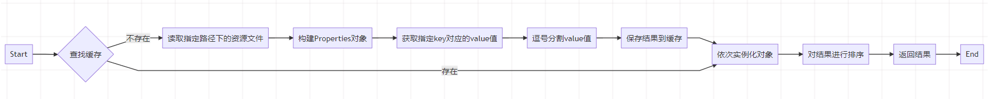

# 自动装配

[TOC]

主要是注解@EnableAutoConfiguration实现自动装配

## 源码

~~~java
@Target(ElementType.TYPE)
@Retention(RetentionPolicy.RUNTIME)
@Documented
@Inherited
@AutoConfigurationPackage
@Import(AutoConfigurationImportSelector.class)
public @interface EnableAutoConfiguration {

    /**
	 * Environment property that can be used to override when auto-configuration is
	 * enabled.
	 */
    String ENABLED_OVERRIDE_PROPERTY = "spring.boot.enableautoconfiguration";

    /**
	 * Exclude specific auto-configuration classes such that they will never be applied.
	 * @return the classes to exclude
	 */
    Class<?>[] exclude() default {};

    /**
	 * Exclude specific auto-configuration class names such that they will never be
	 * applied.
	 * @return the class names to exclude
	 * @since 1.3.0
	 */
    String[] excludeName() default {};

}
~~~

~~~properties
# Logging Systems
org.springframework.boot.logging.LoggingSystemFactory=\
org.springframework.boot.logging.logback.LogbackLoggingSystem.Factory,\
org.springframework.boot.logging.log4j2.Log4J2LoggingSystem.Factory,\
org.springframework.boot.logging.java.JavaLoggingSystem.Factory

# PropertySource Loaders
org.springframework.boot.env.PropertySourceLoader=\
org.springframework.boot.env.PropertiesPropertySourceLoader,\
org.springframework.boot.env.YamlPropertySourceLoader

# ConfigData Location Resolvers
org.springframework.boot.context.config.ConfigDataLocationResolver=\
org.springframework.boot.context.config.ConfigTreeConfigDataLocationResolver,\
org.springframework.boot.context.config.StandardConfigDataLocationResolver

# ConfigData Loaders
org.springframework.boot.context.config.ConfigDataLoader=\
org.springframework.boot.context.config.ConfigTreeConfigDataLoader,\
org.springframework.boot.context.config.StandardConfigDataLoader

# Run Listeners
org.springframework.boot.SpringApplicationRunListener=\
org.springframework.boot.context.event.EventPublishingRunListener

# Error Reporters
org.springframework.boot.SpringBootExceptionReporter=\
org.springframework.boot.diagnostics.FailureAnalyzers

# Application Context Initializers
org.springframework.context.ApplicationContextInitializer=\
org.springframework.boot.context.ConfigurationWarningsApplicationContextInitializer,\
org.springframework.boot.context.ContextIdApplicationContextInitializer,\
org.springframework.boot.context.config.DelegatingApplicationContextInitializer,\
org.springframework.boot.rsocket.context.RSocketPortInfoApplicationContextInitializer,\
org.springframework.boot.web.context.ServerPortInfoApplicationContextInitializer

# Application Listeners
org.springframework.context.ApplicationListener=\
org.springframework.boot.ClearCachesApplicationListener,\
org.springframework.boot.builder.ParentContextCloserApplicationListener,\
org.springframework.boot.context.FileEncodingApplicationListener,\
org.springframework.boot.context.config.AnsiOutputApplicationListener,\
org.springframework.boot.context.config.DelegatingApplicationListener,\
org.springframework.boot.context.logging.LoggingApplicationListener,\
org.springframework.boot.env.EnvironmentPostProcessorApplicationListener

# Environment Post Processors
org.springframework.boot.env.EnvironmentPostProcessor=\
org.springframework.boot.cloud.CloudFoundryVcapEnvironmentPostProcessor,\
org.springframework.boot.context.config.ConfigDataEnvironmentPostProcessor,\
org.springframework.boot.env.RandomValuePropertySourceEnvironmentPostProcessor,\
org.springframework.boot.env.SpringApplicationJsonEnvironmentPostProcessor,\
org.springframework.boot.env.SystemEnvironmentPropertySourceEnvironmentPostProcessor,\
org.springframework.boot.reactor.DebugAgentEnvironmentPostProcessor

# Failure Analyzers
org.springframework.boot.diagnostics.FailureAnalyzer=\
org.springframework.boot.context.config.ConfigDataNotFoundFailureAnalyzer,\
org.springframework.boot.context.properties.IncompatibleConfigurationFailureAnalyzer,\
org.springframework.boot.context.properties.NotConstructorBoundInjectionFailureAnalyzer,\
org.springframework.boot.diagnostics.analyzer.BeanCurrentlyInCreationFailureAnalyzer,\
org.springframework.boot.diagnostics.analyzer.BeanDefinitionOverrideFailureAnalyzer,\
org.springframework.boot.diagnostics.analyzer.BeanNotOfRequiredTypeFailureAnalyzer,\
org.springframework.boot.diagnostics.analyzer.BindFailureAnalyzer,\
org.springframework.boot.diagnostics.analyzer.BindValidationFailureAnalyzer,\
org.springframework.boot.diagnostics.analyzer.UnboundConfigurationPropertyFailureAnalyzer,\
org.springframework.boot.diagnostics.analyzer.ConnectorStartFailureAnalyzer,\
org.springframework.boot.diagnostics.analyzer.NoSuchMethodFailureAnalyzer,\
org.springframework.boot.diagnostics.analyzer.NoUniqueBeanDefinitionFailureAnalyzer,\
org.springframework.boot.diagnostics.analyzer.PortInUseFailureAnalyzer,\
org.springframework.boot.diagnostics.analyzer.ValidationExceptionFailureAnalyzer,\
org.springframework.boot.diagnostics.analyzer.InvalidConfigurationPropertyNameFailureAnalyzer,\
org.springframework.boot.diagnostics.analyzer.InvalidConfigurationPropertyValueFailureAnalyzer,\
org.springframework.boot.diagnostics.analyzer.PatternParseFailureAnalyzer,\
org.springframework.boot.liquibase.LiquibaseChangelogMissingFailureAnalyzer

# Failure Analysis Reporters
org.springframework.boot.diagnostics.FailureAnalysisReporter=\
org.springframework.boot.diagnostics.LoggingFailureAnalysisReporter

# Database Initializer Detectors
org.springframework.boot.sql.init.dependency.DatabaseInitializerDetector=\
org.springframework.boot.flyway.FlywayDatabaseInitializerDetector,\
org.springframework.boot.jdbc.AbstractDataSourceInitializerDatabaseInitializerDetector,\
org.springframework.boot.jdbc.init.DataSourceScriptDatabaseInitializerDetector,\
org.springframework.boot.liquibase.LiquibaseDatabaseInitializerDetector,\
org.springframework.boot.orm.jpa.JpaDatabaseInitializerDetector,\
org.springframework.boot.r2dbc.init.R2dbcScriptDatabaseInitializerDetector

# Depends On Database Initialization Detectors
org.springframework.boot.sql.init.dependency.DependsOnDatabaseInitializationDetector=\
org.springframework.boot.sql.init.dependency.AnnotationDependsOnDatabaseInitializationDetector,\
org.springframework.boot.jdbc.SpringJdbcDependsOnDatabaseInitializationDetector,\
org.springframework.boot.jooq.JooqDependsOnDatabaseInitializationDetector,\
org.springframework.boot.orm.jpa.JpaDependsOnDatabaseInitializationDetector
~~~

Spring Boot默认扫包：从`启动类`所在包开始，扫描当前包及其子包下的所有文件

读取**META-INF/spring.factories**文件下的一些列类名，随后将这些类自动加载到IOC容器中

这其实就是Spring的SPI机制，在**spring.factories** 文件中 配置接口的实现类名称，然后在程序中读取这些配置文件并实例化，自定义的SPI机制也是Spring Boot Starter实现的基础

在**spring.factories** 文件中 按照Properties格式填写好接口和实现类即可通过SpringFactoriesLoader来实例化相应的Bean，其中，key可以是接口、注解、或者抽象类的全名，value为相应的实现类，当存在多个实现类时，用“,”进行分割

